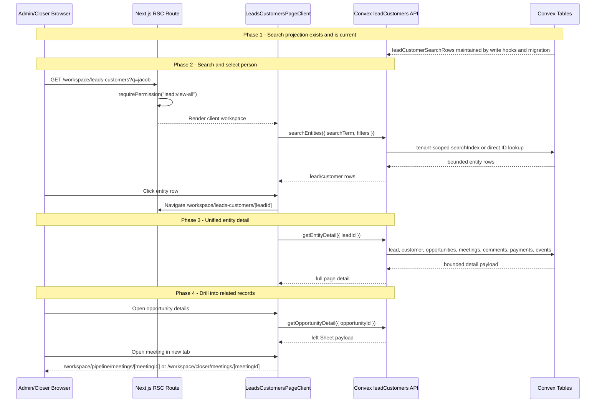

# Leads & Customers Unified View - Design Specification

**Version:** 0.1 (MVP)  
**Status:** Draft  
**Scope:** Replace the separate `/workspace/leads`, `/workspace/customers`, and `/workspace/opportunities` browse experiences with one compact, searchable Leads & Customers workspace. Entity detail becomes lead-centric, with converted customers shown as the same person plus customer state, visible opportunities, meetings, comments, activity, fields, and a left-side opportunity detail sheet.  
**Prerequisite:** Existing WorkOS AuthKit tenant auth, Convex schema (`leads`, `customers`, `opportunities`, `meetings`, `meetingComments`, `paymentRecords`, `leadIdentifiers`, `opportunitySearch`), current lead/customer/opportunity detail queries, and the Phase 5 attribution payload work already present in `convex/lib/attribution/detailPayload.ts`.

---

## Table of Contents

1. [Goals & Non-Goals](#1-goals--non-goals)
2. [Actors & Roles](#2-actors--roles)
3. [End-to-End Flow Overview](#3-end-to-end-flow-overview)
4. [Phase 0: Current State Lock and UX Direction](#4-phase-0-current-state-lock-and-ux-direction)
5. [Phase 1: Entity Search Projection and Query Facade](#5-phase-1-entity-search-projection-and-query-facade)
6. [Phase 2: Unified Route and Search Workspace](#6-phase-2-unified-route-and-search-workspace)
7. [Phase 3: Entity Detail Page](#7-phase-3-entity-detail-page)
8. [Phase 4: Opportunity Sheet, Meeting Links, and Legacy Redirects](#8-phase-4-opportunity-sheet-meeting-links-and-legacy-redirects)
9. [Phase 5: Verification and Rollout](#9-phase-5-verification-and-rollout)
10. [Data Model](#10-data-model)
11. [Convex Function Architecture](#11-convex-function-architecture)
12. [Routing & Authorization](#12-routing--authorization)
13. [Security Considerations](#13-security-considerations)
14. [Error Handling & Edge Cases](#14-error-handling--edge-cases)
15. [Open Questions](#15-open-questions)
16. [Dependencies](#16-dependencies)
17. [Applicable Skills](#17-applicable-skills)
18. [References](#18-references)

---

## 1. Goals & Non-Goals

### Goals

- Add `/workspace/leads-customers` as the canonical workspace for finding people by name, email, phone, social handle, Convex ID, or known identifier.
- Replace the sidebar entries for Leads, Customers, and Opportunities with one label: **Leads & Customers**.
- Keep `leads` as the canonical person/entity root. A customer is a converted lead with an attached `customers` row.
- Make lead and customer detail pages visually and structurally identical. Customer state appears as a prominent lifecycle strip, not as a separate layout.
- Show all high-value detail sections directly on the entity page: identity, customer state, opportunities, meetings, comments, activity, fields, identifiers, payments, and attribution.
- Remove tab-only access for details. Anchor navigation is allowed, but information must remain on-page and visible after scroll.
- Let users open meeting detail routes in a new tab from every meeting row/card.
- Let users open opportunity-specific detail in a left-side `Sheet` without leaving the entity page.
- Preserve side-deal creation, but move it under the new workspace as `/workspace/leads-customers/new-opportunity`.
- Keep old routes working through redirects so existing links from reports, reminders, operations tables, and browser history do not break.
- Add one purpose-built Convex projection for fast, bounded, tenant-scoped entity search instead of making the client stitch together lead, customer, and opportunity lists.
- Keep the UI compact, elegant, and operational: dense enough for repeated admin/closer use, with a subtle premium "ledger" feel rather than large marketing cards.

### Non-Goals

- No change to Slack qualification, Calendly webhook ingestion, payment recording semantics, or customer conversion semantics.
- No merge algorithm redesign. Existing merge functionality remains available, but the detail surface changes.
- No full replacement of admin Operations, Reports, Billing, or closer pipeline routes.
- No bulk edit, bulk merge, or bulk deletion tool in this MVP.
- No new charting package, animation package, table package, or global design system replacement.
- No removal of underlying legacy route files in the first release. They become redirect shims first.
- No full text search over meeting comment content in MVP. Comments are visible on detail, but not indexed for global search.

---

## 2. Actors & Roles

| Actor | Identity | Auth Method | Key Permissions |
|---|---|---|---|
| Tenant owner | `users.role = "tenant_master"` | WorkOS AuthKit, member of tenant org | Search all tenant leads/customers, view all entity detail, create side deals, merge leads, convert active leads, view all opportunities/payments/comments. |
| Tenant admin | `users.role = "tenant_admin"` | WorkOS AuthKit, member of tenant org | Same as owner except existing owner-only role controls outside this feature. |
| Closer | `users.role = "closer"` | WorkOS AuthKit, member of tenant org | Uses the same route for operational lookup. MVP preserves current broad lead/customer visibility unless product chooses to tighten closer access. Opportunity detail still revalidates assigned-closer access where existing detail queries already do. |
| System | Convex queries/mutations/migrations | Internal Convex execution | Maintains search projection rows, resolves legacy route redirects, enriches entity detail payloads, and keeps reads bounded. |

### CRM Role Mapping

| CRM `users.role` | WorkOS role slug | New route access |
|---|---|---|
| `tenant_master` | `owner` | Full |
| `tenant_admin` | `tenant-admin` | Full |
| `closer` | `closer` | Same access family as current Leads/Customers/Opportunities nav |
| `lead_generator` | `lead-generator` | None |

### Permission Strategy

| Surface | Gate | Notes |
|---|---|---|
| `/workspace/leads-customers` | `requirePermission("lead:view-all")` | Matches existing Leads route and includes admins/closers. |
| Entity detail | `requirePermission("lead:view-all")` plus Convex tenant checks | Convex resolves `tenantId` from auth; never from client args. |
| Side-deal creation | Existing `pipeline:view-own`/mutation guards | Keep the current `createManual` authorization path. |
| Customer payment actions | Existing customer/payment mutations | Do not add new client-only permission assumptions. |

> **Access decision:** The new UI exposes more information at once, so the implementation must not rely on UI visibility for security. Every query and mutation keeps server-side `requireTenantUser(...)` or existing permission checks. A tighter closer-only visibility model is desirable, but it changes current product behavior and is tracked as an open question.

---

## 3. End-to-End Flow Overview



---

## 4. Phase 0: Current State Lock and UX Direction

### 4.1 Verified Current State

| Current route | Strengths | Problems to solve |
|---|---|---|
| `/workspace/leads` | Has search, lead status tabs, lead detail with identifiers, meetings, opportunities, activity, fields. | Detail data is hidden behind tabs; search is lead-only; customers are separate; opportunity data is shallow. |
| `/workspace/customers` | Has customer conversion, payment history, winning opportunity, attribution. | No search; relationships card is oversized; detail differs from lead page despite customer being a converted lead. |
| `/workspace/opportunities` | Has search, filters, export, new side-deal creation, strongest opportunity detail page. | Searching opportunities is redundant when leads already own opportunities; detail is separate from person context. |
| `/workspace/opportunities/[id]` | Rich opportunity data, payments, meetings, activity, attribution. | Navigates away from lead/customer context and repeats lead/customer summary data. |

Existing code already contains useful building blocks:

| Existing asset | Decision |
|---|---|
| `EntityAttributionCard` | Reuse the data model, redesign visual density for entity and opportunity sheet surfaces. |
| `api.opportunities.detailQuery.getOpportunityDetail` | Reuse for the opportunity sheet where possible. |
| `api.leads.queries.getLeadDetail` | Replace with a broader `leadCustomers.queries.getEntityDetail` facade. |
| `api.customers.queries.getCustomerDetail` | Fold customer enrichment into entity detail. |
| `meetingComments` table and `closer/meetingComments.getComments` | Reuse comment shape, but load bounded per-meeting excerpts directly in entity detail. |
| `opportunitySearch` projection | Keep for opportunity-specific search, but do not use it as the primary person search surface. |

### 4.2 UX Direction

The visual direction is **compact executive ledger**:

- restrained neutral canvas using existing `radix-nova` semantic tokens;
- small-radius sections, hairline separators, and crisp table rows;
- numeric and timestamp columns use tabular figures;
- badges are semantic and quiet, not colorful for every state;
- critical lifecycle state is obvious in the header strip;
- no nested UI cards inside cards;
- no large empty hero layout;
- no data hidden behind tabs on detail pages;
- opportunity detail uses a left-side sheet so the person context remains the page anchor.

### 4.3 Detail Page Information Architecture

The detail page is lead-centric:

| Entity state | Canonical route | Header state | Content differences |
|---|---|---|---|
| Active lead | `/workspace/leads-customers/[leadId]` | "Lead" status badge | Customer strip is absent; conversion actions may show for admins. |
| Converted customer | Same lead route | "Customer" and customer status badges | Customer strip shows converted date, total paid, winning opportunity, sold program. |
| Merged lead | Legacy lead route redirects to target lead | Target lead header | Shows merge activity in timeline. |

> **Why lead-centric:** Every customer already has `customers.leadId`, and every opportunity already has `opportunities.leadId`. Using the lead as the route identity lets one person view own all opportunities, meetings, identifiers, custom fields, conversion state, and payments without choosing between "lead" and "customer" screens.

---

## 5. Phase 1: Entity Search Projection and Query Facade

### 5.1 Why a Projection Is Worth It

The UI could query `leads`, `customers`, and `opportunitySearch` independently, but that would duplicate filtering rules in the client and make pagination unreliable. A single projection row per lead/customer entity keeps the route simple and lets Convex use a bounded indexed or search-indexed read.

> **Runtime decision:** Add `leadCustomerSearchRows` as a derived projection. It is not source of truth. Source tables remain `leads`, `customers`, `opportunities`, `meetings`, `leadIdentifiers`, and `paymentRecords`. This is a schema addition plus backfill, so implementation must invoke `convex-migration-helper`.

### 5.2 Projection Row Semantics

One projection row exists for every non-deleted lead. If a customer row exists for that lead, the row is marked `lifecycle: "customer"` and includes customer status/payment summary. If a lead was merged, the row remains only long enough to support redirects and diagnostics; browse and fuzzy search results hide it through `isSearchVisible: false`, not through client-side or post-query filtering.

| Field family | Source |
|---|---|
| Identity | `leads.fullName`, `leads.email`, `leads.phone`, `leads.socialHandles`, `leadIdentifiers` |
| Lifecycle | `leads.status`, optional `customers.status`, `customers.convertedAt` |
| Relationship counts | bounded opportunities/meetings/payments by lead/customer |
| Activity | max of lead update, latest opportunity activity, latest meeting, conversion, payment |
| Search text | name/email/phone/social handles/identifier values/lead id/customer id/opportunity ids |
| Visibility | `isSearchVisible = lifecycle !== "merged"` for default browse/search surfaces |

### 5.3 Query Facade

```typescript
// Path: convex/leadCustomers/queries.ts
import { paginationOptsValidator } from "convex/server";
import { v } from "convex/values";
import { query } from "../_generated/server";
import { requireTenantUser } from "../requireTenantUser";

const lifecycleValidator = v.union(
  v.literal("lead"),
  v.literal("customer"),
  v.literal("merged"),
);

export const searchEntities = query({
  args: {
    searchTerm: v.string(),
    lifecycle: v.optional(lifecycleValidator),
  },
  handler: async (ctx, args) => {
    const { tenantId } = await requireTenantUser(ctx, [
      "tenant_master",
      "tenant_admin",
      "closer",
    ]);

    const term = args.searchTerm.trim();
    if (term.length < 2) return [];

    const direct = await resolveDirectEntityIdentifier(ctx, tenantId, term);
    if (direct) return [direct];

    const rows = await ctx.db
      .query("leadCustomerSearchRows")
      .withSearchIndex("search_lead_customer_entities", (q) => {
        let search = q
          .search("searchText", term)
          .eq("tenantId", tenantId)
          .eq("isSearchVisible", true);
        if (args.lifecycle) search = search.eq("lifecycle", args.lifecycle);
        return search;
      })
      .take(50);

    return rows;
  },
});

export const listEntities = query({
  args: {
    paginationOpts: paginationOptsValidator,
    lifecycle: v.optional(lifecycleValidator),
  },
  handler: async (ctx, args) => {
    const { tenantId } = await requireTenantUser(ctx, [
      "tenant_master",
      "tenant_admin",
      "closer",
    ]);

    const query = args.lifecycle
      ? ctx.db
          .query("leadCustomerSearchRows")
          .withIndex(
            "by_tenantId_and_isSearchVisible_and_lifecycle_and_latestActivityAt",
            (q) =>
              q
                .eq("tenantId", tenantId)
                .eq("isSearchVisible", true)
                .eq("lifecycle", args.lifecycle!),
          )
      : ctx.db
          .query("leadCustomerSearchRows")
          .withIndex("by_tenantId_and_isSearchVisible_and_latestActivityAt", (q) =>
            q.eq("tenantId", tenantId).eq("isSearchVisible", true),
          );

    return await query.order("desc").paginate(args.paginationOpts);
  },
});
```

### 5.4 Direct Identifier Resolution

The search box should feel like an operational lookup, not a fuzzy marketing search. Before full-text search, the query should attempt direct ID resolution:

| Input type | Resolution |
|---|---|
| Lead ID | `ctx.db.normalizeId("leads", term)` then tenant check |
| Customer ID | `ctx.db.normalizeId("customers", term)` then redirect to customer lead row |
| Opportunity ID | `ctx.db.normalizeId("opportunities", term)` then redirect to opportunity lead row and selected sheet |
| Meeting ID | `ctx.db.normalizeId("meetings", term)` then redirect to meeting opportunity lead row |
| Email / phone / handle | Search projection; exact normalized identifier lookup can be added first when useful |

```typescript
// Path: convex/leadCustomers/identifierResolution.ts
import type { Id } from "../_generated/dataModel";
import type { QueryCtx } from "../_generated/server";

export async function resolveDirectEntityIdentifier(
  ctx: QueryCtx,
  tenantId: Id<"tenants">,
  rawTerm: string,
) {
  const leadId = ctx.db.normalizeId("leads", rawTerm);
  if (leadId) return await getProjectedRowForLead(ctx, tenantId, leadId);

  const customerId = ctx.db.normalizeId("customers", rawTerm);
  if (customerId) {
    const customer = await ctx.db.get(customerId);
    if (customer?.tenantId === tenantId) {
      return await getProjectedRowForLead(ctx, tenantId, customer.leadId);
    }
  }

  const opportunityId = ctx.db.normalizeId("opportunities", rawTerm);
  if (opportunityId) {
    const opportunity = await ctx.db.get(opportunityId);
    if (opportunity?.tenantId === tenantId) {
      const row = await getProjectedRowForLead(ctx, tenantId, opportunity.leadId);
      return row ? { ...row, selectedOpportunityId: opportunity._id } : null;
    }
  }

  return null;
}
```

### 5.5 Detail Query Contract

The detail query returns one complete, bounded payload for the page:

| Payload key | Bound |
|---|---:|
| `identifiers` | 100 |
| `opportunities` | 50 |
| `meetings` | 50 total across opportunities |
| `commentsByMeetingId` | 5 active comments per meeting, max 250 comments total |
| `payments` | 50 |
| `activity` | 75 merged events |
| `fieldEntries` | all current `lead.customFields` keys, bounded by document size |

```typescript
// Path: convex/leadCustomers/detail.ts
export const getEntityDetail = query({
  args: { leadId: v.id("leads") },
  handler: async (ctx, { leadId }) => {
    const { tenantId, userId, role } = await requireTenantUser(ctx, [
      "tenant_master",
      "tenant_admin",
      "closer",
    ]);

    const lead = await ctx.db.get(leadId);
    if (!lead || lead.tenantId !== tenantId) return null;

    const customer = await ctx.db
      .query("customers")
      .withIndex("by_tenantId_and_leadId", (q) =>
        q.eq("tenantId", tenantId).eq("leadId", leadId),
      )
      .first();

    const opportunities = await ctx.db
      .query("opportunities")
      .withIndex("by_tenantId_and_leadId", (q) =>
        q.eq("tenantId", tenantId).eq("leadId", leadId),
      )
      .order("desc")
      .take(50);
    const visibleOpportunities = selectEntityDetailOpportunities({
      opportunities,
      viewerUserId: userId,
      viewerRole: role,
    });

    return await buildEntityDetailPayload(ctx, {
      tenantId,
      viewerUserId: userId,
      viewerRole: role,
      lead,
      customer,
      opportunities: visibleOpportunities,
    });
  },
});
```

> **Authorization decision:** The entity page may preserve broad lead/customer lookup for closers, but it must not bypass the stricter resource guards that already exist on opportunity, meeting, comment, and payment detail surfaces. For `role === "closer"`, inline comments, meeting detail actions, opportunity sheet payloads, and payment actions are only available for opportunities assigned to `viewerUserId`. If product keeps unassigned opportunities visible for context, they render as summary-only rows with disabled/absent detail actions and no comments.

---

## 6. Phase 2: Unified Route and Search Workspace

### 6.1 Route Shell

```typescript
// Path: app/workspace/leads-customers/page.tsx
import { Suspense } from "react";
import { requirePermission } from "@/lib/auth";
import { LeadsCustomersPageClient } from "./_components/leads-customers-page-client";
import { LeadsCustomersSkeleton } from "./_components/leads-customers-skeleton";

export const unstable_instant = false;

export default async function LeadsCustomersPage() {
  await requirePermission("lead:view-all");

  return (
    <Suspense fallback={<LeadsCustomersSkeleton />}>
      <LeadsCustomersPageClient />
    </Suspense>
  );
}
```

### 6.2 Search Workspace ASCII Mockup

```text
+----------------------------------------------------------------------------------+
| Leads & Customers                                      [ + New Side Deal ] [CSV] |
| Search by name, email, phone, @handle, lead ID, customer ID, opportunity ID       |
| [ jacob parada                                                        ] [Search] |
|                                                                                  |
| [All] [Leads] [Customers] [Won] [Needs follow-up]        Sort: Latest activity   |
+----------------------------------------------------------------------------------+
| Identity              State        Last signal          Opportunities   Meetings |
| Jacob Parada          Customer     Paid May 22          1 won           1        |
| @tom_caufriez23       Lead         Slack May 31         1 qualified     0        |
| Alida Crudo           Customer     Paid May 28          1 won           1        |
+----------------------------------------------------------------------------------+
| Result footer: 25 shown                                      [Load More]         |
+----------------------------------------------------------------------------------+
```

Mobile:

```text
+--------------------------------------+
| Leads & Customers        [+]         |
| [ Search identifier...        ]      |
| [All] [Leads] [Customers]            |
+--------------------------------------+
| Jacob Parada                         |
| Customer - Won - 25K Accelerator     |
| jacob@...  +1 905...                 |
| 1 opp - 1 meeting - paid May 22      |
+--------------------------------------+
| tom_caufriez23                       |
| Lead - Slack qualified               |
| instagram @tom_caufriez23            |
| 1 opp - no meetings                  |
+--------------------------------------+
```

### 6.3 Workspace Behavior

| Interaction | Behavior |
|---|---|
| Search input | Debounced 250-300 ms; syncs `q` in URL; minimum 2 chars unless direct ID. |
| Filter controls | Use `ToggleGroup` or `TabsList` for lifecycle; state reflected in query params. |
| Row click | `Link` to `/workspace/leads-customers/[leadId]`; Cmd/Ctrl-click and middle-click work. |
| Direct opportunity search hit | Row includes an inline "Open opportunity" action that navigates to `?opportunityId=<id>` on detail. |
| New side deal | Goes to `/workspace/leads-customers/new-opportunity`; old `/workspace/opportunities/new` redirects. |
| Export | Admin-only, exports current loaded rows first; full export remains a future bounded server job if needed. |

### 6.4 Component Shape

Use a small provider for URL state and selected row state instead of pushing booleans through every component.

```typescript
// Path: app/workspace/leads-customers/_components/entity-browser-context.tsx
"use client";

import { createContext, use, type ReactNode } from "react";

type EntityBrowserState = {
  query: string;
  lifecycle: "all" | "lead" | "customer";
};

type EntityBrowserActions = {
  setQuery: (value: string) => void;
  setLifecycle: (value: EntityBrowserState["lifecycle"]) => void;
};

type EntityBrowserContextValue = {
  state: EntityBrowserState;
  actions: EntityBrowserActions;
};

const EntityBrowserContext = createContext<EntityBrowserContextValue | null>(null);

export function EntityBrowserProvider({
  value,
  children,
}: {
  value: EntityBrowserContextValue;
  children: ReactNode;
}) {
  return <EntityBrowserContext value={value}>{children}</EntityBrowserContext>;
}

export function useEntityBrowser() {
  const context = use(EntityBrowserContext);
  if (!context) throw new Error("useEntityBrowser must be used inside EntityBrowserProvider");
  return context;
}
```

> **Composition decision:** Build `EntityBrowser.Search`, `EntityBrowser.Filters`, `EntityBrowser.Results`, and `EntityBrowser.Footer` around this provider. Avoid a monolithic page component with many boolean props for lead/customer/opportunity variants.

---

## 7. Phase 3: Entity Detail Page

### 7.1 Detail Route

```typescript
// Path: app/workspace/leads-customers/[leadId]/page.tsx
import { preloadQuery } from "convex/nextjs";
import { api } from "@/convex/_generated/api";
import { requirePermission } from "@/lib/auth";
import type { Id } from "@/convex/_generated/dataModel";
import { EntityDetailPageClient } from "./_components/entity-detail-page-client";

export const unstable_instant = false;

export default async function LeadCustomerDetailPage({
  params,
}: {
  params: Promise<{ leadId: string }>;
}) {
  const { session } = await requirePermission("lead:view-all");
  const { leadId } = await params;
  const typedLeadId = leadId as Id<"leads">;
  const preloadedDetail = await preloadQuery(
    api.leadCustomers.detail.getEntityDetail,
    { leadId: typedLeadId },
    { token: session.accessToken },
  );

  return <EntityDetailPageClient preloadedDetail={preloadedDetail} />;
}
```

### 7.2 Desktop Detail ASCII Mockup

```text
+----------------------------------------------------------------------------------+
| <- Leads & Customers        Jacob Parada       [Lead converted] [Customer active] |
| jacob@reeltormedia.com  +1 905-868-4709  instagram @jacob_parada                  |
| First seen May 22   Converted May 22   Total paid $500   Assigned Johann          |
+----------------------------------------------------------------------------------+
| Identity chain                                                                    |
| Lead: Jacob Parada  -> Customer: Active  -> Winning opp: Payment received         |
+----------------------------------------------------------------------------------+
| Opportunities                                                                      |
| +----------------------------+----------------+----------------+----------------+ |
| | Payment received           | 25K Accelerator| Paid $500      | [Details]      | |
| | Slack qualified - Won      | Johann         | May 22         |                | |
| +----------------------------+----------------+----------------+----------------+ |
| | Scheduled follow-up        | Masterclass    | No payment     | [Details]      | |
| +----------------------------+----------------+----------------+----------------+ |
+----------------------------------------------------------------------------------+
| Meetings                                                                          |
| + May 22, 8:30 PM - Completed - New - Johann                     [Open new tab]  |
| | Calendly note: Lead asked about deposit timing.                                  |
| | Comments                                                                         |
| |  Johann - Payment confirmed after call.                     May 22, 9:36 PM      |
| |  Admin  - Stripe reference added.                           May 22, 9:52 PM      |
| + May 29, 9:00 PM - No show - Follow-up                         [Open new tab]    |
+----------------------------------------------------------------------------------+
| Activity                                                                          |
|  May 22 9:36 PM  Payment recorded - $500 deposit                                  |
|  May 22 8:30 PM  Meeting completed                                                |
|  May 22 12:39 PM Slack qualified by Maryie Cruz                                   |
+----------------------------------------------------------------------------------+
| Fields & Identifiers                                                              |
| instagram: @jacob_parada     phone: +19058684709     source: slack_qualified      |
| goal: scale agency     budget: 25K                                                |
+----------------------------------------------------------------------------------+
```

### 7.3 Mobile Detail ASCII Mockup

```text
+--------------------------------------+
| <- Leads & Customers                 |
| Jacob Parada                         |
| [Customer active] [Won]              |
| jacob@...  +1 905...                 |
+--------------------------------------+
| Customer                             |
| Converted May 22 - Paid $500         |
| Program 25K Accelerator              |
+--------------------------------------+
| Opportunities                        |
| Payment received                     |
| 25K Accelerator - Johann             |
| [Details]                            |
+--------------------------------------+
| Meetings                             |
| May 22, 8:30 PM - Completed          |
| [Open meeting]                       |
| Note: Lead asked about deposit...    |
| Comments                             |
| Johann: Payment confirmed...         |
+--------------------------------------+
| Activity                             |
| Payment recorded                     |
| Meeting completed                    |
+--------------------------------------+
| Fields & Identifiers                 |
| instagram @jacob_parada              |
+--------------------------------------+
```

### 7.4 Visible Sections

| Section | Required content | UI notes |
|---|---|---|
| Header | name, email, phone, social handles, lifecycle badges, customer state if converted | Sticky only if it does not occlude content. |
| Identity chain | lead, customer, winning opportunity, winning meeting | Replace current oversized relationships card with one compact row/strip. |
| Opportunities | every opportunity summary, status, source, booked/sold program, closer, payment summary, details action | No tabs. Details opens left sheet. |
| Meetings | date, status, type, closer, opportunity status, join/recording artifacts if available, notes, visible comments | Meeting link opens new tab. Comments are inline, not hidden behind a menu. |
| Payments | customer total and payment rows, tied to opportunity/meeting when known | Can be integrated in customer strip plus payments section. |
| Activity | qualification, meeting, follow-up, payment, customer conversion, merge events | Single chronological timeline. |
| Fields & identifiers | `lead.customFields`, `leadIdentifiers`, social handles | Clearly visible as a dense definition grid. |
| Attribution | Slack qualifier, booked program, sold program, DM team/closer, phone closer | Use compact field grid, not a large card. |

### 7.5 Detail Component Shape

```typescript
// Path: app/workspace/leads-customers/[leadId]/_components/entity-detail-page-client.tsx
"use client";

import { type Preloaded, usePreloadedQuery } from "convex/react";
import { api } from "@/convex/_generated/api";
import { EntityDetail } from "./entity-detail";
import { OpportunityDetailSheet } from "./opportunity-detail-sheet";

export function EntityDetailPageClient({
  preloadedDetail,
}: {
  preloadedDetail: Preloaded<typeof api.leadCustomers.detail.getEntityDetail>;
}) {
  const detail = usePreloadedQuery(preloadedDetail);

  if (detail === null) return <EntityDetail.NotFound />;

  return (
    <EntityDetail.Provider detail={detail}>
      <EntityDetail.Frame>
        <EntityDetail.Header />
        <EntityDetail.IdentityChain />
        <EntityDetail.Opportunities />
        <EntityDetail.Meetings />
        <EntityDetail.Payments />
        <EntityDetail.Activity />
        <EntityDetail.Fields />
      </EntityDetail.Frame>
      <OpportunityDetailSheet />
    </EntityDetail.Provider>
  );
}
```

> **Rendering decision:** The page detail query should carry the initial payload. The opportunity sheet can fetch full opportunity detail lazily only when `opportunityId` is present in URL state. This keeps first paint focused and avoids serializing all opportunity event/payment data twice.

---

## 8. Phase 4: Opportunity Sheet, Meeting Links, and Legacy Redirects

### 8.1 Left Opportunity Sheet ASCII Mockup

```text
+-----------------------------------------+----------------------------------------+
| Opportunity detail                       | Entity page remains behind              |
| Payment received                         | Jacob Parada detail                      |
| [Slack qualified] [Won] [Lead converted] |                                        |
|----------------------------------------- |                                        |
| Lifecycle                                |                                        |
| Source        Slack qualified            |                                        |
| Closer        Johann                     |                                        |
| Created       May 22, 12:39 PM           |                                        |
| Paid          May 22, 9:36 PM            |                                        |
|----------------------------------------- |                                        |
| Attribution                              |                                        |
| Slack setter  Maryie Cruz                |                                        |
| Booked        25K Accelerator            |                                        |
| Sold          25K Accelerator            |                                        |
| DM team       DMTeamCole                 |                                        |
|----------------------------------------- |                                        |
| Meetings                                |                                        |
| May 22, 8:30 PM   Completed [Open]       |                                        |
|----------------------------------------- |                                        |
| Payments                                |                                        |
| $500 Deposit Recorded                    |                                        |
|----------------------------------------- |                                        |
| Activity                                |                                        |
| Payment recorded                         |                                        |
+-----------------------------------------+----------------------------------------+
```

### 8.2 Sheet Requirements

- Use `Sheet`, `SheetContent side="left"`, `SheetHeader`, `SheetTitle`, and `SheetDescription`.
- Sheet state must be URL-addressable: `/workspace/leads-customers/[leadId]?opportunityId=<id>`.
- Closing the sheet removes only `opportunityId` from the URL.
- The sheet must not block opening meeting links in new tabs.
- It should reuse existing `OpportunityMeetingsList`, `OpportunityPaymentsList`, and `OpportunityActivityTimeline` behavior where the visual density fits.
- Actions that mutate opportunity state remain guarded by existing Convex mutations.

```typescript
// Path: app/workspace/leads-customers/[leadId]/_components/opportunity-detail-sheet.tsx
"use client";

import { useQuery } from "convex/react";
import { Sheet, SheetContent, SheetHeader, SheetTitle } from "@/components/ui/sheet";
import { api } from "@/convex/_generated/api";

export function OpportunityDetailSheet() {
  const opportunityId = useSelectedOpportunityIdFromUrl();
  const detail = useQuery(
    api.opportunities.detailQuery.getOpportunityDetail,
    opportunityId ? { opportunityId } : "skip",
  );

  return (
    <Sheet open={Boolean(opportunityId)} onOpenChange={handleSheetOpenChange}>
      <SheetContent side="left" className="w-full overflow-y-auto sm:max-w-xl">
        <SheetHeader>
          <SheetTitle>Opportunity Detail</SheetTitle>
        </SheetHeader>
        <OpportunitySheetBody detail={detail} />
      </SheetContent>
    </Sheet>
  );
}
```

### 8.3 Meeting Links

| Viewer | Meeting detail href |
|---|---|
| Tenant owner/admin | `/workspace/pipeline/meetings/[meetingId]` |
| Closer | `/workspace/closer/meetings/[meetingId]` |

```typescript
// Path: app/workspace/leads-customers/[leadId]/_components/meeting-row.tsx
<Button asChild variant="ghost" size="sm">
  <Link
    href={`${meetingBasePath}/${meeting._id}`}
    target="_blank"
    rel="noreferrer"
  >
    Open Meeting
    <ExternalLinkIcon aria-hidden="true" data-icon="inline-end" />
  </Link>
</Button>
```

### 8.4 Legacy Redirects

| Legacy route | Redirect behavior |
|---|---|
| `/workspace/leads` | `/workspace/leads-customers` with compatible `status` -> `lifecycle` mapping when possible |
| `/workspace/leads/[leadId]` | `/workspace/leads-customers/[leadId]` |
| `/workspace/leads/[leadId]/merge` | Keep until a new merge route is built; link from new detail can still use this route |
| `/workspace/customers` | `/workspace/leads-customers?lifecycle=customer` |
| `/workspace/customers/[customerId]` | Resolve customer by ID, then redirect to `/workspace/leads-customers/[leadId]` |
| `/workspace/opportunities` | `/workspace/leads-customers` |
| `/workspace/opportunities/[opportunityId]` | Resolve opportunity, then redirect to `/workspace/leads-customers/[leadId]?opportunityId=<opportunityId>` |
| `/workspace/opportunities/new` | `/workspace/leads-customers/new-opportunity` |

```typescript
// Path: app/workspace/opportunities/[opportunityId]/page.tsx
import { fetchQuery } from "convex/nextjs";
import { redirect, notFound } from "next/navigation";
import { api } from "@/convex/_generated/api";
import type { Id } from "@/convex/_generated/dataModel";
import { requirePermission } from "@/lib/auth";

export default async function LegacyOpportunityDetailPage({
  params,
}: {
  params: Promise<{ opportunityId: string }>;
}) {
  const { opportunityId } = await params;
  const { session } = await requirePermission("pipeline:view-own");
  const target = await fetchQuery(
    api.leadCustomers.redirects.resolveOpportunityRedirect,
    { opportunityId: opportunityId as Id<"opportunities"> },
    { token: session.accessToken },
  );

  if (!target) notFound();

  redirect(
    `/workspace/leads-customers/${target.leadId}?opportunityId=${target.opportunityId}`,
  );
}
```

---

## 9. Phase 5: Verification and Rollout

### 9.1 Build Order

1. Add projection table and query facade behind no UI usage.
2. Backfill projection rows in dev and production test tenant.
3. Add unified route and search page while leaving old nav untouched.
4. Add entity detail page and opportunity sheet.
5. Wire old routes to redirects in dev.
6. Update sidebar, command palette, breadcrumbs, and internal links.
7. Run manual QA across admin and closer roles.
8. Flip production nav after redirects and detail routes are verified.

### 9.2 QA Matrix

| Scenario | Expected result |
|---|---|
| Search active lead by Instagram handle | Returns lead row, detail shows opportunities/meetings/fields. |
| Search customer by email | Returns customer row, detail header clearly says customer and shows payment summary. |
| Search opportunity ID | Returns owning entity and opens selected opportunity sheet after navigation. |
| Customer old URL | Redirects to new lead-centric detail without losing access. |
| Opportunity old URL | Redirects to new detail with left sheet open. |
| Meeting row open | Opens the correct meeting detail route in a new tab. |
| Entity with 2+ opportunities | All opportunities are visible without using tabs. |
| Meeting with comments | Comments render inline under the meeting; deleted comments are hidden. |
| Closer views assigned opportunity | Opportunity sheet opens, meeting links work, and inline comments are visible. |
| Closer views unassigned opportunity context | Summary-only row does not expose comments, payments, or sheet actions that existing guards would deny. |
| Merged lead in browse/search | Merged row is hidden from default results because `isSearchVisible` is false; legacy/direct routes redirect to target when possible. |
| Empty fields/comments | Section shows a compact empty state, not broken spacing. |
| Mobile viewport | Header and sections do not overlap; text truncates or wraps cleanly. |
| Dark mode | Semantic tokens remain readable; no hard-coded light colors. |

### 9.3 Commands

```bash
pnpm tsc --noEmit
pnpm lint
npx convex dev --once
```

Manual browser QA should include desktop and mobile viewports with the in-app browser after the implementation ships.

---

## 10. Data Model

### 10.1 New: `leadCustomerSearchRows`

```typescript
// Path: convex/schema.ts
leadCustomerSearchRows: defineTable({
  tenantId: v.id("tenants"),
  leadId: v.id("leads"),
  customerId: v.optional(v.id("customers")),

  lifecycle: v.union(
    v.literal("lead"),
    v.literal("customer"),
    v.literal("merged"),
  ),
  isSearchVisible: v.boolean(),
  leadStatus: v.union(
    v.literal("active"),
    v.literal("converted"),
    v.literal("merged"),
  ),
  customerStatus: v.optional(
    v.union(
      v.literal("active"),
      v.literal("churned"),
      v.literal("paused"),
    ),
  ),

  displayName: v.string(),
  email: v.optional(v.string()),
  phone: v.optional(v.string()),
  primaryIdentifier: v.optional(v.string()),
  searchText: v.string(),

  opportunityCount: v.number(),
  wonOpportunityCount: v.number(),
  meetingCount: v.number(),
  latestMeetingAt: v.optional(v.number()),
  latestActivityAt: v.number(),
  firstSeenAt: v.number(),
  convertedAt: v.optional(v.number()),

  totalPaidMinor: v.optional(v.number()),
  paymentCurrency: v.optional(v.string()),
  updatedAt: v.number(),
})
  .index("by_tenantId_and_leadId", ["tenantId", "leadId"])
  .index("by_tenantId_and_customerId", ["tenantId", "customerId"])
  .index("by_tenantId_and_isSearchVisible_and_latestActivityAt", [
    "tenantId",
    "isSearchVisible",
    "latestActivityAt",
  ])
  .index("by_tenantId_and_isSearchVisible_and_lifecycle_and_latestActivityAt", [
    "tenantId",
    "isSearchVisible",
    "lifecycle",
    "latestActivityAt",
  ])
  .index("by_tenantId_and_leadStatus_and_latestActivityAt", [
    "tenantId",
    "leadStatus",
    "latestActivityAt",
  ])
  .index("by_tenantId_and_customerStatus_and_latestActivityAt", [
    "tenantId",
    "customerStatus",
    "latestActivityAt",
  ])
  .searchIndex("search_lead_customer_entities", {
    searchField: "searchText",
    filterFields: [
      "tenantId",
      "isSearchVisible",
      "lifecycle",
      "leadStatus",
      "customerStatus",
    ],
  }),
```

### 10.2 Modified Tables

No source-of-truth table fields are required for MVP.

### 10.3 Projection Maintenance

| Source write | Required projection action |
|---|---|
| Lead created/updated | Rebuild row for `leadId`. |
| Lead identifier created/merged | Rebuild row for `leadId`. |
| Lead converted to customer | Rebuild row for `leadId` after customer insert and lead status patch. |
| Customer status/payment summary changed | Rebuild row for `customer.leadId`. |
| Opportunity created/status/closer/activity/payment fields changed | Rebuild row for `opportunity.leadId`. |
| Meeting created/status/scheduled time changed | Rebuild row for linked opportunity lead. |
| Lead merge | Rebuild target lead row and patch/hide source lead row as `merged`. |

Projection refresh should be attached to central write helpers where the repo already funnels side effects, not only to individual callers:

- `convex/lib/opportunityActivity.ts#patchOpportunityLifecycle()` rebuilds after opportunity status/activity changes.
- `convex/lib/opportunityMeetingRefs.ts#updateOpportunityMeetingRefs()` rebuilds after meeting reference changes.
- `convex/lib/paymentHelpers.ts#syncCustomerPaymentSummary()` rebuilds after customer payment summary changes.
- `convex/reporting/writeHooks.ts` remains useful for payment/opportunity aggregate side effects, but should not be the only projection maintenance hook.

```typescript
// Path: convex/leadCustomers/projection.ts
export async function rebuildLeadCustomerSearchRow(
  ctx: MutationCtx,
  tenantId: Id<"tenants">,
  leadId: Id<"leads">,
) {
  const lead = await ctx.db.get(leadId);
  if (!lead || lead.tenantId !== tenantId) return;

  const customer = await ctx.db
    .query("customers")
    .withIndex("by_tenantId_and_leadId", (q) =>
      q.eq("tenantId", tenantId).eq("leadId", leadId),
    )
    .first();

  const opportunities = await ctx.db
    .query("opportunities")
    .withIndex("by_tenantId_and_leadId", (q) =>
      q.eq("tenantId", tenantId).eq("leadId", leadId),
    )
    .take(100);

  const row = await buildLeadCustomerSearchRow(ctx, {
    tenantId,
    lead,
    customer,
    opportunities,
  });

  const existing = await ctx.db
    .query("leadCustomerSearchRows")
    .withIndex("by_tenantId_and_leadId", (q) =>
      q.eq("tenantId", tenantId).eq("leadId", leadId),
    )
    .unique();

  if (existing) {
    await ctx.db.patch(existing._id, row);
  } else {
    await ctx.db.insert("leadCustomerSearchRows", row);
  }
}
```

### 10.4 Migration Strategy

This is a schema addition plus derived-data backfill:

1. Widen schema with `leadCustomerSearchRows`, including `isSearchVisible`.
2. Deploy code that can rebuild rows but does not yet depend on them for nav.
3. Add a `convex/migrations.ts` migration using the existing `@convex-dev/migrations` component to backfill one row per `leads` document.
4. Run the migration with `dryRun: true` in dev, then against the production test tenant.
5. Run the real migration and monitor migration status plus Convex logs for `[LeadCustomers:Projection]`.
6. Run an assertion migration that checks each lead has exactly one projection row, `tenantId`/`leadId` match, `isSearchVisible === (lifecycle !== "merged")`, and lifecycle fields match source rows.
7. Verify row counts: active + converted + merged leads should equal projection count for the tenant.
8. Verify sampled rows against existing lead/customer/opportunity detail pages.
9. Enable the new route while old nav remains available.
10. Add redirects after route/detail/sheet parity is verified.

Rollback is route-level first: restore the old sidebar and command palette entries, stop linking to `/workspace/leads-customers`, and keep redirect shims disabled or reverted. Because `leadCustomerSearchRows` is derived and not source of truth, it can remain in the schema during rollback and be rebuilt or dropped in a later cleanup after production is stable.

Use `convex-migration-helper` for implementation planning and execution. Prefer the repo's existing `@convex-dev/migrations` runner over ad hoc scheduled batching unless the implementation finds a concrete blocker.

---

## 11. Convex Function Architecture

```text
convex/
  leadCustomers/                                      # NEW
    queries.ts                                       # listEntities, searchEntities
    detail.ts                                        # getEntityDetail
    redirects.ts                                     # legacy route redirect resolvers
    projection.ts                                    # rebuildLeadCustomerSearchRow
    identifierResolution.ts                          # direct ID/identifier lookup helpers
    validators.ts                                    # lifecycle/filter validators
  leads/
    mutations.ts                                     # MODIFIED: rebuild projection after identity edits
    merge.ts                                         # MODIFIED: rebuild source/target projection rows
    identityResolution.ts                            # MODIFIED: rebuild projection when identifiers change
  customers/
    conversion.ts                                    # MODIFIED: rebuild projection after conversion
    mutations.ts                                     # MODIFIED: rebuild projection after status/payment changes
  opportunities/
    createManual.ts                                  # MODIFIED: rebuild projection after side-deal create
    detailQuery.ts                                   # REUSED by opportunity sheet
  lib/
    opportunityActivity.ts                           # MODIFIED: rebuild projection in patchOpportunityLifecycle
    opportunityMeetingRefs.ts                        # MODIFIED: rebuild projection after meeting refs change
    paymentHelpers.ts                                # MODIFIED: rebuild projection after customer payment summary sync
  reporting/
    writeHooks.ts                                    # MODIFIED: rebuild projection when payment/opportunity writes affect entity summary
  migrations.ts                                      # MODIFIED: @convex-dev/migrations backfill/assert projections
  schema.ts                                          # MODIFIED: leadCustomerSearchRows
```

---

## 12. Routing & Authorization

### 12.1 App Router File Tree

```text
app/workspace/
  leads-customers/
    page.tsx                                         # NEW
    loading.tsx                                      # NEW
    new-opportunity/
      page.tsx                                       # NEW or moved from opportunities/new
      _components/                                   # REUSE create opportunity components
    [leadId]/
      page.tsx                                       # NEW
      loading.tsx                                    # NEW
      _components/
        entity-detail-page-client.tsx
        entity-detail.tsx
        opportunity-detail-sheet.tsx
        opportunities-section.tsx
        meetings-section.tsx
        activity-section.tsx
        fields-identifiers-section.tsx
        entity-detail-skeleton.tsx
  leads/
    page.tsx                                         # MODIFIED: redirect
    [leadId]/page.tsx                                # MODIFIED: redirect
    [leadId]/merge/page.tsx                          # KEEP until merge route moves
  customers/
    page.tsx                                         # MODIFIED: redirect
    [customerId]/page.tsx                            # MODIFIED: redirect resolver
  opportunities/
    page.tsx                                         # MODIFIED: redirect
    [opportunityId]/page.tsx                         # MODIFIED: redirect resolver
    new/page.tsx                                     # MODIFIED: redirect
```

### 12.2 Navigation Updates

| File | Change |
|---|---|
| `app/workspace/_components/workspace-shell-client.tsx` | Replace Leads, Customers, Opportunities with one Leads & Customers nav item. |
| `components/command-palette.tsx` | Replace page entries and keep "Create opportunity" pointing to new side-deal route. |
| `components/workspace-breadcrumbs.tsx` | Add route labels for Leads & Customers and detail. |
| Reports and Operations row links | Prefer new route when linking to a person; opportunity-specific links can retain old path until redirect phase. |

### 12.3 Next.js Constraints

- Keep pages as Server Components by default.
- Use thin page files and `*-page-client.tsx` for interactive content.
- Use `params: Promise<...>` and `searchParams: Promise<...>` in route files, matching Next.js 16 conventions already used in this repo.
- Preserve `export const unstable_instant = false`.
- Use `Link` for navigation, including rows/actions, so browser affordances work.
- Use `loading.tsx` and skeletons for dynamic route segments.
- Use `fetchQuery` only in redirect shims or server-side existence checks that need auth token context.

---

## 13. Security Considerations

### 13.1 Credential Security

No new credentials, tokens, webhooks, or external service calls are introduced.

### 13.2 Multi-Tenant Isolation

- Every public Convex query derives `tenantId` from `requireTenantUser(ctx, ...)`.
- The projection includes `tenantId` as the first filter field and first index field for tenant-scoped reads.
- Redirect resolvers must check tenant ownership before returning target IDs.
- Client args never accept `tenantId`, `userId`, or `role`.

### 13.3 Role-Based Data Access

| Resource | Tenant owner | Tenant admin | Closer | Lead generator |
|---|---:|---:|---:|---:|
| Entity search rows | Full | Full | Existing lead/customer access | None |
| Entity detail | Full | Full | Existing lead/customer access | None |
| Opportunity sheet | Full | Full | Assigned opportunities only; existing detail guard applies | None |
| Meeting detail link | Admin meeting route | Admin meeting route | Closer route only for assigned opportunities | None |
| Inline meeting comments | Full | Full | Assigned opportunities only | None |
| Payment rows | Full | Full | Existing payment/customer guards; no bypass through entity payload | None |
| Merge action | Full | Full | Existing `lead:merge` behavior | None |
| Side-deal create | Full | Full | Existing create behavior if allowed | None |

For closers, the entity detail query must carry explicit permission metadata per opportunity and meeting. Broad person lookup does not imply broad comment, payment, meeting-detail, or opportunity-detail access. UI affordances should be removed or disabled when the backend would return `null` or throw under the existing resource-specific guards.

### 13.4 PII Handling

The search projection contains PII already present in source tables: names, emails, phones, and social handles. It must not be logged in PostHog or structured logs. PostHog events for the new route should use only enum/boolean/count properties, not raw search terms or identifiers.

### 13.5 Webhook Security

No webhook behavior changes.

### 13.6 Rate Limit and Performance Awareness

- Search results are capped at 50.
- Entity detail caps related rows as defined in Phase 1.
- Comments are visible but bounded; full comment history remains on meeting detail.
- Avoid `.collect()` in new queries.
- Avoid `.filter()` for database filtering; use projection indexes/search indexes.

---

## 14. Error Handling & Edge Cases

| Scenario | Detection | Recovery | User-facing behavior |
|---|---|---|---|
| Projection row missing for a valid lead | Detail route resolves source `lead` but list/search does not show it | Rebuild projection on demand and log `[LeadCustomers:Projection]` | Detail still loads if navigated directly; list catches up after rebuild. |
| Customer row exists but lead missing | Customer redirect resolver cannot load lead | Return `null` | `notFound()` for legacy customer URL. |
| Opportunity belongs to inaccessible tenant | Redirect resolver tenant check fails | Return `null` | `notFound()`; do not leak whether ID exists. |
| Opportunity ID search hit | Direct resolver finds opportunity | Return owning entity row plus `selectedOpportunityId` | Detail opens with sheet selected. |
| Entity has many meetings/comments | Query caps rows | Return `isCapped` metadata per section | Show compact "Showing latest 50 meetings" note and link to meeting detail for full history. |
| Meeting comments include deleted comments | `deletedAt` present | Exclude from active comments | Deleted content is not displayed. |
| Merged lead searched | Projection `lifecycle = "merged"` | Hide by default; direct legacy route redirects to target if available | User lands on target lead. |
| Closer opens unassigned opportunity from entity detail | Opportunity permission metadata denies sheet access | Do not request full sheet payload; render summary-only opportunity context | No comments/payments/actions are shown for that opportunity. |
| Closer opens assigned meeting link | Meeting belongs to an assigned opportunity | Link to `/workspace/closer/meetings/[meetingId]` | Existing meeting route loads normally. |
| Closer sees unassigned meeting context | Meeting belongs to an unassigned opportunity | Omit inline comments and hide/disable meeting detail link | Summary remains visible only if product keeps broad lead visibility. |
| Search term is too short | `trim().length < 2` and no direct ID | Skip query | Empty instructional state with no network churn. |
| Old opportunity route with action permissions | Redirect to sheet | Existing sheet action buttons still use Convex guards | User can still perform allowed side-deal actions. |
| Mobile sheet too wide | Viewport CSS constraints | Full-width sheet on mobile | Content scrolls inside sheet without horizontal overflow. |

---

## 15. Open Questions

| # | Question | Current Thinking |
|---:|---|---|
| 1 | Should closer visibility be tightened to only entities with assigned opportunities/meetings? | Recommended long term, but it changes current Leads/Customers behavior. MVP should preserve existing access unless product confirms the tighter model. |
| 2 | Should the route slug be `/workspace/leads-customers` or `/workspace/people`? | Use `/workspace/leads-customers` because the user-facing nav label is "Leads & Customers" and it avoids introducing a new product term. |
| 3 | Should `/workspace/opportunities/[id]` remain a canonical full page? | Recommendation: turn it into a redirect after the new sheet reaches parity. Keep old component code briefly for rollback. |
| 4 | Should meeting comments be fully expanded or capped inline? | Cap inline at 5 active comments per meeting in MVP, with meeting detail opening in a new tab for full history. This satisfies visibility without making entity detail unbounded. |
| 5 | Should customer search include payment reference codes? | Defer. It would require payment-derived search text and careful PII/audit consideration. |
| 6 | Should export include leads and customers together? | MVP can export currently loaded rows for admins only. Full tenant export should be a separate bounded server workflow. |

---

## 16. Dependencies

### New Packages

| Package | Why | Runtime | Install command |
|---|---|---|---|
| None | Existing shadcn/ui, Convex, Next.js, React, and lucide-react cover MVP. | N/A | N/A |

### Already-Installed Packages

| Package | Used for |
|---|---|
| `convex` | Query/mutation API, search indexes, pagination, Next.js helpers. |
| `next` | App Router routes, redirects, `Link`, Suspense/loading files. |
| `react` | Client composition, context, Suspense. |
| `lucide-react` | Icons in buttons and section labels. |
| `date-fns` | Existing relative date formatting where already used. |
| `sonner` | Existing toast behavior for mutations. |
| `@hookform/resolvers` + `react-hook-form` + `zod` | Existing new side-deal form. |

### Environment Variables

| Variable | Where set | Used by |
|---|---|---|
| `NEXT_PUBLIC_CONVEX_URL` | `.env.local` / deployment env | Existing Convex client and `convex/nextjs` helpers. |
| Existing WorkOS env vars | `.env.local` / deployment env | Existing AuthKit session and Convex token flow. |

### External Service Configuration

No new external configuration.

---

## 17. Applicable Skills

| Skill | When to invoke | Phase(s) |
|---|---|---|
| `convex-migration-helper` | Adding/backfilling `leadCustomerSearchRows` and any projection repair migration. | 1, 5 |
| `convex-performance-audit` | Checking search/detail query caps, projection maintenance, and comment enrichment read cost. | 1, 3, 5 |
| `frontend-design` | Designing compact, elegant, information-dense list/detail/sheet UI. | 2, 3, 4 |
| `web-design-guidelines` | Auditing accessibility, focus states, keyboard links, text overflow, URL state, mobile layout. | 2, 3, 4, 5 |
| `shadcn` | Composing `Sheet`, `Table`, `Card`, `Badge`, `Button`, `Skeleton`, `Tooltip`, `ScrollArea`, `ToggleGroup`. | 2, 3, 4 |
| `next-best-practices` | App Router route files, async params/searchParams, redirects, RSC/client boundaries, loading files. | 2, 4 |
| `vercel-react-best-practices` | Avoiding data waterfalls, keeping query payloads bounded, URL state, dynamic imports only where useful. | 2, 3, 4 |
| `vercel-composition-patterns` | Building provider-backed browser/detail/sheet composition without boolean prop sprawl. | 2, 3, 4 |

---

## 18. References

| Reference | Notes |
|---|---|
| `.docs/internal/Design-document-creation.md` | Required design spec structure. |
| `convex/_generated/ai/guidelines.md` | Convex validators, bounded queries, indexes, auth, pagination. |
| `.docs/convex/nextjs.md` and `.docs/convex/module-nextjs.md` | Convex + Next.js SSR/preloading/fetch helpers. |
| `node_modules/next/dist/docs/01-app/01-getting-started/03-layouts-and-pages.md` | App Router route/page conventions. |
| `node_modules/next/dist/docs/01-app/01-getting-started/04-linking-and-navigating.md` | `Link`, loading files, streaming, dynamic routes. |
| `node_modules/next/dist/docs/01-app/01-getting-started/05-server-and-client-components.md` | Server/client component boundaries. |
| `node_modules/next/dist/docs/01-app/01-getting-started/06-fetching-data.md` | Suspense and meaningful loading states. |
| `https://ui.shadcn.com/docs/components/radix/sheet` | Left-side opportunity sheet composition. |
| `https://ui.shadcn.com/docs/components/radix/table` | Responsive result/detail tables. |
| `https://ui.shadcn.com/docs/components/radix/card` | Card composition and compact `size="sm"` option. |
| `https://ui.shadcn.com/docs/components/radix/tabs` | Use tabs only for filters/browse state, not hidden detail data. |
| `https://raw.githubusercontent.com/vercel-labs/web-interface-guidelines/main/command.md` | Accessibility, focus, URL state, typography, overflow, and interaction audit rules. |
