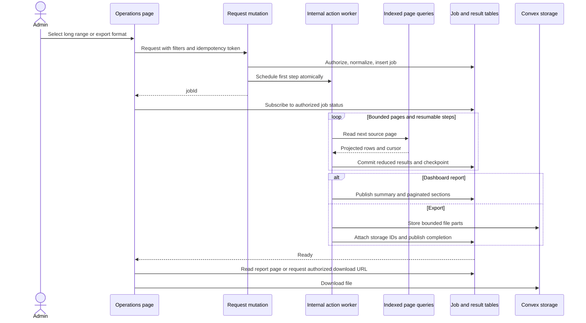

# Operations reporting and exports

**Status:** Implemented after approval. See [implementation and validation](implementation-validation.md) for delivered behavior, development deployment, and rollout notes. The sections below retain the original design context.

**Date:** 2026-09-11

**Scope:** Complete historical dashboard results and asynchronous CSV, Excel, and PDF exports for Lead Gen, Qualifications, Booked Calls, and Sales Calls.

**Prerequisites:** Existing tenant admin access, reporting tables, and Convex storage. Renderer compatibility and resource budgets must be verified in development before rollout.

## 1. Recommendation

Use actions to orchestrate bounded, indexed database pages and aggregate their results. Keep short-range dashboard queries reactive where they fit a conservative read budget. Use asynchronous reporting jobs for ranges longer than seven days, and automatically fall back to the same jobs when a shorter range exceeds that budget.

All exports, including short-range exports, use asynchronous jobs. A public mutation creates the job and schedules an internal action atomically. The client receives the job ID, subscribes to a small status query, and downloads the generated file when the job completes. The database stores storage IDs; a separate authorized mutation resolves a download URL with a fresh expiry check when needed.

The important refinements to the proposed approach are:

1. Start through a mutation so inserting the job and scheduling its action succeed together.
2. Process and checkpoint bounded pages. An action must not accumulate the entire raw dataset, an unlimited group map, or one enormous workbook.
3. Store dashboard results as a small summary plus paginated result rows. Returning a large array from an action would retain the original serialization problem.
4. Produce ordinary single-file downloads for normal reports and numbered file parts for exceptionally large reports. Convex storage does not provide a documented append API for building an unlimited file incrementally.
5. Generate PDF directly in a Node action, subject to a compatibility spike. HTML-to-PDF requires a browser renderer that is not part of the proposed Convex deployment.
6. Sweep every ten minutes, with a separate download lifetime measured from completion. Include failed jobs, intermediate files, and uploads interrupted before their storage ID was attached to the job.

This change preserves the dashboards' existing metric definitions. It does not create a new analytics warehouse, change attribution, or promise a transactionally frozen view of mutable data across an entire multi-query scan.

## 2. Existing behavior and constraints

### Repository findings

| Area | Current behavior | Consequence |
| --- | --- | --- |
| Lead Gen dashboard | Reporting readers cap daily/origin stats at 500 rows; some origin paths read raw submissions. | A month can fail even though the final summary is small. |
| Lead Gen exports | Summary query caps at 1,000 rows; raw export caps at 5,000 and also observes tenant configuration. Excel obtains one large report object and renders in the browser. | Raising a constant does not provide a scalable export path. |
| Qualifications | Dashboard reads at most 1,000 submission events, with bounded Slack-user and schedule reads. | Results can be capped; the event population differs from the opportunity-based detail list. |
| Booked Calls | Efficiency calculation caps bookings at 2,000. The dashboard catches the range error and returns empty results with `capped: true`. | High volume can appear as an empty dashboard unless the capped state is handled. |
| Sales Calls | Dashboard caps daily meeting stats at 1,000 and payment reads at 2,500. | Both meeting and payment totals can be partial. |
| Date controls | Shared frontend validation and `deriveOverviewRange` impose a 120-day maximum. Some detail APIs have separate window limits. | Backend pagination alone will not enable longer custom ranges. |
| Storage/jobs | No shared operations export-job lifecycle exists. | Additive tables, status APIs, workers, and cleanup are required. |

Primary code inspected:

- [Lead Gen export menu](/Users/nimbus/.codex/worktrees/1d36/ptdom-crm/app/workspace/operations/lead-gen/_components/lead-gen-export-menu.tsx), [export queries](/Users/nimbus/.codex/worktrees/1d36/ptdom-crm/convex/leadGen/exports.ts), [report limits](/Users/nimbus/.codex/worktrees/1d36/ptdom-crm/convex/leadGen/reportLimits.ts), [report builders](/Users/nimbus/.codex/worktrees/1d36/ptdom-crm/convex/leadGen/reportBuilders.ts), and [Excel renderer](/Users/nimbus/.codex/worktrees/1d36/ptdom-crm/app/workspace/operations/lead-gen/_components/lead-gen-excel-report.ts).
- [Qualifications dashboard](/Users/nimbus/.codex/worktrees/1d36/ptdom-crm/convex/operations/qualificationsDashboard.ts), [qualification ledger](/Users/nimbus/.codex/worktrees/1d36/ptdom-crm/convex/reporting/lib/slackQualificationLedger.ts), [Booked Calls dashboard](/Users/nimbus/.codex/worktrees/1d36/ptdom-crm/convex/operations/bookedCallsDashboard.ts), and [Sales Calls dashboard](/Users/nimbus/.codex/worktrees/1d36/ptdom-crm/convex/operations/salesCallsDashboard.ts).
- [Schema](/Users/nimbus/.codex/worktrees/1d36/ptdom-crm/convex/schema.ts), [reporting helpers](/Users/nimbus/.codex/worktrees/1d36/ptdom-crm/convex/reporting/lib/helpers.ts), [range derivation](/Users/nimbus/.codex/worktrees/1d36/ptdom-crm/convex/dashboard/overviewRange.ts), [business time helpers](/Users/nimbus/.codex/worktrees/1d36/ptdom-crm/convex/reporting/lib/hondurasBusinessTime.ts), and [CSV serialization](/Users/nimbus/.codex/worktrees/1d36/ptdom-crm/lib/csv.ts).

This plan supersedes the browser-only export mechanism in the [Lead Gen Excel plan](/Users/nimbus/.codex/worktrees/1d36/ptdom-crm/plans/lead-gen-excel-reporting/lead-gen-excel-reporting-design.md). It preserves that report's presentation and the metric contracts of the [operations redesign](/Users/nimbus/.codex/worktrees/1d36/ptdom-crm/plans/nim-17-operations-redesign/design.md) and [team-origin plan](/Users/nimbus/.codex/worktrees/1d36/ptdom-crm/plans/lead-gen-top-posts-by-team/lead-gen-top-posts-by-team-design.md).

### Convex constraints that shape the design

Current published limits, checked on the date above:

| Boundary | Limit |
| --- | --- |
| Array / document / object | 8,192 elements / 1 MiB / 1,024 fields |
| Query or mutation transaction | 16 MiB read; 32,000 documents scanned; 4,096 index-range reads |
| Mutation writes | 16 MiB and 16,000 documents |
| Query/mutation user-code execution | 1 second, excluding database operations |
| Function return / arguments | 16 MiB; Node action arguments are limited to 5 MiB |
| Default-runtime action | 64 MiB memory; 30 minutes |
| Node action | 512 MiB memory; 10 minutes |
| Scheduled arguments | 4 MiB per call; 16 MiB total per mutation |
| HTTP action response | 20 MiB |

Source: [Convex production limits](https://docs.convex.dev/production/state/limits). These are ceilings, not batch-size targets. Each query called by an action has its own transaction budget; moving aggregation into an action does not exempt the page queries or the action's return value from their limits.

Use an index with tenant equality followed by the relevant filter equality and date range. Database `.filter()` does not avoid scanning rows. Returning fewer fields reduces serialized payload but does not reduce bytes read from the underlying documents. Existing rollups remain useful because they reduce the records needed for a report. See [Queries that scale](https://stack.convex.dev/queries-that-scale), [local query performance guidance](/Users/nimbus/.codex/worktrees/1d36/ptdom-crm/.docs/convex/database/indexes-and-query-performance.md), and [local index guidance](/Users/nimbus/.codex/worktrees/1d36/ptdom-crm/.docs/convex/database/indexes.md).

Use cursor pagination with explicit read limits. `numItems` alone is insufficient, particularly for reactive pages or filtering. Continue until `isDone`; an empty filtered page is not completion. Honor the SDK's page-splitting protocol if a byte limit requires a split. See [pagination](https://docs.convex.dev/database/pagination) and [PaginationOptions](https://docs.convex.dev/api/interfaces/server.PaginationOptions).

## 3. Report definitions and export contents

### Common behavior

Every export records the report name, inclusive date labels, actual timestamp boundaries, filters, generation start time, and report-definition version. Job metadata also records completion time; a CSV part written earlier cannot contain the future completion time of the whole job. CSVs include the relevant identifying columns and range metadata; Excel and PDF include a readable report header. Use stable IDs alongside human-readable labels in raw exports.

The first version exports the dashboard's committed date range and its top-level filters: source for Lead Gen, date for the other three pages. Search text, row selection, and filters confined to a drill-down list do not silently redefine the dashboard export. Label the menu scope as the selected report range. A future “export these filtered rows” command would have a separate contract.

| Page | Menu | Contents |
| --- | --- | --- |
| Lead Gen | Summary CSV; Raw Submissions CSV; Performance Excel; Report PDF | Preserve current day/specialist/team/source summary and raw submission columns. Preserve Excel's team sections, specialist performance, source breakdown, and top origins. PDF presents the same performance report. |
| Qualifications | Summary CSV; Raw Qualifications CSV; Performance Excel; Report PDF | Summary has qualifier rows with submissions, schedule hours, submissions/hour, and last submission, plus a distinct overall row with the team quota/goal and progress. Raw file contains one qualification event per row. Excel/PDF contain overall metrics and qualifier performance. |
| Booked Calls | Summary CSV; Raw Bookings CSV; Performance Excel; Report PDF | Summary has distinct team and DM-closer row kinds with bookings, hours, and bookings/hour; goals apply at their existing team/overall scope. Raw file contains one counted booking per row. Excel/PDF contain overall metrics and team/closer performance. |
| Sales Calls | Summary CSV; Raw Calls CSV; Raw Payments CSV; Performance Excel; Report PDF | Summary contains closer metrics and program breakdowns using an explicit row-kind column. Calls and payments have separate raw exports because their date populations differ. Excel/PDF include overall metrics, closer performance, program breakdowns, and attribution reconciliation. |

The performance workbook and PDF are aggregate reports. Raw ledgers remain CSV exports, so rendering a monthly workbook does not require building a workbook containing every raw event.

### Preserve the populations

**Lead Gen:** Read `leadGenDailyStats` for totals and performance, `leadGenOriginStats` for global origins, and `leadGenTeamOriginStats` for team origins. Raw submissions use `submittedAt`. Raw exports retain voided rows with void metadata; dashboard metrics reflect the existing corrected rollups. Retain original team attribution. Count schedule hours once per worker/day at the applicable aggregation scope, even when rows span sources, teams, or pages. “Unique prospects” retains the existing daily-unique aggregation meaning; it is not a newly introduced distinct count across the entire range. Rank post/reel origins only after complete aggregation. Preserve top-3/top-10 presentation limits, explicitly labeled as rankings.

If a worker-filtered origin report is used, the current fallback deduplicates prospect/day pairs from submissions. That set must survive page boundaries in temporary keyed rows; summing page-local distinct counts would be wrong. Do not add worker/team filters to the UI as part of this change, but preserve supported backend filter semantics when extracting the readers.

**Qualifications:** Count `slackQualificationEvents` by `submittedAt`, grouped by Slack user, including the result kinds currently counted by the dashboard. Do not substitute the separate goal-eligibility predicate used elsewhere. Retain scheduled qualifiers with no submissions where the current dashboard includes them. Apply the current schedule and quota rules.

Raw columns: event ID, submitted time, Slack user/team IDs, resolved qualifier label, prospect full-name snapshot, platform, handle snapshot, lead/opportunity IDs when present, and result kind. The event's `fullNameSnapshot` is the prospect's name, not the qualifier's name. The opportunity-based `operationsQualificationRows` detail list cannot supply this ledger: repeated or unlinked events may not have a corresponding distinct opportunity row.

**Booked Calls:** Read `meetings` by `createdAt`, exclude explicit `follow_up` classification, and require DM-closer attribution, matching the existing efficiency calculation. A missing classification retains current behavior. Group by the meeting's team attribution and DM closer. Keep historical teams, missing-quota behavior, and schedule-based rates.

Raw columns: meeting/opportunity/lead IDs, booked time, scheduled time, meeting/opportunity status, booking program, lead label/handle, source, income where currently available, team attribution, and DM closer. Do not reuse scheduled-day meeting rollups for booking-created metrics.

**Sales Calls:** Read `operationsMeetingDailyStats` by scheduled day for call aggregates and `meetings.scheduledAt` for Raw Calls CSV. Count all meeting statuses; showed means completed. Show-up rate is `showed / (calls - canceled)`. Read payments by `recordedAt`, reuse existing non-disputed, commissionable, final-payment and legacy-attribution rules. Sales count is payment-record count, not distinct opportunities. Close rate is `paymentSales / showed`; average sale is final-payment cash divided by payment count. Preserve `null` for undefined rates and do not clamp legitimate rates above 100%.

Raw payment columns: payment ID, recorded time, opportunity ID, amount in minor units, currency, resolved payment type, program, and resolved attributed closer. Export the qualifying final-payment population so its amount/count can reconcile with the cards. A payment may relate to a call outside the calls date range. Keep unattributed payment totals visible: the overall cash card and the attributed closer-total row can legitimately differ. Program attribution for calls and payments also comes from different fields.

The current Sales Calls UI formats money as USD. Verify that contract against test-tenant payment currencies before rollout; retain currency in raw data. Do not label a mixed-currency sum as USD or introduce an implicit exchange rate. If mixed currencies occur, resolve the display contract before enabling those monetary reports.

### Date semantics

Lead Gen, Qualifications, and Booked Calls use the existing Honduras business-day boundary: 01:00 in `America/Tegucigalpa`, currently 07:00 UTC. Sales Calls uses the existing UTC-midnight scheduled-day and payment boundaries. Keep these differences explicit in report headers; changing them would be a separate metric change.

Canonical requests use inclusive date labels and exclusive timestamp upper bounds. Resolve presets once on the server when the request is created. Seven days means seven selected date keys, including weekends, matching the existing `dayCount` behavior. Avoid building one array containing every day in a long range; calculate repeated weekday schedules arithmetically or in bounded chunks.

Introduce operations-specific range validation so long custom ranges can exceed 120 days without changing unrelated Overview/reporting pages. Thread that policy through URL parsing, the date picker, backend range derivation, and these pages' paginated detail validators. Validate real calendar dates, order, and finite bounds. There is no new silent row/date truncation. Very large requests remain subject to the explicit job resource budget below.

## 4. Architecture

### Shared logic, separate consumers

Create domain-specific indexed readers and pure incremental reducers under a proposed `convex/operations/reports/` module. Use a small shared job runner for page handling, progress, retries, and publication. Keep metric rules in named Lead Gen, Qualifications, Booked Calls, and Sales Calls modules, rather than a generic expression/configuration engine.

The live queries and asynchronous readers reuse index selection, population predicates, contribution logic, rates, and report types. Extract the useful portions of existing builders; do not wrap the current capped queries in actions or call a monolithic report builder once per page. Cross-page aggregation needs explicit state.

Dashboard jobs produce a small summary and separate result rows. Export jobs consume the same reducers and report models but produce files. A fresh export may scan again; code reuse does not imply a permanent cache of raw personal data. Within one job, all render sections use its completed materialization rather than re-reading source data during rendering.

### Dashboard selection and UI

- For a resolved range of seven days or fewer, use a bounded live query. Before hydrating or aggregating an unsafe result, return `{ kind: "needsSnapshot" }` rather than partial totals. Account for all sources and dimension reads, not just the primary row count.
- For longer ranges, skip the expensive live query entirely and request a dashboard job. A short range receiving `needsSnapshot` takes the same path. Do not rely on catching a Convex hard-limit failure to detect this condition.
- Subscribe to job status, then a small immutable summary and paginated performance sections. Do not append every section page to an unlimited client array. Add page navigation to large performance tables as needed.
- Show loading skeletons with `role="status"`, an accessible label, and dimensions matching the report. Show “Generated at …” and Refresh for completed historical reports. Display errors with Retry; never present capped/failed data as zero activity.
- A committed filter change gets a new request key. Late completion for an old key cannot overwrite the current view. Coalesce duplicate requests for the same owner, scope, and definition version; React Strict Mode must not create duplicate jobs.
- Existing bounded drill-down lists can remain paginated reactive queries. They represent current records, while historical aggregate sections show their generation time. They must never become a whole-range fetch to match the new aggregation path.

### Consistency contract

An action's multiple queries do not share one transaction. Freezing date bounds or recording `startedAt` does not reconstruct past values of records updated while the job runs. Adding a creation-time cutoff cannot solve updates, deletes, or records moving across a date index. See [actions](https://docs.convex.dev/functions/actions).

Reports are operational views assembled during a recorded read interval. Unchanged source data must produce identical totals across live and asynchronous paths and across formats. Concurrent corrections may produce differences from an earlier dashboard or export; expose generation time and Refresh. Do not claim accounting-grade, point-in-time consistency. Achieving that would require a separate design for versioned facts or a supported consistent-read mechanism spanning the entire job.

## 5. Processing and resource budgets

Initial engineering targets below are configurable and must be measured in the development spike. They are deliberately below platform limits.

| Work unit | Initial target |
| --- | --- |
| Source page | 100 rows; `maximumRowsRead: 250`; `maximumBytesRead: 1 MiB` |
| Projected page / checkpoint request | Normally under 1 MiB; bound serialized bytes as well as count |
| Reference hydration | Separate bounded queries; begin with at most 8 full-document lookups per query, including a budget for authorization reads |
| Page commit | One atomic checkpoint plus bounded contributions; target under 2 MiB writes and 500 affected result rows |
| Action scan step | At most 20 pages or about 45 seconds, then checkpoint and schedule continuation |
| Dashboard summary | Under 256 KiB; no unbounded dimension arrays |
| Dashboard section page | At most 100 rows and under 1 MiB |
| File part | Initially at most 16 MiB output; enforce format-specific input/cell/page budgets before rendering |
| Active jobs | Initially one dashboard and one export per user; at most two running jobs per tenant; bounded queue |
| Recovery | Lease heartbeat between pages; stale-lease watchdog; at most three transient retries per step |
| Whole job | Initial two-hour maximum age; explicit resource-limit failure, never successful truncation |

Actions may use local arrays and maps; only the current bounded work belongs in them. Persist high-cardinality groups, deduplication keys, and rendering input in temporary result rows. A range can therefore span many steps without growing a function result, scheduled argument, or job document with its total data volume.

Use one cursor per source and a deterministic order through its existing date index. Preserve cursors as opaque values tied to the same filters and reader version. Source filtering after a bounded indexed read is acceptable; filtering in the database must not hide an unbounded scan. Do not use the limited search endpoints as export sources.

Hydrate labels through small batches and bounded caches. Include missing/deleted references using the current snapshot/fallback labels; enforce tenant membership on every referenced record. Avoid a large `Promise.all` across records or sources. Existing date indexes cover the first version's visible filters. A future Booked Calls DM-closer/date index must use `createdAt`, not the existing scheduled-date index.

Apply each page's contributions and its next cursor in the same mutation, guarded by the expected checkpoint sequence and lease generation. Duplicate completion becomes a no-op; a stale worker cannot add totals twice. If a page's contributions cannot fit a commit, stage bounded sub-batches with deterministic keys and advance the source cursor only after the entire page is committed. Never advance a cursor after dropping part of a returned page to fit an array limit.

Maintain sums and denominators, then derive rates. Preserve cross-page worker/day schedule deduplication and origin/prospect/day uniqueness where required. Determine global rankings from completed groups, using bounded ranking passes or indexed result rows; selecting the top entries independently on each source page is incorrect.

The current docs expose `getConvexSize` and `ctx.meta.getTransactionMetrics()` for measuring payloads and transaction headroom. Verify availability in the installed SDK before using them; this checkout has no `node_modules`. If needed, make a reviewed SDK update or retain conservative explicit budgets. See [write performance and limits](https://docs.convex.dev/database/writing-data#write-performance-and-limits).

## 6. APIs, state, and schema

Public requests accept report scope, date/filter input, format where applicable, and a client idempotency token. They do not accept trusted tenant/user/role identity.

| Proposed API | Contract |
| --- | --- |
| `requestDashboardReport` mutation | Authorize and normalize; return `{ jobId, requestKey }`; coalesce an equivalent active request. |
| `requestExport` mutation | Same flow, with explicit report/export kind; return immediately after enqueue. |
| `getReportJob` query | Owner-authorized small status: state, phase, rows processed, times including expiry, sanitized error, artifact count. No raw results or growing arrays. |
| `getDashboardReportSummary` query | Ready report's small typed summary and range metadata. |
| `listDashboardReportRows` query | Authorized section/cursor/page-size read, available only after publication. |
| `listReportArtifacts` query | Paginated filenames, part numbers, sizes, and availability. |
| `requestReportDownload` mutation | Verify owner, tenant, current role, ready state, and current expiry; resolve one artifact's storage URL. Use a mutation so the time-sensitive authorization check executes for each request. |
| `cancelReport` mutation | Fence the worker, cancel pending scheduling where possible, and make artifacts eligible for cleanup. |

Use explicit `args` and `returns` validators. All page readers, claim/checkpoint/finalization mutations, render actions, recovery, and cleanup functions are internal. The job ID is the correlation ID and is not itself authorization.

State progression: `queued -> running -> rendering -> ready`, with `failed`, `canceled`, and `expired` terminal states. Dashboard jobs can go directly from running to ready. A retry stays in its current processing phase with a new lease generation and incremented attempt count. Publish ready only when every required source and artifact is complete.

Add the following tenant-scoped tables with explicit discriminated row/status types:

| Table | Important fields | Indexes |
| --- | --- | --- |
| `operationsReportJobs` | `tenantId`, `requestedByUserId`, purpose, report kind, format, normalized range/filters, request token/key, definition version, status/phase, progress scalars, lease generation/expiry, timestamps, sanitized failure, `expiresAt`, `purgeAt` | Tenant/user/token; tenant/user/requestKey/status; tenant/status; status/lease expiry; expiry; purge time |
| `operationsReportCheckpoints` | `tenantId`, `jobId`, source/step key, opaque cursor and optional split state, sequence, completion flag, bounded rendering position | Job/source key; job |
| `operationsReportRows` | `tenantId`, `jobId`, section, stable row key, typed payload, optional numeric sort value | Job/section/key; job/section/sort value; job |
| `operationsReportArtifacts` | `tenantId`, `jobId`, part number, filename, MIME type, state, storage ID when attached, byte size, row count, expected hash, ownership token, reservation/expiry times, recovery cursor | Job/part; ownership token; state/reservation time; expiry |

Use repo-style field-based index names, such as `by_jobId_and_section_and_rowKey`. Internal expiry scans may cross tenants because they act only on this feature's owned rows; public reads always derive and check the tenant and owner. Keep temporary raw projections in bounded chunks or individual rows, never one document per full report. Do not serialize arbitrary dimension IDs as an object with thousands of keys.

### Scheduling and retries

Creating a job and calling `ctx.scheduler.runAfter(0, ...)` from the same mutation is atomic. Scheduled actions do not supply automatic durable retries, and scheduled functions do not inherit the requesting user's authentication. Store the authenticated owner and tenant at creation; workers load that record and recheck eligibility rather than storing/replaying an auth token. See [scheduled functions](https://docs.convex.dev/scheduling/scheduled-functions).

A claim mutation grants a lease and schedules a watchdog. A checkpoint mutation persists progress and schedules the next step when yielding. Retry only transient errors with bounded backoff; validation, authorization, incompatible definitions, and unsupported record/render sizes are terminal. Fence old workers after cancellation, expiry, or takeover. A browser disconnect does not cancel the job.

## 7. File production and downloads

### CSV

Reuse the formula-injection protection and quoting rules in `lib/csv.ts`. Serialize incrementally with consistent UTF-8/newline handling. Preserve existing Lead Gen column ordering, append any new metadata columns deliberately, and document that header change. Include headers in every file part. Never slice a record or lose the final page at a part boundary.

### Excel

Extract the existing Lead Gen workbook construction from its browser download wrapper. Reuse `xlsx-js-style`, writing a buffer in a separate `"use node"` renderer; do not import browser `writeFile` behavior into an action. Introduce report-specific sheets for qualifier performance, DM-closer/team performance, and Sales Calls closer/program summaries. Preserve numeric cells, percentage formats, missing values, safe sheet names, and historical team labels.

Bound cells and sheets before creating the workbook. A small compressed XLSX file can still require substantial memory, so output byte size alone is not a guard. Partition large report sections into independently usable workbooks with a repeated summary and clear part numbers. Treat a format's inability to represent a value as an explicit error rather than silent clipping.

### PDF

Recommended first implementation: `@react-pdf/renderer` in a Node action using its buffer API. Its [Node API](https://react-pdf.org/docs/v4/node) supports server-side generation without a browser. Verify bundling, fonts, memory, and storage upload in Convex before adding the dependency to the production path.

Use a report template rather than a screenshot of the dashboard: title/date/filter header, KPI summary, complete performance tables, relevant source/team/program sections, generation time, repeated table headings, and page numbers. Use built-in or bundled fonts and local drawing primitives; do not fetch arbitrary avatar/image URLs while rendering. Test page wrapping, long labels, and empty reports. Partition exceptionally large reports before rendering.

If the compatibility spike fails, evaluate a separate authenticated Chromium renderer for HTML-to-PDF and revise this plan with its hosting, credentials, and data flow. Do not assume Playwright/Chromium can simply run inside the current Convex action. Browser Print is not a substitute for the requested stored, asynchronously generated PDF.

### Large files and storage

`ctx.storage.store` accepts a completed Blob and returns a storage ID. It does not offer a documented append/compose workflow. See [storing generated files](/Users/nimbus/.codex/worktrees/1d36/ptdom-crm/.docs/convex/files/storing.md). Accordingly, process a bounded part, store it, record its artifact, and release its memory. Do not concatenate all parts into a final unbounded buffer or return file bytes/base64 through an action.

Normal reports complete with one artifact and automatically download it. A multipart result shows “Ready: N files” with a paginated part list and explicit download controls. Do not depend on the browser allowing dozens of automatic downloads. A guaranteed single arbitrarily large CSV/ZIP would require a separate streaming-storage/worker design; it is not promised by this Convex-only version.

The Export button shows a spinner, `aria-busy`, and phase text such as “Reading records” or “Preparing PDF.” Use processed-row counts without a fabricated percentage or an expensive pre-count. Preserve the request's original filters in the completion notice even if the page changes. Offer Cancel, Retry, and Regenerate after expiry.

On completion, fetch the bounded file and download it through a local Blob URL with the intended filename, then revoke that URL. This avoids relying on the `download` attribute to rename a cross-origin storage URL. Handle fetch failure, expiry, and blocked automatic download with a visible download control. Deduplicate the completion effect by job/artifact ID. Store only resumable job IDs/request keys in session state; no auth tokens, report data, or permanent URLs.

## 8. Retention, cleanup, and interrupted uploads

### Proposed policy

- Run an internal cleanup cron every ten minutes with `crons.interval()`.
- Export download availability lasts ten minutes after the entire job becomes ready. Intermediate parts must not expire while their job is still producing subsequent parts.
- Dashboard materializations are reusable for ten minutes after completion; display their timestamp and offer Refresh. Cleanup removes their temporary rows as well.
- Failed/canceled jobs' artifacts and staging rows become immediately eligible for cleanup. Stalled jobs are recovered or failed, not retained indefinitely.
- Keep small diagnostic job metadata for 24 hours after termination. Purge it only after all child rows and storage cleanup/reconciliation have completed.

The ten-minute sweep interval means physical deletion normally occurs ten to twenty minutes after completion, not exactly at ten minutes. Scheduled execution delays can extend that window. The download mutation denies new URL requests after logical expiry, but a previously issued storage URL remains usable until its file is deleted. Convex storage URLs are bearer URLs, not application-authorized per-download URLs. See [serving files](https://docs.convex.dev/file-storage/serve-files).

Do not rely on a cached reactive query's `Date.now()` check to expire access: passing time alone does not invalidate a query. Return `expiresAt` for the UI's countdown/expiry state, and perform URL authorization in the fresh mutation. The sweeper persists the terminal expired state and removes the owned artifacts.

If strict revocation at the expiry instant becomes a requirement, it needs an authenticated delivery path or a separately specified stronger deletion schedule. Do not describe a storage URL as expiring merely because its job document has `expiresAt`.

### Bounded sweeper

Select expired jobs/artifacts through indexes, initially 50 at a time. Fence an expired job before deleting its files. Delete only artifacts owned by these report jobs, then remove checkpoints/results in bounded batches and schedule continuation. Check transaction headroom and avoid one large cascading mutation. Retry failed storage deletion without discarding its ID. Keep active leases separate from expiry cleanup. See [deleting files](https://docs.convex.dev/file-storage/delete-files).

### Close the upload-registration gap

`storage.store()` and the mutation attaching its returned ID are separate operations. A worker can die after the file exists but before the database knows its ID. A sweeper that follows only attached IDs will miss those files.

Before each upload, reserve an artifact with its expected SHA-256, size, unique ownership token, and upload time window. The proposed ownership marker is a MIME parameter on the Blob's content type, keeping CSV bytes and headers unaffected. **Phase 0 must verify that Convex preserves this parameter in `_storage` metadata and that all target downloads remain usable.** This is a release gate, not an assumed API guarantee.

For an abandoned reservation, wait until its worker can no longer upload, then page `_storage` metadata over the bounded reservation window. Match the ownership token, hash, and size before attaching or deleting an otherwise unattached file. Save reconciliation cursors, account for duplicate uploads, and retain reservations until the window is fully reconciled. Never delete an unrelated file simply because its age or checksum resembles an export. Metadata access uses `db.system`, following [file metadata guidance](/Users/nimbus/.codex/worktrees/1d36/ptdom-crm/.docs/convex/files/metadata.md).

If MIME ownership markers are not preserved, choose and validate an equivalent durable ownership marker before shipping; do not claim complete orphan cleanup with only best-effort `finally` blocks. Inject a failure immediately after successful storage upload in QA to prove recovery.

## 9. Authorization and failure behavior

Use `requireTenantUser(ctx, ["tenant_master", "tenant_admin"])` for every public request/status/result/download/cancel endpoint. Require job ownership as well as tenant membership. A guessed correlation ID grants no access. Internal worker checks use the stored owner/tenant and current active membership/role policy. Revocation prevents further reads/publication and makes existing artifacts eligible for deletion; already issued bearer URLs remain subject to physical deletion.

Do not change WorkOS role mapping or grant system-admin sessions access to tenant exports. Keep file URLs, raw names/handles, payment details, and auth material out of logs. Use structured `[Operations:Reports]` events with job ID, scope, phase, page counts, timing, retries, and error category.

| Failure | Required behavior |
| --- | --- |
| Duplicate click, mutation retry, reconnect | Return the existing job for the same owner/idempotency token. A deliberate new export/Refresh has a new token. |
| Worker timeout or crash | Watchdog reclaims an expired lease, resumes committed cursors, and does not double-count a replayed page. |
| Invalid cursor after a reader/deployment change | Fail clearly and regenerate using the current definition; never restart only part of an aggregate. |
| Canceled job completes a late upload | Reject publication through the lease fence and clean the reserved/attached artifact. |
| Missing/deleted related entity | Preserve counts and stable IDs; use snapshot or fallback labels. |
| Empty dataset | Valid header-only CSV or clearly labeled empty Excel/PDF, with zero totals and undefined rates handled correctly. |
| Job exceeds age, size, or render budget | Clear failure or documented file partitioning; no partial report labeled complete. |
| Authorization changes | Stop processing/access and schedule cleanup. |
| Storage/download failure | Preserve retryable state or offer Regenerate; do not silently leave the button spinning. |
| Cleanup failure | Retain artifact ownership and retry; alert on oldest overdue artifact/reservation. |

Measure phase durations, source rows/pages, output bytes, retry counts, completed/failed jobs, and cleanup backlog. Use Convex logs/Insights to check actual read budgets during rollout. This design review used static code and documentation; it did not measure production load.

## 10. Implementation phases and migration

### Phase 0: Prove the boundaries

Install locked dependencies in development. Read the installed Next.js 16 guides before changing client boundaries and shared date controls, and follow the generated Convex guidelines. Verify the installed pagination/transaction-metrics APIs.

Build focused development probes for CSV/Excel/PDF generation and storage, bounded page iteration, and orphan-file ownership/recovery. Measure large-document reads, renderer peak memory, output sizes, and elapsed time. Confirm metric parity on small fixtures, including currency and time boundaries. Finalize file-part budgets and the PDF choice from this evidence.

**Exit:** All three formats can generate/store/download in the target runtime; interrupted uploads can be identified safely; the worker can yield/resume without changing totals.

### Phase 1: Add the job lifecycle

Add the four new tables and indexes, public request/status APIs, lease/checkpoint protocol, bounded queue, and cleanup/recovery. Start with a small internal fixture report. Implement failure injection before connecting the UI.

**Migration:** These are additive, initially empty tables. Existing CRM documents and rollups require no backfill or dual-write changes. Do not install another migrations component just for empty job tables. If an additional index on an existing large table becomes necessary, stage/backfill that index before switching readers, following the repo migration skill.

### Phase 2: Extract readers and metric reducers

Build indexed page readers for all four reports, including dimensions/schedules. Extract existing population and formula logic. Add persistent group/deduplication state and paginated finalized result sections. Replace capped live results with a typed fallback decision where needed.

**Exit:** Small live/asynchronous results match, while fixtures beyond every current cap return complete results through jobs.

### Phase 3: Connect historical dashboards

Add a shared report-request/status hook and operations-only long-range policy. Integrate the four page clients, loading/failure/refresh states, paginated performance sections, and stale-result protection. Keep current thin page RSCs, route authorization, shell, and Suspense patterns.

Likely frontend integration points are the four route-private `*-page-client.tsx` files, plus [use-dashboard-range](/Users/nimbus/.codex/worktrees/1d36/ptdom-crm/app/workspace/_components/use-dashboard-range.ts), [date utilities](/Users/nimbus/.codex/worktrees/1d36/ptdom-crm/app/workspace/_components/dashboard-date-utils.ts), and the shared date-range filter. Changes to shared utilities must preserve the default 120-day policy for other consumers.

### Phase 4: Connect exports

Add shared export-menu/job-status components, report-specific CSV serializers, server-side Excel builders, and PDF templates. Move Lead Gen to the same asynchronous path. Retire its browser report download query usage, including the 1,000/5,000 export caps. Explicitly deprecate the old `rawExportMaxRows` export guard in the new path; keep legacy endpoints/configuration readable during rollout and remove obsolete settings only after consumers are migrated.

**Exit:** All menu choices work across all four pages, including failure, multipart, expiry, and retry behavior.

### Phase 5: Roll out and verify retention

Deploy the additive backend first with a scoped rollout flag for the test tenant. Enable historical dashboards and exports after metric and volume QA. Verify multiple cleanup cycles and failed-upload recovery with tagged test files. Enable more broadly only after monitoring actual resource use.

**Rollback:** Disable new job creation/UI routing, fence queued/running jobs if needed, and leave the compatible backend schema plus cleanup running. Do not delete job/artifact tables while files still depend on their ownership records. The old path may still be used for safe small ranges; large ranges should show temporarily unavailable rather than reverting to capped totals. Remove legacy APIs and temporary compatibility code in a later cleanup release.

Applicable implementation skills: `convex:convex-expert`, `convex:convex-reviewer`, repo-local `convex-performance-audit`, `convex-migration-helper`, `next-best-practices`, `shadcn`, and `vercel-react-best-practices`. Use the PDF/spreadsheet artifact skills for renderer inspection and visual QA. No new WorkOS integration, external rendering service, or recurring app automation is required by the recommended path.

## 11. Verification matrix

The repo currently emphasizes manual QA and has no installed test runtime in this checkout. Add focused reducer/job integration coverage because cursor handling, retries, and financial aggregation justify it; use the generated Convex testing guidance. Follow [TESTING.MD](/Users/nimbus/.codex/worktrees/1d36/ptdom-crm/TESTING.MD) for development backend inspection and role-specific UI checks.

| Area | Cases and acceptance criteria |
| --- | --- |
| Metric parity | Fixed fixtures agree between live, job, summary CSV, Excel, and PDF. Raw ledgers reconcile using the documented populations. |
| Volume | Exceed 500/1,000 rollups, 2,000 bookings, 2,500 payments, 5,000 submissions, 8,192 result rows, and 32,000 scanned source documents per report. No individual transaction/serialized array approaches those hard limits. |
| Cardinality | More than 8,192 groups/deduplication keys are stored and paged, not returned in one array or serialized object. |
| Page boundaries | Duplicate timestamps, empty filtered pages, byte-limited/split pages, source exhaustion, worker/day split across pages, and part-boundary rows. No missing or double-counted records on unchanged data. |
| Dates | 7 versus 8 days; current month early/late; custom ranges over 120 and 366 days; leap day; exact 00:00 and 07:00 UTC boundaries; invalid/reversed dates. |
| Domain rules | Voids, duplicate qualifications, unlinked events, missing schedules, historical teams, follow-ups, canceled/no-show calls, deposits/disputes, legacy payment attribution, unassigned revenue, and null denominators. |
| Durability | Crash before/after page commit; duplicate scheduled step; lease takeover; cancellation during upload; crash after `storage.store`; browser disconnect and Strict Mode replay. |
| Security | Other tenant, same-tenant different user, closer/system-admin sessions, role revocation, mismatched filters/artifact ID, CSV formula inputs, and expired download requests, including previously cached ready status. |
| Files | Excel numeric types and safe sheet names; CSV quotes/newlines/Unicode; PDF page breaks/repeated headings/long names; multipart completeness; download filenames and retry controls. |
| Cleanup | Successful, failed, canceled, abandoned-upload, and stale-running jobs; no deletion of unrelated uploads; retries eventually remove owned storage and temporary rows. |
| Resources | Measure read bytes/rows, commit bytes, action memory/time, concurrent-job limits, and cleanup continuation. Fail before rendering oversized input. |
| Concurrent edits | Update records while scanning to confirm the documented read-interval semantics, completed-output immutability, and useful Refresh behavior. |

Create volume fixtures in an isolated development deployment using internal fixture helpers. Do not generate tens of thousands of real Calendly bookings or write production data for load testing. Run the repository lint/type/build checks appropriate to changed files and use Convex deployment validation before browser QA.

## 12. Review decisions

The plan is ready for review with these explicit defaults:

| Decision | Recommended default |
| --- | --- |
| Very large exports | Numbered bounded files; normal reports still download one file. A mandatory single huge file requires a different storage/streaming design. |
| Download lifetime | Ten minutes from completion, swept every ten minutes; normal physical retention is ten to twenty minutes, subject to scheduler delays. |
| PDF approach | Direct Node PDF generation after a compatibility spike, using the dashboard's report data. |
| Sales Calls audit export | Separate Raw Calls CSV and Raw Payments CSV. |
| Qualifications raw population | Submission-event ledger, matching dashboard counts. |
| Long custom ranges | Remove the 120-day restriction only for these operations flows; bound processing through steps, concurrency, parts, and explicit job age. |
| Consistency | Operational read interval with generation timestamps and Refresh; no claimed transactionally frozen historical snapshot. |

The remaining technical gates are PDF/runtime compatibility, safe interrupted-upload ownership metadata, measured per-format budgets, and confirmation of the existing USD reporting contract. They are scheduled in Phase 0 before implementation of the production flow depends on them.

The local file-storage directory was reviewed in full. Its `serve.md` and `delete.md` files are empty, so this plan uses the current official serving/deletion pages for those contracts. The initial planning pass made no application or deployment changes; implementation followed the user's approval.
