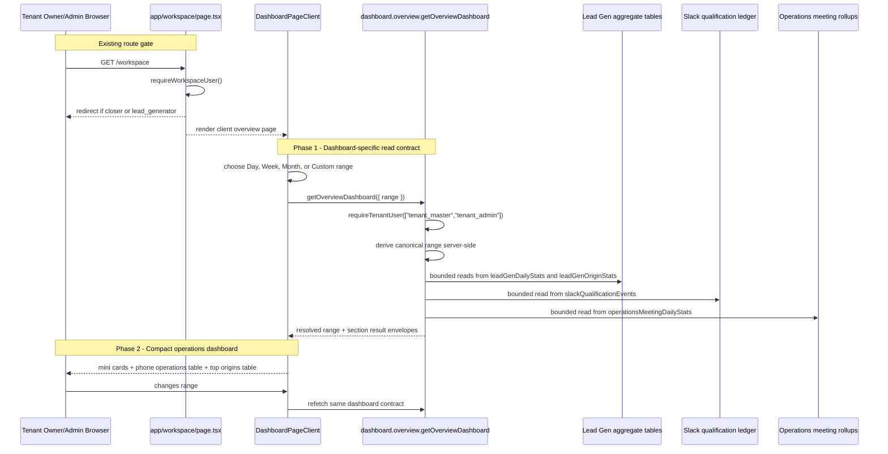

# Overview Dashboard Redesign — Design Specification

**Version:** 0.2 (MVP)  
**Status:** Draft, implementation-ready after product confirmation of ranking choices  
**Scope:** Replace the current tenant owner/admin `/workspace` dashboard with a compact operations overview driven by one shared Day/Week/Month/Custom range. The implementation should use dashboard-specific Convex read contracts that return only the data this screen needs.  
**Prerequisite:** Existing lead-gen ops rollups, Slack qualification reporting, operations meeting rollups, WorkOS AuthKit tenant auth, and admin workspace routing. No MVP schema migration is planned.

---

## Table of Contents

1. [Goals & Non-Goals](#1-goals--non-goals)
2. [Actors & Roles](#2-actors--roles)
3. [End-to-End Flow Overview](#3-end-to-end-flow-overview)
4. [Verified Current State](#4-verified-current-state)
5. [Phase 1: Dashboard Query Contract](#5-phase-1-dashboard-query-contract)
6. [Phase 2: Overview UI Composition](#6-phase-2-overview-ui-composition)
7. [Phase 3: Verification & Rollout](#7-phase-3-verification--rollout)
8. [Data Model](#8-data-model)
9. [Convex Function Architecture](#9-convex-function-architecture)
10. [Routing & Authorization](#10-routing--authorization)
11. [Security Considerations](#11-security-considerations)
12. [Error Handling & Edge Cases](#12-error-handling--edge-cases)
13. [Open Questions](#13-open-questions)
14. [Dependencies](#14-dependencies)
15. [Applicable Skills](#15-applicable-skills)

---

## 1. Goals & Non-Goals

### Goals

- Redesign `/workspace` for `tenant_master` and `tenant_admin` users as an operations dashboard with:
  - A shared Day / Week / Month / Custom range control.
  - Three top mini dashboards: Lead Gen, Top Qualifiers, Top DM Closers.
  - A full-width Phone Closer Operations table.
  - A full-width Top Posts & Reels table.
- Use one dashboard-specific Convex public query as the preferred client contract:
  - The query derives tenant context from auth, not from client input.
  - The query derives canonical date boundaries server-side.
  - The query returns only the fields needed by this dashboard.
  - Each section has a typed `status` envelope so one capped section does not blank the full UI.
- Reuse existing aggregate tables and proven summarization logic where it is already correct.
- Extract shared helper logic when an existing query already has the right semantics, rather than calling public queries through `ctx.runQuery`.
- Create the missing top DM closer builder from existing `operationsMeetingDailyStats` rows.
- Keep all MVP reads bounded by existing aggregate caps or explicit dashboard caps.
- Make range semantics explicit:
  - Lead Gen and Slack use Honduras 1am-to-1am business dates.
  - Operations rollups use the existing `operationsMeetingDailyStats.dayKey` UTC date buckets.
- Preserve the existing RSC page shell and role redirects.

### Non-Goals (deferred)

- Per-widget independent filters. The global dashboard range applies to all sections.
- Cross-tenant system admin reporting under `/admin`.
- A materialized overview snapshot table.
- New visual charting packages.
- New lead-gen attribution semantics or capture fields.
- Exact Honduras-business-day operations rollups. If required later, this becomes a schema/data migration and must use `convex-migration-helper`.
- Commercial revenue/sales columns in the overview phone closer table. Those remain in `/workspace/reports/team` unless product scope changes.

---

## 2. Actors & Roles

| Actor | Identity | Auth Method | Key Permissions |
|---|---|---|---|
| Tenant owner | CRM `users.role = "tenant_master"` in a WorkOS tenant org | WorkOS AuthKit session bridged to Convex auth | Full read access to this tenant overview |
| Tenant admin | CRM `users.role = "tenant_admin"` in a WorkOS tenant org | WorkOS AuthKit session bridged to Convex auth | Full read access to this tenant overview |
| Closer | CRM `users.role = "closer"` | WorkOS AuthKit session bridged to Convex auth | Redirected from `/workspace` to `/workspace/closer`; no access to admin overview query |
| Lead generator | CRM `users.role = "lead_generator"` | WorkOS AuthKit session bridged to Convex auth | Redirected from `/workspace` to `/workspace/lead-gen/capture`; no access to admin overview query |
| System admin | WorkOS org ID matches `SYSTEM_ADMIN_ORG_ID` | WorkOS AuthKit session | Uses `/admin`; no new cross-tenant behavior here |

### CRM Role <-> WorkOS Role Mapping

| CRM `users.role` | WorkOS RBAC role | Notes |
|---|---|---|
| `tenant_master` | `owner` | Primary dashboard actor |
| `tenant_admin` | `tenant-admin` | Primary dashboard actor |
| `closer` | `closer` | Redirected to closer dashboard |
| `lead_generator` | `lead-generator` | Redirected to lead-gen capture |

---

## 3. End-to-End Flow Overview



---

## 4. Verified Current State

This section replaces the old "Phase 1 data contract audit." The design below is based on repo verification of the current schema, query files, and UI components. Runtime row counts still need to be measured during rollout, but the sources and missing implementation pieces are known now.

### 4.1 Source Verification Matrix

| Dashboard Need | Verified Existing Source | Verified Code | Decision |
|---|---|---|---|
| Lead-gen total | `leadGenDailyStats` | `convex/leadGen/reporting.ts:getOverview`; `convex/leadGen/reportBuilders.ts:summarizeDailyRows` | Use existing aggregate table and shared summarizer. Extract the bounded daily stats reader so the dashboard query does not call a public query. |
| Top lead generators | `leadGenDailyStats` + `leadGenWorkers` | `listWorkerPerformance`; `buildWorkerPerformanceRows` | Use existing grouping semantics, return top 5 only. Do not return email, inactive state, or full worker table columns unless the card needs them. |
| Top Slack qualifiers | `slackQualificationEvents`, `slackUsers`, linked opportunities | `convex/slack/metrics.ts:perSlackUserBreakdown`; `convex/reporting/lib/slackQualificationLedger.ts` | Reuse the ledger helper and extract per-user row building into a shared helper. Return top 5 only. |
| Qualifier opportunity-to-booked ratio | Same Slack source | Existing `ratio = booked / uniqueSlackOpportunityCount` | Preserve existing ratio semantics. |
| Top DM closers | `operationsMeetingDailyStats.dmCloserId` + `dmClosers` + `attributionTeams` | Field exists in schema; no dedicated top-N dashboard query exists | Create dashboard-specific builder. Rank by scheduled call volume for MVP and display show rate as context. |
| Phone closer operations | `operationsMeetingDailyStats.assignedCloserId` | `convex/reporting/teamPerformance.ts:getTeamOperationsDimensions`; team report table | Replicate the minimal operations-table aggregation in the dashboard helper with bounded ID enrichment. Avoid the current `getActiveClosers()` async iteration in this dashboard query. |
| Top posts/reels | `leadGenOriginStats` | `convex/leadGen/reporting.ts:listTopOrigins`; `TopOriginsTable` | Extract or replicate the tenant-wide public query semantics: rank by submissions, not by the Excel helper's unique-prospect-first sort. |
| Shared date filter | Existing pieces only | `time-period-filter.tsx`, Slack business date utils, `hondurasBusinessTime.ts` | Create a dashboard range helper. Client sends preset/custom intent; Convex returns canonical boundaries and label. |

### 4.2 What To Use, Rewrite, Replicate, Or Create

| Category | Item | Plan |
|---|---|---|
| Use | Existing tables and indexes | No MVP schema changes. Use `leadGenDailyStats`, `leadGenOriginStats`, `slackQualificationEvents`, `operationsMeetingDailyStats`, `dmClosers`, `attributionTeams`, `leadGenWorkers`, `slackUsers`. |
| Use | `reporting/lib/hondurasBusinessTime.ts` | Use for business date validation, timestamp conversion, and business-day arithmetic. |
| Rewrite / extract | Lead-gen reporting internals | Move private daily stats reader, range validator, worker/team loaders, and tenant-wide top-origin grouping into shared helpers consumed by both current lead-gen queries and the overview query. |
| Rewrite / extract | Slack per-user breakdown | Keep the public `perSlackUserBreakdown` query but move row construction into a helper that accepts `tenantId`, `windowStart`, and `windowEnd`. |
| Replicate narrowly | Phone closer operations | Do not call the existing public query and do not reuse its active closer scan. Build the dashboard's minimal phone table directly from capped operations stats rows. |
| Create | Top DM closer builder | Group capped `operationsMeetingDailyStats` rows by `dmCloserId`, enrich from `dmClosers` and `attributionTeams`, and return top 5. |
| Create | Dashboard query and section envelopes | Add `convex/dashboard/overview.ts`, `overviewRange.ts`, and `overviewBuilders.ts`. |
| Create | Dashboard UI components | Add compact cards, reusable tables, date range control, and skeletons under `app/workspace/_components/`. |

> **Design decision:** Build dashboard-specific reads rather than composing existing public queries. Public queries often return fields this screen does not need and sometimes have UI/report-specific behavior. The dashboard should share pure helpers where possible, but its public API should be purpose-built.

### 4.3 Verified Caps And Boundaries

| Area | Current Cap / Boundary | Dashboard Policy |
|---|---|---|
| Lead-gen daily rows | `DAILY_STATS_READ_LIMIT = 500` in `leadGen/reporting.ts` | Preserve cap. If exceeded, mark only Lead Gen as `capped`. |
| Lead-gen top origins | `ORIGIN_STATS_READ_LIMIT = 500` for tenant-wide aggregate path | Preserve cap. If exceeded, mark Top Origins as `capped`; do not show partial top-N. |
| Lead-gen report days | `MAX_REPORT_DAYS = 120` | Use 120 business days as the maximum dashboard Custom range. |
| Slack qualification events | `MAX_QUALIFICATION_EVENTS = 1000`, exported from `slackQualificationLedger.ts` | Preserve existing truncation behavior. Show `truncated` warning but still display top qualifiers. |
| Operations stats rows | `MAX_OPERATIONS_STATS_ROWS = 1000` in team report | Use a dashboard constant of 1000 rows. If exceeded, mark Phone Operations and Top DM Closers as `capped`; do not show partial leaderboards. |
| Operations day boundary | `operationsMeetingDailyStats.dayKey` is derived from UTC date | Keep this explicit in UI copy and docs. Do not claim exact Honduras 1am parity for operations. |

### 4.4 Missing MVP Work

| Missing Work | Required For | Owner Module |
|---|---|---|
| `getOverviewDashboard` public query | Single typed client contract | `convex/dashboard/overview.ts` |
| Server-side range resolver | Authoritative Day/Week/Month/Custom boundaries | `convex/dashboard/overviewRange.ts` |
| Section result envelope helper | Partial UI degradation | `convex/dashboard/overviewBuilders.ts` |
| Lead-gen dashboard helper extraction | Avoid duplicate or over-broad lead-gen reads | `convex/leadGen/reportBuilders.ts` or colocated helper file |
| Slack per-user builder extraction | Reuse existing ratio semantics without public-query composition | `convex/slack/metrics.ts` or `convex/reporting/lib/slackQualificationBreakdown.ts` |
| Top DM closer aggregation | New card | `convex/dashboard/overviewBuilders.ts` |
| Bounded phone operations aggregation | Full-width table | `convex/dashboard/overviewBuilders.ts` |
| Dashboard range control | Day/Week/Month/Custom UI | `app/workspace/_components/dashboard-date-range-filter.tsx` |
| Compact cards and tables | New overview surface | `app/workspace/_components/*` |

---

## 5. Phase 1: Dashboard Query Contract

### 5.1 Public Query Shape

```typescript
// Path: convex/dashboard/overview.ts
import { v } from "convex/values";
import { query } from "../_generated/server";
import { requireTenantUser } from "../requireTenantUser";
import { getOverviewDashboardData } from "./overviewBuilders";

const overviewRangeValidator = v.union(
  v.object({
    kind: v.literal("preset"),
    preset: v.union(
      v.literal("today"),
      v.literal("this_week"),
      v.literal("this_month"),
    ),
  }),
  v.object({
    kind: v.literal("custom"),
    startBusinessDate: v.string(),
    endBusinessDateInclusive: v.string(),
  }),
);

export const getOverviewDashboard = query({
  args: {
    range: overviewRangeValidator,
  },
  handler: async (ctx, args) => {
    const { tenantId } = await requireTenantUser(ctx, [
      "tenant_master",
      "tenant_admin",
    ]);

    return await getOverviewDashboardData(ctx, {
      tenantId,
      range: args.range,
      now: Date.now(),
    });
  },
});
```

> **Runtime decision:** Use a Convex `query`, not an action or server route. All required data already lives in Convex, and the dashboard should remain reactive when underlying rollups update.

> **Security decision:** The client never supplies `tenantId`, `userId`, or role. The query derives tenant access through `requireTenantUser()`.

### 5.2 Resolved Range Contract

The client sends intent. Convex returns the exact resolved range so every section and label uses the same source of truth.

```typescript
// Path: convex/dashboard/overviewRange.ts
import {
  addBusinessDays,
  businessDateToUtcStart,
  countBusinessDays,
  timestampToBusinessDateKey,
} from "../reporting/lib/hondurasBusinessTime";

export type OverviewRangeInput =
  | { kind: "preset"; preset: "today" | "this_week" | "this_month" }
  | {
      kind: "custom";
      startBusinessDate: string;
      endBusinessDateInclusive: string;
    };

export type DerivedOverviewRange = {
  input: OverviewRangeInput;
  startBusinessDate: string;
  endBusinessDateInclusive: string;
  endBusinessDateExclusive: string;
  slackWindowStart: number;
  slackWindowEnd: number;
  operationsStartDate: number;
  operationsEndDate: number;
  operationsStartDayKey: string;
  operationsEndDayKeyExclusive: string;
  dayCount: number;
  label: string;
  operationsBoundary: "utc_day_key";
};

export type PublicOverviewRange = Pick<
  DerivedOverviewRange,
  | "startBusinessDate"
  | "endBusinessDateInclusive"
  | "endBusinessDateExclusive"
  | "dayCount"
  | "label"
  | "operationsBoundary"
>;

const MAX_CUSTOM_DAYS = 120;

export function deriveOverviewRange(
  input: OverviewRangeInput,
  now: number,
): DerivedOverviewRange {
  const today = timestampToBusinessDateKey(now);
  const tomorrow = addBusinessDays(today, 1);

  const startBusinessDate =
    input.kind === "custom"
      ? input.startBusinessDate
      : input.preset === "this_week"
        ? startOfBusinessIsoWeek(today)
        : input.preset === "this_month"
          ? startOfBusinessMonth(today)
          : today;

  const endBusinessDateInclusive =
    input.kind === "custom" ? input.endBusinessDateInclusive : today;
  const endBusinessDateExclusive =
    input.kind === "custom"
      ? addBusinessDays(endBusinessDateInclusive, 1)
      : tomorrow;

  const dayCount = countBusinessDays(
    startBusinessDate,
    endBusinessDateExclusive,
  );
  if (dayCount > MAX_CUSTOM_DAYS) {
    throw new Error(`Dashboard range cannot exceed ${MAX_CUSTOM_DAYS} days`);
  }

  const slackWindowStart = businessDateToUtcStart(startBusinessDate);
  const slackWindowEnd = businessDateToUtcStart(endBusinessDateExclusive);

  return {
    input,
    startBusinessDate,
    endBusinessDateInclusive,
    endBusinessDateExclusive,
    slackWindowStart,
    slackWindowEnd,
    operationsStartDate: Date.parse(`${startBusinessDate}T00:00:00.000Z`),
    operationsEndDate: Date.parse(`${endBusinessDateExclusive}T00:00:00.000Z`),
    operationsStartDayKey: startBusinessDate,
    operationsEndDayKeyExclusive: endBusinessDateExclusive,
    dayCount,
    label:
      startBusinessDate === endBusinessDateInclusive
        ? startBusinessDate
        : `${startBusinessDate} to ${endBusinessDateInclusive}`,
    operationsBoundary: "utc_day_key",
  };
}

export function toPublicOverviewRange(
  range: DerivedOverviewRange,
): PublicOverviewRange {
  return {
    startBusinessDate: range.startBusinessDate,
    endBusinessDateInclusive: range.endBusinessDateInclusive,
    endBusinessDateExclusive: range.endBusinessDateExclusive,
    dayCount: range.dayCount,
    label: range.label,
    operationsBoundary: range.operationsBoundary,
  };
}

function startOfBusinessIsoWeek(dateKey: string) {
  businessDateToUtcStart(dateKey);
  const [year, month, day] = dateKey.split("-").map(Number);
  const date = new Date(Date.UTC(year, month - 1, day));
  const utcDay = date.getUTCDay() || 7;
  date.setUTCDate(date.getUTCDate() - (utcDay - 1));
  return date.toISOString().slice(0, 10);
}

function startOfBusinessMonth(dateKey: string) {
  businessDateToUtcStart(dateKey);
  return `${dateKey.slice(0, 7)}-01`;
}
```

> **Range decision:** The dashboard uses Honduras business dates as the selection model because lead-gen ops and Slack qualification reporting already use that model. Operations tables use matching date labels but read existing UTC day-key rollups.

### 5.3 Section Result Envelope

```typescript
// Path: convex/dashboard/overviewTypes.ts
export type SectionResult<T> =
  | {
      status: "ready";
      data: T;
      truncated: boolean;
      message: null;
    }
  | {
      status: "empty";
      data: T;
      truncated: false;
      message: string;
    }
  | {
      status: "capped";
      data: null;
      truncated: true;
      message: string;
    }
  | {
      status: "error";
      data: null;
      truncated: false;
      message: string;
    };
```

```typescript
// Path: convex/dashboard/overviewBuilders.ts
async function resolveSection<T>(
  key: string,
  build: () => Promise<{ data: T; truncated?: boolean; isEmpty?: boolean }>,
): Promise<SectionResult<T>> {
  try {
    const result = await build();
    if (result.isEmpty) {
      return {
        status: "empty",
        data: result.data,
        truncated: false,
        message: "No activity for this range.",
      };
    }
    return {
      status: "ready",
      data: result.data,
      truncated: Boolean(result.truncated),
      message: null,
    };
  } catch (error) {
    const message = error instanceof Error ? error.message : "Unknown error";
    if (isExpectedRangeCapError(message)) {
      return { status: "capped", data: null, truncated: true, message };
    }
    console.error("[Dashboard:Overview] section failed", { key, message });
    return {
      status: "error",
      data: null,
      truncated: false,
      message: "This section could not be loaded.",
    };
  }
}

function isExpectedRangeCapError(message: string) {
  return /too large|cannot exceed|narrow/i.test(message);
}
```

> **Failure isolation decision:** Section envelopes are for expected section-level cap and data issues. They do not protect against the whole Convex query exceeding transaction limits. If the composed query is too large in rollout verification, keep these exact section contracts but split into separate public queries.

### 5.4 Composed Dashboard Data

```typescript
// Path: convex/dashboard/overviewBuilders.ts
import type { Id } from "../_generated/dataModel";
import type { QueryCtx } from "../_generated/server";
import {
  deriveOverviewRange,
  toPublicOverviewRange,
  type OverviewRangeInput,
} from "./overviewRange";

export async function getOverviewDashboardData(
  ctx: QueryCtx,
  args: {
    tenantId: Id<"tenants">;
    range: OverviewRangeInput;
    now: number;
  },
) {
  const range = deriveOverviewRange(args.range, args.now);

  const [
    leadGen,
    topQualifiers,
    topDmClosers,
    phoneCloserOperations,
    topOrigins,
  ] = await Promise.all([
    resolveSection("leadGen", () => getLeadGenSection(ctx, args.tenantId, range)),
    resolveSection("topQualifiers", () =>
      getTopQualifiersSection(ctx, args.tenantId, range),
    ),
    resolveSection("topDmClosers", () =>
      getTopDmClosersSection(ctx, args.tenantId, range),
    ),
    resolveSection("phoneCloserOperations", () =>
      getPhoneCloserOperationsSection(ctx, args.tenantId, range),
    ),
    resolveSection("topOrigins", () =>
      getTopOriginsSection(ctx, args.tenantId, range),
    ),
  ]);

  return {
    range: toPublicOverviewRange(range),
    leadGen,
    topQualifiers,
    topDmClosers,
    phoneCloserOperations,
    topOrigins,
  };
}
```

### 5.5 Lead Gen Section

Return only the top-card data.

```typescript
// Path: convex/dashboard/overviewTypes.ts
export type LeadGenOverview = {
  totalSubmissions: number;
  uniqueProspects: number;
  duplicates: number;
  scheduledHours: number;
  leadsPerHour: number | null;
  topWorkers: Array<{
    workerId: Id<"leadGenWorkers">;
    displayName: string;
    submissions: number;
    uniqueProspects: number;
    leadsPerHour: number | null;
  }>;
};
```

Implementation plan:

| Step | Detail |
|---|---|
| Extract | Move `readDailyStatsRows`, lead-gen range validation, `loadWorkers`, and needed team loading into shared helpers or a dashboard-specific helper module. |
| Reuse | Use `summarizeDailyRows`, `buildWorkerPerformanceRows`, and `loadCurrentScheduledHoursByWorkerDay`. |
| Trim | Slice workers to top 5 and drop email, `isActive`, duplicates, and team fields unless the UI explicitly displays them. |
| Cap behavior | If daily stats exceed 500 rows, return `status: "capped"` for this section. |

```typescript
// Path: convex/dashboard/overviewBuilders.ts
async function getLeadGenSection(
  ctx: QueryCtx,
  tenantId: Id<"tenants">,
  range: DerivedOverviewRange,
) {
  const rows = await readLeadGenDailyRowsForDashboard(ctx, {
    tenantId,
    startDayKey: range.startBusinessDate,
    endDayKey: range.endBusinessDateInclusive,
    limit: 500,
  });
  const hoursByWorkerDay = await loadCurrentScheduledHoursByWorkerDay(ctx, {
    tenantId,
    rows,
  });
  const workers = await loadLeadGenWorkersForRows(ctx, tenantId, rows);
  const teams = await loadLeadGenTeamsForRows(ctx, tenantId, rows);
  const summary = summarizeDailyRows(rows, hoursByWorkerDay);
  const topWorkers = buildWorkerPerformanceRows({
    rows,
    currentScheduledHoursByWorkerDay: hoursByWorkerDay,
    workers,
    teams,
  })
    .slice(0, 5)
    .map((worker) => ({
      workerId: worker.workerId,
      displayName: worker.displayName,
      submissions: worker.submissions,
      uniqueProspects: worker.uniqueProspects,
      leadsPerHour: worker.leadsPerHour,
    }));

  return {
    data: {
      totalSubmissions: summary.submissions,
      uniqueProspects: summary.uniqueProspects,
      duplicates: summary.duplicates,
      scheduledHours: summary.scheduledHours,
      leadsPerHour: summary.leadsPerHour,
      topWorkers,
    },
    isEmpty: summary.submissions === 0,
  };
}
```

### 5.6 Top Qualifiers Section

```typescript
// Path: convex/dashboard/overviewTypes.ts
export type TopQualifierRow = {
  slackUserId: string;
  displayName: string | null;
  avatarUrl: string | null;
  isDeleted: boolean;
  total: number;
  uniqueOpportunityCount: number;
  booked: number;
  ratio: number | null;
};
```

Implementation plan:

| Step | Detail |
|---|---|
| Reuse | Use `listQualificationEventsForRange`, `loadOpportunityMapForQualificationEvents`, and `summarizeQualificationEvents`. |
| Extract | Move the per-user row builder from `slack/metrics.ts` into a shared helper, or add a function exported only for internal reuse. |
| Trim | Return top 5 rows only. |
| Truncation | Preserve existing Slack behavior: a 1000-event cap returns partial/truncated metrics, not a hard capped section. |

```typescript
// Path: convex/dashboard/overviewBuilders.ts
async function getTopQualifiersSection(
  ctx: QueryCtx,
  tenantId: Id<"tenants">,
  range: DerivedOverviewRange,
) {
  const breakdown = await buildSlackUserQualificationBreakdown(ctx, {
    tenantId,
    windowStart: range.slackWindowStart,
    windowEnd: range.slackWindowEnd,
    limit: 5,
  });

  return {
    data: {
      rows: breakdown.rows,
    },
    truncated: breakdown.truncated,
    isEmpty: breakdown.rows.length === 0,
  };
}
```

### 5.7 Top DM Closers Section

MVP definition: top DM closers are ranked by booked-call attribution volume in `operationsMeetingDailyStats`, grouped by `dmCloserId`.

```typescript
// Path: convex/dashboard/overviewTypes.ts
export type TopDmCloserRow = {
  dmCloserId: Id<"dmClosers">;
  displayName: string;
  teamName: string | null;
  scheduled: number;
  completed: number;
  noShows: number;
  reviewRequired: number;
  showRate: number | null;
};
```

```typescript
// Path: convex/dashboard/overviewBuilders.ts
const OPERATIONS_STATS_ROW_LIMIT = 1000;

async function getTopDmClosersSection(
  ctx: QueryCtx,
  tenantId: Id<"tenants">,
  range: DerivedOverviewRange,
) {
  const rows = await ctx.db
    .query("operationsMeetingDailyStats")
    .withIndex("by_tenantId_and_dayKey", (q) =>
      q
        .eq("tenantId", tenantId)
        .gte("dayKey", range.operationsStartDayKey)
        .lt("dayKey", range.operationsEndDayKeyExclusive),
    )
    .take(OPERATIONS_STATS_ROW_LIMIT + 1);

  if (rows.length > OPERATIONS_STATS_ROW_LIMIT) {
    throw new Error("DM closer range is too large. Narrow the date range.");
  }

  const byDmCloser = new Map<Id<"dmClosers">, {
    scheduled: number;
    completed: number;
    noShows: number;
    reviewRequired: number;
  }>();

  for (const row of rows) {
    if (!row.dmCloserId) continue;
    const current = byDmCloser.get(row.dmCloserId) ?? {
      scheduled: 0,
      completed: 0,
      noShows: 0,
      reviewRequired: 0,
    };
    current.scheduled += row.count;
    if (row.meetingStatus === "completed") current.completed += row.count;
    if (row.meetingStatus === "no_show") current.noShows += row.count;
    if (row.meetingStatus === "meeting_overran") {
      current.reviewRequired += row.count;
    }
    byDmCloser.set(row.dmCloserId, current);
  }

  const enriched = await enrichDmCloserRows(ctx, tenantId, byDmCloser);
  const sortedRows = enriched
    .sort(
      (left, right) =>
        right.scheduled - left.scheduled ||
        right.completed - left.completed ||
        left.displayName.localeCompare(right.displayName),
    )
    .slice(0, 5);

  return {
    data: { rows: sortedRows },
    isEmpty: sortedRows.length === 0,
  };
}
```

> **Scalability decision:** A `by_tenantId_and_dmCloserId_and_dayKey` index would help filtered drilldowns but not tenant-wide top-N ranking. If the 1000-row range cap is a real problem, the right follow-up is a daily DM closer rollup table, not only a new index.

### 5.8 Phone Closer Operations Section

Return the dashboard table fields only.

```typescript
// Path: convex/dashboard/overviewTypes.ts
export type PhoneCloserOperations = {
  rows: Array<{
    closerId: Id<"users">;
    closerName: string;
    scheduled: number;
    completed: number;
    noShows: number;
    reviewRequired: number;
    showRate: number | null;
    noShowRate: number | null;
  }>;
  totals: {
    scheduled: number;
    completed: number;
    noShows: number;
    reviewRequired: number;
    showRate: number | null;
    noShowRate: number | null;
  };
};
```

Implementation plan:

| Step | Detail |
|---|---|
| Read | Query `operationsMeetingDailyStats` by `by_tenantId_and_dayKey`, same as team report. |
| Bound | Use `.take(1001)` and cap at 1000 rows. |
| Group | Group by `assignedCloserId`. |
| Enrich | Load only closer IDs present in stats rows with `ctx.db.get`. This is bounded by the 1000-row cap and avoids the current active-user iteration. |
| Sort | Scheduled desc, then closer name asc. |

```typescript
// Path: convex/dashboard/overviewBuilders.ts
async function getPhoneCloserOperationsSection(
  ctx: QueryCtx,
  tenantId: Id<"tenants">,
  range: DerivedOverviewRange,
) {
  const rows = await readOperationsStatsRows(ctx, tenantId, range);
  const byCloser = groupOperationsRowsByAssignedCloser(rows);
  const closerNames = await loadUserDisplayNames(ctx, tenantId, [
    ...byCloser.keys(),
  ]);
  const tableRows = [...byCloser.entries()]
    .map(([closerId, totals]) => ({
      closerId,
      closerName: closerNames.get(closerId) ?? "Removed closer",
      ...totals,
      showRate: totals.scheduled === 0 ? null : totals.completed / totals.scheduled,
      noShowRate: totals.scheduled === 0 ? null : totals.noShows / totals.scheduled,
    }))
    .sort(
      (left, right) =>
        right.scheduled - left.scheduled ||
        left.closerName.localeCompare(right.closerName),
    );

  return {
    data: {
      rows: tableRows,
      totals: summarizePhoneCloserRows(tableRows),
    },
    isEmpty: tableRows.length === 0,
  };
}
```

> **Reuse decision:** The UI table can be extracted from the team report, but the dashboard query should use its own minimal bounded builder so it does not inherit report-only filters or active-user scans.

### 5.9 Top Posts & Reels Section

```typescript
// Path: convex/dashboard/overviewTypes.ts
export type TopOriginRow = {
  originKey: string;
  source: "instagram" | "meta_business";
  originKind: "post" | "reel" | string;
  originValue: string;
  submissions: number;
  uniqueProspects: number;
};
```

Implementation plan:

| Step | Detail |
|---|---|
| Use source | Read `leadGenOriginStats` tenant-wide by `by_tenantId_and_dayKey`. |
| Preserve ranking | Sort by `submissions` descending to match `leadGen.reporting.listTopOrigins`. |
| Avoid wrong helper | Do not use Excel `listTopOriginsForScope` unchanged because it sorts unique prospects first. |
| Trim | Return top 10. |

```typescript
// Path: convex/dashboard/overviewBuilders.ts
async function getTopOriginsSection(
  ctx: QueryCtx,
  tenantId: Id<"tenants">,
  range: DerivedOverviewRange,
) {
  const rows = await readTenantTopOriginStatsRows(ctx, {
    tenantId,
    startDayKey: range.startBusinessDate,
    endDayKey: range.endBusinessDateInclusive,
    limit: 500,
  });
  const origins = groupOriginStatsBySubmissions(rows).slice(0, 10);

  return {
    data: { rows: origins },
    isEmpty: origins.length === 0,
  };
}
```

---

## 6. Phase 2: Overview UI Composition

### 6.1 Page Structure

The existing page route should stay thin and server-gated.

```typescript
// Path: app/workspace/page.tsx
import { redirect } from "next/navigation";
import { requireWorkspaceUser } from "@/lib/auth";
import { DashboardPageClient } from "./_components/dashboard-page-client";

export const unstable_instant = false;

export default async function WorkspaceIndexPage() {
  const access = await requireWorkspaceUser();

  if (access.crmUser.role === "lead_generator") {
    redirect("/workspace/lead-gen/capture");
  }

  if (access.crmUser.role === "closer") {
    redirect("/workspace/closer");
  }

  return <DashboardPageClient />;
}
```

### 6.2 Client Query Usage

The current dashboard separately queries current user, all-time stats, period stats, and fixed 30-day Slack metrics. The redesigned dashboard should replace those dashboard-specific reads with the single overview query. The shell already knows the user and role; the dashboard does not need an extra user query unless product requires a personalized greeting.

```tsx
// Path: app/workspace/_components/dashboard-page-client.tsx
"use client";

import { useState } from "react";
import { useQuery } from "convex/react";
import { api } from "@/convex/_generated/api";
import { usePageTitle } from "@/hooks/use-page-title";
import { useRole } from "@/components/auth/role-context";
import { OverviewDashboardSkeleton } from "./skeletons/overview-dashboard-skeleton";
import { DashboardDateRangeFilter, type DashboardRangeInput } from "./dashboard-date-range-filter";

export function DashboardPageClient() {
  usePageTitle("Overview");
  const { isAdmin } = useRole();
  const [range, setRange] = useState<DashboardRangeInput>({
    kind: "preset",
    preset: "today",
  });
  const overview = useQuery(
    api.dashboard.overview.getOverviewDashboard,
    isAdmin ? { range } : "skip",
  );

  if (!isAdmin || overview === undefined) {
    return <OverviewDashboardSkeleton />;
  }

  return (
    <div className="mx-auto flex w-full max-w-[1500px] flex-col gap-5">
      <header className="flex flex-col gap-3 border-b pb-4 lg:flex-row lg:items-end lg:justify-between">
        <div className="min-w-0">
          <h1 className="text-2xl font-semibold tracking-normal">Overview</h1>
          <p className="mt-1 text-sm text-muted-foreground">
            {overview.range.label}
          </p>
        </div>
        <DashboardDateRangeFilter value={range} onChange={setRange} />
      </header>

      <OverviewTopCards overview={overview} />
      <PhoneCloserOperationsSection section={overview.phoneCloserOperations} />
      <TopOriginsOverviewSection section={overview.topOrigins} />
    </div>
  );
}
```

> **Data-minimization decision:** The overview query should not return user emails, full worker records, full Slack events, raw meetings, raw opportunities, or payment data. It returns only aggregate rows and display labels needed by the visible dashboard.

### 6.3 Date Range Control

Create a compact control rather than reusing the current `TimePeriodFilter` unchanged.

| Control | Behavior |
|---|---|
| Day | Sends `{ kind: "preset", preset: "today" }` |
| Week | Sends `{ kind: "preset", preset: "this_week" }` |
| Month | Sends `{ kind: "preset", preset: "this_month" }` |
| Custom | Opens `Calendar` range picker and sends inclusive `startBusinessDate` / `endBusinessDateInclusive` |

Implementation guidance:

- Reuse `components/ui/calendar`, `popover`, `button`, and a segmented/toggle control.
- Reuse business-date conversion patterns from the Slack qualifications report UI, but keep Convex as the authority.
- Validate obvious client errors before calling Convex: missing `from`/`to`, start after end, and over 120 days when the client can compute it.
- Keep the last good overview rendered while the user is editing an incomplete custom range.

```tsx
// Path: app/workspace/_components/dashboard-date-range-filter.tsx
"use client";

export type DashboardRangeInput =
  | { kind: "preset"; preset: "today" | "this_week" | "this_month" }
  | {
      kind: "custom";
      startBusinessDate: string;
      endBusinessDateInclusive: string;
    };

export function DashboardDateRangeFilter({
  value,
  onChange,
}: {
  value: DashboardRangeInput;
  onChange: (value: DashboardRangeInput) => void;
}) {
  // Use ToggleGroup for Day / Week / Month and a Popover + Calendar for Custom.
  // Convert selected calendar dates to YYYY-MM-DD business-date strings.
}
```

### 6.4 Top Mini Dashboard Cards

| Component | Data | UI Requirements |
|---|---|---|
| `LeadGenOverviewCard` | `overview.leadGen` | Total submissions, unique/duplicate context, top 5 lead generators |
| `TopQualifiersCard` | `overview.topQualifiers` | Top 5 Slack users, total events, opp/booked context, ratio progress |
| `TopDmClosersCard` | `overview.topDmClosers` | Top 5 DM closers, team label, scheduled/completed/no-show context, show rate |

Layout:

| Viewport | Layout |
|---|---|
| Mobile | Stack cards |
| Tablet | Two columns, lead-gen card may span full width if needed |
| Desktop | Three equal columns |
| Wide desktop | Preserve max width; avoid over-stretched rows |

Each card should render the `SectionResult` states consistently:

| Status | UI |
|---|---|
| `ready` | Normal card rows |
| `empty` | Compact empty state inside card |
| `capped` | Warning state asking user to narrow the range |
| `error` | Compact destructive/error state |

### 6.5 Phone Closer Operations Section

Extract the existing team report table presentation into a reusable component or copy it into a workspace-level component if extraction would create awkward route-folder imports.

```tsx
// Path: app/workspace/_components/phone-closer-operations-table.tsx
export function PhoneCloserOperationsTable({
  data,
}: {
  data: PhoneCloserOperations;
}) {
  // Columns: Phone closer, Booked calls, Completed, No shows,
  // Review req., Show rate, No-show rate.
}
```

Dashboard table columns:

| Column | Required | Notes |
|---|---|---|
| Phone closer | Yes | Display name, fallback "Removed closer" |
| Booked calls | Yes | `scheduled` |
| Completed | Yes | Completed calls |
| No shows | Yes | No-show calls |
| Review req. | Yes | `meeting_overran` count |
| Show rate | Yes | Completed / booked calls |
| No-show rate | Yes | No-shows / booked calls |

### 6.6 Top Posts & Reels Section

Create a reusable overview table rather than importing directly from `app/workspace/lead-gen/_components`, unless the existing table is moved to a shared workspace component.

```tsx
// Path: app/workspace/_components/top-origins-overview-table.tsx
export function TopOriginsOverviewTable({
  rows,
}: {
  rows: TopOriginRow[];
}) {
  // Columns: Origin, Kind, Submissions, Unique prospects.
}
```

Columns:

| Column | Required | Notes |
|---|---|---|
| Origin | Yes | Truncated URL/label with external-link affordance |
| Kind | Yes | Post/Reel badge |
| Submissions | Yes | Primary sort metric |
| Unique prospects | Yes | Quality context; field already exists in aggregate |

---

## 7. Phase 3: Verification & Rollout

### 7.1 Functional Verification

| Scenario | Expected Result |
|---|---|
| Tenant owner opens `/workspace` | Overview dashboard renders |
| Tenant admin opens `/workspace` | Overview dashboard renders |
| Closer opens `/workspace` | Redirects to `/workspace/closer` |
| Lead generator opens `/workspace` | Redirects to `/workspace/lead-gen/capture` |
| Day selected | Lead Gen and Slack use current Honduras business date; operations uses matching existing UTC day key |
| Week selected | Uses current business ISO week-to-date, not trailing 7 days |
| Month selected | Uses current business month-to-date, not trailing 30 days |
| Valid Custom range selected | Query runs with inclusive business date range |
| Invalid Custom range | Query is skipped client-side and rejected defensively server-side |
| Lead-gen cap hit | Lead Gen card shows capped state; other sections remain usable |
| Top origins cap hit | Top Origins section shows capped state; no partial leaderboard |
| Slack event cap hit | Top Qualifiers shows partial/truncated warning with available rows |
| Operations cap hit | Phone Operations and Top DM Closers show capped state; no partial leaderboard |
| No attributed DM closer rows | Top DM Closers shows empty state |

### 7.2 Performance Verification

| Area | Target |
|---|---|
| Convex query reads | No unbounded `.collect()` and no unbounded async iteration |
| Lead Gen | `leadGenDailyStats` read limited to 501 rows |
| Top Origins | `leadGenOriginStats` read limited to 501 rows |
| Slack | Uses existing 1001-event bounded ledger helper |
| Operations | `operationsMeetingDailyStats` read limited to 1001 rows per operations-backed section; if duplicated reads are too costly, share the read inside `getOverviewDashboardData` |
| Enrichment | Load only IDs referenced by capped source rows |
| Client rendering | No overlapping text at 390px mobile or 1440px desktop |
| Tables | Horizontal overflow only inside table wrappers |

> **Optimization decision:** Start with one public query. If verification shows the composed query is too heavy, split it into section queries without changing the returned section shapes. The UI can then fetch sections independently with the same `range` state.

### 7.3 Repo Validation Commands

```bash
pnpm lint
pnpm build
npx convex logs --history 100
```

If a deployment with test tenant data is available, run the new query for Day, Week, Month, and a 120-day Custom range with the tenant owner/admin session path. Record whether any section reports `capped` or `truncated`.

### 7.4 Browser Verification

Use Browser after implementation:

- Desktop: about `1440x1000`.
- Mobile: about `390x844`.
- Confirm top cards have stable heights.
- Confirm section state messages do not push table headers off screen.
- Confirm Top Origins links and table overflow work.
- Confirm Custom range popover is usable with keyboard and touch.

---

## 8. Data Model

### 8.1 MVP Schema Changes

No schema changes are required for MVP.

### 8.2 Existing Tables Used

```typescript
// Path: convex/schema.ts
leadGenDailyStats: defineTable({
  tenantId: v.id("tenants"),
  statKey: v.string(),
  dayKey: v.string(),
  workerId: v.id("leadGenWorkers"),
  userId: v.id("users"),
  teamId: v.optional(v.id("attributionTeams")),
  source: leadGenSourceValidator,
  submissions: v.number(),
  uniqueProspectsSubmitted: v.number(),
  duplicateProspectSubmissions: v.number(),
  scheduledHours: v.number(),
  updatedAt: v.number(),
})
  .index("by_tenantId_and_statKey", ["tenantId", "statKey"])
  .index("by_tenantId_and_dayKey", ["tenantId", "dayKey"])
  .index("by_tenantId_and_workerId_and_dayKey", [
    "tenantId",
    "workerId",
    "dayKey",
  ])
  .index("by_tenantId_and_teamId_and_dayKey", [
    "tenantId",
    "teamId",
    "dayKey",
  ])
  .index("by_tenantId_and_source_and_dayKey", [
    "tenantId",
    "source",
    "dayKey",
  ]);
```

```typescript
// Path: convex/schema.ts
leadGenOriginStats: defineTable({
  tenantId: v.id("tenants"),
  originKey: v.string(),
  dayKey: v.string(),
  source: leadGenSourceValidator,
  originKind: leadGenOriginKindValidator,
  originValue: v.string(),
  submissions: v.number(),
  uniqueProspectsSubmitted: v.number(),
  updatedAt: v.number(),
})
  .index("by_tenantId_and_dayKey", ["tenantId", "dayKey"])
  .index("by_tenantId_and_originKey_and_dayKey", [
    "tenantId",
    "originKey",
    "dayKey",
  ])
  .index("by_tenantId_and_source_and_dayKey", [
    "tenantId",
    "source",
    "dayKey",
  ]);
```

```typescript
// Path: convex/schema.ts
slackQualificationEvents: defineTable({
  tenantId: v.id("tenants"),
  installationId: v.id("slackInstallations"),
  leadId: v.optional(v.id("leads")),
  opportunityId: v.optional(v.id("opportunities")),
  resultKind: slackQualificationResultKindValidator,
  qualifiedBy: v.object({
    slackUserId: v.string(),
    slackTeamId: v.string(),
    submittedAt: v.number(),
  }),
  slackUserId: v.string(),
  slackTeamId: v.string(),
  fullNameSnapshot: v.string(),
  platform: socialPlatformValidator,
  handleSnapshot: v.string(),
  submittedAt: v.number(),
  createdAt: v.number(),
})
  .index("by_tenantId_and_submittedAt", ["tenantId", "submittedAt"])
  .index("by_tenantId_and_slackUserId_and_submittedAt", [
    "tenantId",
    "slackUserId",
    "submittedAt",
  ]);
```

```typescript
// Path: convex/schema.ts
operationsMeetingDailyStats: defineTable({
  tenantId: v.id("tenants"),
  dayKey: v.string(),
  assignedCloserId: v.id("users"),
  bookingProgramId: v.optional(v.id("tenantPrograms")),
  soldProgramId: v.optional(v.id("tenantPrograms")),
  attributionTeamId: v.optional(v.id("attributionTeams")),
  dmCloserId: v.optional(v.id("dmClosers")),
  opportunityStatus: v.optional(opportunityStatusValidator),
  meetingStatus: v.union(
    v.literal("scheduled"),
    v.literal("in_progress"),
    v.literal("completed"),
    v.literal("canceled"),
    v.literal("no_show"),
    v.literal("meeting_overran"),
  ),
  count: v.number(),
  updatedAt: v.number(),
})
  .index("by_tenantId_and_dayKey", ["tenantId", "dayKey"])
  .index("by_tenantId_and_assignedCloserId_and_dayKey", [
    "tenantId",
    "assignedCloserId",
    "dayKey",
  ]);
```

```typescript
// Path: convex/schema.ts
dmClosers: defineTable({
  tenantId: v.id("tenants"),
  teamId: v.id("attributionTeams"),
  slug: v.string(),
  displayName: v.string(),
  utmMedium: v.string(),
  normalizedUtmMedium: v.string(),
  isActive: v.boolean(),
  createdAt: v.number(),
  updatedAt: v.number(),
})
  .index("by_tenantId_and_teamId", ["tenantId", "teamId"])
  .index("by_tenantId_and_slug", ["tenantId", "slug"])
  .index("by_tenantId_and_normalizedUtmMedium", [
    "tenantId",
    "normalizedUtmMedium",
  ]);
```

### 8.3 Potential Follow-Up Schema Change

Only if Month or Custom ranges commonly cap, add a daily DM closer rollup. This is not MVP.

```typescript
// Path: convex/schema.ts
// Potential follow-up, not MVP.
dmCloserDailyStats: defineTable({
  tenantId: v.id("tenants"),
  dayKey: v.string(),
  dmCloserId: v.id("dmClosers"),
  attributionTeamId: v.optional(v.id("attributionTeams")),
  scheduled: v.number(),
  completed: v.number(),
  noShows: v.number(),
  reviewRequired: v.number(),
  updatedAt: v.number(),
}).index("by_tenantId_and_dayKey", ["tenantId", "dayKey"]);
```

> **Migration note:** Adding this table, adding indexes, or backfilling rollups is a schema/data change in a production app. Use `convex-migration-helper` before implementing it.

---

## 9. Convex Function Architecture

```text
convex/
├── dashboard/
│   ├── adminStats.ts               # EXISTING - old dashboard stats, no longer primary overview data
│   ├── overview.ts                 # NEW - public tenant-scoped overview query
│   ├── overviewBuilders.ts         # NEW - section builders and section envelopes
│   ├── overviewRange.ts            # NEW - server-side Day/Week/Month/Custom range resolver
│   └── overviewTypes.ts            # NEW - shared dashboard result types
├── leadGen/
│   ├── reporting.ts                # MODIFIED - keep public queries, delegate to shared helpers where extracted
│   ├── reportBuilders.ts           # MODIFIED - export reusable summary/top-origin helpers
│   └── reportLimits.ts             # NEW optional - shared caps for public reports and overview
├── reporting/
│   └── lib/
│       └── slackQualificationLedger.ts  # EXISTING - reused for Slack event reads
├── slack/
│   └── metrics.ts                  # MODIFIED optional - per-user builder extraction
└── schema.ts                       # UNCHANGED for MVP
```

Architecture rules:

- Public query wrapper stays thin.
- Dashboard helpers receive `tenantId` from auth-resolved context only.
- Do not call public Convex queries through `ctx.runQuery` to compose dashboard data.
- Use helper extraction for shared business logic and dashboard-specific builders for minimal output contracts.
- Every DB read uses an index and a fixed `.take(n)` limit or bounded ID lookups derived from capped rows.

---

## 10. Routing & Authorization

### 10.1 Route Tree

```text
app/workspace/
├── page.tsx                                  # EXISTING route gate, likely unchanged
└── _components/
    ├── dashboard-page-client.tsx             # MODIFIED - new overview layout/query
    ├── dashboard-date-range-filter.tsx       # NEW
    ├── overview-top-cards.tsx                # NEW
    ├── lead-gen-overview-card.tsx            # NEW
    ├── top-qualifiers-card.tsx               # NEW or extracted from Slack card
    ├── top-dm-closers-card.tsx               # NEW
    ├── phone-closer-operations-section.tsx   # NEW
    ├── phone-closer-operations-table.tsx     # NEW or extracted
    ├── top-origins-overview-section.tsx      # NEW
    ├── top-origins-overview-table.tsx        # NEW or extracted
    └── skeletons/
        └── overview-dashboard-skeleton.tsx   # NEW
```

### 10.2 Authorization Strategy

| Layer | Enforcement |
|---|---|
| RSC page | `requireWorkspaceUser()` redirects `closer` and `lead_generator` |
| Client UI | `useRole().isAdmin` prevents accidental client query call, display-only |
| Convex query | `requireTenantUser(ctx, ["tenant_master", "tenant_admin"])` is authoritative |
| Data reads | All indexes begin with authenticated `tenantId` where table supports tenant scoping |

```typescript
// Path: convex/dashboard/overview.ts
const { tenantId } = await requireTenantUser(ctx, [
  "tenant_master",
  "tenant_admin",
]);
```

---

## 11. Security Considerations

### 11.1 Credential Security

This redesign introduces no new credentials, tokens, webhooks, or environment variables. The query reads existing Convex data only.

### 11.2 Multi-Tenant Isolation

| Resource | Tenant Isolation |
|---|---|
| Lead-gen daily stats | `tenantId` from auth; query via tenant-prefixed index |
| Lead-gen origin stats | `tenantId` from auth; query via tenant-prefixed index |
| Slack qualification events | `tenantId` from auth; query via tenant-prefixed index |
| Slack users | Lookup by `tenantId` + `slackUserId` |
| Operations meeting stats | `tenantId` from auth; query via `by_tenantId_and_dayKey` |
| DM closers | Loaded by referenced IDs and verified against `tenantId` |
| Users / phone closers | Loaded by referenced IDs and verified against `tenantId` |

### 11.3 Role-Based Data Access

| Data Resource | `tenant_master` | `tenant_admin` | `closer` | `lead_generator` |
|---|---|---|---|---|
| Overview dashboard | Full | Full | None | None |
| Lead-gen aggregate card | Full | Full | None from overview | None from overview |
| Top Slack qualifiers | Full | Full | None | None |
| Top DM closers | Full | Full | None | None |
| Phone closer operations | Full | Full | None from overview | None |
| Top posts/reels | Full | Full | None | None |

### 11.4 Webhook Security

No webhook behavior changes. Existing Slack and Calendly processing continues to populate the underlying tables.

### 11.5 Rate Limit Awareness

No external service calls are made. Relevant limits are Convex transaction/read limits and the explicit dashboard row caps.

---

## 12. Error Handling & Edge Cases

### 12.1 Invalid Custom Range

| Field | Behavior |
|---|---|
| Scenario | Custom start date is after end date, strings are invalid, or range exceeds 120 business days |
| Detection | Client validation plus `deriveOverviewRange()` server validation |
| Recovery | Skip query while invalid; Convex rejects invalid direct calls |
| User-facing behavior | Inline date control error; previous good data remains visible if available |

### 12.2 Lead-Gen Row Cap

| Field | Behavior |
|---|---|
| Scenario | `leadGenDailyStats` exceeds dashboard cap |
| Detection | Read `limit + 1` rows |
| Recovery | Section returns `status: "capped"` |
| User-facing behavior | Lead Gen card asks user to narrow the range |

### 12.3 Top Origin Row Cap

| Field | Behavior |
|---|---|
| Scenario | `leadGenOriginStats` exceeds dashboard cap |
| Detection | Read `limit + 1` rows |
| Recovery | Section returns `status: "capped"` |
| User-facing behavior | Top Posts & Reels section asks user to narrow the range; no partial ranking |

### 12.4 Slack Qualification Truncation

| Field | Behavior |
|---|---|
| Scenario | More than 1000 Slack qualification events in range |
| Detection | Existing ledger returns `truncated: true` |
| Recovery | Show available top qualifiers with partial badge |
| User-facing behavior | Card marks data as partial |

### 12.5 Operations Row Cap

| Field | Behavior |
|---|---|
| Scenario | `operationsMeetingDailyStats` exceeds dashboard cap |
| Detection | Read `limit + 1` rows |
| Recovery | Operations-backed sections return `status: "capped"` |
| User-facing behavior | Phone table and/or DM closer card asks user to narrow range; no partial top-N |

### 12.6 No DM Attribution

| Field | Behavior |
|---|---|
| Scenario | Operations rows exist but have no `dmCloserId` |
| Detection | Grouped DM closer map is empty |
| Recovery | Return empty state |
| User-facing behavior | "No attributed DM closer activity for this range." |

### 12.7 Removed Historical Entities

| Field | Behavior |
|---|---|
| Scenario | Historical rows reference deleted/inactive users, workers, Slack users, or DM closers |
| Detection | Enrichment lookup returns null or inactive entity |
| Recovery | Preserve aggregate row with fallback display label |
| User-facing behavior | Historical totals remain visible |

### 12.8 Range Boundary Mismatch

| Field | Behavior |
|---|---|
| Scenario | Operations numbers differ near 1am Honduras cutoff because operations rollups use UTC day keys |
| Detection | QA around boundary timestamps |
| Recovery | Keep behavior explicit; migrate operations rollups only if required |
| User-facing behavior | Range label is clear; do not claim exact sub-day parity for operations |

---

## 13. Open Questions

| # | Question | Current Thinking |
|---|---|---|
| 1 | Should Top DM Closers rank by scheduled calls, completed calls, or show rate? | Use scheduled calls first, completed calls second, display show rate as context. |
| 2 | Should Phone Closer Operations include sales/revenue columns? | No for MVP. Keep revenue in Team Performance reports. |
| 3 | Should operations migrate to Honduras 1am-to-1am rollups? | No for MVP. This requires a migration if product needs exact parity. |
| 4 | Should the dashboard keep the personalized "Welcome back" greeting? | Prefer removing it to avoid an extra current-user query for this screen. |
| 5 | Should one composed query or per-section queries ship first? | Start with one query; split only if rollout verification shows transaction/read pressure. |

---

## 14. Dependencies

### New Packages

| Package | Why | Runtime | Install Command |
|---|---|---|---|
| None | Existing dependencies cover MVP | N/A | N/A |

### Already-Installed Packages

| Package | Used For |
|---|---|
| `convex` | Tenant-scoped reactive query |
| `date-fns` | Client-side calendar display and date formatting |
| `react-day-picker` | Existing calendar range picker |
| `lucide-react` | Icons for dashboard controls/cards |
| `@/components/ui/*` | Cards, tables, badges, skeletons, popover, toggle controls, calendar |

### Environment Variables

| Variable | Where Set | Used By |
|---|---|---|
| None new | N/A | N/A |
| `SYSTEM_ADMIN_ORG_ID` | Existing server/Convex env | Existing system-admin routing outside this redesign |

### External Service Configuration

| Service | Configuration |
|---|---|
| None | No new WorkOS, Calendly, Slack, or PostHog setup |

---

## 15. Applicable Skills

| Skill | When to Invoke | Phase(s) |
|---|---|---|
| `convex` | Implementing the tenant-scoped overview query and helpers | Phase 1 |
| `convex-migration-helper` | Only if row caps require new indexes or rollup tables | Follow-up, not MVP |
| `frontend-design` | Building the compact dashboard UI | Phase 2 |
| `vercel-react-best-practices` | Refactoring client components and preventing avoidable rerenders | Phase 2 |
| `next-best-practices` | If changing RSC/client boundaries or adding preloading | Phase 2 |
| `browser:browser` | Viewport and interaction verification after implementation | Phase 3 |

---

This document is the source of truth for the overview dashboard MVP. Phase 1 starts with implementation of the dashboard-specific query contract, not with rediscovery of data sources.
