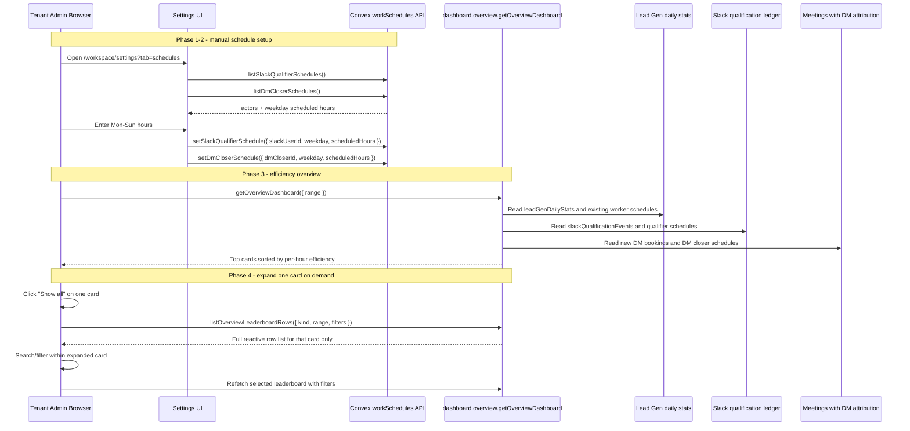

# Overview Efficiency Schedules - Design Specification

**Version:** 0.1 (MVP)  
**Status:** Draft  
**Scope:** `/workspace` currently ranks Lead Gen, Top Qualifiers, and Top DM Closers primarily by raw quantity. End state: tenant admins can manually configure weekly scheduled hours for Slack qualifiers and DM closers, and the `/workspace` top cards rank lead generators, Slack qualifiers, and DM closers by per-hour efficiency with raw count and scheduled-hour context.  
**Prerequisite:** Existing overview dashboard redesign, Lead Gen Ops schedules, Slack qualification ledger, DM closer attribution registry, and WorkOS AuthKit tenant auth.

---

## Table of Contents

1. [Goals & Non-Goals](#1-goals--non-goals)
2. [Actors & Roles](#2-actors--roles)
3. [End-to-End Flow Overview](#3-end-to-end-flow-overview)
4. [Phase 0: Current-State Analysis And Decisions](#4-phase-0-current-state-analysis-and-decisions)
5. [Phase 1: Schedule Data Model](#5-phase-1-schedule-data-model)
6. [Phase 2: Schedule Management APIs And UI](#6-phase-2-schedule-management-apis-and-ui)
7. [Phase 3: Efficiency-Based Overview Query](#7-phase-3-efficiency-based-overview-query)
8. [Phase 4: Expandable Full-Leaderboard Reporting Artifact](#8-phase-4-expandable-full-leaderboard-reporting-artifact)
9. [Phase 5: Dashboard Presentation And QA](#9-phase-5-dashboard-presentation-and-qa)
10. [Data Model](#10-data-model)
11. [Convex Function Architecture](#11-convex-function-architecture)
12. [Routing & Authorization](#12-routing--authorization)
13. [Security Considerations](#13-security-considerations)
14. [Error Handling & Edge Cases](#14-error-handling--edge-cases)
15. [Open Questions](#15-open-questions)
16. [Dependencies](#16-dependencies)
17. [Applicable Skills](#17-applicable-skills)

---

## 1. Goals & Non-Goals

### Goals

- Add manually maintained weekly schedules for Slack qualifiers and DM closers using the same weekday + scheduled-hours shape as Lead Gen Ops.
- Keep schedules tenant-scoped and editable only by `tenant_master` and `tenant_admin`.
- Change `/workspace` top lead generators to rank by `leadsPerHour` instead of raw submissions.
- Change `/workspace` Top Qualifiers to rank by qualified opportunities per scheduled hour.
- Change `/workspace` Top DM Closers to rank by booked calls per scheduled hour.
- Display raw quantity and scheduled hours beside each efficiency score so admins can spot tiny-denominator cases.
- Make the Lead Gen, Top Qualifiers, and Top DM Closers overview cards expandable so admins can view every relevant actor for the selected range, not only the top 5.
- Support lightweight in-card filtering for expanded leaderboards without reloading the entire overview dashboard.
- Reuse the existing Honduras 1am-to-1am business date range already used by the overview dashboard for Lead Gen and Slack-aligned sections.
- Keep the implementation deployable without a production data backfill: missing schedules produce `null` efficiency and sort below configured workers.

### Non-Goals (deferred)

- Changing the underlying CRM funnel definitions for qualified, booked, completed, or won.
- Replacing Lead Gen Ops reporting, exports, or existing report table sort orders outside `/workspace`.
- Creating CRM `users` for DM closers or Slack qualifiers.
- Automatic schedule import from Slack, Calendly, WorkOS, payroll, or calendars.
- Hour-level start/end availability windows. MVP stores daily total hours only.
- Per-tenant configurable timezone. MVP uses the existing Honduras business-date convention.
- Compensation, payouts, quotas, or productivity targets.
- Dedicated full report routes for these three leaderboards. The expanded card is the MVP reporting artifact.

---

## 2. Actors & Roles

| Actor | Identity | Auth Method | Key Permissions |
|---|---|---|---|
| Tenant owner | CRM `users.role = "tenant_master"` | WorkOS AuthKit, member of tenant org | View overview dashboard, manage Slack qualifier schedules, manage DM closer schedules |
| Tenant admin | CRM `users.role = "tenant_admin"` | WorkOS AuthKit, member of tenant org | Same as tenant owner for this feature |
| Lead generator | CRM `users.role = "lead_generator"` and mirrored `leadGenWorkers` row | WorkOS AuthKit, member of tenant org | No schedule management; appears in overview ranking based on existing Lead Gen Ops schedule |
| Slack qualifier | Tenant-scoped Slack user in `slackUsers` | Slack-signed `/qualify-lead` submissions, may not have CRM login | Appears in schedule config and overview ranking after qualifying leads |
| DM closer | Tenant-scoped `dmClosers` attribution record | External UTM attribution record, not a CRM login | Appears in schedule config and overview ranking after bookings are attributed |

### CRM Role <-> External Identity Mapping

| CRM / External Identity | Role In This Feature | Notes |
|---|---|---|
| `tenant_master` | Admin editor/viewer | Can edit all schedule rows for the tenant |
| `tenant_admin` | Admin editor/viewer | Can edit all schedule rows for the tenant |
| `lead_generator` | Ranked worker | Uses existing `leadGenWorkers` + `leadGenWorkerSchedules` |
| `slackUsers.slackUserId` | Ranked qualifier | Schedule is keyed by `tenantId + slackUserId` because qualification events also store immutable Slack IDs |
| `dmClosers._id` | Ranked DM closer | Schedule is keyed by Convex `dmClosers` ID |

---

## 3. End-to-End Flow Overview



---

## 4. Phase 0: Current-State Analysis And Decisions

### 4.1 Verified Current State

| Area | Current Source | Current Behavior | Required Change |
|---|---|---|---|
| `/workspace` route | `app/workspace/page.tsx` | Admins render `DashboardPageClient`; lead generators and closers are redirected | Preserve routing |
| Lead Gen top card | `convex/dashboard/overviewLeadGen.ts` -> `buildWorkerPerformanceRows()` | Calculates `leadsPerHour`, but `compareWorkerPerformanceRows()` sorts by submissions and the card displays submissions | Add dashboard-specific efficiency sort and display `leads/hr` as the ranked metric |
| Lead Gen schedules | `leadGenWorkerSchedules` | Stores `weekday` and `scheduledHours` per worker, manually set in Lead Gen Ops settings | Reuse; no schema change required for lead generators |
| Top Qualifiers card | `convex/dashboard/overviewSlack.ts` -> `buildSlackUserQualificationBreakdown()` | Ranks by `total` qualification event count and displays conversion rate | Add qualifier schedules and rank by qualified opportunities per hour |
| Top DM Closers card | `convex/dashboard/overviewOperations.ts` | Reads `meetings` by `createdAt`, excludes `callClassification = "follow_up"`, groups by `dmCloserId`, ranks by booked count | Add DM closer schedules and rank by booked calls per hour |
| Schedule config UI | `app/workspace/lead-gen/_components/lead-gen-settings-page-client.tsx` | Lead-gen-only weekly schedule editor | Add comparable admin UI for Slack qualifiers and DM closers |
| Overview loading model | `DashboardPageClient` uses `useQuery(api.dashboard.overview.getOverviewDashboard, ...)` | One client-side reactive query loads the full dashboard surface | Keep this query top-5 only; add separate expanded leaderboard query that runs only while a card is open |

### 4.2 Metric Definitions

| Leaderboard | Numerator | Denominator | Efficiency Field | Ranking |
|---|---:|---:|---|---|
| Lead Gen | `submissions` in the selected dashboard range | Scheduled hours for the worker across each business date in the selected range | `leadsPerHour` | Descending `leadsPerHour`, then submissions, then name |
| Top Qualifiers | Distinct Slack-sourced opportunities qualified by the Slack user in the range | Scheduled hours for that Slack user across each business date in the range | `qualifiedPerHour` | Descending `qualifiedPerHour`, then qualified count, then name |
| Top DM Closers | New bookings created in the range and attributed to the DM closer, excluding follow-up bookings | Scheduled hours for that DM closer across each business date in the range | `bookedPerHour` | Descending `bookedPerHour`, then booked count, then name |

> **Metric decision:** Use the same business date range for counts and schedule hours. This prevents comparing a 5-hour worker to an 8-hour worker by raw volume only, and it also makes zero-output scheduled days count against the selected range once an actor appears in the ranked data.

> **Qualifier decision:** Rank qualifiers by distinct Slack-sourced qualified opportunities per hour, not raw Slack event count. Duplicate pending and unlinked Slack events can indicate work, but the current overview card is meant to highlight productive qualification output.

### 4.3 Schedule Storage Decision

MVP should copy the Lead Gen Ops weekly schedule shape, not physically reuse the `leadGenWorkerSchedules` table.

Use two explicit additive weekly schedule tables:

- `slackQualifierSchedules`
- `dmCloserSchedules`

Do not replace or widen `leadGenWorkerSchedules` in MVP.

| Option | Migration Need | Decision |
|---|---|---|
| Add `slackQualifierSchedules` and `dmCloserSchedules` with the same `weekday + scheduledHours` shape as Lead Gen Ops | No data migration. Additive schema only. | **Recommended for MVP.** Typed actor IDs, low rollout risk, and no production backfill. |
| Add a new generic `workSchedules` table for all actor kinds, but leave Lead Gen on `leadGenWorkerSchedules` for now | No data migration for Slack/DM only, but introduces a second abstraction and still needs dual-read if Lead Gen joins later. | Acceptable later if schedule UI needs one generic API. Not needed for MVP. |
| Move Lead Gen, Slack qualifiers, and DM closers into one generic schedule table | Requires widen-migrate-narrow or dual-write rollout for existing Lead Gen schedules. | Defer. Only do this if product needs one canonical schedule table. |
| Directly store Slack/DM schedules in `leadGenWorkerSchedules` | Breaking schema change because existing rows require `workerId: v.id("leadGenWorkers")` and `userId: v.id("users")`. | Reject for MVP. Reusing the physical table would require optional/discriminated fields, new indexes, code dual-read, and a backfill/cleanup plan. |

> **Per-day bucket decision:** Do not add new manual per-day schedule buckets. Store weekly schedules only and compute scheduled-hour denominators from the selected business-date range at query time. Numerators can use existing Lead Gen daily stats and existing Convex aggregate components where they already exist; any new high-volume numerator materialization should use `@convex-dev/aggregate`, not hand-rolled daily bucket tables.

### 4.4 Migration Strategy

For the recommended MVP storage option, this is a safe additive schema change:

1. Deploy new schedule tables and new code that treats missing schedules as `scheduledHours = 0` and efficiency `null`.
2. Deploy the settings UI so admins can enter schedules for Slack qualifiers and DM closers.
3. Manually populate schedules for the production test tenant.
4. Verify schedule coverage for expected Slack qualifiers and DM closers.
5. Flip the overview cards to efficiency-first ranking after coverage is acceptable.

No `@convex-dev/migrations` job is required for MVP because the recommended feature path adds new tables and does not make existing fields required. Manual schedule entry is an operational data setup step, not a schema/data migration.

If implementation instead consolidates schedules into one shared table, repurposes `leadGenWorkerSchedules`, changes required fields, or adds a new persisted aggregate that must include historical rows, use a separate widen-migrate-narrow and backfill plan with the `convex-migration-helper` skill.

### 4.5 Expanded Row Semantics

"Show everyone" means every relevant actor for the selected card and range, not an unbounded database scan.

| Card | Expanded Candidate Set | Include Zero-Activity Scheduled Actors | Include Inactive/Deleted Actors |
|---|---|---:|---:|
| Lead Gen | All `leadGenWorkers` for the tenant plus any worker with activity in the selected range | Yes | Yes, if inactive but has schedule or range activity |
| Top Qualifiers | Slack users with qualification activity in range plus Slack users with a configured schedule | Yes | Yes, if deleted but has schedule or range activity |
| Top DM Closers | All DM closers for the tenant plus any closer with attributed bookings in the selected range | Yes | Yes, if disabled but has schedule or range activity |

Expanded rows use the same efficiency sort as the top-5 cards by default. Client filters can narrow the rendered set, but they do not change metric definitions.

### 4.6 Numerator Aggregation Strategy

Do not introduce new per-day bucket tables for this feature.

| Leaderboard | MVP Numerator Source | Notes |
|---|---|---|
| Lead Gen | Existing `leadGenDailyStats` rows | This table already exists and is maintained by Lead Gen Ops. The schedule work should not add another lead-gen aggregate. |
| Top Qualifiers | Prefer existing `@convex-dev/aggregate` Slack qualification aggregates for unique Slack-qualified opportunity counts; use the Slack qualification event ledger only for secondary row context that is already bounded/capped. | Existing `slackQualificationsByUser` and `slackQualificationsByTime` aggregate opportunities by qualifier and submitted time. Use aggregate counts where the metric is unique Slack-sourced opportunities, then keep existing truncation warnings for any raw-event secondary data. |
| Top DM Closers | Keep the existing bounded `meetings` scan by `createdAt` for MVP, unless the cap becomes a real product issue. | Current `meetingsByStatus` is keyed by assigned phone closer, call classification, status, and `scheduledAt`, not DM closer and booking `createdAt`. If this section must scale beyond the bounded scan, add a new `@convex-dev/aggregate` keyed by `dmCloserId + callClassification + createdAt` and backfill it before switching reads. |

This keeps the schedule feature independent from new day-bucket maintenance. Any future aggregate backfill is a separate migration/data-rollout task, not part of the additive schedule-table MVP.

---

## 5. Phase 1: Schedule Data Model

### 5.1 Shared Weekday Validator

Move the weekday validator to a neutral shared module, then keep the existing lead-gen export as a compatibility alias.

```typescript
// Path: convex/lib/workSchedule.ts
import { v } from "convex/values";
import { businessDateToUtcStart } from "../reporting/lib/hondurasBusinessTime";

export const weekdayValidator = v.union(
  v.literal("monday"),
  v.literal("tuesday"),
  v.literal("wednesday"),
  v.literal("thursday"),
  v.literal("friday"),
  v.literal("saturday"),
  v.literal("sunday"),
);

export const weekdays = [
  "monday",
  "tuesday",
  "wednesday",
  "thursday",
  "friday",
  "saturday",
  "sunday",
] as const;

export type Weekday = (typeof weekdays)[number];

const weekdaysByUtcDay: readonly Weekday[] = [
  "sunday",
  "monday",
  "tuesday",
  "wednesday",
  "thursday",
  "friday",
  "saturday",
];

export function weekdayForBusinessDate(dayKey: string): Weekday {
  businessDateToUtcStart(dayKey);
  const date = new Date(`${dayKey}T12:00:00.000Z`);
  const weekday = weekdaysByUtcDay[date.getUTCDay()];
  if (!weekday) throw new Error("Invalid business date weekday");
  return weekday;
}
```

```typescript
// Path: convex/leadGen/validators.ts
export { weekdayValidator as leadGenWeekdayValidator } from "../lib/workSchedule";
```

> **Weekday decision:** `weekdays` stays Monday-first for UI/editor ordering. Any helper that indexes with `Date.getUTCDay()` must use a Sunday-first lookup array, matching the existing Lead Gen Ops schedule helper.

### 5.2 New Schedule Tables

```typescript
// Path: convex/schema.ts
slackQualifierSchedules: defineTable({
  tenantId: v.id("tenants"),
  slackUserId: v.string(),
  weekday: weekdayValidator,
  scheduledHours: v.number(),
  updatedByUserId: v.id("users"),
  updatedAt: v.number(),
})
  .index("by_tenantId", ["tenantId"])
  .index("by_tenantId_and_slackUserId", ["tenantId", "slackUserId"])
  .index("by_tenantId_and_slackUserId_and_weekday", [
    "tenantId",
    "slackUserId",
    "weekday",
  ]),

dmCloserSchedules: defineTable({
  tenantId: v.id("tenants"),
  dmCloserId: v.id("dmClosers"),
  weekday: weekdayValidator,
  scheduledHours: v.number(),
  updatedByUserId: v.id("users"),
  updatedAt: v.number(),
})
  .index("by_tenantId", ["tenantId"])
  .index("by_tenantId_and_dmCloserId", ["tenantId", "dmCloserId"])
  .index("by_tenantId_and_dmCloserId_and_weekday", [
    "tenantId",
    "dmCloserId",
    "weekday",
  ]),
```

> **Validation decision:** Keep `scheduledHours` as a number and enforce `0 <= hours <= 24` in mutations, matching the current Lead Gen Ops implementation. Decimal quarter-hours remain supported by the UI `step={0.25}`.

---

## 6. Phase 2: Schedule Management APIs And UI

### 6.1 Public Convex API

Add one schedule-focused module with tenant-admin-only reads and writes.

```typescript
// Path: convex/workSchedules.ts
import { v } from "convex/values";
import { mutation, query } from "./_generated/server";
import { weekdayValidator } from "./lib/workSchedule";
import { requireTenantUser } from "./requireTenantUser";

function validateScheduledHours(hours: number) {
  if (!Number.isFinite(hours) || hours < 0 || hours > 24) {
    throw new Error("Scheduled hours must be between 0 and 24");
  }
}

export const listSlackQualifierSchedules = query({
  args: {},
  handler: async (ctx) => {
    const { tenantId } = await requireTenantUser(ctx, [
      "tenant_master",
      "tenant_admin",
    ]);

    const slackUsers = await ctx.db
      .query("slackUsers")
      .withIndex("by_tenantId", (q) => q.eq("tenantId", tenantId))
      .take(300);
    const schedules = await ctx.db
      .query("slackQualifierSchedules")
      .withIndex("by_tenantId", (q) => q.eq("tenantId", tenantId))
      .take(2_100);

    return { slackUsers, schedules };
  },
});

export const setSlackQualifierSchedule = mutation({
  args: {
    slackUserId: v.string(),
    weekday: weekdayValidator,
    scheduledHours: v.number(),
  },
  handler: async (ctx, args) => {
    const { tenantId, userId } = await requireTenantUser(ctx, [
      "tenant_master",
      "tenant_admin",
    ]);
    validateScheduledHours(args.scheduledHours);

    const slackUser = await ctx.db
      .query("slackUsers")
      .withIndex("by_tenantId_and_slackUserId", (q) =>
        q.eq("tenantId", tenantId).eq("slackUserId", args.slackUserId),
      )
      .unique();
    if (!slackUser) throw new Error("Slack qualifier not found.");

    const existing = await ctx.db
      .query("slackQualifierSchedules")
      .withIndex("by_tenantId_and_slackUserId_and_weekday", (q) =>
        q
          .eq("tenantId", tenantId)
          .eq("slackUserId", args.slackUserId)
          .eq("weekday", args.weekday),
      )
      .unique();

    const patch = {
      scheduledHours: args.scheduledHours,
      updatedByUserId: userId,
      updatedAt: Date.now(),
    };

    if (existing) {
      await ctx.db.patch(existing._id, patch);
      return existing._id;
    }

    return await ctx.db.insert("slackQualifierSchedules", {
      tenantId,
      slackUserId: args.slackUserId,
      weekday: args.weekday,
      ...patch,
    });
  },
});
```

The DM closer query and mutation should mirror this shape, using `dmCloserId: v.id("dmClosers")`, validating `dmCloser.tenantId`, and writing to `dmCloserSchedules`.

### 6.2 Settings UI

Add a dedicated schedules tab to workspace settings instead of hiding this under existing Attribution or Integrations tabs.

```tsx
// Path: app/workspace/settings/_components/settings-page-client.tsx
const defaultTab =
  tabParam === "event-types" ||
  tabParam === "field-mappings" ||
  tabParam === "programs" ||
  tabParam === "integrations" ||
  tabParam === "attribution" ||
  tabParam === "schedules"
    ? tabParam
    : "calendly";

// ...
<TabsTrigger value="schedules">Schedules</TabsTrigger>

// ...
<TabsContent value="schedules" className="mt-6">
  <WorkSchedulesTab />
</TabsContent>
```

```tsx
// Path: app/workspace/settings/_components/work-schedules-tab.tsx
"use client";

import { useMutation, useQuery } from "convex/react";
import { api } from "@/convex/_generated/api";

export function WorkSchedulesTab() {
  const qualifierData = useQuery(api.workSchedules.listSlackQualifierSchedules, {});
  const dmCloserData = useQuery(api.workSchedules.listDmCloserSchedules, {});
  const setQualifierSchedule = useMutation(
    api.workSchedules.setSlackQualifierSchedule,
  );
  const setDmCloserSchedule = useMutation(
    api.workSchedules.setDmCloserSchedule,
  );

  // Reuse the same Mon-Sun editor pattern from Lead Gen Ops:
  // actor select, seven numeric inputs, and one Save Schedule button.
  return null;
}
```

> **UI decision:** A single "Schedules" settings tab makes the mental model explicit: these are manual work-hour inputs for productivity normalization, not Slack integration credentials or DM attribution mapping.

---

## 7. Phase 3: Efficiency-Based Overview Query

### 7.1 Shared Range-Hours Helpers

Add helper functions that sum scheduled hours for every business date in the selected overview range, not only dates where the actor produced activity.

These helpers compute denominators from weekly schedule rows at read time. They must not persist per-day schedule documents.

```typescript
// Path: convex/workSchedules/rangeHours.ts
import type { Id } from "../_generated/dataModel";
import type { QueryCtx } from "../_generated/server";
import { addBusinessDays } from "../reporting/lib/hondurasBusinessTime";
import { type Weekday, weekdayForBusinessDate } from "../lib/workSchedule";

export function businessDatesInInclusiveRange(args: {
  startBusinessDate: string;
  endBusinessDateInclusive: string;
}) {
  const days: string[] = [];
  for (
    let day = args.startBusinessDate;
    day <= args.endBusinessDateInclusive;
    day = addBusinessDays(day, 1)
  ) {
    days.push(day);
  }
  return days;
}

function sumHoursForWeekdayRows(
  rows: Array<{ weekday: Weekday; scheduledHours: number }>,
  businessDates: string[],
) {
  const byWeekday = new Map(rows.map((row) => [row.weekday, row.scheduledHours]));
  return businessDates.reduce((sum, dayKey) => {
    const weekday = weekdayForBusinessDate(dayKey);
    return sum + (byWeekday.get(weekday) ?? 0);
  }, 0);
}

export async function loadDmCloserScheduledHoursForRange(
  ctx: QueryCtx,
  args: {
    tenantId: Id<"tenants">;
    dmCloserIds: Id<"dmClosers">[];
    startBusinessDate: string;
    endBusinessDateInclusive: string;
  },
) {
  const businessDates = businessDatesInInclusiveRange(args);
  const result = new Map<Id<"dmClosers">, number>();

  for (const dmCloserId of args.dmCloserIds) {
    const rows = await ctx.db
      .query("dmCloserSchedules")
      .withIndex("by_tenantId_and_dmCloserId", (q) =>
        q.eq("tenantId", args.tenantId).eq("dmCloserId", dmCloserId),
      )
      .take(7);
    result.set(dmCloserId, sumHoursForWeekdayRows(rows, businessDates));
  }

  return result;
}
```

Add equivalent helpers for:

- `loadSlackQualifierScheduledHoursForRange(ctx, { tenantId, slackUserIds, startBusinessDate, endBusinessDateInclusive })`
- `loadLeadGenScheduledHoursForRange(ctx, { tenantId, workerIds, startBusinessDate, endBusinessDateInclusive })`

### 7.2 Lead Gen Overview Changes

Keep using `leadGenDailyStats` for count aggregation, but replace the top-worker ordering for the overview with an efficiency-aware sorter.

```typescript
// Path: convex/dashboard/overviewLeadGen.ts
const topWorkers = buildWorkerPerformanceRows({
  rows,
  currentScheduledHoursByWorkerDay,
  workers,
  teams,
})
  .map((worker) => ({
    ...worker,
    scheduledHours:
      scheduledHoursByWorker.get(worker.workerId) ?? worker.scheduledHours,
    leadsPerHour:
      (scheduledHoursByWorker.get(worker.workerId) ?? worker.scheduledHours) > 0
        ? worker.submissions /
          (scheduledHoursByWorker.get(worker.workerId) ?? worker.scheduledHours)
        : null,
  }))
  .sort(compareEfficiencyRows("leadsPerHour", "submissions", "displayName"))
  .slice(0, TOP_OVERVIEW_WORKER_LIMIT);
```

`buildWorkerPerformanceRows()` currently only emits workers present in `leadGenDailyStats`. The shared overview builder must union those activity rows with scheduled workers, and with all workers when `includeAllCandidates` is true, so scheduled zero-activity workers can appear in the expanded leaderboard.

> **Compatibility decision:** Limit this ranking change to the overview dashboard first. Existing Lead Gen Ops reporting and exports can keep their current quantity-first sort until product asks for those reports to change too.

### 7.3 Top Qualifiers Overview Changes

Extend the Slack qualifier row shape with scheduled hours and per-hour efficiency. Prefer the existing Slack qualification aggregate for the ranking numerator, because the MVP metric is unique Slack-sourced opportunities qualified by user.

Implementation shape:

1. Build the candidate set from Slack users with configured schedules, Slack users returned by the bounded Slack-user registry, and any Slack user with activity in the selected range.
2. For each candidate, count unique Slack-qualified opportunities in the range with `slackQualificationsByUser` aggregate bounds keyed by `[slackUserId, submittedAt]`.
3. Use the raw Slack qualification event ledger only for secondary context that still needs event-level detail, preserving existing truncation behavior.
4. Apply scheduled-hour enrichment and efficiency sorting after the full candidate set is built.

```typescript
// Path: convex/dashboard/overviewSlack.ts
const scheduledHoursBySlackUserId =
  await loadSlackQualifierScheduledHoursForRange(ctx, {
    tenantId,
    slackUserIds: candidateSlackUserIds,
    startBusinessDate: range.startBusinessDate,
    endBusinessDateInclusive: range.endBusinessDateInclusive,
  });

const rows = candidateRows
  .map((candidate) => {
    const scheduledHours =
      scheduledHoursBySlackUserId.get(candidate.slackUserId) ?? 0;
    const uniqueOpportunityCount =
      aggregateQualifiedBySlackUserId.get(candidate.slackUserId) ?? 0;
    return {
      slackUserId: candidate.slackUserId,
      displayName: candidate.displayName,
      avatarUrl: candidate.avatarUrl,
      isDeleted: candidate.isDeleted,
      total: candidate.qualificationEventCount,
      uniqueOpportunityCount,
      booked: candidate.booked,
      ratio: uniqueOpportunityCount > 0 ? candidate.booked / uniqueOpportunityCount : null,
      scheduledHours,
      qualifiedPerHour:
        scheduledHours > 0 ? uniqueOpportunityCount / scheduledHours : null,
    };
  })
  .sort(compareEfficiencyRows("qualifiedPerHour", "uniqueOpportunityCount", "displayName"))
  .slice(0, 5);
```

If the implementation keeps using `buildSlackUserQualificationBreakdown()` for MVP, update it so it does not slice by raw event count before schedule enrichment. That path remains bounded by the existing raw-event cap and should surface `truncated` when the cap is hit.

### 7.4 Top DM Closers Overview Changes

Keep the existing meeting read and follow-up exclusion, then add schedule enrichment and efficiency sorting.

The MVP path remains the current bounded `meetings` scan by booking `createdAt`, because the existing `meetingsByStatus` aggregate is not keyed for this DM closer metric. If the bounded scan becomes too expensive, add a dedicated Convex aggregate keyed by `dmCloserId`, `callClassification`, and `createdAt`, then backfill before replacing this read path.

```typescript
// Path: convex/dashboard/overviewOperations.ts
const scheduledHoursByDmCloser =
  await loadDmCloserScheduledHoursForRange(ctx, {
    tenantId,
    dmCloserIds: candidateDmCloserIds,
    startBusinessDate: range.startBusinessDate,
    endBusinessDateInclusive: range.endBusinessDateInclusive,
  });

for (const dmCloserId of candidateDmCloserIds) {
  const booked = byDmCloser.get(dmCloserId) ?? 0;
  const dmCloser = await ctx.db.get(dmCloserId);
  if (!dmCloser || dmCloser.tenantId !== tenantId) continue;
  const scheduledHours = scheduledHoursByDmCloser.get(dmCloserId) ?? 0;

  enriched.push({
    dmCloserId,
    displayName: dmCloser.displayName,
    teamName: team && team.tenantId === tenantId ? team.displayName : null,
    booked,
    scheduledHours,
    bookedPerHour: scheduledHours > 0 ? booked / scheduledHours : null,
  });
}

const sortedRows = enriched
  .sort(compareEfficiencyRows("bookedPerHour", "booked", "displayName"))
  .slice(0, 5);
```

### 7.5 Efficiency Sort Helper

```typescript
// Path: convex/dashboard/efficiencySort.ts
export function compareNullableEfficiency(args: {
  leftRate: number | null;
  rightRate: number | null;
  leftCount: number;
  rightCount: number;
  leftName: string;
  rightName: string;
}) {
  const leftHasRate = args.leftRate !== null;
  const rightHasRate = args.rightRate !== null;
  if (leftHasRate !== rightHasRate) return leftHasRate ? -1 : 1;
  if (args.leftRate !== args.rightRate) {
    return (args.rightRate ?? -1) - (args.leftRate ?? -1);
  }
  if (args.leftCount !== args.rightCount) return args.rightCount - args.leftCount;
  return args.leftName.localeCompare(args.rightName);
}
```

---

## 8. Phase 4: Expandable Full-Leaderboard Reporting Artifact

### 8.1 Query Contract

Keep `getOverviewDashboard` optimized for the first paint and add a second query that is only subscribed when a card is expanded.

```typescript
// Path: convex/dashboard/overviewLeaderboards.ts
import { v } from "convex/values";
import { query } from "../_generated/server";
import { requireTenantUser } from "../requireTenantUser";
import { deriveOverviewRange, overviewRangeValidator } from "./overviewRange";

const leaderboardKindValidator = v.union(
  v.literal("lead_gen"),
  v.literal("qualifiers"),
  v.literal("dm_closers"),
);

const leaderboardFilterValidator = v.object({
  search: v.optional(v.string()),
  schedule: v.optional(
    v.union(v.literal("all"), v.literal("scheduled"), v.literal("unscheduled")),
  ),
  activity: v.optional(
    v.union(v.literal("all"), v.literal("with_activity"), v.literal("without_activity")),
  ),
});

export const listOverviewLeaderboardRows = query({
  args: {
    kind: leaderboardKindValidator,
    range: overviewRangeValidator,
    filters: v.optional(leaderboardFilterValidator),
  },
  handler: async (ctx, args) => {
    const { tenantId } = await requireTenantUser(ctx, [
      "tenant_master",
      "tenant_admin",
    ]);
    const range = deriveOverviewRange(args.range, Date.now());

    return await buildExpandedOverviewLeaderboard(ctx, {
      tenantId,
      kind: args.kind,
      range,
      filters: args.filters,
    });
  },
});
```

> **Data-loading decision:** Do not add all rows to the initial `getOverviewDashboard` response. The top cards stay fast and return top 5 only; expanding one card opens one extra Convex subscription for that card's full leaderboard. This avoids duplicating the full reporting payload on every dashboard load.

### 8.2 Shared Builders, Not Duplicated Logic

Both the top-5 query and expanded query must call shared builders that produce the same row shape and sort order.

```typescript
// Path: convex/dashboard/overviewLeaderboardBuilders.ts
import type { Id } from "../_generated/dataModel";
import type { QueryCtx } from "../_generated/server";
import type { DerivedOverviewRange } from "./overviewRange";

export async function buildLeadGenEfficiencyRows(ctx: QueryCtx, args: {
  tenantId: Id<"tenants">;
  range: DerivedOverviewRange;
  includeAllCandidates: boolean;
}) {
  // Reads leadGenWorkers, leadGenWorkerSchedules, and leadGenDailyStats.
  // Candidate set = activity workers ∪ scheduled workers.
  // When includeAllCandidates is true, also include all tenant leadGenWorkers.
  // Returns unsliced rows sorted by leadsPerHour desc, then submissions desc.
}

export async function buildQualifierEfficiencyRows(ctx: QueryCtx, args: {
  tenantId: Id<"tenants">;
  range: DerivedOverviewRange;
  includeAllCandidates: boolean;
}) {
  // Reads slackUsers, slackQualifierSchedules, Slack qualification aggregates,
  // and bounded event detail only where secondary context needs it.
  // Candidate set = activity Slack users ∪ scheduled Slack users.
  // When includeAllCandidates is true, also include tenant slackUsers.
  // Returns unsliced rows sorted by qualifiedPerHour desc, then qualified desc.
}

export async function buildDmCloserEfficiencyRows(ctx: QueryCtx, args: {
  tenantId: Id<"tenants">;
  range: DerivedOverviewRange;
  includeAllCandidates: boolean;
}) {
  // Reads meetings, dmClosers, attributionTeams, and dmCloserSchedules.
  // Candidate set = booking-attributed DM closers ∪ scheduled DM closers.
  // When includeAllCandidates is true, also include all tenant dmClosers.
  // Returns unsliced rows sorted by bookedPerHour desc, then booked desc.
}
```

`getOverviewDashboard` calls these builders with `includeAllCandidates: false` and slices to 5. `listOverviewLeaderboardRows` calls them with `includeAllCandidates: true`, applies filters, and returns the filtered rows.

`includeAllCandidates` controls whether the builder includes every registry row. It must not drop scheduled zero-activity actors, because those rows are required for the expanded `without_activity` filter and for explaining configured schedules with no output.

### 8.3 Filtering Semantics

| Filter | Applies To | Backend Behavior |
|---|---|---|
| `search` | All three leaderboards | Case-insensitive substring match against display name, email where available, team name where available, Slack ID, or UTM medium where available |
| `schedule = "scheduled"` | All three leaderboards | Keep rows with `scheduledHours > 0` |
| `schedule = "unscheduled"` | All three leaderboards | Keep rows with `scheduledHours === 0` |
| `activity = "with_activity"` | All three leaderboards | Keep rows with numerator count greater than 0 |
| `activity = "without_activity"` | All three leaderboards | Keep rows with numerator count equal to 0 |

Filters are applied after the candidate set is built and before rows are returned. This is acceptable because each actor registry is bounded by existing admin-list caps (`leadGenWorkers` 250, `slackUsers` 300, `dmClosers` 300). If those caps need to grow, revisit this with `convex-performance-audit`.

### 8.4 Expanded Query Return Shape

```typescript
// Path: convex/dashboard/overviewTypes.ts
export type ExpandedOverviewLeaderboard =
  | {
      kind: "lead_gen";
      rows: LeadGenOverview["topWorkers"];
      totalRows: number;
      filteredRows: number;
      truncated: boolean;
    }
  | {
      kind: "qualifiers";
      rows: TopQualifierRow[];
      totalRows: number;
      filteredRows: number;
      truncated: boolean;
    }
  | {
      kind: "dm_closers";
      rows: TopDmCloserRow[];
      totalRows: number;
      filteredRows: number;
      truncated: boolean;
    };
```

`totalRows` is the unfiltered candidate count. `filteredRows` is the returned count after filters. `truncated` means a source cap was hit and the "everyone" view is only every row within the available capped source sample.

### 8.5 Client Interaction Pattern

The overview cards are already Client Components under `DashboardPageClient`, so the expanded area should use Convex React hooks directly.

```tsx
// Path: app/workspace/_components/overview-expandable-leaderboard.tsx
"use client";

import { useDeferredValue, useState } from "react";
import { useQuery } from "convex/react";
import { ChevronDownIcon, ChevronUpIcon } from "lucide-react";
import { api } from "@/convex/_generated/api";
import { Button } from "@/components/ui/button";
import {
  Collapsible,
  CollapsibleContent,
  CollapsibleTrigger,
} from "@/components/ui/collapsible";

export function OverviewExpandableLeaderboard(props: {
  kind: "lead_gen" | "qualifiers" | "dm_closers";
  range: DashboardRangeInput;
  open: boolean;
  onOpenChange: (open: boolean) => void;
}) {
  const [search, setSearch] = useState("");
  const deferredSearch = useDeferredValue(search);
  const searchFilter = deferredSearch.trim();
  const rows = useQuery(
    api.dashboard.overviewLeaderboards.listOverviewLeaderboardRows,
    props.open
      ? {
          kind: props.kind,
          range: props.range,
          filters: searchFilter ? { search: searchFilter } : {},
        }
      : "skip",
  );

  return (
    <Collapsible open={props.open} onOpenChange={props.onOpenChange}>
      <CollapsibleTrigger asChild>
        <Button type="button" variant="ghost" size="sm">
          {props.open ? <ChevronUpIcon data-icon="inline-start" /> : <ChevronDownIcon data-icon="inline-start" />}
          {props.open ? "Show top 5" : "Show all"}
        </Button>
      </CollapsibleTrigger>
      <CollapsibleContent>
        <ExpandedLeaderboardFilters search={search} onSearchChange={setSearch} />
        {rows === undefined ? (
          <ExpandedLeaderboardSkeleton />
        ) : (
          <ExpandedLeaderboardTable data={rows} />
        )}
      </CollapsibleContent>
    </Collapsible>
  );
}
```

> **Next.js decision:** Use an inline skeleton for the expanded query rather than a route-level `loading.tsx` or server Suspense boundary. Next 16 `loading.tsx` is for route segment streaming, while this interaction happens inside an already-hydrated Client Component. Convex `useQuery` returns `undefined` while loading and remains reactive after data arrives, so a local skeleton is the clearest loading state.

> **React decision:** Use `useDeferredValue` or a small debounce for the search filter so typing does not create a new Convex subscription for every keystroke. The expanded query still refetches reactively when the deferred filters, selected card, or dashboard `queryRange` change.

### 8.6 UI Layout Rules

- Keep the expanded list inside the same top card using `Collapsible`; do not open a nested card inside the card.
- Put filters in a compact toolbar above the expanded table: search input, schedule segmented control, activity segmented control.
- Give the expanded content a stable max height with internal scrolling so opening one card does not push the full dashboard far below the fold.
- Use the same row renderer as the collapsed top-5 list where possible, with extra columns only in the expanded table.
- Preserve accessible states: `aria-expanded` via `CollapsibleTrigger`, `role="status"` on skeletons, table caption or `aria-label` for the full leaderboard.
- Pass the validated dashboard `queryRange`, not the unvalidated draft `range`, to the expanded query.
- When the dashboard range changes, keep the expansion state but refetch the expanded query with the new validated range.

---

## 9. Phase 5: Dashboard Presentation And QA

### 9.1 Type Contract Changes

```typescript
// Path: convex/dashboard/overviewTypes.ts
export type LeadGenOverview = {
  totalSubmissions: number;
  duplicates: number;
  scheduledHours: number;
  leadsPerHour: number | null;
  topWorkers: Array<{
    workerId: Id<"leadGenWorkers">;
    displayName: string;
    submissions: number;
    scheduledHours: number;
    leadsPerHour: number | null;
  }>;
};

export type TopQualifierRow = {
  slackUserId: string;
  displayName: string | null;
  avatarUrl: string | null;
  isDeleted: boolean;
  total: number;
  uniqueOpportunityCount: number;
  booked: number;
  ratio: number | null;
  scheduledHours: number;
  qualifiedPerHour: number | null;
};

export type TopDmCloserRow = {
  dmCloserId: Id<"dmClosers">;
  displayName: string;
  teamName: string | null;
  booked: number;
  scheduledHours: number;
  bookedPerHour: number | null;
};
```

### 9.2 Card Copy And Display

| Card | Current Ranked Column | New Ranked Column | Secondary Context |
|---|---|---|---|
| Lead Gen | Submissions | Leads/hr | `N submissions - Hh scheduled` |
| Top Qualifiers | Conversion | Qualified/hr | `N qualified - B booked - Hh scheduled` |
| Top DM Closers | Booked calls | Bookings/hr | `N booked - Hh scheduled` |

```tsx
// Path: app/workspace/_components/top-dm-closers-card.tsx
<span className="font-semibold tabular-nums">
  {formatDecimal(row.bookedPerHour)}
</span>
<p className="truncate text-xs text-muted-foreground">
  {formatWholeNumber(row.booked)} booked - {formatDecimal(row.scheduledHours)}h
</p>
```

Update `overview-help-tooltip.tsx` so the ranking description explicitly says these lists are efficiency-ranked and missing schedule rows cannot produce a per-hour rate.

Each card footer should include a compact `Show all` / `Show top 5` control. When expanded, the top-5 list can remain at the top as a summary, with the full filtered table below it, or the full table can replace the list if vertical space is tight. Prefer the replacement pattern on mobile to avoid duplicate rows.

### 9.3 QA Checklist

| Scenario | Expected Result |
|---|---|
| No Slack qualifier schedules configured | Qualifier rows render with count context and `--` per-hour; configured actors sort above unconfigured actors |
| No DM closer schedules configured | DM rows render with `--` per-hour; no query failure |
| Admin sets 5 hours Monday and 8 hours Tuesday for a qualifier | A Monday-Tuesday dashboard range uses 13 scheduled hours |
| Admin sets Sunday hours only | A Sunday business-date range uses Sunday hours, not Monday hours |
| Admin sets a 0-hour day | That day contributes 0 hours and does not divide by zero |
| DM closer has only follow-up bookings | Excluded from Top DM Closers as today |
| Lead generator has lower volume but higher efficiency | Lead generator ranks above higher-volume/lower-efficiency worker |
| Range hits existing Slack event cap | Section keeps existing partial-data behavior and sorts available candidate rows by efficiency |
| Slack ranking uses aggregate counts | Unique Slack-qualified opportunity counts match the existing aggregate verification for the selected range |
| Card is collapsed | No expanded leaderboard query subscription is active |
| Card is expanded | Only that card's expanded query runs; the whole overview query is not rerun |
| Expanded search is changed | Only the expanded leaderboard refetches with filters |
| Range changes while a card is expanded | Expanded rows refetch for the new range and keep the same filters |
| Expanded row list has scheduled zero-activity actors | They appear with zero count and their scheduled hours |
| Production ranking rollout before schedule coverage | Efficiency-first ranking remains disabled or clearly marked until expected Slack qualifier and DM closer schedules are populated |

---

## 10. Data Model

```typescript
// Path: convex/schema.ts
// NEW
slackQualifierSchedules: defineTable({
  tenantId: v.id("tenants"),
  slackUserId: v.string(),
  weekday: weekdayValidator,
  scheduledHours: v.number(),
  updatedByUserId: v.id("users"),
  updatedAt: v.number(),
})
  .index("by_tenantId", ["tenantId"])
  .index("by_tenantId_and_slackUserId", ["tenantId", "slackUserId"])
  .index("by_tenantId_and_slackUserId_and_weekday", [
    "tenantId",
    "slackUserId",
    "weekday",
  ]),

// NEW
dmCloserSchedules: defineTable({
  tenantId: v.id("tenants"),
  dmCloserId: v.id("dmClosers"),
  weekday: weekdayValidator,
  scheduledHours: v.number(),
  updatedByUserId: v.id("users"),
  updatedAt: v.number(),
})
  .index("by_tenantId", ["tenantId"])
  .index("by_tenantId_and_dmCloserId", ["tenantId", "dmCloserId"])
  .index("by_tenantId_and_dmCloserId_and_weekday", [
    "tenantId",
    "dmCloserId",
    "weekday",
  ]),

// EXISTING - unchanged
leadGenWorkerSchedules: defineTable({
  tenantId: v.id("tenants"),
  workerId: v.id("leadGenWorkers"),
  userId: v.id("users"),
  weekday: leadGenWeekdayValidator,
  scheduledHours: v.number(),
  updatedByUserId: v.id("users"),
  updatedAt: v.number(),
})
```

No existing table gets a new required field.

---

## 11. Convex Function Architecture

```text
convex/
  schema.ts                                # MODIFIED - Phase 1: add schedule tables
  workSchedules.ts                         # NEW - Phase 2: admin list/set APIs
  workSchedules/
    rangeHours.ts                          # NEW - Phase 3: range schedule-hour helpers
  lib/
    workSchedule.ts                        # NEW - Phase 1: shared weekday validator/helpers
  leadGen/
    validators.ts                          # MODIFIED - Phase 1: re-export weekday validator
    schedules.ts                           # MODIFIED - Phase 3: optional reuse of full-range helper
  dashboard/
    efficiencySort.ts                      # NEW - Phase 3: nullable per-hour sorting
    overviewLeaderboardBuilders.ts         # NEW - Phase 4: shared row builders for top-5 and expanded views
    overviewLeaderboards.ts                # NEW - Phase 4: on-demand expanded leaderboard query
    overviewLeadGen.ts                     # MODIFIED - Phase 3: rank top workers by leads/hr
    overviewSlack.ts                       # MODIFIED - Phase 3: add qualifier hours and qualified/hr
    overviewOperations.ts                  # MODIFIED - Phase 3: add DM closer hours and booked/hr
    overviewTypes.ts                       # MODIFIED - Phases 4-5: expanded types and efficiency fields
```

---

## 12. Routing & Authorization

```text
app/workspace/settings/
  page.tsx                                 # EXISTING - requireRole(["tenant_master", "tenant_admin"])
  _components/
    settings-page-client.tsx               # MODIFIED - add "schedules" tab
    work-schedules-tab.tsx                 # NEW - Slack qualifier and DM closer schedule UI
    weekly-schedule-editor.tsx             # NEW - shared Mon-Sun editor, or colocate in tab

app/workspace/_components/
  overview-expandable-leaderboard.tsx      # NEW - Phase 4: expanded rows, filters, loading state
  overview-expanded-leaderboard-table.tsx  # NEW - Phase 4: full row table renderers
  lead-gen-overview-card.tsx               # MODIFIED - show leads/hr as ranked metric
  top-qualifiers-card.tsx                  # MODIFIED - show qualified/hr as ranked metric
  top-dm-closers-card.tsx                  # MODIFIED - show bookings/hr as ranked metric
  overview-help-tooltip.tsx                # MODIFIED - update ranking explanations
```

Authorization remains server-enforced:

- `app/workspace/settings/page.tsx` already uses `requireRole(["tenant_master", "tenant_admin"])`.
- New Convex queries and mutations use `requireTenantUser(ctx, ["tenant_master", "tenant_admin"])`.
- `/workspace` overview query already uses `requireTenantUser(ctx, ["tenant_master", "tenant_admin"])`.
- The expanded leaderboard query also uses `requireTenantUser(ctx, ["tenant_master", "tenant_admin"])`.
- No client argument may provide `tenantId`, editor user ID, or role.

---

## 13. Security Considerations

### Credential Security

This feature adds no credentials, tokens, webhooks, or external API calls.

### Multi-Tenant Isolation

| Resource | Tenant Isolation |
|---|---|
| `slackQualifierSchedules` | Every row has `tenantId`; writes validate the `slackUsers` row belongs to the same tenant |
| `dmCloserSchedules` | Every row has `tenantId`; writes validate the `dmClosers` row belongs to the same tenant |
| Overview query | Tenant is derived from Convex auth via `requireTenantUser` |
| Settings UI | RSC route gate and Convex functions both enforce admin roles |

### Role-Based Data Access

| Data Resource | `tenant_master` | `tenant_admin` | `closer` | `lead_generator` |
|---|---|---|---|---|
| Slack qualifier schedules | Full | Full | None | None |
| DM closer schedules | Full | Full | None | None |
| Overview efficiency leaderboards | Read | Read | None | None |
| Expanded overview leaderboards | Read | Read | None | None |
| Lead-gen own schedule | Read indirectly in own lead-gen reports if already exposed | Read indirectly | None | No management access |

### Webhook Security

No webhook behavior changes. Existing Slack and Calendly signature verification stays untouched.

### Rate Limit Awareness

No external API is called for schedule calculations. Slack profile display data is read from the existing `slackUsers` cache.

---

## 14. Error Handling & Edge Cases

### Missing Schedule

Detection: no row for actor + weekday.  
Recovery: treat that weekday as 0 scheduled hours.  
User behavior: row displays `--` for efficiency if total scheduled hours is 0.

### Invalid Hours

Detection: mutation validates finite number between 0 and 24.  
Recovery: reject mutation with a clear error.  
User behavior: toast displays the mutation error and keeps the draft visible.

### Deleted Slack User

Detection: `slackUsers.isDeleted === true`.  
Recovery: keep existing schedule rows and display deleted state if the user still has activity or a schedule.  
User behavior: admin can zero the schedule; dashboard can still explain historical rows.

### Disabled DM Closer

Detection: `dmClosers.isActive === false`.  
Recovery: keep schedules for historical reporting; do not delete.  
User behavior: settings should show disabled state, and overview can still rank historical activity in selected ranges.

### Very Small Denominator

Detection: scheduled hours greater than 0 but low.  
Recovery: no automatic suppression in MVP.  
User behavior: display scheduled hours next to the score so admins can interpret the result.

### Range Cap Hit

Detection: existing section caps throw or return `truncated`.  
Recovery: preserve current section-level capped/partial behavior.  
User behavior: only the affected section shows capped or partial state; the whole dashboard does not fail.

### Expanded Query Loading

Detection: expanded `useQuery` returns `undefined`.  
Recovery: render a fixed-height skeleton inside the expanded area.  
User behavior: the card stays open and interactive while the full leaderboard loads.

### Expanded Query Error

Detection: expanded query throws and Convex hook surfaces the error through the nearest error boundary.  
Recovery: wrap expanded content in the existing `SectionErrorBoundary` pattern if available for this surface, or render a local error state matching `OverviewErrorState`.  
User behavior: only the expanded list fails; the top-5 card remains visible.

### Filter Removes All Rows

Detection: expanded query returns `filteredRows = 0`.  
Recovery: show an empty state inside the expanded area.  
User behavior: filters remain editable and can be cleared.

---

## 15. Open Questions

| # | Question | Current Thinking |
|---|---|---|
| 1 | Should Top Qualifiers use `uniqueOpportunityCount`, `created_opportunity` events, or all goal-eligible events as the numerator? | Use `uniqueOpportunityCount` for MVP because it matches the current card's qualified-opportunity language and avoids duplicate inflation. |
| 2 | Should leaderboards require a minimum scheduled-hours threshold before ranking? | Do not enforce a threshold in MVP; display hours beside the score and revisit after real usage. |
| 3 | Should Lead Gen Ops reports outside `/workspace` also switch to efficiency-first ranking? | Defer. This design changes only overview cards to avoid broad reporting behavior changes. |
| 4 | Should schedule config live in `/workspace/settings` or each domain area? | Use `/workspace/settings?tab=schedules` for Slack qualifiers and DM closers; leave lead-gen schedules in Lead Gen Ops because that module already owns worker setup. |
| 5 | Should `dmCloserSchedules` count the booking creation day or scheduled-call day? | Use booking creation day for Top DM Closers because the current card ranks "bookings they created in the selected range." |
| 6 | Should expanded rows be in-card or modal/sheet? | Use in-card collapse for MVP because the user asked for collapsible cards and it keeps the dashboard as the reporting artifact. |
| 7 | Should expanded lists paginate? | Not for MVP if actor registries remain bounded near current caps. Add pagination only if production grows beyond the 250-300 actor cap. |
| 8 | Should DM closer bookings get a new aggregate now instead of the existing bounded scan? | Defer for MVP. If the `meetings` scan cap becomes a product issue, add a `@convex-dev/aggregate` keyed for DM closer booking creation time and backfill it before switching reads. |
| 9 | Should all schedules eventually move into one canonical table? | Defer. Consolidation would require a separate migration plan for existing Lead Gen schedules; the additive MVP keeps migration risk low. |

---

## 16. Dependencies

### New Packages

| Package | Why | Runtime | Install command |
|---|---|---|---|
| None | Existing Convex, React, shadcn/ui, and lucide-react are enough | N/A | N/A |

### Already-Installed Packages

| Package | Used for |
|---|---|
| `convex` | Queries, mutations, validators, indexes |
| `lucide-react` | Optional settings tab icons |
| `sonner` | Schedule save toasts |
| `date-fns` | Existing date display if needed |
| shadcn/ui components | Tabs, Select, Input, Button, Card, Skeleton |
| `@radix-ui/react-collapsible` through `components/ui/collapsible` | Existing collapsible card interaction |

### Environment Variables

| Variable | Where set | Used by |
|---|---|---|
| None new | N/A | N/A |

### External Service Configuration

| Service | Configuration |
|---|---|
| Slack | No change |
| Calendly | No change |
| WorkOS | No change |

---

## 17. Applicable Skills

| Skill | When to invoke | Phase(s) |
|---|---|---|
| `convex-migration-helper` | Before implementing schema/data changes and validating the no-backfill rollout | Phase 1 |
| `convex-performance-audit` | If expanded leaderboards exceed current actor caps or require pagination/materialization | Phase 4 |
| `next-best-practices` | If settings route/server/client boundaries change beyond adding the tab | Phase 2 |
| `shadcn` | When composing the settings schedule UI with existing primitives | Phase 2 |
| `frontend-design` | When designing the collapsible card layout, filters, skeletons, and dense reporting table | Phases 4-5 |
| `web-design-guidelines` | Before shipping the settings tab and revised overview cards | Phase 5 |
