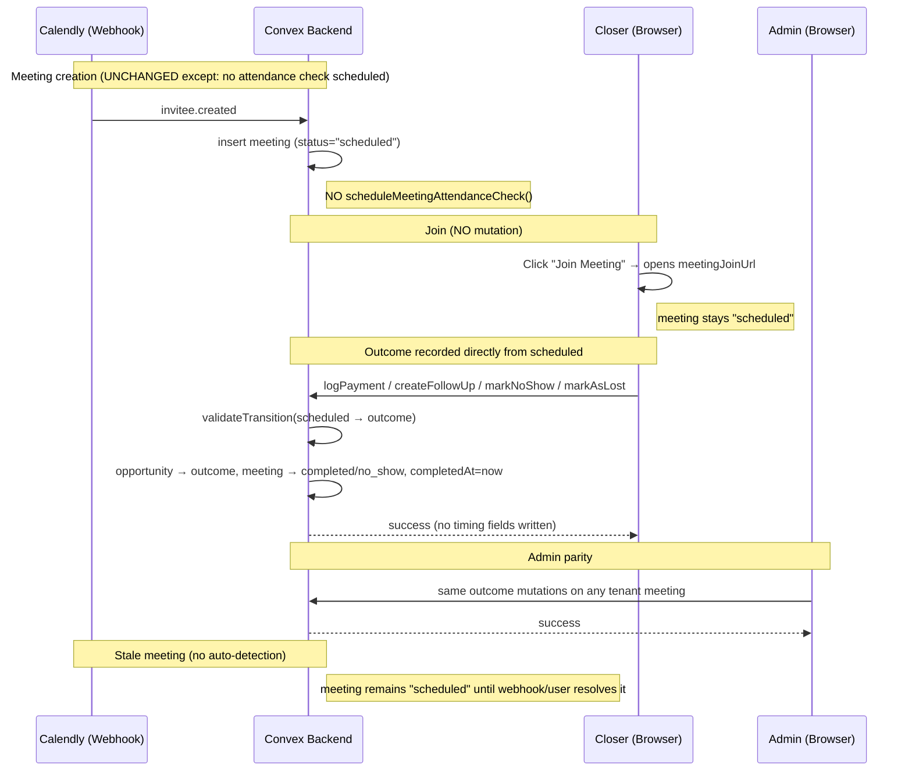
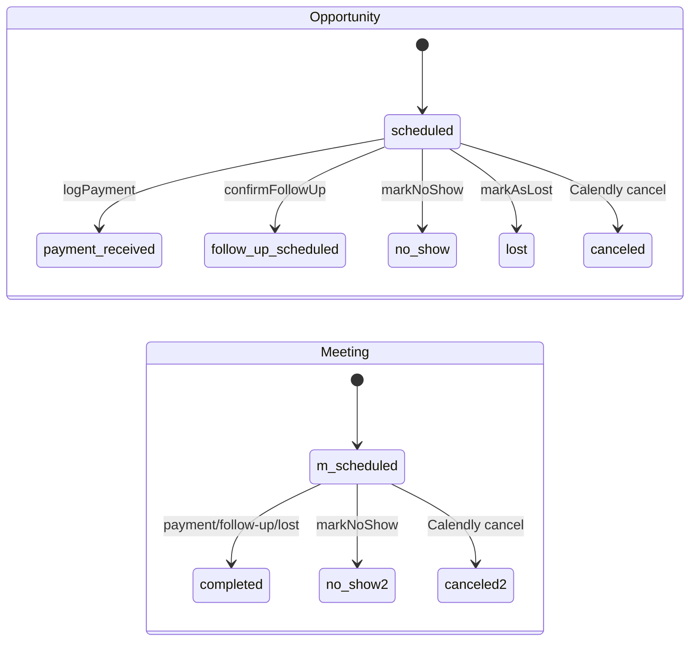

# Phone Closer Overrun Refactor — Design Specification

**Version:** 0.2 (MVP)
**Status:** Draft
**Scope:** A meeting lifecycle gated on closer-pressed **Start Meeting → End Meeting** with a system-driven **Meeting Overran** review fallback → a frictionless model where **Join Meeting** is a plain link and outcomes (payment / follow-up / no-show / lost) are recorded directly from a scheduled meeting. Removes overran detection, the `meetingReviews` review system, the `in_progress` lifecycle state, and all actual-duration/timing tracking, then cleans existing data and narrows the schema so the deployed product behaves as if `meeting_overran` and `in_progress` never existed.
**Prerequisite:** None (refactor of deployed behavior). One test tenant on production. `@convex-dev/migrations@^0.3.3` is installed and registered in `convex/convex.config.ts`.

> **Source brainstorm:** [`brainstorming/phone-closer-overrun-refactor-scope.md`](../../brainstorming/phone-closer-overrun-refactor-scope.md). This design resolves the Open Questions from that brainstorm into concrete decisions (see [§15](#15-open-questions)).

---

## Table of Contents

1. [Goals & Non-Goals](#1-goals--non-goals)
2. [Actors & Roles](#2-actors--roles)
3. [End-to-End Flow Overview](#3-end-to-end-flow-overview)
4. [Phase 1: Outcome Contract & Status Machine](#4-phase-1-outcome-contract--status-machine)
5. [Phase 2: Backend — Stop Producing Overran/Timing/In-Progress Data](#5-phase-2-backend--stop-producing-overrantimingin-progress-data)
6. [Phase 3: Frontend — Join Link & Direct Outcomes](#6-phase-3-frontend--join-link--direct-outcomes)
7. [Phase 4: Reporting Simplification](#7-phase-4-reporting-simplification)
8. [Phase 5: Data Cleanup (Erase Legacy Lifecycle State)](#8-phase-5-data-cleanup-erase-legacy-lifecycle-state)
9. [Phase 6: Schema Narrow](#9-phase-6-schema-narrow)
10. [Data Model](#10-data-model)
11. [Convex Function Architecture](#11-convex-function-architecture)
12. [Routing & Authorization](#12-routing--authorization)
13. [Security Considerations](#13-security-considerations)
14. [Error Handling & Edge Cases](#14-error-handling--edge-cases)
15. [Open Questions](#15-open-questions)
16. [Dependencies](#16-dependencies)
17. [Applicable Skills](#17-applicable-skills)

---

## 1. Goals & Non-Goals

### Goals

- A closer opens a meeting by clicking **Join Meeting**, which simply opens `meetingJoinUrl` (or `zoomJoinUrl`) and **mutates nothing** in Convex.
- A scheduled meeting is immediately actionable: the assigned closer (or an admin) can **log payment**, **schedule a follow-up**, **mark no-show**, or **mark lost** directly from `scheduled`, without any Start/End or `in_progress` intermediate state.
- The system **never** produces `meeting_overran` or `in_progress` again: no Start mutation writes `in_progress`, no attendance check is scheduled, no stale-meeting cron runs, no `meetingReviews` row is created.
- All actual-duration/timing artifacts are gone: no `startedAt`, `stoppedAt`, `lateStartDurationMs`, `exceededScheduledDurationMs`, `overranDurationMs`, `attendanceCheckId`, `overranDetectedAt`, or `reviewId` on meetings.
- Stale scheduled meetings remain `scheduled` indefinitely until a webhook (cancel / no-show / reschedule) or a user action resolves them. No blocking workflow.
- The deployed schema contains **no** `meeting_overran` literal, **no** `in_progress` lifecycle literal, and **no** `meetingReviews` table. Existing data is repaired to a concrete outcome when downstream action evidence exists; otherwise it is reset to `scheduled` before the narrow so Convex schema validation passes.
- Reviews are removed completely: no review routes, backend functions, reports, nav items, `meetingReviews` data, or replacement review framework remain after the narrow.
- The currently-deployed app continues to function throughout the rollout (widen → migrate → narrow). No closer or admin hits a hard error during the migration window.
- Optional Fathom recording links are preserved as a passive artifact; all compliance/reporting requirements around them are removed.
- Every denormalized status projection is also cleaned and narrowed: `opportunitySearch.status`, `meetings.opportunityStatus`, `operationsMeetingDailyStats.opportunityStatus`, and `operationsQualificationRows.opportunityStatus` must contain no `meeting_overran` or `in_progress` before Phase 6.

### Non-Goals (deferred)

- **Passive "stale scheduled meetings" report** for admins (deferred — separate small report; see [§15 Q6](#15-open-questions)). This MVP simply leaves stale meetings `scheduled`.
- **Replacing PostHog funnels.** This design removes the broken `meeting_started` capture and documents the funnel breakage; the replacement outcome-based funnel is a PostHog-side config task (analyst, not code) tracked in [§15 Q7](#15-open-questions).
- **Net-new meeting timing/analytics.** Once removed, we do not re-add any duration metric.

---

## 2. Actors & Roles

| Actor                       | Identity                                     | Auth Method                                                    | Key Permissions                                                                                                                                  |
| --------------------------- | -------------------------------------------- | -------------------------------------------------------------- | ------------------------------------------------------------------------------------------------------------------------------------------------ |
| **Closer**                  | Individual contributor assigned to a meeting | WorkOS AuthKit, member of tenant org; CRM role `closer`        | Join own meeting; record outcomes (payment/follow-up/no-show/lost) on **own assigned** scheduled meetings; save Fathom link                       |
| **Tenant Admin**            | Tenant operator                              | WorkOS AuthKit, member of tenant org; CRM role `tenant_admin`  | All closer outcome actions on any meeting in tenant (via admin pipeline surface); manage pipeline; view reports                                  |
| **Tenant Master**           | Tenant owner                                 | WorkOS AuthKit, member of tenant org; CRM role `tenant_master` | Superset of admin                                                                                                                                |
| **Calendly (webhook)**      | External system                              | Per-tenant HMAC-signed webhook                                 | Creates meetings (`invitee.created`), cancels (`invitee.canceled`), marks no-show (`invitee_no_show.created`)                                    |
| **Convex Scheduler / Cron** | Internal system                              | n/a (server)                                                   | After refactor: no longer schedules attendance checks or runs the stale-meeting sweep                                                            |

### CRM Role ↔ WorkOS Role Mapping

| CRM `users.role` | WorkOS Role | Notes                                  |
| ---------------- | ----------- | -------------------------------------- |
| `tenant_master`  | `owner`     | Full workspace + outcome actions       |
| `tenant_admin`   | `admin`     | Full workspace + outcome actions       |
| `closer`         | `closer`    | Outcomes on own assigned meetings only |

> Mapping lives in `convex/lib/roleMapping.ts`; backend enforcement via `requireTenantUser(ctx, [...])`; UI visibility via `useRole()` (never trusted for authorization).

---

## 3. End-to-End Flow Overview



---

## 4. Phase 1: Outcome Contract & Status Machine

### 4.1 What & Why

The single highest-risk finding from the brainstorm: today, outcome actions are gated on `opportunity.status === "in_progress"` **or** a pending `meeting_overran` review. The only way an opportunity reaches `in_progress` is `startMeeting`. If we remove Start/End without changing the transition map, a normal scheduled meeting **cannot** log payment, schedule follow-up, mark no-show, or mark lost. Phase 1 fixes the contract first, so every later phase builds on valid transitions.

Today's opportunity map (`convex/lib/statusTransitions.ts:27-48`):

```typescript
// Path: convex/lib/statusTransitions.ts (CURRENT)
scheduled: ["in_progress", "meeting_overran", "canceled", "no_show"],
in_progress: ["payment_received", "follow_up_scheduled", "no_show", "lost"],
meeting_overran: ["payment_received", "follow_up_scheduled", "no_show", "lost"],
```

> **Decision — reverse the "outcome mutations never touch meeting status" contract.** The current code base has an explicit contract (`convex/closer/meetingActions.ts:201-213`, `convex/closer/followUpMutations.ts:14-26`) that outcome mutations operate on the opportunity _only_, because **End Meeting** was the sole control that ended the meeting lifecycle. Removing End Meeting removes that control. The new contract: **outcome mutations transition the meeting to its terminal state** (`completed` for payment/follow-up/lost, `no_show` for no-show), setting `completedAt = now` as the _operational_ completion timestamp. This is intentional and must be applied consistently.

### 4.2 New Opportunity Transition Map

The map below is the **final post-narrow map**. During the widen window only, outcome mutations may include a temporary compatibility branch that accepts an existing `in_progress` row and immediately moves it to a concrete outcome. That branch is deleted after [§8](#8-phase-5-data-cleanup-erase-legacy-lifecycle-state) verifies zero `in_progress` rows.

```typescript
// Path: convex/lib/statusTransitions.ts (TARGET)
export const VALID_TRANSITIONS: Record<OpportunityStatus, OpportunityStatus[]> =
	{
		qualified_pending: ["scheduled", "lost"],
		// scheduled now reaches every terminal outcome directly
		scheduled: [
			"payment_received",
			"follow_up_scheduled",
			"lost",
			"no_show",
			"canceled",
		],
		canceled: ["follow_up_scheduled", "scheduled"],
		no_show: ["follow_up_scheduled", "reschedule_link_sent", "scheduled"],
		follow_up_scheduled: ["scheduled", "payment_received", "lost"],
		reschedule_link_sent: ["scheduled"],
		payment_received: [],
		lost: [],
		// REMOVED: in_progress and meeting_overran keys entirely
	};
```

### 4.3 New Meeting Transition Map

The final meeting state machine has one actionable non-terminal state: `scheduled`. `in_progress` is migration-only and cannot remain in the deployed schema after Phase 6.

```typescript
// Path: convex/lib/statusTransitions.ts (TARGET)
export const MEETING_VALID_TRANSITIONS: Record<MeetingStatus, MeetingStatus[]> =
	{
		// scheduled goes straight to a terminal meeting state via outcomes
		scheduled: ["completed", "canceled", "no_show"],
		completed: [],
		canceled: [],
		no_show: ["scheduled"], // Calendly no-show reversal
		// REMOVED: in_progress and meeting_overran keys entirely
	};
```

> **Why remove `in_progress` in this refactor?** It is the same broken lifecycle model as Start/End and overran detection. Existing `in_progress` rows are repaired in the cleanup pass using concrete downstream action evidence (payment/follow-up/no-show/lost/cancel); if no evidence exists, they reset to `scheduled` so a closer/admin can add the correct action manually later.

### 4.4 Outcome Availability Predicate

> **Resolves Q1 (when do outcomes become available).** Outcomes are available to the assigned closer / admin when the meeting is `scheduled` **and** we are at or past a small lead before the scheduled start. This prevents accidentally logging an outcome for a meeting that has not begun, while keeping friction near zero.

```typescript
// Path: convex/lib/outcomeEligibility.ts (NEW)
const OUTCOME_LEAD_MS = 5 * 60_000; // outcomes open 5 min before scheduledAt

export function isMeetingOutcomeEligible(
	meeting: Doc<"meetings">,
	now: number,
): boolean {
	return (
		meeting.status === "scheduled" &&
		now >= meeting.scheduledAt - OUTCOME_LEAD_MS
	);
}
```

- Closers act only on **own assigned** meetings (existing `assignedCloserId` check is retained in every mutation).
- Public Convex mutations enforce this predicate server-side; UI visibility is convenience only. A closer must not be able to bypass the 5-minute lead window by calling a mutation directly.
- Admins bypass the lead window (they may resolve backdated meetings); they still must be tenant-scoped and role-checked server-side.

```typescript
// Path: convex/lib/outcomeEligibility.ts (NEW)
export function assertCanRecordMeetingOutcome(args: {
	meeting: Doc<"meetings">;
	opportunity: Doc<"opportunities">;
	userId: Id<"users">;
	role: Doc<"users">["role"];
	now: number;
}): void {
	const isAdmin =
		args.role === "tenant_master" || args.role === "tenant_admin";
	if (!isAdmin && args.opportunity.assignedCloserId !== args.userId) {
		throw new Error("Not your meeting");
	}
	if (args.meeting.status !== "scheduled") {
		throw new Error(`Meeting is not scheduled (current: ${args.meeting.status})`);
	}
	if (!isAdmin && !isMeetingOutcomeEligible(args.meeting, args.now)) {
		throw new Error("Outcome actions open 5 minutes before the scheduled time.");
	}
}
```

### 4.5 Status State Machine (target)



---

## 5. Phase 2: Backend — Stop Producing Overran/Timing/In-Progress Data

### 5.1 Remove attendance-check scheduling from meeting creation

`convex/pipeline/inviteeCreated.ts` schedules an attendance check at **three** meeting-insert sites (UTM relink ~1052-1115, B4 heuristic reschedule ~1374-1435, default flow ~1696-1779). Each does: insert meeting → `scheduleMeetingAttendanceCheck(...)` → `patch({ attendanceCheckId })`.

```typescript
// Path: convex/pipeline/inviteeCreated.ts (BEFORE — repeated at 3 sites)
const meetingId = await ctx.db.insert("meetings", {
	/* ... */
});
const attendanceCheckId = await scheduleMeetingAttendanceCheck(
	ctx,
	meetingId,
	scheduledAt,
	durationMinutes,
);
await ctx.db.patch(meetingId, { attendanceCheckId });

// Path: convex/pipeline/inviteeCreated.ts (AFTER)
const meetingId = await ctx.db.insert("meetings", {
	/* ... no attendanceCheckId */
});
// No attendance check scheduled. Stale meetings remain "scheduled".
```

Remove imports of `getMeetingAttendanceCheckTimestamp` / `scheduleMeetingAttendanceCheck` (lines 41-43).

### 5.2 Remove the stale-meeting cron

```typescript
// Path: convex/crons.ts (REMOVE lines 42-47)
// crons.interval(
//   "sweep-stale-scheduled-meetings", { minutes: 5 },
//   internal.closer.meetingOverrunSweep.sweepStaleMeetings, {},
// );
```

Delete `convex/closer/meetingOverrunSweep.ts` after the cron is removed and any queued jobs are drained.

> **Runtime decision — order matters.** Remove the cron registration **first** (Deploy 1). The cron and the one-shot `runAt` attendance checks both target `internal.closer.meetingOverrun.checkMeetingAttendance`. We must not delete that function reference while queued `_scheduled_functions` still point at it, or those jobs fail at execution. See [§8](#8-phase-5-data-cleanup-erase-legacy-lifecycle-state) for cancellation, and the no-op shim fallback in [§5.4](#54-attendance-check-becomes-a-safe-no-op-shim).

### 5.3 Retire Start / End mutations

`startMeeting` and `stopMeeting` (`convex/closer/meetingActions.ts:47-199`) are removed as required transitions. During the widen window they may remain as **rejecting stubs** (throw a clear error) so any stale client that calls them fails loudly rather than silently corrupting state; they are deleted in the narrow phase along with their UI.

```typescript
// Path: convex/closer/meetingActions.ts (WIDEN WINDOW — optional defensive stub)
export const startMeeting = mutation({
	args: { meetingId: v.id("meetings") },
	handler: async () => {
		throw new Error(
			"Start Meeting has been removed. Use Join Meeting and record the outcome directly.",
		);
	},
});
```

### 5.4 Attendance check becomes a safe no-op shim

> **Runtime decision — scheduler safety shim, not product state.** If we cannot _prove_ every queued attendance check was canceled during the implementation window, the deployed `checkMeetingAttendance` must not be deleted outright; a queued job referencing a missing function errors. We keep a **temporary no-op** that never writes `meeting_overran`, then delete it once `npx convex data _scheduled_functions` (or the migration's cancel pass) shows zero pending references.

```typescript
// Path: convex/closer/meetingOverrun.ts (WIDEN WINDOW — no-op shim)
export const checkMeetingAttendance = internalMutation({
	args: { meetingId: v.id("meetings") },
	handler: async () => {
		// No-op: overran detection is removed. This shim only exists so any
		// still-queued _scheduled_functions job resolves cleanly. Delete after
		// verifying zero pending references.
		return;
	},
});
```

### 5.5 Update outcome mutations to accept `scheduled` and complete the meeting

All four outcome mutations get the same shape change: (1) drop the `assertOverranReviewStillPending` guard, (2) rely on the new transition map (which now permits `scheduled → outcome`), (3) transition the meeting to its terminal state, (4) write **no** timing fields.

During the widen window, these mutations may include a temporary `in_progress` compatibility branch that performs the same terminal transition for rows that have not yet been migrated. That branch is removed after the cleanup pass. The final code accepts `scheduled` only.

> **Implementation invariant — one helper closes the meeting.** Do not raw-patch `meeting.status` in each outcome mutation. Add a shared helper (for example `completeMeetingForOutcome(ctx, { meeting, opportunity, toMeetingStatus, completedAt })`) that patches the meeting, calls `replaceMeetingAggregate(ctx, oldMeeting, meetingId)`, and calls `updateOpportunityMeetingRefs(ctx, opportunity._id)`. When opportunity status changes first, ensure `meetings.opportunityStatus` and `operationsMeetingDailyStats` are synced through the existing write-hook path (`patchOpportunityLifecycle` / `replaceOpportunityAggregate`) before schema narrow. This prevents stale `meetingsByStatus`, `operationsMeetingDailyStats`, `opportunitySearch`, and `nextMeetingId` data.

> **API shape — meeting-driven outcomes carry `meetingId`.** `logPayment` and `markNoShow` already receive a meeting id. `FollowUpDialog` / `confirmFollowUpScheduled` and `MarkLostDialog` / `markAsLost` must add a `meetingId` when used from a meeting detail page so the backend can complete the correct meeting. Side-deal and reminder outcome APIs remain opportunity-only and must not attempt to complete a meeting unless a meeting id is explicitly supplied.

**Payment** (`convex/closer/payments.ts`, replacing the gate at 76-83):

```typescript
// Path: convex/closer/payments.ts (AFTER)
// REMOVED: if (opportunity.status === "meeting_overran") { await assertOverranReviewStillPending(...) }
if (!validateTransition(opportunity.status, "payment_received")) {
	throw new Error(
		`Cannot log payment for opportunity with status "${opportunity.status}"`,
	);
}
if (!validateMeetingTransition(meeting.status, "completed")) {
	throw new Error(`Cannot complete meeting with status "${meeting.status}"`);
}
// ... insert paymentRecords, executeConversion (unchanged) ...
await patchOpportunityLifecycle(ctx, {
	opportunity,
	patch: {
		status: "payment_received",
		paymentReceivedAt: now,
		updatedAt: now,
	},
});
// NEW: complete the meeting operationally (no startedAt/stoppedAt/duration)
if (meeting.status !== "completed") {
	await completeMeetingForOutcome(ctx, {
		meeting,
		opportunity,
		toMeetingStatus: "completed",
		completedAt: now,
	});
}
```

**No-show** (`convex/closer/noShowActions.ts`, replacing the gate at 53-57 and write at 87-100):

```typescript
// Path: convex/closer/noShowActions.ts (AFTER)
if (meeting.status !== "scheduled") {
	throw new Error(
		`Can only mark no-show on scheduled meetings (current: "${meeting.status}")`,
	);
}
// REMOVED: meeting_overran branch + assertOverranReviewStillPending
await completeMeetingForOutcome(ctx, {
	meeting,
	opportunity,
	toMeetingStatus: "no_show",
	completedAt: now,
	extraMeetingPatch: {
		noShowMarkedAt: now,
		noShowReason: reason,
		noShowNote: normalizedNote,
		noShowMarkedByUserId: userId,
		noShowSource: "closer",
	},
	// REMOVED: stoppedAt, stoppedAtSource, noShowWaitDurationMs (depend on startedAt)
});
```

**Follow-up** (`convex/closer/followUpMutations.ts`): remove the `meeting_overran` early-returns at 92-94, 200, 284-286, 342-345; `confirmFollowUpScheduled` transitions opportunity → `follow_up_scheduled` and, for a meeting-driven follow-up, sets the meeting → `completed` (unless already terminal).

**Lost** (`convex/closer/meetingActions.ts:223-282` `markAsLost`): remove the overran guard at 244-245; on success set meeting → `completed` unless it has stronger no-show/cancel evidence. The meeting-detail path passes `meetingId`; side-deal paths use `convex/sideDeals/markLost.ts` and remain opportunity-only.

> **Stats correctness.** Going `scheduled → payment_received` directly produces `activeOpportunityDelta: -1` (scheduled is active, payment_received is not) — see `convex/lib/tenantStatsHelper.ts:55-68`. This is the **same net delta** as the old `scheduled → in_progress → payment_received` path, because the old `scheduled → in_progress` step was active→active (delta 0). No double counting. Remove both `meeting_overran` and `in_progress` from `ACTIVE_OPPORTUNITY_STATUSES`; the cleanup migration repairs any active legacy row before the narrow.

### 5.6 Remove overran webhook ignore branches

`convex/pipeline/inviteeCanceled.ts:95-125` and `convex/pipeline/inviteeNoShow.ts:89-116` short-circuit when the opportunity is `meeting_overran` and emit `meeting.webhook_ignored_overran`. After cleanup no row is `meeting_overran`, so these branches are dead. Remove them; let cancel / no-show webhooks process normally. Also remove the `attendanceCheckId`-cancel calls in these files (no attendance check exists anymore).

### 5.7 Delete the review system backend

Delete wholesale once UI is gone (Phase 3) and data is clean (Phase 5):

- `convex/reviews/queries.ts`, `convex/reviews/mutations.ts` (`resolveReview`)
- `convex/closer/meetingOverrun.ts` (`checkMeetingAttendance` shim, `respondToOverranReview`, `scheduleFollowUpFromOverran`)
- `convex/lib/overranReviewGuards.ts` (and all imports: `payments.ts:77`, `meetingActions.ts:245`, `noShowActions.ts:67`, `followUpMutations.ts`, `reminderOutcomes.ts:72,123`, `followUp.ts:105`)
- `convex/lib/attendanceChecks.ts`
- `convex/reporting/reviewsReporting.ts`, `convex/reporting/meetingTime.ts`
- Review-table references in admin/testing utilities (`convex/admin/rawWebhookReplay.ts`, `convex/testing/operationalData.ts`) must also be removed before the schema narrow, otherwise generated types fail after `meetingReviews` is deleted.

### 5.8 Remove non-meeting `in_progress` writers/readers

`in_progress` is not only a meeting lifecycle state today; manual side deals also use it as the active state. Because the final schema removes the literal globally, these paths must move to `scheduled` as the direct-outcome source state:

- `convex/opportunities/createManual.ts`: insert manual side-deal opportunities with `status: "scheduled"` and emit `toStatus: "scheduled"` in the creation event. This preserves the existing active-opportunity count because `scheduled` is still active.
- `convex/opportunities/detailQuery.ts`: side-deal permissions (`canRecordPayment`, `canMarkLost`, `canDeleteOpportunity`) gate on `scheduled` instead of `in_progress`.
- `convex/opportunities/staleness.ts`: stale side-deal nudges query `source=side_deal,status=scheduled`.
- `convex/sideDeals/deleteEmptyOpportunity.ts`: allow deletion of empty side-deal opportunities in `scheduled`.
- `convex/admin/meetingActions.ts`: delete `adminResolveMeeting`; it writes manual timing fields and transitions opportunity → `in_progress`, which is exactly the workflow being removed.

> **Naming trade-off:** `scheduled` is imperfect for a side deal with no meeting row, but adding a new active status would expand this migration. For this MVP, `scheduled` means "actionable, not terminal" across both booked meetings and manual side deals.

---

## 6. Phase 3: Frontend — Join Link & Direct Outcomes

> **Skill usage:** Invoke `frontend-design`, `next-best-practices`, and `vercel-react-best-practices` while implementing this phase. The action bar refactor is a textbook case for `vercel-composition-patterns` (replace boolean-prop gating with explicit, readable conditionals). All workspace pages stay thin RSC shells delegating to `"use client"` `*-page-client.tsx` components, per `AGENTS.md`.

### 6.1 Action bar: from lifecycle gating to outcome eligibility

`app/workspace/closer/meetings/_components/outcome-action-bar.tsx` is the heart of the change. Today it gates on `meeting.status === "scheduled"` + start-window for Start, `meeting.status === "in_progress"` for End, and `(isInProgress || isPendingOverranReview)` for outcomes (lines 177-357). Replace with a single eligibility predicate.

```tsx
// Path: app/workspace/closer/meetings/_components/outcome-action-bar.tsx (AFTER)
"use client";

type OutcomeActionBarProps = {
	meeting: Doc<"meetings">;
	opportunity: Doc<"opportunities">;
	viewerRole: Doc<"users">["role"];
	payments: Doc<"paymentRecords">[];
	activeFollowUp?: ActiveFollowUpSummary | null;
	onStatusChanged?: () => Promise<void>;
	// REMOVED: meetingReview, flashKey (start-window flash)
};

export function OutcomeActionBar(props: OutcomeActionBarProps) {
	const { meeting, opportunity, viewerRole } = props;
	const [showNoShowDialog, setShowNoShowDialog] = useState(false);
	const viewerIsCloser = viewerRole === "closer";
	const isAdmin =
		viewerRole === "tenant_master" || viewerRole === "tenant_admin";

	const joinUrl = meeting.meetingJoinUrl ?? meeting.zoomJoinUrl;
	const isScheduledOutcomeSource =
		meeting.status === "scheduled" && opportunity.status === "scheduled";

	// Eligible while meeting is scheduled; closers respect the 5-min lead, admins don't.
	const eligible = useOutcomeEligibility(meeting); // wraps isMeetingOutcomeEligible
	const canRecordScheduledOutcome =
		isScheduledOutcomeSource &&
		(viewerIsCloser || isAdmin) &&
		(isAdmin || eligible);

	return (
		<div className="flex flex-wrap gap-2">
			{joinUrl ? (
				<Button asChild variant="outline" size="sm">
					<a href={joinUrl} target="_blank" rel="noopener noreferrer">
						Join
					</a>
				</Button>
			) : null}
			{canRecordScheduledOutcome ? (
				<>
					<PaymentFormDialog
						opportunityId={opportunity._id}
						meetingId={meeting._id}
					/>
					<FollowUpDialog
						opportunityId={opportunity._id}
						meetingId={meeting._id}
					/>
					<Button
						variant="outline"
						size="sm"
						onClick={() => setShowNoShowDialog(true)}
					>
						Mark No-Show
					</Button>
					<MarkNoShowDialog
						open={showNoShowDialog}
						onOpenChange={setShowNoShowDialog}
						meetingId={meeting._id}
					/>
					<MarkLostDialog
						opportunityId={opportunity._id}
						meetingId={meeting._id}
					/>
				</>
			) : null}
		</div>
	);
}
```

- **Removed:** `useMutation(startMeeting)`, `useMeetingStartWindow`, start/end buttons, start-window help alerts, `meeting_started` PostHog capture (line 195), all `flashKey` wiggle logic.
- Outcome dialogs now run from `scheduled`, but their contracts are **not** all unchanged: `PaymentFormDialog` and `MarkNoShowDialog` keep their meeting ids; `FollowUpDialog` and `MarkLostDialog` must pass `meetingId` from meeting detail pages so the backend completes the right meeting. Side-deal/reminder flows remain opportunity-only.
- `MarkNoShowDialog` drops wait-time/start-time props and the `noShowWaitDurationMs` PostHog payload because actual attendance timing is no longer recorded.
- Recovery actions for already `no_show` or `canceled` meetings stay outside this scheduled-outcome bar. Keep `no-show-action-bar.tsx` style recovery actions (reschedule/follow-up where currently allowed), and add the equivalent canceled-meeting recovery surface if the status transition map still permits `canceled → follow_up_scheduled`.

> **`vercel-composition-patterns` note:** the current bar mixes Start/End lifecycle with outcomes behind ~8 booleans (`isMeetingScheduled`, `isMeetingInProgress`, `isInProgress`, `isPendingOverranReview`, …). The target uses one scheduled-outcome predicate (`canRecordScheduledOutcome`) and renders an explicit, fixed set of outcome actions — eliminating the impossible-state combinatorics.

### 6.2 Join Meeting as a plain link (both surfaces)

> **Resolves Q2 (Join placement).** Keep the **primary** Join button on the meeting info card (already a static `<a>` at `meeting-info-panel.tsx:202-236`) and add a compact secondary Join in the action bar so closers don't scroll. Neither mutates Convex.

```tsx
// Path: app/workspace/closer/meetings/_components/meeting-info-panel.tsx (UNCHANGED behavior, keep)
const joinUrl = meeting.meetingJoinUrl ?? meeting.zoomJoinUrl;
// <a href={joinUrl} target="_blank" rel="noopener noreferrer"> Join Meeting </a>
```

Remove the **Recorded timing** section (`meeting-info-panel.tsx:146-198`) that renders `startedAt`, `stoppedAt`, late/over badges.

### 6.3 Delete overran/timing UI and navigation guard

Delete components:

- `meeting-overran-banner.tsx`
- `meeting-overran-context-dialog.tsx` (already dead — no importer)
- `end-meeting-button.tsx`
- `hooks/use-in-progress-meeting-guard.ts`

Update `meeting-detail-page-client.tsx`:

- Remove `useInProgressMeetingGuard`, the in-progress warning dialog (lines 285-312), `blockBack` wiring (134), `<MeetingOverranBanner>` (213-220), and `flashKey` plumbing.
- The page becomes a plain detail view: banners (duplicate/reassignment/reschedule), info panel, outcome action bar, deal-won card.

### 6.4 Remove review routes and shell entry points

- Delete `app/workspace/reviews/**` (11 files) and `app/workspace/reports/reviews/**` (13 files), `app/workspace/reports/meeting-time/**` (12 files).
- `app/workspace/_components/workspace-shell-client.tsx`: remove the `getPendingReviewCount` query (234-237), the review badge (324-342), and the "Reviews" / "Review Ops" / "Meeting Time" nav items (83, 117-118).
- `components/command-palette.tsx`: remove the Reviews entry (line 36, ⌘3) and re-number shortcuts.

### 6.5 Admin parity (no manual-resolve tool)

> **Resolves Q5 (admin manual resolve).** The admin pipeline meeting surface (`app/workspace/pipeline/meetings/_components/admin-action-bar.tsx`) currently only resolves `scheduled` meetings through `AdminResolveMeetingDialog` and gates other outcomes on `in_progress`. Replace that with direct scheduled outcomes for **payment, follow-up, no-show, and lost**. Admins bypass the 5-minute lead window but still use the same server transition validation.

Admin implementation must be explicit about mutation authorization:

- Either expose admin-specific wrappers (`adminLogPayment`, `adminConfirmFollowUpScheduled`, `adminMarkNoShow`, `adminMarkLost`) that load any tenant meeting and call the same shared outcome helpers, or widen the shared outcome mutations to accept `tenant_admin`/`tenant_master` while preserving closer ownership checks for `closer`.
- Do not reuse closer dialogs unchanged if their mutations still enforce "assigned closer only"; the UI would render controls that fail server-side.
- Admin follow-up/lost from a meeting row must pass `meetingId`, same as the closer meeting-detail path, so the meeting is completed and denormalized meeting refs are updated.
- **Delete** `admin-resolve-meeting-dialog.tsx` and the overran manual-time resolution path — there is no overran or `in_progress` state to resolve, and direct outcomes cover every case.

---

## 7. Phase 4: Reporting Simplification

> **Resolves the show-rate ambiguity.** Today there are **three** show-rate definitions across surfaces (team table excludes `meeting_overran` from the denominator; ops tables count it; dashboard ignores it). With `meeting_overran` gone, standardize on a **single** definition.

### 7.1 Canonical show-rate definition (target)

```
showUpRate = completed / (booked − canceled)
```

where `booked` = all meetings in range, `canceled` = canceled count. `no_show` stays in the denominator (a no-show is a confirmed non-attendance, not an unknown). No `reviewRequired` term. Apply this in:

- `convex/reporting/teamPerformance.ts` (drop `reviewRequiredCalls = countsForClassification.meeting_overran` at 316, drop `in_progress` from attended-call math at 318, drop `confirmedAttendanceDenominator − reviewRequiredCalls`, drop the entire `teamMeetingTime` rollup 239-296)
- `convex/reporting/pipelineHealth.ts` (drop `getPipelineBacklogAndLoss` pending-review scan 274-279, drop `reviewRequired` from show-rate 438-461)
- `convex/dashboard/overviewOperations.ts`, `convex/operations/meetingStats.ts`, `convex/operations/phoneSales.ts`, `convex/reporting/teamOutcomes.ts` — align to the canonical formula and remove legacy buckets.

### 7.2 Delete report surfaces

| Surface                                                       | Action                                                                                                                                                                                                          |
| ------------------------------------------------------------- | --------------------------------------------------------------------------------------------------------------------------------------------------------------------------------------------------------------- |
| `/workspace/reports/meeting-time` (12 files)                  | Delete route + `convex/reporting/meetingTime.ts`                                                                                                                                                                |
| `/workspace/reports/reviews` (13 files)                       | Delete route + `convex/reporting/reviewsReporting.ts`                                                                                                                                                           |
| Pipeline "Pending Overran Reviews" card                       | Delete `pending-overran-reviews-card.tsx` + parent wiring                                                                                                                                                       |
| Team "Meeting Time" summary                                   | Delete `meeting-time-summary.tsx`                                                                                                                                                                               |
| Team "Review Req." column                                     | Remove from `closer-performance-table.tsx` (95-100, 146-148, 193-195), `team-report-page-client.tsx`, team footer, and any totals shape                                                                         |
| Pipeline `reviewRequired` alert/stat                          | Remove from `pipeline-report-page-client.tsx` and `convex/reporting/pipelineHealth.ts`                                                                                                                          |
| Status charts/filters incl. `meeting_overran` / `in_progress` | Remove both literals from `status-distribution-chart.tsx:22-23`, `pipeline-aging-table.tsx:20-21`, `pipeline-filters.tsx:22-23`, `opportunity-filters.tsx`, `_components/pipeline/pipeline-filters.tsx`, `operations-filter-bar.tsx`, `qualification-filters.tsx`, `qualification-tab.tsx`, `opportunities-page-client.tsx`, `pipeline/page.tsx`, `meeting-outcome-distribution-chart.tsx`, `reminder-history-panel.tsx` |
| `convex/reporting/lib/outcomeDerivation.ts` overran / in-progress mapping | Remove `meeting_overran` branches and the final `in_progress` derived outcome bucket                                                                                                                             |
| `convex/reporting/lib/eventLabels.ts`, `activityFeed.ts` overran/review labels | Remove overran event labels + `review_resolved_*` buckets                                                                                                                                                       |

### 7.3 PostHog

Remove the `meeting_started` capture (`outcome-action-bar.tsx:195`) and `meeting_overran_context_submitted` (deleted with the dialog). Document in `posthog-setup-report.md` that the **Meeting→Payment** and **Meeting Churn** funnels must be re-anchored on an existing event (e.g. `payment_logged`, `opportunity_marked_lost`) since `meeting_started` no longer fires. (Funnel reconfiguration is a PostHog console task — see [§15 Q7](#15-open-questions).)

---

## 8. Phase 5: Data Cleanup (Erase Legacy Lifecycle State)

> **Skill usage:** `convex-migration-helper`. The constraint is **Convex schema validation**: data at rest must match the schema _before_ the narrow deploy. The goal is to make the DB look like neither `meeting_overran` nor `in_progress` ever existed. Because there is one test tenant with small row counts, a single audited `internalMutation` _may_ suffice, but we use `@convex-dev/migrations` for batching, dry-run, and resume safety (already installed and registered).

### 8.1 Cleanup evidence precedence

> **Resolves Q4 (cleanup precedence).** Repair each `meeting_overran` or `in_progress` opportunity/meeting using concrete downstream records, in this strict order. The first match wins. A review response alone (`meetingReviews.closerStatedOutcome`) is **not** evidence — it was a prompt, not an operational write. Review rows are deleted; they are never used to infer the final outcome.

| #   | Evidence                                                                                                                                                              | Opportunity repair                  | Meeting repair                                        | Completion timestamp                  |
| --- | --------------------------------------------------------------------------------------------------------------------------------------------------------------------- | ----------------------------------- | ----------------------------------------------------- | ------------------------------------- |
| 1   | `paymentRecords` linked by `meetingId`/`opportunityId`, or converted customer                                                                                         | `payment_received`                  | `completed`                                           | payment `recordedAt`                  |
| 2   | Cancellation fields / Calendly cancel webhook applied                                                                                                                 | `canceled`                          | `canceled`                                            | `canceledAt`                          |
| 3   | `meetings.noShowMarkedAt` / `opportunities.noShowAt` / no-show webhook                                                                                                | `no_show`                           | `no_show`                                             | `noShowMarkedAt`                      |
| 4   | `followUps` row linked to opportunity (incl. old overran-review path); if follow-up already completed with terminal `completionOutcome`, prefer that terminal outcome | `follow_up_scheduled` (or terminal) | `completed`                                           | `now`                                 |
| 5   | `opportunities.lostAt` / `lostByUserId` / `lostReason`                                                                                                                | `lost`                              | `completed` (unless stronger no-show/cancel evidence) | `lostAt`                              |
| 6   | **None of the above**                                                                                                                                                 | `scheduled`                         | `scheduled`                                           | clear `completedAt` when it only came from legacy Start/End/admin timing and no downstream outcome exists |

> **Why cancel before no-show, and payment first?** Payment is the strongest revenue-bearing signal and must never be lost. Cancellation outranks no-show because a Calendly cancel is an explicit lifecycle event that should win over an inferred attendance state. Lost is last among positive evidence because it is the most easily reverted. Unresolved rows reset to `scheduled` — we never fabricate a terminal outcome.

Legacy opportunity status is also repair evidence. Old `stopMeeting` / `adminResolveMeeting` can leave `meeting.status === "completed"` while `opportunity.status === "in_progress"` with no downstream outcome. The cleanup must repair those linked meeting/opportunity pairs too, even when the meeting row is already `completed`; otherwise the opportunity could reset to `scheduled` while the linked meeting remains completed and the new scheduled-only action UI cannot record an outcome.

### 8.2 Migration definition

```typescript
// Path: convex/migrations/eraseLegacyLifecycleState.ts (NEW — temporary, removed after run)
import { migrations } from "../migrations"; // existing runner in convex/migrations.ts

// Step A: cancel any queued attendance checks, then strip overran/start/end fields.
export const stripLegacyLifecycleFields = migrations.define({
	table: "meetings",
	migrateOne: async (ctx, meeting) => {
		if (meeting.attendanceCheckId) {
			try {
				await ctx.scheduler.cancel(meeting.attendanceCheckId);
			} catch {
				/* already ran/canceled */
			}
		}
		return {
			attendanceCheckId: undefined,
			reviewId: undefined,
			overranDetectedAt: undefined,
			startedAt: undefined,
			startedAtSource: undefined,
			stoppedAt: undefined,
			stoppedAtSource: undefined,
			lateStartDurationMs: undefined,
			overranDurationMs: undefined,
			exceededScheduledDurationMs: undefined,
			noShowWaitDurationMs: undefined,
		};
	},
});

// Step B: repair legacy meeting/opportunity pairs using the precedence in §8.1.
export const repairLegacyLifecycleMeetings = migrations.define({
	table: "meetings",
	migrateOne: async (ctx, meeting) => {
		const opportunity = await ctx.db.get(meeting.opportunityId);
		const hasLegacyMeeting =
			meeting.status === "meeting_overran" ||
			meeting.status === "in_progress";
		const hasLegacyOpportunity =
			opportunity?.status === "meeting_overran" ||
			opportunity?.status === "in_progress";

		if (!hasLegacyMeeting && !hasLegacyOpportunity) return;

		const repair = await deriveMeetingRepair(ctx, { meeting, opportunity }); // §8.1 table
		await applyLifecycleRepair(ctx, {
			beforeMeeting: meeting,
			meetingPatch: repair.meetingPatch,
			beforeOpportunity: opportunity,
			opportunityPatch: repair.opportunityPatch,
		});
	},
});

// Step C: repair remaining legacy opportunities that have no matching meeting pass.
export const repairStandaloneLegacyOpportunities = migrations.define({
	table: "opportunities",
	migrateOne: async (ctx, opportunity) => {
		if (
			opportunity.status !== "meeting_overran" &&
			opportunity.status !== "in_progress"
		) {
			return;
		}
		const repair = await deriveOpportunityRepair(ctx, opportunity); // same §8.1 precedence
		await applyLifecycleRepair(ctx, {
			beforeMeeting: repair.linkedMeeting,
			meetingPatch: repair.meetingPatch,
			beforeOpportunity: opportunity,
			opportunityPatch: repair.opportunityPatch,
		});
	},
});

// Step D: delete all meetingReviews rows.
export const deleteMeetingReviews = migrations.define({
	table: "meetingReviews",
	migrateOne: async (ctx, row) => {
		await ctx.db.delete(row._id);
	},
});

// Step E: refresh denormalized status projections after source rows are repaired.
export const refreshStatusProjections = migrations.define({
	table: "opportunities",
	migrateOne: async (ctx, opportunity) => {
		await refreshOpportunityStatusProjections(ctx, { opportunityId: opportunity._id });
	},
});
```

> **Runtime decision — repair opportunities via the meeting pass.** We drive repair from the `meetings` table (each meeting links its `opportunityId`) so meeting and opportunity are patched atomically per row. This also catches old `completed` meeting + `in_progress` opportunity pairs created by Stop/Admin Resolve. The standalone opportunity pass is defensive: it repairs any opportunity still `meeting_overran` or `in_progress` with no matching meeting pass, using the same evidence precedence and resetting to `scheduled` when no evidence exists.

### 8.3 Aggregates & events

- Rebuild/clean `operationsMeetingDailyStats` rows whose `meetingStatus` is `meeting_overran` or `in_progress` (re-bucket to the repaired status, or recompute the affected `dayKey`s via `convex/operations/meetingStats.ts`).
- Rebuild/clean denormalized opportunity-status projections that can also contain legacy literals: `opportunitySearch.status`, `meetings.opportunityStatus`, `operationsMeetingDailyStats.opportunityStatus`, and `operationsQualificationRows.opportunityStatus`.
- Recompute reporting aggregates that bucketed `meeting_overran` or `in_progress` (`meetingsByStatus`, `opportunityByStatus` aggregate components).
- Recompute tenant/opportunity denormalized stats after status repair (`tenantStats.activeOpportunities`, won/lost/payment counters, opportunity aggregate components). Migration repair must go through a helper equivalent to the normal lifecycle/write-hook updates (`patchOpportunityLifecycle`, `replaceOpportunityAggregate`, `replaceMeetingAggregate`, `updateOpportunityMeetingRefs`, and projection refreshes); otherwise dashboards will retain stale counts even though source documents are clean.
- Delete/ignore overran/start/end domain events (`meeting.overran_detected`, `meeting.overran_closer_responded`, `meeting.overran_review_resolved`, `meeting.webhook_ignored_overran`, `meeting.started`, `meeting.stopped`) where they feed the activity feed or reports.

### 8.4 Verification gate (must pass before §9)

```bash
# Path: shell — production verification after migrations complete
# All production checks use --prod because the active test tenant is on production.
npx convex run --prod --component migrations lib:getStatus --watch
npx convex data --prod meetingReviews --limit 1    # expect zero rows
npx convex data --prod _scheduled_functions --limit 20 # expect no checkMeetingAttendance jobs

# Expect zero meeting_overran/in_progress across source rows and projections:
npx convex run --prod audits:countLegacyLifecycleRows
# NEW one-off internalQuery returns:
# { meetings:0, opportunities:0, opportunitySearch:0, meetingOpportunityStatus:0,
#   operationsMeetingDailyStatsMeetingStatus:0,
#   operationsMeetingDailyStatsOpportunityStatus:0,
#   operationsQualificationRows:0 }
npx convex run --prod audits:compareLifecycleAggregates  # expect no aggregate/stat mismatches
```

The narrow deploy ([§9](#9-phase-6-schema-narrow)) is **blocked** until `countLegacyLifecycleRows` returns all zeros, `compareLifecycleAggregates` reports no mismatches, `meetingReviews` is empty, and `_scheduled_functions` shows no pending `checkMeetingAttendance` jobs.

---

## 9. Phase 6: Schema Narrow

After [§8.4](#84-verification-gate-must-pass-before-9) verification, narrow `convex/schema.ts` and supporting type sources in one deploy:

1. Remove fields from `meetings`: `startedAt`, `startedAtSource`, `stoppedAt`, `stoppedAtSource`, `lateStartDurationMs`, `overranDurationMs`, `exceededScheduledDurationMs`, `attendanceCheckId`, `overranDetectedAt`, `reviewId`, `noShowWaitDurationMs`.
2. Remove `meetingReviews` table + its 4 indexes.
3. Remove `meeting_overran` and `in_progress` literals from: `meetings.status`, `meetings.opportunityStatus` (through `opportunityStatusValidator`), `opportunities.status`, `opportunitySearch.status`, `operationsMeetingDailyStats.meetingStatus`, `operationsMeetingDailyStats.opportunityStatus`, and `operationsQualificationRows.opportunityStatus`.
4. Mirror literal removal in `lib/status-config.ts` (14-15, 36-40, 91-99, 169-189, 257-258), `convex/lib/statusTransitions.ts`, `convex/opportunities/validators.ts`, `convex/opportunities/queries.ts`, `convex/opportunities/listQueries.ts`, `convex/closer/pipeline.ts`, `convex/operations/phoneSales.ts`, `convex/operations/qualifications.ts`, `convex/operations/projections.ts`, `convex/reporting/lib/outcomeDerivation.ts`, `convex/reporting/lib/eventLabels.ts`, `convex/lib/opportunitySearch.ts`, `convex/users/queries.ts`, `convex/workos/userMutations.ts`, reporting filters, and any UI status config.
5. Regenerate types: `npx convex dev` / deploy regenerates `convex/_generated`.
6. Delete the temporary migration files and the `checkMeetingAttendance` shim.

> **Preserve / redefine:** `meetings.completedAt` is **kept** but redefined as "operationally completed/resolved at" (no longer an actual end time; never used for duration). `meetings.fathomLink` + `fathomLinkSavedAt` are **kept** as optional artifacts (Q3). `noShowReason`/`noShowNote`/`noShowMarkedAt`/`noShowMarkedByUserId`/`noShowSource` are **kept**.

---

## 10. Data Model

### 10.1 Modified: `meetings` Table (target)

```typescript
// Path: convex/schema.ts
meetings: defineTable({
  // ... existing schedule/identity fields (UNCHANGED) ...
  tenantId: v.id("tenants"),
  opportunityId: v.id("opportunities"),
  scheduledAt: v.number(),          // Unix ms
  durationMinutes: v.number(),
  assignedCloserId: v.id("users"),
  meetingJoinUrl: v.optional(v.string()),
  zoomJoinUrl: v.optional(v.string()),

  // Status — meeting_overran and in_progress REMOVED
  status: v.union(
    v.literal("scheduled"),
    v.literal("completed"),
    v.literal("canceled"),
    v.literal("no_show"),
    // REMOVED: v.literal("in_progress")
    // REMOVED: v.literal("meeting_overran")
  ),
  opportunityStatus: v.optional(opportunityStatusValidator), // validator has legacy literals removed

  // Operational completion timestamp (redefined — NOT actual end time, NOT for duration)
  completedAt: v.optional(v.number()),

  // No-show operational fields (KEPT)
  noShowMarkedAt: v.optional(v.number()),
  noShowReason: v.optional(v.union(
    v.literal("no_response"), v.literal("late_cancel"),
    v.literal("technical_issues"), v.literal("other"),
  )),
  noShowNote: v.optional(v.string()),
  noShowMarkedByUserId: v.optional(v.id("users")),
  noShowSource: v.optional(v.union(
    v.literal("closer"),
    v.literal("calendly_webhook"),
  )),

  // Optional recording artifact (KEPT, no compliance/reporting)
  fathomLink: v.optional(v.string()),
  fathomLinkSavedAt: v.optional(v.number()),

  rescheduledFromMeetingId: v.optional(v.id("meetings")),
  operationsStatsSyncedAt: v.optional(v.number()),

  // ───── REMOVED in narrow (Phase 6) ─────
  // startedAt, startedAtSource, stoppedAt, stoppedAtSource,
  // lateStartDurationMs, overranDurationMs, exceededScheduledDurationMs,
  // attendanceCheckId, overranDetectedAt, reviewId, noShowWaitDurationMs
})
  .index("by_tenantId_and_status_and_scheduledAt", ["tenantId", "status", "scheduledAt"])
  .index("by_opportunityId_and_scheduledAt", ["opportunityId", "scheduledAt"]),
  // ... other existing indexes UNCHANGED ...
```

### 10.2 Modified: `opportunities` Table (target)

```typescript
// Path: convex/schema.ts
opportunities: defineTable({
	tenantId: v.id("tenants"),
	// ... existing fields ...
	status: v.union(
		v.literal("qualified_pending"),
		v.literal("scheduled"),
		v.literal("payment_received"),
		v.literal("follow_up_scheduled"),
		v.literal("reschedule_link_sent"),
		v.literal("lost"),
		v.literal("canceled"),
		v.literal("no_show"),
		// REMOVED: v.literal("in_progress")
		// REMOVED: v.literal("meeting_overran")
	),
	// ... existing outcome timestamps (lostAt, canceledAt, noShowAt, paymentReceivedAt) UNCHANGED ...
});
// ... existing indexes UNCHANGED ...
```

### 10.3 Modified: Denormalized Status Projection Tables

These tables store copies of opportunity status and therefore must be cleaned before the narrow deploy, not only updated in source `opportunities` rows:

```typescript
// Path: convex/schema.ts
opportunitySearch: defineTable({
  // ... existing fields ...
  status: opportunityStatusValidator, // legacy literals removed
});

meetings: defineTable({
  // ... existing fields ...
  opportunityStatus: v.optional(opportunityStatusValidator), // legacy literals removed
});

operationsQualificationRows: defineTable({
  // ... existing fields ...
  opportunityStatus: v.optional(opportunityStatusValidator), // legacy literals removed
});
```

### 10.4 Removed: `meetingReviews` Table

```typescript
// Path: convex/schema.ts
// ENTIRE TABLE REMOVED in Phase 6 (after all rows deleted in Phase 5).
// Was: meetingReviews: defineTable({ category: v.literal("meeting_overran"), ... })
//   .index("by_tenantId_and_status_and_createdAt", ...)
//   .index("by_meetingId", ...)
//   .index("by_tenantId_and_closerId_and_createdAt", ...)
//   .index("by_tenantId_and_resolvedAt", ...)
```

### 10.5 Modified: `operationsMeetingDailyStats` Table

```typescript
// Path: convex/schema.ts
operationsMeetingDailyStats: defineTable({
  // ... existing dimension fields ...
  meetingStatus: v.union(
    v.literal("scheduled"),
    v.literal("completed"),
    v.literal("canceled"),
    v.literal("no_show"),
    // REMOVED: v.literal("in_progress")
    // REMOVED: v.literal("meeting_overran")
  ),
  opportunityStatus: v.optional(opportunityStatusValidator), // legacy literals removed
  count: v.number(),
  updatedAt: v.number(),
})
  .index("by_tenantId_and_dayKey", ["tenantId", "dayKey"])
  .index("by_tenantId_and_assignedCloserId_and_dayKey", ["tenantId", "assignedCloserId", "dayKey"]),
```

---

## 11. Convex Function Architecture

```
convex/
├── schema.ts                         # MODIFIED: drop meeting_overran/in_progress literals, timing fields, meetingReviews — Phase 1(widen)/6(narrow)
├── admin/
│   ├── meetingActions.ts             # MODIFIED: delete adminResolveMeeting timing/in_progress path; add/route direct admin outcomes — Phase 2/3
│   ├── rawWebhookReplay.ts           # MODIFIED: drop meetingReviews cleanup — Phase 6
│   └── migrations.ts                 # MODIFIED: drop legacy status references — Phase 6
├── crons.ts                          # MODIFIED: remove "sweep-stale-scheduled-meetings" — Phase 2
├── convex.config.ts                  # UNCHANGED (migrations component already registered)
├── lib/
│   ├── statusTransitions.ts          # MODIFIED: new maps, drop meeting_overran/in_progress — Phase 1
│   ├── tenantStatsHelper.ts          # MODIFIED: drop meeting_overran/in_progress from ACTIVE_OPPORTUNITY_STATUSES — Phase 1/5
│   ├── outcomeEligibility.ts         # NEW: isMeetingOutcomeEligible + assertCanRecordMeetingOutcome — Phase 1
│   ├── opportunitySearch.ts          # MODIFIED: projection status validator/refresh — Phase 5/6
│   ├── opportunityMeetingRefs.ts     # MODIFIED/USED: refresh next/latest meeting refs after repairs — Phase 2/5
│   ├── attendanceChecks.ts           # DELETE — Phase 2/6
│   └── overranReviewGuards.ts        # DELETE — Phase 2/6
├── closer/
│   ├── dashboard.ts                  # MODIFIED: drop in_progress/meeting_overran buckets — Phase 4/6
│   ├── meetingActions.ts             # MODIFIED: remove startMeeting/stopMeeting; markAsLost completes meeting — Phase 2/3
│   ├── meetingDetail.ts              # MODIFIED: stop loading meetingReview/reviewId data — Phase 3/6
│   ├── meetingOverrun.ts             # MODIFIED→no-op shim (widen) → DELETE (narrow) — Phase 2/6
│   ├── meetingOverrunSweep.ts        # DELETE — Phase 2
│   ├── payments.ts                   # MODIFIED: accept scheduled, complete meeting, drop overran guard — Phase 2
│   ├── pipeline.ts                   # MODIFIED: drop legacy status validators/buckets — Phase 4/6
│   ├── followUpMutations.ts          # MODIFIED: drop overran early-returns, complete meeting — Phase 2
│   └── noShowActions.ts              # MODIFIED: accept scheduled, drop wait/timing fields — Phase 2
├── opportunities/
│   ├── createManual.ts               # MODIFIED: manual side deals start scheduled, not in_progress — Phase 2
│   ├── detailQuery.ts                # MODIFIED: side-deal permissions gate on scheduled — Phase 2
│   ├── listQueries.ts                # MODIFIED: drop legacy status filters/projections — Phase 4/6
│   ├── queries.ts                    # MODIFIED: drop legacy status validators — Phase 6
│   ├── staleness.ts                  # MODIFIED: stale side-deal nudges use scheduled — Phase 2
│   └── validators.ts                 # MODIFIED: drop legacy status literals — Phase 6
├── sideDeals/
│   ├── deleteEmptyOpportunity.ts     # MODIFIED: delete empty scheduled side deals — Phase 2
│   ├── logPayment.ts                 # MODIFIED/VERIFY: scheduled source state remains valid — Phase 2
│   └── markLost.ts                   # MODIFIED/VERIFY: scheduled source state remains valid — Phase 2
├── pipeline/
│   ├── inviteeCreated.ts             # MODIFIED: remove 3× scheduleMeetingAttendanceCheck — Phase 2
│   ├── inviteeCanceled.ts            # MODIFIED: remove overran ignore branch + cancel call — Phase 2
│   └── inviteeNoShow.ts              # MODIFIED: remove overran ignore branch + cancel call — Phase 2
├── reviews/
│   ├── queries.ts                    # DELETE — Phase 3/6
│   └── mutations.ts                  # DELETE — Phase 3/6
├── reporting/
│   ├── writeHooks.ts                 # MODIFIED/USED: aggregate/projection updates for lifecycle repair — Phase 2/5
│   ├── lib/
│   │   ├── outcomeDerivation.ts      # MODIFIED: drop meeting_overran/in_progress branches — Phase 4
│   │   └── eventLabels.ts            # MODIFIED: drop overran/review labels — Phase 4
│   ├── meetingTime.ts                # DELETE — Phase 4
│   ├── reviewsReporting.ts           # DELETE — Phase 4
│   ├── teamPerformance.ts            # MODIFIED: canonical show-rate, drop meeting-time rollup/review req — Phase 4
│   ├── pipelineHealth.ts             # MODIFIED: drop pending-review scan + reviewRequired — Phase 4
│   └── activityFeed.ts               # MODIFIED: drop review_resolved_* buckets — Phase 4
├── operations/
│   ├── meetingStats.ts               # MODIFIED: drop meeting_overran/in_progress buckets — Phase 4/5
│   ├── phoneSales.ts                 # MODIFIED: drop legacy status validators/buckets — Phase 4/6
│   ├── qualifications.ts             # MODIFIED: drop legacy opportunityStatus filters/projections — Phase 4/6
│   └── projections.ts                # MODIFIED: refresh narrowed opportunityStatus projections — Phase 5/6
├── users/
│   └── queries.ts                    # MODIFIED: drop legacy status buckets — Phase 4/6
├── workos/
│   └── userMutations.ts              # MODIFIED: drop legacy status buckets — Phase 4/6
├── testing/
│   ├── e2e.ts                        # MODIFIED: drop startedAt/stoppedAt output — Phase 6
│   └── operationalData.ts            # MODIFIED: drop meetingReviews table checks — Phase 6
├── migrations/                       # NEW (temporary)
│   └── eraseLegacyLifecycleState.ts  # NEW: strip fields, repair rows, delete reviews — Phase 5
└── audits/
    └── legacyLifecycle.ts            # NEW (temporary): countLegacyLifecycleRows + compareLifecycleAggregates — Phase 5
```

---

## 12. Routing & Authorization

### Route changes

```
app/workspace/
├── reviews/                          # DELETE entire tree (11 files) — Phase 3
│   ├── page.tsx
│   ├── [reviewId]/page.tsx
│   └── _components/*
├── reports/
│   ├── meeting-time/                 # DELETE entire tree (12 files) — Phase 4
│   ├── reviews/                      # DELETE entire tree (13 files) — Phase 4
│   ├── pipeline/_components/
│   │   └── pending-overran-reviews-card.tsx   # DELETE — Phase 4
│   └── team/_components/
│       └── meeting-time-summary.tsx           # DELETE — Phase 4
├── pipeline/meetings/_components/
│   ├── admin-action-bar.tsx          # MODIFIED: direct scheduled outcomes — Phase 3
│   └── admin-resolve-meeting-dialog.tsx       # DELETE — Phase 3
└── closer/meetings/
    ├── [meetingId]/_components/
    │   └── meeting-detail-page-client.tsx     # MODIFIED: remove guard/banner — Phase 3
    └── _components/
        ├── outcome-action-bar.tsx             # MODIFIED: outcome-eligibility gating — Phase 3
        ├── mark-no-show-dialog.tsx            # MODIFIED: remove wait-time/start-time props — Phase 3
        ├── no-show-action-bar.tsx             # MODIFIED/KEEP: recovery actions remain for no_show meetings — Phase 3
        ├── end-meeting-button.tsx             # DELETE — Phase 3
        ├── meeting-overran-banner.tsx         # DELETE — Phase 3
        ├── meeting-overran-context-dialog.tsx # DELETE (already dead) — Phase 3
        └── meeting-info-panel.tsx             # MODIFIED: drop timing section, keep Join — Phase 3
```

### Authorization (unchanged enforcement model)

```typescript
// Path: app/workspace/reviews/page.tsx (DELETED) — its requireRole guard goes away.
// Closer meeting detail page stays:
// Path: app/workspace/closer/meetings/[meetingId]/page.tsx (RSC)
// preloadQuery(api.closer.meetingDetail.getMeetingDetail, ...) — UNCHANGED.

// Outcome mutations enforce ownership server-side (UNCHANGED guard, NEW scheduled allowance):
// Path: convex/closer/payments.ts
const { userId, role } = await requireTenantUser(ctx, [
	"closer",
	"tenant_master",
	"tenant_admin",
]);
if (role === "closer" && opportunity.assignedCloserId !== userId)
	throw new Error("Not your meeting");
await assertCanRecordMeetingOutcome(ctx, {
	meeting,
	opportunity,
	userId,
	role,
	now: Date.now(),
});
```

> **Auth gating strategy:** unchanged. Page RSCs use `requireRole(...)`; Convex functions use `requireTenantUser(...)`. `useRole()`/`useOutcomeEligibility()` only control UI visibility — every outcome mutation re-validates ownership, the lead-window/admin override, and the transition server-side. Admin scheduled no-show must be covered by an admin wrapper or by a shared mutation that explicitly accepts admin roles.

---

## 13. Security Considerations

### 13.1 Credential Security

No new credentials. Calendly per-tenant webhook signing keys remain Convex env / tenant-scoped secrets; never reach the client. Join URLs (`meetingJoinUrl`, `zoomJoinUrl`) are already stored on the meeting and rendered as plain links — no change.

### 13.2 Multi-Tenant Isolation

Every outcome mutation continues to resolve `tenantId` from the authenticated user (via `requireTenantUser`) and verifies `meeting.tenantId === tenantId` and `opportunity.tenantId === tenantId` (existing `loadMeetingContext`, `convex/closer/meetingActions.ts:21-37`). The migration (`eraseLegacyLifecycleState.ts`) is an `internalMutation`/migrations component run — server-only, not client-callable. The verification query lives under `convex/audits/` as an `internalQuery`.

### 13.3 Role-Based Data Access (target)

| Data resource                                      | Closer                       | Tenant Admin    | Tenant Master |
| -------------------------------------------------- | ---------------------------- | --------------- | ------------- |
| Own assigned meetings                              | Full (outcomes)              | Full            | Full          |
| Other closers' meetings                            | None                         | Full (outcomes) | Full          |
| Outcome mutations (payment/follow-up/no-show/lost) | Own only, within lead window | Any, anytime    | Any, anytime  |
| Reports (team/pipeline/operations)                 | None                         | Read            | Read          |
| ~~Reviews inbox~~                                  | ~~—~~                        | **Removed**     | **Removed**   |

### 13.4 Webhook Security

Unchanged: per-tenant HMAC-SHA256 verification, raw event persistence in `rawWebhookEvents`, async processing via `ctx.scheduler.runAfter(0, internal.pipeline.processor.processRawEvent, ...)`. The only change is that the `invitee.created` processor no longer schedules an attendance check, and the cancel/no-show processors no longer special-case `meeting_overran` or lifecycle-start state.

### 13.5 Rate Limit Awareness

This refactor **reduces** Convex scheduler load: it eliminates one `runAt` job per meeting created and the 5-minute sweep cron. No external API rate-limit surface changes (Calendly call volume unaffected).

---

## 14. Error Handling & Edge Cases

### 14.1 Queued attendance check fires after Start/End removal

| Error                                     | Cause                                                                      | Action                                                                                                                                                                                                                           |
| ----------------------------------------- | -------------------------------------------------------------------------- | -------------------------------------------------------------------------------------------------------------------------------------------------------------------------------------------------------------------------------- |
| Scheduled job references missing function | `checkMeetingAttendance` deleted while `_scheduled_functions` still queued | Keep no-op shim ([§5.4](#54-attendance-check-becomes-a-safe-no-op-shim)) until `eraseLegacyLifecycleState.stripLegacyLifecycleFields` cancels all `attendanceCheckId`s and `_scheduled_functions` shows zero pending. Only then delete the shim. |

### 14.2 Outcome recorded on a meeting that "hasn't happened yet"

A closer could click an outcome before the call or call the mutation directly. Detection: `assertCanRecordMeetingOutcome` enforces `meeting.status === "scheduled"`, `opportunity.status === "scheduled"`, ownership, and `now >= scheduledAt − 5min` for closers. Recovery: admins may override the time window only. User-facing: `useOutcomeEligibility` hides the scheduled-outcome controls for closers before the lead window; mutation errors are reserved for stale tabs/direct calls.

### 14.3 Concurrent outcome + Calendly cancel webhook

Scenario: closer marks payment while a `invitee.canceled` webhook arrives. Detection: both call `validateTransition`/`validateMeetingTransition` inside a single Convex mutation (serializable). Recovery: whichever commits first wins; the second sees the new status and either no-ops (cancel webhook sees `payment_received`, which is terminal) or the transition validator rejects it. User-facing: closer sees success; webhook logs a benign "invalid transition" warning.

### 14.4 Migration partial failure / resume

Detection: `@convex-dev/migrations` tracks per-table cursor state. Recovery: re-run the existing app runner in production, for example `npx convex run --prod migrations:run '{"fn":"migrations/eraseLegacyLifecycleState:repairLegacyLifecycleMeetings"}'` (or `{"fn":"migrations:repairLegacyLifecycleMeetings"}` if the migration is defined directly in `convex/migrations.ts`). It resumes from the last cursor; `migrateOne` patches are idempotent (re-stripping already-undefined fields is a no-op; re-deleting a missing review row is skipped). Always run the matching dry-run first: `npx convex run --prod migrations:run '{"fn":"migrations/eraseLegacyLifecycleState:repairLegacyLifecycleMeetings","dryRun":true}'`.

### 14.5 Schema narrow attempted with residual legacy lifecycle rows

Detection: Convex rejects the deploy ("document does not match schema"). Recovery: the [§8.4 verification gate](#84-verification-gate-must-pass-before-9) (`countLegacyLifecycleRows` = all zeros) **must** pass before attempting the narrow. If the deploy is rejected, re-run `repairLegacyLifecycleMeetings` / `repairStandaloneLegacyOpportunities` and re-verify. Never force the narrow.

### 14.6 Legacy `in_progress` rows during migration

Scenario: opportunity/meeting stuck `in_progress` from a pre-refactor Start with no End, or a `completed` meeting linked to an `in_progress` opportunity from legacy Stop/Admin Resolve. Detection: `countLegacyLifecycleRows` reports residual source/projection rows before narrow. Recovery: the cleanup migration applies the [§8.1](#81-cleanup-evidence-precedence) precedence to the linked pair; payment/follow-up/no-show/lost/cancel evidence becomes the matching final state, and rows with no evidence reset both meeting and opportunity to `scheduled` for manual follow-up. User-facing: after cleanup, the row appears as a normal scheduled meeting.

### 14.7 Reports referencing deleted buckets during the window

Detection: a report query reads `meeting_overran` or `in_progress` count = 0 after cleanup. Recovery: queries are updated in Phase 4 (before narrow) to drop the buckets; aggregates recomputed in Phase 5. User-facing: show-rate numbers shift slightly (review-required denominator term removed) — documented as the canonical formula change ([§7.1](#71-canonical-show-rate-definition-target)).

---

## 15. Open Questions

| #     | Question                                               | Current Thinking                                                                                                                                                                  |
| ----- | ------------------------------------------------------ | --------------------------------------------------------------------------------------------------------------------------------------------------------------------------------- |
| ~~1~~ | ~~When do outcome actions become available?~~          | **Resolved.** Available to assigned closer from `scheduledAt − 5min` while meeting is `scheduled`; admins any time. See [§4.4](#44-outcome-availability-predicate).              |
| ~~2~~ | ~~Join Meeting placement?~~                            | **Resolved.** Both — primary on info card, compact secondary in action bar. Neither mutates Convex. [§6.2](#62-join-meeting-as-a-plain-link-both-surfaces).                       |
| ~~3~~ | ~~Keep optional Fathom links?~~                        | **Resolved.** Keep `fathomLink`/`fathomLinkSavedAt` as passive artifacts; remove all compliance/reporting. [§9](#9-phase-6-schema-narrow).                                        |
| ~~4~~ | ~~Cleanup evidence precedence?~~                       | **Resolved.** payment → cancel → no-show → follow-up → lost → reset-to-scheduled. [§8.1](#81-cleanup-evidence-precedence).                                                        |
| ~~5~~ | ~~Admin manual "resolve meeting" tool needed?~~        | **Resolved.** No. Direct outcomes cover every case; delete `admin-resolve-meeting-dialog.tsx` and overran manual-time path. [§6.5](#65-admin-parity-no-manual-resolve-tool).      |
| ~~6~~ | ~~Surface stale scheduled meetings passively?~~        | **Resolved for this MVP.** Ignore (leave `scheduled`). Optional passive report deferred (Non-goal).                                                                               |
| 7     | PostHog funnel replacement for `meeting_started`?      | Re-anchor Meeting→Payment / Churn funnels on `payment_logged` / `opportunity_marked_lost` in the PostHog console (analyst task). Code removes the dead `meeting_started` capture. |

---

## 16. Dependencies

### New Packages

None. (`@convex-dev/migrations` is already installed.)

### Already Installed (no action needed)

| Package                                     | Used for                                                                                                                                   |
| ------------------------------------------- | ------------------------------------------------------------------------------------------------------------------------------------------ |
| `@convex-dev/migrations` (`^0.3.3`)         | Batched, resumable data cleanup with dry-run ([§8](#8-phase-5-data-cleanup-erase-legacy-lifecycle-state)) — registered in `convex/convex.config.ts` |
| `convex`                                    | Schema, queries, mutations, scheduler cancellation                                                                                         |
| `next` (16, App Router)                     | Workspace routing; RSC shells + client page components                                                                                     |
| `posthog-js` / `posthog-node`               | Event capture (removing `meeting_started`)                                                                                                 |
| `shadcn/ui` (`radix-nova`) + `lucide-react` | Outcome dialogs, action bar, info panel UI                                                                                                 |

### Environment Variables

| Variable   | Where Set | Used By                                  |
| ---------- | --------- | ---------------------------------------- |
| (none new) | —         | This refactor introduces no new env vars |

### External Service Configuration

- **PostHog console:** reconfigure the two funnels off `meeting_started` (manual; [§15 Q7](#15-open-questions)).

---

## 17. Applicable Skills

| Skill                         | When to Invoke                                                                                           | Phase |
| ----------------------------- | -------------------------------------------------------------------------------------------------------- | ----- |
| `convex-migration-helper`     | Designing/running the erase-overran cleanup and the widen→narrow sequence                                | 5, 6  |
| `convex-performance-audit`    | Verifying the new direct-outcome transitions don't introduce read amplification / OCC conflicts in stats | 2, 4  |
| `frontend-design`             | Reworking the meeting detail page, action bar, and Join surface to a polished, production-grade UI       | 3     |
| `next-best-practices`         | RSC/client boundaries, route deletion, metadata, loading states for the simplified detail page           | 3     |
| `vercel-react-best-practices` | Performance-sensitive action bar / detail page rendering                                                 | 3     |
| `vercel-composition-patterns` | Refactoring `outcome-action-bar.tsx` away from boolean-prop gating to explicit composition               | 3     |
| `web-design-guidelines`       | Accessibility audit of the new action bar / Join button states                                           | 3     |
| `shadcn`                      | Outcome dialog + button composition                                                                      | 3     |

---

_This document is a living specification. Sections will be updated as implementation progresses and open questions are resolved._
