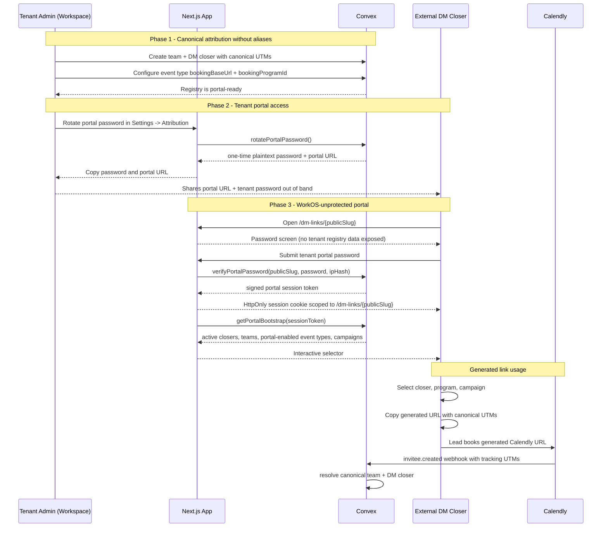

# DM Link Portal and Alias Retirement - Design Specification

**Version:** 0.1 (MVP)  
**Status:** Draft  
**Scope:** Alias-backed UTM attribution and an admin-only placeholder link matrix -> a WorkOS-unprotected, tenant-password-protected DM link portal that generates canonical Calendly links from tenant registry data, while removing alias tables and UI from this greenfield project.  
**Prerequisite:** Pipeline Operations Phase 2 attribution registry is present or being completed (`attributionTeams`, `dmClosers`, `eventTypeConfigs.bookingBaseUrl`, `eventTypeConfigs.bookingProgramId`). Before deleting alias schema, verify production and dev contain no alias rows and no populated `attributionAliasId` fields.

---

## Table of Contents

1. [Goals & Non-Goals](#1-goals--non-goals)
2. [Actors & Roles](#2-actors--roles)
3. [End-to-End Flow Overview](#3-end-to-end-flow-overview)
4. [Phase 1: Alias Retirement and Canonical Attribution](#4-phase-1-alias-retirement-and-canonical-attribution)
5. [Phase 2: Tenant Portal Access Configuration](#5-phase-2-tenant-portal-access-configuration)
6. [Phase 3: Public DM Link Portal](#6-phase-3-public-dm-link-portal)
7. [Phase 4: Workspace Settings Integration](#7-phase-4-workspace-settings-integration)
8. [Phase 5: Copy Auditing and Analytics](#8-phase-5-copy-auditing-and-analytics)
9. [Data Model](#9-data-model)
10. [Convex Function Architecture](#10-convex-function-architecture)
11. [Routing & Authorization](#11-routing--authorization)
12. [Security Considerations](#12-security-considerations)
13. [Error Handling & Edge Cases](#13-error-handling--edge-cases)
14. [Open Questions](#14-open-questions)
15. [Dependencies](#15-dependencies)
16. [Applicable Skills](#16-applicable-skills)

---

## 1. Goals & Non-Goals

### Goals

- Remove `attributionAliases` as a normal product concept before real tenant data depends on it.
- Resolve Calendly UTM attribution directly from canonical tenant registry rows:
  - `utm_source` -> `attributionTeams.utmSource`
  - `utm_medium` -> `dmClosers.utmMedium`
  - DM closer must belong to the matched team when both values exist.
- Provide a public route that bypasses WorkOS AuthKit but requires a tenant-wide portal password before exposing DM closers, programs, campaign values, or booking URLs.
- Let external DM closers select:
  - which DM closer they are
  - which bookable program / Calendly event type they need
  - which campaign preset to use
- Generate a copy-ready Calendly URL using canonical UTM values, without CRM accounts for DM closers.
- Let tenant owners/admins configure portal access from `/workspace/settings?tab=attribution`.
- Store portal passwords securely as salted password hashes. The existing password is never retrievable as plaintext; admins rotate/generate a new one and copy it once.
- Keep booked program mapping tied to `eventTypeConfigs.bookingProgramId`; do not encode internal program IDs in public URL query params.

### Non-Goals (deferred)

- WorkOS login, WorkOS invitations, or CRM accounts for external DM closers.
- Per-DM-closer passwords.
- Retaining aliases as an advanced legacy UI. This project is greenfield, so aliases should be removed now if verification confirms no data depends on them.
- Rewriting raw historical UTM fields. Raw `utmParams` stay immutable.
- Replacing Calendly as the booking host.
- Guaranteeing automatic clipboard copy without a user gesture. Browsers require user interaction, so the portal shows a prominent copy action.
- Persisting stable generated link records unless audit requirements grow. MVP generates links on demand and optionally records copy events.

---

## 2. Actors & Roles

| Actor | Identity | Auth Method | Key Permissions |
| --- | --- | --- | --- |
| **Tenant owner** | `users.role = tenant_master` | WorkOS AuthKit, tenant org JWT -> Convex | Configure portal, rotate password, manage teams, DM closers, campaign presets, and portal-visible event types. |
| **Tenant admin** | `users.role = tenant_admin` | WorkOS AuthKit, tenant org JWT -> Convex | Same as owner for this feature, except unrelated owner-only role management. |
| **External DM closer** | External operator represented by a `dmClosers` row | Tenant portal password + short-lived portal session cookie | Select own closer row and copy canonical booking links. No CRM data access. |
| **System** | Convex actions, queries, mutations, and Next.js server actions | Internal secrets + validated portal session token | Hashes passwords, validates portal sessions, builds scoped portal payloads, records copy events. |
| **Calendly** | Booking host and webhook sender | Calendly URL + webhook signature flow | Receives generated URL with canonical UTMs; sends tracking data back through existing webhook pipeline. |

### CRM Role <-> WorkOS Role Mapping

| CRM `users.role` | WorkOS slug | Portal settings access |
| --- | --- | --- |
| `tenant_master` | `owner` | Full access |
| `tenant_admin` | `tenant-admin` | Full access |
| `closer` | `closer` | None in workspace settings; external DM portal does not use CRM closer accounts |

---

## 3. End-to-End Flow Overview



---

## 4. Phase 1: Alias Retirement and Canonical Attribution

### 4.1 Readiness Verification

Because this is greenfield, alias removal can be a single deploy only if data verification confirms:

| Check | Required result |
| --- | --- |
| `attributionAliases` table row count | `0` |
| `opportunities` with populated `attributionAliasId` | `0` |
| `meetings` with populated `attributionAliasId` | `0` |
| Any imported raw webhook event requiring alias repair | `0`, or explicitly discarded before production usage |

```typescript
// Path: convex/admin/attributionAudit.ts
import { query } from "../_generated/server";
import { requireSystemAdminSession } from "../requireSystemAdmin";

export const verifyAliasRetirementReadiness = query({
  args: {},
  handler: async (ctx) => {
    const identity = await ctx.auth.getUserIdentity();
    requireSystemAdminSession(identity);

    const aliases = await ctx.db.query("attributionAliases").take(1);
    const opportunities = await ctx.db.query("opportunities").take(500);
    const meetings = await ctx.db.query("meetings").take(500);

    return {
      hasAliasRows: aliases.length > 0,
      opportunitiesWithAliasId: opportunities.filter(
        (row) => row.attributionAliasId !== undefined,
      ).length,
      meetingsWithAliasId: meetings.filter(
        (row) => row.attributionAliasId !== undefined,
      ).length,
    };
  },
});
```

> **Migration decision:** If the checks are clean, remove alias schema and code directly. If any count is non-zero, stop and use the `convex-migration-helper` skill to widen-migrate-narrow instead of deleting fields immediately.

### 4.2 Schema and Code Removal

Remove these alias surfaces:

| Area | Remove |
| --- | --- |
| Schema | `attributionAliases` table |
| Schema | `opportunities.attributionAliasId` |
| Schema | `meetings.attributionAliasId` |
| Backend | `convex/attribution/aliases.ts` |
| Backend | alias lookup branches in `resolveAttributionForTenant()` |
| Backend | alias comparisons in attribution backfills |
| Frontend | `AttributionAliasDialog` |
| Frontend | Aliases table/card in `AttributionTab` |
| Frontend | unmapped panel actions that create aliases |

Keep these canonical surfaces:

| Area | Keep |
| --- | --- |
| Schema | `attributionTeams`, `dmClosers` |
| Schema | `opportunities.attributionTeamId`, `opportunities.dmCloserId` |
| Schema | `meetings.attributionTeamId`, `meetings.dmCloserId` |
| Frontend | Team and DM closer CRUD |
| Frontend | Booking link matrix, upgraded into portal settings |

### 4.3 Canonical Resolver

The resolver becomes alias-free and increments the resolution version.

Resolution order:

1. No UTM source and no UTM medium -> `none`.
2. Reserved internal source `utm_source=ptdom` -> `internal`.
3. Canonical pair match:
   - active team with `normalizedUtmSource`
   - active DM closer with `normalizedUtmMedium`
   - DM closer `teamId` equals matched team `_id`
4. Canonical source-only team match.
5. Canonical medium-only DM closer match, only when the active closer match is unique enough within the tenant.
6. No match -> `unmapped`.

```typescript
// Path: convex/lib/attribution/resolveAttribution.ts
export const ATTRIBUTION_RESOLUTION_VERSION = 2;

export async function resolveAttributionForTenant(
  ctx: AttributionCtx,
  args: {
    tenantId: Id<"tenants">;
    utmParams: UtmParams | undefined;
  },
): Promise<ResolvedAttribution> {
  const resolvedAt = Date.now();
  const source = normalizeUtmValue(args.utmParams?.utm_source);
  const medium = normalizeUtmValue(args.utmParams?.utm_medium);

  if (!source && !medium) {
    return { resolutionStatus: "none", resolutionVersion: 2, resolvedAt };
  }

  if (source === "ptdom") {
    return { resolutionStatus: "internal", resolutionVersion: 2, resolvedAt };
  }

  const team = source
    ? (
        await ctx.db
          .query("attributionTeams")
          .withIndex("by_tenantId_and_normalizedUtmSource", (q) =>
            q.eq("tenantId", args.tenantId).eq("normalizedUtmSource", source),
          )
          .take(5)
      ).find((candidate) => candidate.isActive)
    : null;

  const mediumMatches = medium
    ? (
        await ctx.db
          .query("dmClosers")
          .withIndex("by_tenantId_and_normalizedUtmMedium", (q) =>
            q.eq("tenantId", args.tenantId).eq("normalizedUtmMedium", medium),
          )
          .take(5)
      ).filter((candidate) => candidate.isActive)
    : [];

  const matchingCloser = team
    ? mediumMatches.find((candidate) => candidate.teamId === team._id)
    : mediumMatches.length === 1
      ? mediumMatches[0]
      : null;

  if (team && matchingCloser) {
    return {
      resolutionStatus: "mapped",
      teamId: team._id,
      dmCloserId: matchingCloser._id,
      resolutionVersion: 2,
      resolvedAt,
    };
  }

  if (team) {
    return {
      resolutionStatus: "mapped",
      teamId: team._id,
      resolutionVersion: 2,
      resolvedAt,
    };
  }

  if (matchingCloser) {
    return {
      resolutionStatus: "mapped",
      teamId: matchingCloser.teamId,
      dmCloserId: matchingCloser._id,
      resolutionVersion: 2,
      resolvedAt,
    };
  }

  return { resolutionStatus: "unmapped", resolutionVersion: 2, resolvedAt };
}
```

> **Reserved value decision:** Reject `utmSource` values that normalize to `ptdom` in team CRUD. Internal follow-up and reschedule links already use this reserved source and must never become external DM attribution.

### 4.4 Acceptance Criteria

- New Calendly bookings from generated canonical links resolve to `mapped` without alias rows.
- `attributionAliasId` no longer exists in generated types.
- Alias dialogs and alias table are gone from Settings -> Attribution.
- Backfills compile without alias fields.
- Unmapped UTM review no longer offers "create alias"; it can suggest creating a canonical team or DM closer instead.

---

## 5. Phase 2: Tenant Portal Access Configuration

### 5.1 Access Model

Each tenant gets one portal configuration:

- a random public slug used in the route URL
- an enabled/disabled flag
- a salted password hash
- a session version for revoking sessions on password rotation
- a session TTL

The public slug is not the WorkOS org ID, tenant ID, company name, or team slug. It is a random URL-safe value to reduce tenant enumeration.

```txt
/dm-links/lp_7UuVqHWpJj9tx9p2Xx4Y9A
```

> **Password retrieval decision:** Do not store plaintext passwords. The Settings UI should say "Generate new password" or "Rotate password", return the plaintext once, and instruct admins to copy it. If the password is lost, rotate it. Reversible password storage would make this route materially less secure.

### 5.2 Password Hashing

Use Node's built-in `crypto.scrypt` in a Convex Node action. No new package is required.

Recommended defaults:

| Parameter | Value |
| --- | --- |
| Algorithm | `scrypt` |
| `N` | `32768` |
| `r` | `8` |
| `p` | `1` |
| Key length | `32` bytes |
| Salt | 16+ random bytes |
| Pepper | Optional `LINK_PORTAL_PASSWORD_PEPPER` Convex env var |

```typescript
// Path: convex/linkPortal/passwordActions.ts
"use node";

import { randomBytes, scrypt as scryptCallback } from "node:crypto";
import { promisify } from "node:util";
import { action } from "../_generated/server";
import { internal } from "../_generated/api";

const scrypt = promisify(scryptCallback);

async function hashPortalPassword(password: string, salt: string) {
  const pepper = process.env.LINK_PORTAL_PASSWORD_PEPPER ?? "";
  const derived = (await scrypt(`${password}${pepper}`, salt, 32, {
    N: 32768,
    r: 8,
    p: 1,
  })) as Buffer;

  return derived.toString("base64url");
}

export const rotatePortalPassword = action({
  args: {},
  handler: async (ctx) => {
    const access = await ctx.runQuery(
      internal.linkPortal.authz.requireTenantAdminForPortal,
      {},
    );

    const plainPassword = randomBytes(18).toString("base64url");
    const salt = randomBytes(16).toString("base64url");
    const passwordHash = await hashPortalPassword(plainPassword, salt);

    const config = await ctx.runMutation(
      internal.linkPortal.configMutations.rotatePasswordHash,
      {
        tenantId: access.tenantId,
        passwordHash,
        passwordSalt: salt,
        passwordHashParams: {
          algorithm: "scrypt",
          keyLength: 32,
          N: 32768,
          r: 8,
          p: 1,
        },
      },
    );

    return {
      portalUrlPath: `/dm-links/${config.publicSlug}`,
      plainPassword,
      passwordSetAt: config.passwordSetAt,
    };
  },
});
```

### 5.3 Portal Session Token

After password verification, Convex returns a signed short-lived session token. Next.js stores that token in an HttpOnly cookie scoped to `/dm-links/{publicSlug}`.

Session token payload:

| Field | Purpose |
| --- | --- |
| `tenantId` | Tenant scope for all portal data |
| `publicSlug` | Route binding; prevents token reuse under another slug |
| `sessionVersion` | Revokes all old sessions after password rotation or portal disable |
| `iat` / `exp` | Session lifetime |
| `jti` | Random session identifier; hash can be used for audit |

Use `LINK_PORTAL_SESSION_SECRET` as a Convex environment variable for HMAC signing. The browser never receives this secret.

### 5.4 Rate Limiting

For valid portal slugs, failed password attempts are recorded per tenant + IP hash.

| Threshold | Behavior |
| --- | --- |
| 5 failed attempts in 15 minutes | Lock that IP hash for the tenant portal for 15 minutes |
| Unknown slug | Return generic failure and do not reveal whether a tenant exists |
| Successful login | Clear the failure bucket for that tenant + IP hash |

Next.js should pass an HMAC-SHA256 hash of the requester IP, not the raw IP address, to Convex.

---

## 6. Phase 3: Public DM Link Portal

### 6.1 Route Shape

Use an app route outside `/workspace`:

```txt
app/dm-links/[portalSlug]/page.tsx
app/dm-links/[portalSlug]/actions.ts
app/dm-links/[portalSlug]/_components/dm-link-portal-client.tsx
```

Add `/dm-links` to `PUBLIC_PREFIXES` in `proxy.ts`. That bypasses WorkOS AuthKit for the portal route while leaving `/workspace/settings` protected by WorkOS.

### 6.2 Server Component Boundary

The page reads only the HttpOnly portal cookie and route slug. It does not call WorkOS `withAuth()`.

```tsx
// Path: app/dm-links/[portalSlug]/page.tsx
import { cookies } from "next/headers";
import { fetchAction } from "convex/nextjs";
import { api } from "@/convex/_generated/api";
import { DmLinkPortalClient } from "./_components/dm-link-portal-client";
import { unlockPortal } from "./actions";

export const unstable_instant = false;

export default async function DmLinksPage({
  params,
}: {
  params: Promise<{ portalSlug: string }>;
}) {
  const { portalSlug } = await params;
  const cookieStore = await cookies();
  const sessionToken = cookieStore.get(`dm_link_portal_${portalSlug}`)?.value;

  const bootstrap = sessionToken
    ? await fetchAction(api.linkPortal.portalActions.getPortalBootstrap, {
        portalSlug,
        sessionToken,
      }).catch(() => null)
    : null;

  return (
    <DmLinkPortalClient
      portalSlug={portalSlug}
      bootstrap={bootstrap}
      unlockPortal={unlockPortal}
    />
  );
}
```

### 6.3 Password Submit Server Action

```typescript
// Path: app/dm-links/[portalSlug]/actions.ts
"use server";

import { cookies, headers } from "next/headers";
import { redirect } from "next/navigation";
import { fetchAction } from "convex/nextjs";
import { api } from "@/convex/_generated/api";

export async function unlockPortal(portalSlug: string, formData: FormData) {
  const password = String(formData.get("password") ?? "");
  const headerStore = await headers();
  const ipHash = await hashRequesterIp(headerStore);

  const result = await fetchAction(api.linkPortal.passwordActions.verifyPassword, {
    portalSlug,
    password,
    ipHash,
  });

  const cookieStore = await cookies();
  cookieStore.set(`dm_link_portal_${portalSlug}`, result.sessionToken, {
    httpOnly: true,
    secure: process.env.NODE_ENV === "production",
    sameSite: "lax",
    path: `/dm-links/${portalSlug}`,
    maxAge: result.maxAgeSeconds,
  });

  redirect(`/dm-links/${portalSlug}`);
}
```

> **Runtime decision:** Use Next.js server actions for password submission and cookie setting. The interactive selector stays in a Client Component, but the browser never stores the portal session token in localStorage or React state.

### 6.4 Portal Bootstrap Payload

The bootstrap response should be minimal and tenant-scoped:

```typescript
// Path: convex/linkPortal/portalActions.ts
export type LinkPortalBootstrap = {
  tenantName: string;
  campaignPresets: Array<{
    id: Id<"linkPortalCampaignPresets">;
    label: string;
    utmCampaign: string;
    isDefault: boolean;
  }>;
  dmClosers: Array<{
    id: Id<"dmClosers">;
    displayName: string;
    utmMedium: string;
    teamId: Id<"attributionTeams">;
    teamDisplayName: string;
    teamUtmSource: string;
  }>;
  bookablePrograms: Array<{
    eventTypeConfigId: Id<"eventTypeConfigs">;
    eventTypeDisplayName: string;
    bookingProgramId: Id<"tenantPrograms">;
    bookingProgramName: string;
    bookingBaseUrl: string;
  }>;
};
```

Do not return:

- WorkOS org IDs
- tenant IDs
- user emails
- payment links
- raw webhook data
- unmapped raw UTM rows

### 6.5 Link Generation

The client generates the final URL with the standard `URL` API.

```typescript
// Path: app/dm-links/[portalSlug]/_components/build-booking-url.ts
type BuildBookingUrlInput = {
  bookingBaseUrl: string;
  teamUtmSource: string;
  closerUtmMedium: string;
  campaign: string;
};

export function buildBookingUrl(input: BuildBookingUrlInput) {
  const url = new URL(input.bookingBaseUrl);
  url.searchParams.set("utm_source", input.teamUtmSource);
  url.searchParams.set("utm_medium", input.closerUtmMedium);
  url.searchParams.set("utm_campaign", input.campaign);
  return url.toString();
}
```

If `bookingBaseUrl` already contains UTM params, canonical values overwrite them. Non-UTM query params are preserved.

### 6.6 Portal UX

The first authenticated screen should be the tool, not a marketing page:

1. DM closer selector with search.
2. Program selector backed by portal-enabled `eventTypeConfigs`.
3. Campaign segmented control or select.
4. Generated link field with copy button.
5. Optional compact matrix for the selected closer: all enabled programs x campaigns.

Only show active DM closers whose team is active. Only show event types with:

- `linkPortalEnabled === true`
- `bookingBaseUrl` set
- `bookingProgramId` set
- `bookingProgramMappingStatus === "mapped"`

---

## 7. Phase 4: Workspace Settings Integration

### 7.1 Settings -> Attribution Layout

Add a `PortalAccessCard` to the existing Attribution tab above the generated link matrix.

```tsx
// Path: app/workspace/settings/_components/attribution-tab.tsx
<PortalAccessCard />
<AttributionTeamsCard />
<DmClosersCard />
<CampaignPresetsCard />
<PortalEventTypeReadinessCard />
<BookingLinkMatrix />
```

Do not keep the alias card.

### 7.2 Portal Access Card

Fields and actions:

| UI element | Behavior |
| --- | --- |
| Enabled toggle | Enables/disables public portal. Disabling increments `sessionVersion`. |
| Portal URL | Copy `/dm-links/{publicSlug}`. |
| Rotate public URL | Generates a new slug and increments `sessionVersion`. |
| Generate/rotate password | Returns a one-time plaintext password in a modal. Existing password is never shown. |
| Last rotated | Displays `passwordSetAt` / `passwordRotatedAt`. |
| Session duration | Admin-configurable, bounded, default 8 hours. |

### 7.3 Campaign Presets

Default seed values:

| Label | `utm_campaign` |
| --- | --- |
| Organic | `organic` |
| Paid | `paid` |
| Story | `story` |
| DM | `dm` |

Tenant admins can add, rename, disable, and choose one default campaign. Mutations enforce:

- max 40 characters for `utmCampaign`
- normalized uniqueness by tenant
- at least one active default
- no whitespace-only values

### 7.4 Portal Event Type Readiness

Extend the existing event type config UI with a portal visibility toggle and readiness badge.

| State | Meaning |
| --- | --- |
| Ready | `linkPortalEnabled`, mapped program, valid `bookingBaseUrl` |
| Missing URL | Mapped program exists but no public Calendly URL |
| Unmapped program | URL exists but no `bookingProgramId` |
| Hidden | Not shown in public portal |

```typescript
// Path: convex/eventTypeConfigs/mutations.ts
export const setLinkPortalEnabled = mutation({
  args: {
    eventTypeConfigId: v.id("eventTypeConfigs"),
    linkPortalEnabled: v.boolean(),
  },
  handler: async (ctx, args) => {
    const { tenantId } = await requireTenantUser(ctx, [
      "tenant_master",
      "tenant_admin",
    ]);

    const config = await ctx.db.get(args.eventTypeConfigId);
    if (!config || config.tenantId !== tenantId) {
      throw new Error("Event type configuration not found.");
    }

    if (args.linkPortalEnabled) {
      if (!config.bookingBaseUrl || !config.bookingProgramId) {
        throw new Error("Add a booking URL and mapped program before publishing.");
      }
    }

    await ctx.db.patch(config._id, {
      linkPortalEnabled: args.linkPortalEnabled,
      updatedAt: Date.now(),
    });
  },
});
```

---

## 8. Phase 5: Copy Auditing and Analytics

### 8.1 Copy Event Recording

After a successful copy, the client can call a server action that validates the portal session cookie and records a compact audit event.

Do record:

- tenant ID
- DM closer ID
- attribution team ID
- event type config ID
- booked program ID
- campaign preset ID / campaign value
- copy timestamp
- session ID hash

Do not record:

- full generated URL
- raw lead data
- WorkOS user data
- requester IP

```typescript
// Path: convex/linkPortal/copyActions.ts
export const recordCopyEvent = action({
  args: {
    sessionToken: v.string(),
    eventTypeConfigId: v.id("eventTypeConfigs"),
    dmCloserId: v.id("dmClosers"),
    campaignPresetId: v.id("linkPortalCampaignPresets"),
  },
  handler: async (ctx, args) => {
    const session = await validatePortalSession(ctx, args.sessionToken);
    await ctx.runMutation(internal.linkPortal.copyMutations.insertCopyEvent, {
      tenantId: session.tenantId,
      sessionIdHash: session.sessionIdHash,
      eventTypeConfigId: args.eventTypeConfigId,
      dmCloserId: args.dmCloserId,
      campaignPresetId: args.campaignPresetId,
    });
  },
});
```

### 8.2 PostHog Policy

If PostHog events are added, capture only canonical IDs/slugs and booleans. Do not include full URLs or raw UTM query strings.

Recommended event:

```txt
dm_link_copied
```

Allowed properties:

| Property | Allowed |
| --- | --- |
| `tenant_id` | Yes |
| `dm_closer_id` | Yes |
| `team_id` | Yes |
| `event_type_config_id` | Yes |
| `booking_program_id` | Yes |
| `campaign` | Yes |
| `generated_url` | No |
| `utm_source` / `utm_medium` | No |

---

## 9. Data Model

### 9.1 New: `linkPortalConfigs`

```typescript
// Path: convex/schema.ts
linkPortalConfigs: defineTable({
  tenantId: v.id("tenants"),
  publicSlug: v.string(),
  isEnabled: v.boolean(),

  passwordHash: v.optional(v.string()),
  passwordSalt: v.optional(v.string()),
  passwordHashParams: v.optional(
    v.object({
      algorithm: v.literal("scrypt"),
      keyLength: v.number(),
      N: v.number(),
      r: v.number(),
      p: v.number(),
    }),
  ),
  passwordSetAt: v.optional(v.number()),
  passwordRotatedAt: v.optional(v.number()),

  sessionVersion: v.number(),
  sessionTtlSeconds: v.number(),

  createdAt: v.number(),
  updatedAt: v.number(),
})
  .index("by_tenantId", ["tenantId"])
  .index("by_publicSlug", ["publicSlug"]),
```

### 9.2 New: `linkPortalCampaignPresets`

```typescript
// Path: convex/schema.ts
linkPortalCampaignPresets: defineTable({
  tenantId: v.id("tenants"),
  slug: v.string(),
  label: v.string(),
  utmCampaign: v.string(),
  normalizedUtmCampaign: v.string(),
  isDefault: v.boolean(),
  isActive: v.boolean(),
  sortOrder: v.number(),
  createdAt: v.number(),
  updatedAt: v.number(),
})
  .index("by_tenantId", ["tenantId"])
  .index("by_tenantId_and_isActive", ["tenantId", "isActive"])
  .index("by_tenantId_and_normalizedUtmCampaign", [
    "tenantId",
    "normalizedUtmCampaign",
  ]),
```

### 9.3 New: `linkPortalAuthAttempts`

```typescript
// Path: convex/schema.ts
linkPortalAuthAttempts: defineTable({
  tenantId: v.id("tenants"),
  publicSlug: v.string(),
  ipHash: v.string(),
  failedCount: v.number(),
  windowStartedAt: v.number(),
  lockedUntil: v.optional(v.number()),
  updatedAt: v.number(),
})
  .index("by_tenantId_and_ipHash", ["tenantId", "ipHash"])
  .index("by_publicSlug_and_ipHash", ["publicSlug", "ipHash"]),
```

### 9.4 New: `linkPortalCopyEvents`

```typescript
// Path: convex/schema.ts
linkPortalCopyEvents: defineTable({
  tenantId: v.id("tenants"),
  sessionIdHash: v.string(),
  eventTypeConfigId: v.id("eventTypeConfigs"),
  bookingProgramId: v.id("tenantPrograms"),
  attributionTeamId: v.id("attributionTeams"),
  dmCloserId: v.id("dmClosers"),
  campaignPresetId: v.id("linkPortalCampaignPresets"),
  utmCampaign: v.string(),
  copiedAt: v.number(),
})
  .index("by_tenantId_and_copiedAt", ["tenantId", "copiedAt"])
  .index("by_tenantId_and_dmCloserId_and_copiedAt", [
    "tenantId",
    "dmCloserId",
    "copiedAt",
  ])
  .index("by_tenantId_and_eventTypeConfigId_and_copiedAt", [
    "tenantId",
    "eventTypeConfigId",
    "copiedAt",
  ]),
```

### 9.5 Modified: `eventTypeConfigs`

```typescript
// Path: convex/schema.ts
eventTypeConfigs: defineTable({
  // ... existing fields ...
  bookingProgramId: v.optional(v.id("tenantPrograms")),
  bookingProgramName: v.optional(v.string()),
  bookingProgramMappingStatus: v.optional(bookingProgramMappingStatusValidator),
  bookingBaseUrl: v.optional(v.string()),
  bookingUrlSource: v.optional(
    v.union(v.literal("admin_entered"), v.literal("imported_sheet")),
  ),

  // NEW: only enabled configs appear in the public DM link portal.
  linkPortalEnabled: v.optional(v.boolean()),
  updatedAt: v.optional(v.number()),
})
  .index("by_tenantId", ["tenantId"])
  .index("by_tenantId_and_calendlyEventTypeUri", [
    "tenantId",
    "calendlyEventTypeUri",
  ])
  .index("by_tenantId_and_bookingProgramId", [
    "tenantId",
    "bookingProgramId",
  ]),
```

### 9.6 Removed: Alias Schema

```typescript
// Path: convex/schema.ts
// REMOVED:
// attributionAliases: defineTable(...)

opportunities: defineTable({
  // ... existing fields ...
  attributionTeamId: v.optional(v.id("attributionTeams")),
  dmCloserId: v.optional(v.id("dmClosers")),
  // REMOVED: attributionAliasId
  attributionResolution: v.optional(attributionResolutionValidator),
  attributionResolvedAt: v.optional(v.number()),
  attributionResolutionVersion: v.optional(v.number()),
});

meetings: defineTable({
  // ... existing fields ...
  attributionTeamId: v.optional(v.id("attributionTeams")),
  dmCloserId: v.optional(v.id("dmClosers")),
  // REMOVED: attributionAliasId
  attributionResolution: v.optional(attributionResolutionValidator),
  attributionResolvedAt: v.optional(v.number()),
  attributionResolutionVersion: v.optional(v.number()),
});
```

---

## 10. Convex Function Architecture

```txt
convex/
|-- attribution/
|   |-- teams.ts                         # MODIFIED: reject reserved utmSource=ptdom
|   |-- dmClosers.ts                     # KEEP: canonical DM closer CRUD
|   |-- backfills.ts                     # MODIFIED: remove attributionAliasId comparisons
|   `-- aliases.ts                       # REMOVED
|-- eventTypeConfigs/
|   |-- mutations.ts                     # MODIFIED: setLinkPortalEnabled
|   `-- queries.ts                       # MODIFIED: return linkPortalEnabled readiness
|-- lib/
|   `-- attribution/
|       |-- normalize.ts                 # KEEP
|       |-- validators.ts                # MODIFIED: no alias scope validator
|       `-- resolveAttribution.ts        # MODIFIED: canonical resolver v2
|-- linkPortal/                          # NEW
|   |-- authz.ts                         # Internal tenant admin auth helper for actions
|   |-- configQueries.ts                 # Authenticated settings reads
|   |-- configMutations.ts               # Internal/public mutations for settings and sessions
|   |-- passwordActions.ts               # Node action: scrypt hash/verify, session token issue
|   |-- portalActions.ts                 # Public action: validate session, return bootstrap
|   |-- campaignMutations.ts             # Authenticated campaign preset CRUD
|   |-- copyActions.ts                   # Public action: validate session, record copy
|   |-- copyMutations.ts                 # Internal insert for audit rows
|   `-- sessionToken.ts                  # HMAC sign/verify helpers
`-- schema.ts                            # MODIFIED: add portal tables, remove alias table/fields
```

> **Runtime decision:** Password hashing and HMAC signing use Node actions. Database writes stay in mutations. Actions call internal queries/mutations with explicit validators, matching Convex runtime rules.

---

## 11. Routing & Authorization

### 11.1 Next.js Routes

```txt
app/
|-- dm-links/
|   `-- [portalSlug]/
|       |-- page.tsx                         # NEW: public RSC, no WorkOS auth
|       |-- actions.ts                       # NEW: server actions for unlock/logout/copy audit
|       `-- _components/
|           |-- dm-link-portal-client.tsx    # NEW: interactive selector and copy UI
|           `-- build-booking-url.ts         # NEW: URL builder
`-- workspace/
    `-- settings/
        `-- _components/
            |-- attribution-tab.tsx          # MODIFIED: remove alias UI, add PortalAccessCard
            |-- portal-access-card.tsx       # NEW
            |-- campaign-presets-card.tsx    # NEW
            `-- booking-link-matrix.tsx      # MODIFIED: show portal-ready matrix
```

### 11.2 WorkOS Proxy

```typescript
// Path: proxy.ts
const PUBLIC_PREFIXES = [
  "/sign-in",
  "/sign-up",
  "/callback",
  "/onboarding",
  "/privacy",
  "/support",
  "/dm-links",
] as const;
```

`/dm-links` bypasses WorkOS. `/workspace/settings` continues to require WorkOS via existing layout/page auth and Convex `requireTenantUser()` checks.

### 11.3 Authorization Matrix

| Resource/action | Tenant owner | Tenant admin | CRM closer | External DM closer before password | External DM closer after password |
| --- | --- | --- | --- | --- | --- |
| View portal URL in settings | Full | Full | None | None | None |
| Rotate portal password | Full | Full | None | None | None |
| Manage campaign presets | Full | Full | None | None | None |
| Enable event type in portal | Full | Full | None | None | None |
| View portal password plaintext | One-time after rotation only | One-time after rotation only | None | None | None |
| View active DM closer list | Full in workspace | Full in workspace | None | None | Read only, active portal subset |
| Copy generated link | Full via workspace matrix | Full via workspace matrix | None | None | Yes |
| View CRM leads/opportunities/payments | Full per existing RBAC | Full per existing RBAC | Own per existing routes | None | None |

---

## 12. Security Considerations

### 12.1 Credential Security

- Store only salted `scrypt` password hashes.
- Return generated plaintext only from the rotate action response.
- Never log passwords, password hashes, session tokens, full generated URLs, or raw portal request headers.
- Use `HttpOnly`, `Secure`, `SameSite=Lax` cookies scoped to `/dm-links/{portalSlug}`.
- Include `sessionVersion` in session tokens so password rotation, slug rotation, or disabling the portal revokes existing sessions.
- Use a random public slug instead of tenant/company identifiers.

### 12.2 Multi-Tenant Isolation

Workspace settings resolve `tenantId` from WorkOS JWT via `requireTenantUser()`. Public portal data resolves `tenantId` only from a validated portal session token. Client-supplied IDs are always reloaded and checked against that tenant before copy events are recorded.

| Function type | Tenant source |
| --- | --- |
| Settings query/mutation | WorkOS identity -> CRM user -> `tenantId` |
| Password verify | `publicSlug` -> `linkPortalConfigs.tenantId`, after generic failure/rate limit checks |
| Portal bootstrap | signed session token -> `tenantId` + `publicSlug` + `sessionVersion` |
| Copy audit | signed session token -> tenant, then validate selected IDs belong to tenant |

### 12.3 Data Exposure

Before password verification, the page should not reveal:

- tenant name
- team names
- DM closer names
- program names
- configured Calendly URLs
- whether a slug exists

After verification, the portal reveals only the data needed to build booking links.

### 12.4 UTM and URL Safety

- Build generated links with `new URL()` and `URLSearchParams`.
- Overwrite existing `utm_source`, `utm_medium`, and `utm_campaign` on `bookingBaseUrl`.
- Preserve non-UTM query params already present on the Calendly URL.
- Reject team `utmSource` values that normalize to `ptdom`.
- Keep booked program mapping internal; do not expose `bookingProgramId` in query params.

### 12.5 Webhook Security

This feature does not change Calendly webhook verification. Existing HMAC verification still protects webhook ingestion. The generated URL only influences the UTM values Calendly later includes in `invitee.created`.

### 12.6 Rate Limit Awareness

Calendly is not called by the portal. The portal reads local Convex data and constructs URLs. Rate limiting is needed only for password verification and optional copy audit spam.

---

## 13. Error Handling & Edge Cases

### 13.1 Portal Disabled

**Detection:** `linkPortalConfigs.isEnabled === false`.  
**Recovery:** Admin enables it in Settings -> Attribution.  
**User behavior:** Generic unavailable/password screen. Do not disclose whether the portal exists.

### 13.2 Password Not Set

**Detection:** missing `passwordHash` or `passwordSalt`.  
**Recovery:** Admin rotates/generates the password.  
**User behavior:** Generic unavailable/password screen.

### 13.3 Lost Password

**Detection:** Admin cannot retrieve existing plaintext.  
**Recovery:** Rotate password and share new value. Existing sessions are revoked through `sessionVersion`.  
**User behavior:** Old password stops working.

### 13.4 Expired Portal Session

**Detection:** token `exp` is in the past.  
**Recovery:** Delete cookie and prompt for password.  
**User behavior:** Password screen with neutral copy.

### 13.5 Disabled Team or DM Closer

**Detection:** `isActive === false`.  
**Recovery:** Admin re-enables or creates replacement canonical rows.  
**User behavior:** Disabled rows do not appear in portal. Bookings from old links may resolve as `unmapped`.

### 13.6 Event Type Missing Booking URL

**Detection:** `bookingBaseUrl` absent or invalid.  
**Recovery:** Admin updates event type config.  
**User behavior:** Event type does not appear in public portal; settings shows "Missing URL".

### 13.7 Multiple Event Types Map to Same Program

**Detection:** more than one portal-enabled `eventTypeConfig` has the same `bookingProgramId`.  
**Recovery:** Display both rows with event type display names.  
**User behavior:** Program selector labels include event type, e.g. `Mentorship - Discovery Call`.

### 13.8 Clipboard Permission Failure

**Detection:** `navigator.clipboard.writeText()` rejects.  
**Recovery:** Select the generated URL text and show manual copy affordance.  
**User behavior:** Link remains visible and selectable.

### 13.9 Alias Data Found During Verification

**Detection:** readiness query reports rows or populated `attributionAliasId`.  
**Recovery:** Do not delete schema. Use `convex-migration-helper` and stage removal through widen-migrate-narrow.  
**User behavior:** No product-visible change until migration is complete.

---

## 14. Open Questions

| # | Question | Current Thinking |
| --- | --- | --- |
| 1 | Should the portal password be retrievable after generation? | No. Store hash only. Admins retrieve access by rotating to a new generated password. |
| 2 | Should campaigns be fixed or tenant-configurable? | Tenant-configurable presets with seeded defaults. This avoids code changes for tenant-specific campaigns. |
| 3 | Should the portal show all mapped event types by default? | No. Require `linkPortalEnabled` so internal/test event types are not accidentally exposed. |
| 4 | Should copied links be stored as generated records? | Not for MVP. Generate on demand and optionally audit copy events without storing full URLs. |
| 5 | Should DM closers be able to see all other closers? | MVP lists all active DM closers for that tenant after password, per product request. If this becomes sensitive, add per-closer signed links later. |
| 6 | Should old links continue resolving after a closer/team is disabled? | Current recommendation: no. Disabled canonical rows should not receive new attribution. Historical rows already resolved keep cached IDs. |
| 7 | Should the public slug be treated as a secret? | Treat it as non-secret but unguessable. Security depends on the password and rate limits, not slug secrecy alone. |

---

## 15. Dependencies

### New Packages

| Package | Why | Runtime | Install command |
| --- | --- | --- | --- |
| None | Use Node `crypto.scrypt`, existing Next.js, Convex, and UI stack. | N/A | N/A |

### Already-Installed Packages

| Package | Used for |
| --- | --- |
| `next` | App Router route, Server Components, Server Actions, HttpOnly cookies |
| `convex` | Portal config, password actions, canonical resolver, audit tables |
| `@workos-inc/authkit-nextjs` | Existing workspace auth; explicitly bypassed for `/dm-links` via proxy public prefix |
| `react-hook-form` + `zod` | Workspace settings forms if portal config forms follow existing form patterns |
| `lucide-react` | Copy, rotate, lock, and external-link icons in settings and portal UI |

### Environment Variables

| Variable | Where set | Used by |
| --- | --- | --- |
| `LINK_PORTAL_SESSION_SECRET` | Convex env | HMAC signing and validation for portal session tokens |
| `LINK_PORTAL_PASSWORD_PEPPER` | Convex env | Optional extra password-hash secret |
| `LINK_PORTAL_IP_HASH_SECRET` | Next.js env | HMAC hashing requester IP before sending to Convex |
| `NEXT_PUBLIC_CONVEX_URL` | `.env.local` / deployment | Existing `fetchAction` / `fetchQuery` |

### External Service Configuration

| Service | Configuration |
| --- | --- |
| WorkOS | No new route in WorkOS. Ensure `/dm-links` remains outside AuthKit-required proxy paths. |
| Calendly | No API changes. Admins must configure valid `bookingBaseUrl` values for event types. |
| PostHog | Optional event only; do not capture full generated URLs or raw UTM query strings. |

---

## 16. Applicable Skills

| Skill | When to invoke | Phase(s) |
| --- | --- | --- |
| `convex-migration-helper` | If alias rows or populated alias fields exist, or if schema deletion cannot be one deploy. | Phase 1 |
| `workos` | When changing proxy/AuthKit public route behavior or confirming WorkOS bypass boundaries. | Phase 3 |
| `next-best-practices` | When implementing Next.js 16 route, Server Action, cookie, and proxy patterns. | Phases 3-4 |
| `frontend-design` | When building the public portal and Attribution settings UX. | Phases 3-4 |
| `web-design-guidelines` | Before finalizing public portal accessibility and responsive behavior. | Phase 3 |
