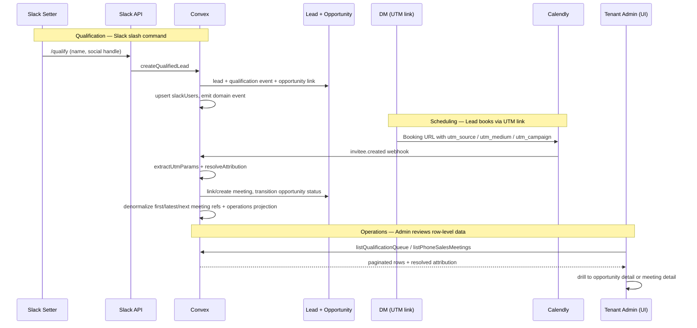
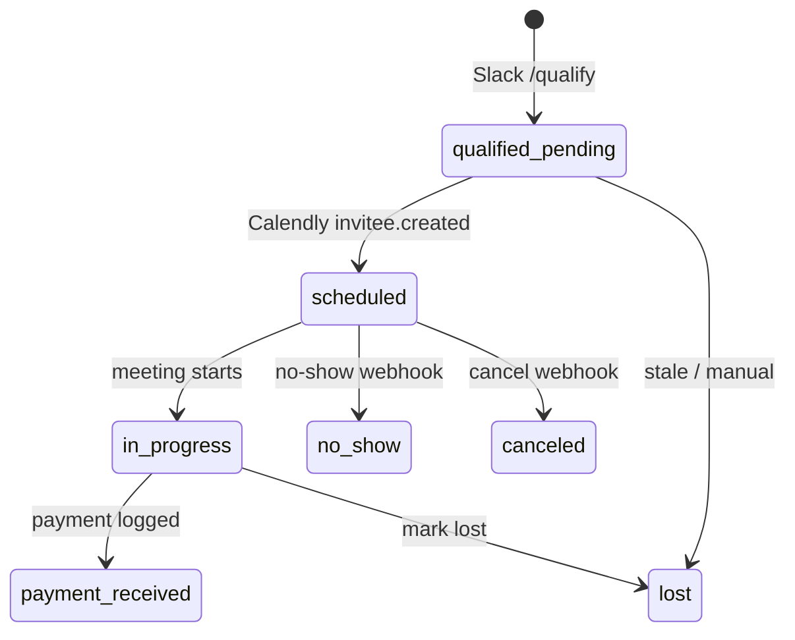

# Pipeline & Operations Redesign — Design Specification

**Version:** 0.1 (MVP)  
**Status:** Draft  
**Scope:** Replace the legacy admin “Pipeline” table (meeting-era filters) with a simplified sidebar and an **Operations** hub that surfaces individual leads/opportunities/meetings across qualification (Slack), scheduling (Calendly), and phone-sales execution—plus a tenant-scoped **UTM attribution model** for external DM closer teams/individuals and Calendly event type → booked-program mapping.  
**Prerequisite:** Existing Convex schema (`leads`, `opportunities`, `meetings`, `customers`, `slackUsers`, `opportunitySearch`), WorkOS AuthKit workspace shell, Calendly webhook pipeline, Slack `/qualify` flow, and current `/workspace/opportunities` detail pages.

---

## Table of Contents

1. [Goals & Non-Goals](#1-goals--non-goals)
2. [Actors & Roles](#2-actors--roles)
3. [End-to-End Flow Overview](#3-end-to-end-flow-overview)
4. [Phase 1: Information Architecture & Sidebar](#4-phase-1-information-architecture--sidebar)
5. [Phase 2: UTM Attribution Model](#5-phase-2-utm-attribution-model)
6. [Phase 3: Operations Hub — Qualification](#6-phase-3-operations-hub--qualification)
7. [Phase 4: Operations Hub — Scheduling & Phone Sales](#7-phase-4-operations-hub--scheduling--phone-sales)
8. [Phase 5: Unified Entity Detail & Attribution Surfaces](#8-phase-5-unified-entity-detail--attribution-surfaces)
9. [Phase 6: Reporting & Analytics Alignment](#9-phase-6-reporting--analytics-alignment)
10. [Data Model](#10-data-model)
11. [Convex Function Architecture](#11-convex-function-architecture)
12. [Routing & Authorization](#12-routing--authorization)
13. [Security Considerations](#13-security-considerations)
14. [Error Handling & Edge Cases](#14-error-handling--edge-cases)
15. [Open Questions](#15-open-questions)
16. [Dependencies](#16-dependencies)
17. [Applicable Skills](#17-applicable-skills)

---

## 1. Goals & Non-Goals

### Goals

- **Simplify admin sidebar navigation** so “Pipeline” is no longer a duplicate of Opportunities/Leads/Customers with legacy meeting-only filters (day/week/month status tabs).
- Provide **operational list + detail views** for Slack-qualified leads (`source: slack_qualified`)—not only aggregate stats in Reports → Slack Qualifications.
- Provide **scheduling visibility**: when a qualified lead actually books (first `invitee.created` / meeting `scheduledAt`), linkable from qualification → opportunity → meeting detail.
- Provide a **Phone Sales Operations** surface for tenant owners/admins: meetings, outcomes, and drill-down to each meeting; **filterable by phone closer** (CRM `users` with role `closer` assigned via Calendly host).
- Introduce a **tenant-scoped UTM attribution layer** so DM closer teams and individuals (from Calendly links like `utm_source=dm team brian&utm_medium=hana_mejia`) can be normalized, filtered, and reported—not only displayed as raw strings on `AttributionCard`.
- Tie each Calendly event type / booking link to a CRM `tenantPrograms` row as the **booked program** so Operations can filter scheduling and show rates before payment is recorded.
- Preserve a separate **sold program** from `paymentRecords.programId` / `customers.programId`; a lead can book a call for one program and buy a different program, and that mismatch is valid business data.
- Surface **dual attribution** on entity pages: **DM closer/team** via UTM registry + **Phone closer** via `assignedCloserId` / Calendly host; **Slack qualifier** via `qualifiedBy` → `slackUsers`.
- Preserve **canonical opportunity detail** at `/workspace/opportunities/[id]` while making Operations views deep-link into it.
- Align with Mauro feedback: attribution on customer/opportunity pages; qualified leads linked to Slack setters; booked calls linked to DM closer (UTM) and phone closer (system user).

### Non-Goals (deferred)

- **Closer-facing Operations hub redesign** beyond existing `/workspace/closer/pipeline` and closer meeting detail (future UX pass).
- **Automated UTM link generation UI** in CRM (Calendly link builder remains external; CRM stores registry + displays resolved attribution).
- **Full CRM replacement of Reports section**—Reports remain for aggregates; Operations is for row-level ops (Phase 6 links them).
- **Lead merge / duplicate resolution UI overhaul** (existing `potentialDuplicateLeadId` banner stays; not in MVP).
- **Deleting test leads/opportunities in bulk** (manual/admin tooling—separate small task per Mauro note).
- **WorkOS session permissions as authoritative RBAC** (Phase 6 per `AGENTS.md`).

---

## 2. Actors & Roles

| Actor | Identity | Auth Method | Key Permissions |
| --- | --- | --- | --- |
| **Tenant owner** | `users.role = tenant_master` | WorkOS AuthKit, tenant org JWT → Convex | Full Operations hub, UTM registry CRUD, all closers’ meetings, customers, team admin |
| **Tenant admin** | `users.role = tenant_admin` | Same | Same as owner except role-changing mutations |
| **Phone closer** | `users.role = closer` | Same | Own meetings/pipeline; no admin Operations access in MVP |
| **Slack setter** | Slack user in tenant workspace | Slack slash command → Convex internal mutation | Creates `slack_qualified` opportunities; not a CRM login |
| **DM closer** | Identified via `utm_medium` on booking link | N/A (external) | Attribution only—no CRM account required |
| **DM team** | Identified via `utm_source` on booking link | N/A (external) | Groups DM closers for filtering/reporting |
| **System** | Convex crons + webhooks | Internal | Pipeline processing, search projection updates, attribution resolution |

### CRM Role ↔ WorkOS Mapping

| CRM `users.role` | WorkOS slug | Operations access (MVP) |
| --- | --- | --- |
| `tenant_master` | `owner` | Full |
| `tenant_admin` | `tenant-admin` | Full |
| `closer` | `closer` | Own pipeline + meetings (existing); no UTM registry admin |

---

## 3. End-to-End Flow Overview



---

## 4. Phase 1: Information Architecture & Sidebar

### 4.1 Current state (problem)

Admin sidebar (`workspace-shell-client.tsx`) exposes **separate top-level items**:

| Nav item | Route | Issue |
| --- | --- | --- |
| Pipeline | `/workspace/pipeline` | Legacy table: status tabs + day/week/month + closer filter; uses `listOpportunitiesForAdmin` sorted by `createdAt`; overlaps Opportunities |
| Leads | `/workspace/leads` | Separate entity browser |
| Customers | `/workspace/customers` | Post-conversion registry |
| Opportunities | `/workspace/opportunities` | Richer list (search, source filter) + canonical detail |

Closers see a reduced nav; admins also have Reports (including Slack Qualifications **stats only**).

### 4.2 Target sidebar (MVP)

**Admin / owner navigation — proposed:**

| Label | Route | Purpose |
| --- | --- | --- |
| Overview | `/workspace` | Dashboard (unchanged) |
| **Operations** | `/workspace/operations` | Hub: Qualification, Scheduling, Phone Sales (tabs or sub-nav) |
| Opportunities | `/workspace/opportunities` | Cross-source opportunity registry + search + detail |
| Customers | `/workspace/customers` | Converted leads (unchanged) |
| Leads | `/workspace/leads` | Identity / merge tooling (keep; demote or nest under Operations later) |
| Reviews | `/workspace/reviews` | Unchanged |
| Team | `/workspace/team` | Unchanged |
| Settings | `/workspace/settings` | Add **Attribution** sub-section for UTM registry (Phase 2) |
| Reports | `/workspace/reports/*` | Unchanged; deep-link from Operations |

**Remove or redirect:**

- `/workspace/pipeline` with no query params → redirect to `/workspace/operations?tab=phone-sales`.
- `/workspace/pipeline?status=...` → redirect to the most relevant Operations tab/filter if the status is meeting-ops oriented; otherwise to `/workspace/opportunities` with equivalent `status`, `closer`, and `period` params.
- Keep `/workspace/pipeline/meetings/[meetingId]` and `/workspace/pipeline/reminders/[followUpId]` as admin detail routes until those detail pages are moved.

> **Decision:** Do **not** keep “Pipeline” as a fourth parallel list. The word “Pipeline” in the product means **the funnel stages** (qualification → scheduled → closed), not a single table filtered by meeting-era time buckets.

### 4.3 Legacy pipeline page disposition

| Capability | Current location | New home |
| --- | --- | --- |
| All opportunities table | `/workspace/pipeline` | `/workspace/opportunities` (must add Slack source filter + CSV export before redirect) |
| Export CSV | Pipeline page | Opportunities page (enable disabled Export button) |
| Closer column + filters | Pipeline | Opportunities filters |
| Meeting deep links | `meetingBasePath` on pipeline table | Opportunity detail → Meetings list → `/workspace/pipeline/meetings/[id]` (keep admin meeting routes) |

```typescript
// Path: app/workspace/pipeline/page.tsx
// MODIFIED — Phase 1: redirect with legacy query param mapping
import { redirect } from "next/navigation";

export default async function LegacyPipelinePage({
  searchParams,
}: {
  searchParams: Promise<Record<string, string | string[] | undefined>>;
}) {
  const params = await searchParams;
  const status = typeof params.status === "string" ? params.status : undefined;
  const closer = typeof params.closer === "string" ? params.closer : undefined;
  const period = typeof params.period === "string" ? params.period : undefined;

  if (status && ["scheduled", "in_progress", "no_show"].includes(status)) {
    const next = new URLSearchParams({ tab: "phone-sales", status });
    if (closer) next.set("closerId", closer);
    if (period) next.set("period", period);
    redirect(`/workspace/operations?${next.toString()}`);
  }

  const next = new URLSearchParams();
  if (status) next.set("status", status);
  if (closer) next.set("closer", closer);
  if (period) next.set("period", period);
  redirect(`/workspace/opportunities${next.size ? `?${next.toString()}` : ""}`);
}
```

### 4.4 Command palette & keyboard shortcuts

Update `components/command-palette.tsx` admin pages: replace “Pipeline” with “Operations”; keep “Opportunities” and “Create opportunity”.

---

## 5. Phase 2: UTM Attribution Model

### 5.1 Current state

- `utmParamsValidator` on `opportunities` (first booking only) and `meetings` (per meeting).
- `extractUtmParams()` in `convex/lib/utmParams.ts` parses Calendly `tracking` on webhooks.
- Internal/system UTMs (`utm_source=ptdom`) used for follow-up and no-show reschedule flows—must not be confused with DM closer UTMs.
- Example production DM link pattern:
  - `utm_source=dm team brian`
  - `utm_medium=hana_mejia` (individual DM closer slug)
  - `utm_campaign=organic`
  - `month=2026-05` (non-UTM query param on Calendly URL—not in `utmParams` today)

**Gap:** Raw strings are hard to filter/report consistently; typos and casing break grouping (`DM Team Brian` vs `dm team brian`).

### 5.2 Recommended model: registry + resolved cache

Use **three layers**:

1. **Registry (tenant configuration)** — what DM teams/closers *mean*.
2. **Raw immutable UTM capture** — what Calendly sent on each meeting and, for external first-bookings only, the opportunity.
3. **Resolved cache (on opportunity/meeting/list projections)** — current best mapping to tenant registry rows.

> **Decision:** Introduce tenant-owned registry tables rather than only free-form strings. Raw UTMs are never rewritten. Resolved fields are a mutable cache so Settings → Attribution can fix historical grouping by adding aliases and running a backfill. Store resolution metadata so these cache changes remain auditable.

#### 5.2.1 Registry entities

| Entity | Purpose | Example |
| --- | --- | --- |
| `attributionTeams` | DM team bucket with canonical `utm_source` | `dm team brian` → display “DM Team Brian” |
| `dmClosers` | Individual external DM closer with canonical `utm_medium`; no WorkOS/CRM login | `hana_mejia` → “Han Mejia”, belongs to a team |
| `attributionAliases` | Map raw UTM values → DM closer/team | `utm_source` exact match + optional `utm_medium` |

**Matching rules (priority order):**

1. Exact active alias with `scope: "pair"` on normalized `(utm_source, utm_medium)`.
2. Active alias with `scope: "source"` on normalized `utm_source` only → team-level attribution, DM closer unknown.
3. Active alias with `scope: "medium"` on normalized `utm_medium` only → DM closer (uncommon; use only if unique enough within tenant).
4. No match → `resolutionStatus: "unmapped"`; show raw strings in UI; flag in admin “Unmapped UTMs” queue.

**System UTMs:** normalized `utm_source === "ptdom"` → `resolutionStatus: "internal"`; never map to DM registry.

**Registry invariants:**

- Normalize UTM values at ingestion and alias creation with `trim().toLowerCase()` plus whitespace collapse. Keep the raw UTM strings separately for display/audit.
- Enforce one active alias per normalized `(tenantId, utmSource, utmMedium)` tuple. A source-only alias and a pair alias may coexist; the pair alias wins.
- Resolver queries must include `scope` so a pair alias for `(source=A, medium=B)` is never returned as the source-only fallback for `(source=A, medium=C)`.
- `attributionTeams.utmSource` is the canonical UTM source for the team. Admins create/select the team UTM once, then DM closer aliases must use that team source unless explicitly marked as an alternate alias.
- `dmClosers.utmMedium` is the canonical UTM medium for the external DM closer. DM closers do not get CRM accounts, WorkOS membership, or `users` rows in MVP.
- Reject alias rows where both `utmSource` and `utmMedium` are empty.
- Validate that `dmCloserId` belongs to the same tenant as the alias and, when `teamId` is provided, belongs to that team.
- Allow aliases to be soft-disabled with `isActive: false`; disabled aliases are ignored by resolver and retained for audit.
- Limit each raw and normalized UTM field to 256 characters before storage. Oversized fields are truncated with `utmTruncated: true` on the meeting for support visibility.
- Use the complete links as source of truth when typed spreadsheet columns disagree with URL query params. Example: the pasted `UTM MEDIUM` column says `hanmejia`, but the complete link uses `utm_medium=hana_mejia`; store `hana_mejia` as canonical and add `hanmejia` only as an optional alias if needed.

```typescript
// Path: convex/lib/attribution/resolveAttribution.ts
import type { UtmParams } from "../utmParams";
import type { Id } from "../../_generated/dataModel";

export type ResolvedAttribution = {
  resolutionStatus: "mapped" | "unmapped" | "internal" | "none";
  teamId?: Id<"attributionTeams">;
  dmCloserId?: Id<"dmClosers">;
  aliasId?: Id<"attributionAliases">;
  teamLabel?: string;
  dmCloserLabel?: string;
  resolutionVersion: number;
  resolvedAt: number;
  raw: UtmParams | undefined;
};

export function isInternalUtm(utm: UtmParams | undefined): boolean {
  return utm?.utm_source === "ptdom";
}
```

#### 5.2.2 Alternative considered: UTMs as-only documents on tenant

Store JSON map on `tenants.attributionConfig` without tables.

| Approach | Pros | Cons |
| --- | --- | --- |
| JSON on tenant | No migration | No indexes, hard to query “all meetings for team X” |
| **Registry tables (chosen)** | Indexed filters, admin UI, aliases | More schema + CRUD |

#### 5.2.3 Write-time resolution (pipeline)

On `invitee.created` (`convex/pipeline/inviteeCreated.ts`):

```typescript
// Path: convex/pipeline/inviteeCreated.ts (excerpt — MODIFIED)
const utmParams = extractUtmParams(payload.tracking);
const resolved = await resolveAttributionForTenant(ctx, {
  tenantId,
  utmParams,
});

await ctx.db.patch(meetingId, {
  utmParams,
  attributionTeamId: resolved.teamId,
  dmCloserId: resolved.dmCloserId,
  attributionAliasId: resolved.aliasId,
  attributionResolution: resolved.resolutionStatus,
  attributionResolvedAt: resolved.resolvedAt,
  attributionResolutionVersion: resolved.resolutionVersion,
});

// External first booking only — also on opportunity.
// Internal ptdom follow-up/reschedule UTMs remain meeting-level only.
if (isExternalFirstBookingForOpportunity) {
  await ctx.db.patch(opportunityId, {
    utmParams,
    attributionTeamId: resolved.teamId,
    dmCloserId: resolved.dmCloserId,
    attributionAliasId: resolved.aliasId,
    attributionResolution: resolved.resolutionStatus,
    attributionResolvedAt: resolved.resolvedAt,
    attributionResolutionVersion: resolved.resolutionVersion,
  });
}
```

> **Runtime decision:** Resolution runs in the **mutation** path (same transaction as meeting insert) so Operations lists can filter by `attributionTeamId` without joining alias tables at read time.

### 5.3 Slack qualification attribution (parallel track)

Slack qualifications do **not** use UTMs at creation. Attribution chain:

| Stage | Field | Resolver |
| --- | --- | --- |
| Qualified | `slackQualificationEvents.slackUserId` and, for new Slack opportunities, `opportunity.qualifiedBy.slackUserId` | `slackUsers` directory |
| Booked | external first-booking `opportunity.utmParams` + resolved cache IDs | Registry (DM closer who shared link) |
| Executed | `meeting.assignedCloserId` / host | CRM `users` (phone closer) |

Display on Operations rows:

```
Qualifier: @slack-display-name  →  DM closer: Han Mejia (DM Team Brian)  →  Phone closer: Jane Doe
```

### 5.4 Admin: Attribution settings UI

Route: `/workspace/settings?tab=attribution` as an additional tab in the existing Settings page.

Related route: existing `/workspace/settings?tab=event-types` owns Calendly event type configuration and should add a required Booked Program selector plus optional booking base URL field.

| Action | Who |
| --- | --- |
| CRUD DM teams, DM closers, aliases | `tenant_master`, `tenant_admin` |
| Select canonical `utm_source` for each team | Admin |
| Select canonical `utm_medium` for each DM closer | Admin |
| Map Calendly event type / booking link to booked CRM program | Admin |
| View unmapped UTMs (last 30d) | Admin |
| Merge duplicate alias | Admin |

Attribution settings should include a matrix view that validates each active booked-program link against the active DM teams/closers. The UI should make it obvious when a team has no canonical `utm_source`, a DM closer has no canonical `utm_medium`, or a Calendly event type is missing its booked-program mapping.

### 5.5 Backfill

Migration `backfillAttributionResolution` walks meetings/opportunities with `utmParams` and patches resolved IDs in batches. Use `convex-migration-helper` widen-migrate-narrow and prefer `@convex-dev/migrations` for resumable batching, dry runs, progress tracking, and safe production execution.

Backfill rules:

- Recompute only resolved cache fields (`attributionTeamId`, `dmCloserId`, `attributionAliasId`, `attributionResolution`, `attributionResolvedAt`, `attributionResolutionVersion`).
- Never rewrite `utmParams`.
- Do not copy internal `ptdom` UTMs from meetings to opportunities.
- Rebuild Operations projections after each batch so lists and filters reflect the new mapping.
- Emit an admin migration summary: rows scanned, rows changed, unmapped count, internal count, truncated UTM count.

### 5.6 Calendly booked-program + link matrix

Each public Calendly booking link is tied to exactly one **booked program**. The CRM must map the webhook event type to a `tenantPrograms` row so admins can filter scheduled calls, show/no-show rates, and phone-sales activity by the program the prospect originally booked for before any payment is recorded.

This booked program is **not** the sold program. The sold program remains the program selected when a payment is logged (`paymentRecords.programId`) and copied to the customer (`customers.programId`). It is valid and expected for a lead to book one program and buy another.

**Source links from current ops sheet:**

| Booked program | Booking base URL | Campaign |
| --- | --- | --- |
| 5k Accelerator | `https://calendly.com/d/cxbd-dfh-7nq/kick-start-your-online-fitness-business-with-pt-dom` | `organic` |
| 25k Accelerator | `https://calendly.com/d/cw8s-tst-xtg/the-complete-strategy-meeting-w-pt-domination` | `organic` |
| 25k Accelerator (EXTENDED) | `https://calendly.com/d/cw8y-ygm-9n5/complete-strategy-meeting-with-pt-domination` | `organic` |
| MDMM and Vip | `https://calendly.com/d/cwkw-rns-qxj/the-complete-strategy-call-with-pt-dom` | `organic` |
| Content Mastery | `https://calendly.com/d/cvmf-nz3-54p/pt-dom-high-performance-content-strategy-meeting` | `organic` |

**Current DM team + closer UTM matrix:**

| DM team | Canonical `utm_source` | DM closer | Canonical `utm_medium` |
| --- | --- | --- | --- |
| DM Team Brian | `dm team brian` | Han Mejia | `hana_mejia` |
| DM Team Brian | `dm team brian` | Sharon Mark | `sharon_mark` |
| DM Team Brian | `dm team brian` | Ivana Aguilar | `ivana_aguilar` |
| DM Team Brian | `dm team brian` | Kendany Alvarado | `kendany_alvarado` |
| DM Team Brian | `dm team brian` | Monica Lopez | `monica_lopez` |
| DM Team Cole | `dm team cole` | Ana Alonzo | `ana_alonzo` |
| DM Team Cole | `dm team cole` | Maryie Cruz | `maryie_cruz` |

**Mapping rules:**

- `eventTypeConfigs.bookingProgramId` is required for booking-program reporting once the event type is known. New auto-created event type configs start as `bookingProgramMappingStatus: "unmapped"` until an admin selects a booked program.
- Store `bookingBaseUrl` on the event type config for operator-visible validation, but treat Calendly webhook `event_type` URI as the durable join key.
- If a webhook arrives for an event type with no booked-program mapping, still create/update the meeting and opportunity, but set `bookingProgramMappingStatus: "unmapped"` and surface it in Operations health.
- Denormalize `bookingProgramId` and `bookingProgramName` onto meetings and Operations projections. Denormalize `firstBookingProgramId` and `firstBookingProgramName` onto opportunities from the first external booking only.
- Do not overwrite sold-program data from the booked program. Revenue/customer reporting must read `paymentRecords.programId` / `customers.programId`; Operations projections may cache `soldProgramId` / `soldProgramName` for list filtering, but those caches are derived from payments.
- Multiple meetings for the same opportunity may have different `bookingProgramId` values if the lead books through a different Calendly event type later. The opportunity-level `firstBookingProgramId` remains the first external booked program; meeting-level `bookingProgramId` stays tied to that specific meeting.
- `soldProgramId` caches represent the winning payment that converted the opportunity/customer. Later customer-direct payments keep their own `paymentRecords.programId` for revenue reporting and do not rewrite the original sold program unless the business explicitly corrects the winning payment.
- Payment disputes/voids, payment program corrections, customer conversion repairs, and tenant-program renames must refresh sold-program caches and Operations projections. The payment/customer rows remain the source of truth.
- A booked-program/sold-program mismatch is not an error. It should be reportable as a cross-sell or down-sell/up-sell outcome.
- The same DM team/closer UTM matrix can be reused across all booked-program links. A valid booking link is the combination of one booked-program-mapped event type + one team source + one DM closer medium + campaign.

---

## 6. Phase 3: Operations Hub — Qualification

### 6.1 Route & layout

```
app/workspace/operations/
├── page.tsx                    # Single tabbed client: ?tab=qualifications|scheduling|phone-sales
├── loading.tsx                 # Route-level skeleton
└── _components/
    ├── operations-page-client.tsx
    ├── qualification-tab.tsx
    ├── scheduling-tab.tsx
    └── phone-sales-tab.tsx
```

> **Decision:** Use a single `/workspace/operations` route with URL-backed tabs for MVP. This keeps the sidebar to one item while preserving deep links through `?tab=...`. Add nested routes only if tab-level loading/error boundaries become necessary.

### 6.2 Qualification queue (list)

**Audience:** `tenant_master`, `tenant_admin`.

**Source of truth:** A durable `slackQualificationEvents` ledger, not only `opportunities.source`.

Current `createQualifiedLead` can return `duplicate: true` for an existing active or already-booked opportunity without inserting a new `source: "slack_qualified"` opportunity. If Operations only queries opportunities, those real Slack qualification attempts disappear. The Slack mutation must always write a qualification event, then link it to the created or existing opportunity when one is known.

**List data source:** `operationsQualificationRows` projection, rebuilt from `slackQualificationEvents` + linked opportunity/lead/meeting/attribution state.

| Source case | Ledger row | Operations row behavior |
| --- | --- | --- |
| New Slack-qualified opportunity | `resultKind: "created_opportunity"`, `opportunityId` set | Show normal qualification row |
| Duplicate pending Slack opportunity | `resultKind: "duplicate_pending"`, `opportunityId` set | Show row and mark duplicate attempt |
| Lead already has active/booked opportunity | `resultKind: "already_booked"`, `opportunityId` set | Show row linked to existing opportunity |
| Qualification accepted but opportunity link fails | `resultKind: "unlinked"` | Show row with operational warning; no detail link until repaired |

**Columns (MVP):**

| Column | Source |
| --- | --- |
| Lead | `leads.fullName`, social handle, optional email |
| Qualified by | `slackQualificationEvents.slackUserId` → `slackUsers.displayName` |
| Qualified at | `slackQualificationEvents.submittedAt` |
| Status | `operationsQualificationRows.opportunityStatus` |
| Booked program | `bookingProgramId` → `tenantPrograms.name` from the first external Calendly booking |
| Sold program | `soldProgramId` → `tenantPrograms.name` from winning payment, if any |
| Scheduled | `firstMeetingAt` / `firstMeetingId` |
| DM closer | Resolved external first-booking attribution |
| Phone closer | `assignedCloserId` → user name (if assigned) |
| Actions | Link to `/workspace/opportunities/[id]` |

**Filters:**

| Filter | Type |
| --- | --- |
| Status | `qualified_pending`, `scheduled`, `in_progress`, `lost`, `all` |
| Booked program | Select from active `tenantPrograms` |
| Sold program | Optional select for won/payment-received rows |
| Slack qualifier | Select from `slackUsers` active in tenant |
| DM team / closer | Select from attribution registry |
| Period | `slackQualificationEvents.submittedAt` window (today / week / month / all)—**on qualification time**, not legacy pipeline `createdAt` |
| Search | `operationsQualificationRows.searchText` with Slack source + lead identifiers |

**Query sketch:**

```typescript
export const listQualificationQueue = query({
  args: {
    paginationOpts: paginationOptsValidator,
    statusFilter: v.optional(opportunityStatusValidator),
    bookingProgramId: v.optional(v.id("tenantPrograms")),
    soldProgramId: v.optional(v.id("tenantPrograms")),
    slackUserId: v.optional(v.string()),
    attributionTeamId: v.optional(v.id("attributionTeams")),
    dmCloserId: v.optional(v.id("dmClosers")),
    qualifiedAfter: v.optional(v.number()),
    qualifiedBefore: v.optional(v.number()),
  },
  handler: async (ctx, args) => {
    const { tenantId } = await requireTenantUser(ctx, [
      "tenant_master",
      "tenant_admin",
    ]);
    // Query operationsQualificationRows using the narrowest matching index:
    // - by_tenantId_and_qualifiedAt
    // - by_tenantId_and_opportunityStatus_and_qualifiedAt
    // - by_tenantId_and_bookingProgramId_and_qualifiedAt
    // - by_tenantId_and_soldProgramId_and_qualifiedAt
    // - by_tenantId_and_slackUserId_and_qualifiedAt
    // - by_tenantId_and_attributionTeamId_and_qualifiedAt
    // - by_tenantId_and_dmCloserId_and_qualifiedAt
  },
});
```

> **Index decision:** Use `operationsQualificationRows` for list filters. Keep `qualifiedAt` on opportunities for entity detail and aggregate compatibility, but do not depend on opportunities alone for Operations because duplicate/already-booked qualification attempts are not guaranteed to create Slack-sourced opportunities.

### 6.3 Qualification detail

**MVP:** Deep-link linked rows to existing `OpportunityDetailClient` with a contextual banner. For `resultKind: "unlinked"`, keep the row in Operations and show a repair state instead of a detail link.

- “Qualified via Slack by {name} on {date}”
- If unbooked: time-in-queue, link to Calendly event type if configured
- If booked: link to `firstMeetingId` admin detail

**Phase 5** may embed a split view; MVP avoids duplicating detail page.

### 6.4 Relation to Reports → Slack Qualifications

| Surface | Content |
| --- | --- |
| Reports | Aggregates: conversion ratio, per-Slack-setter breakdown (`convex/slack/metrics.ts`) |
| Operations → Qualification | **Row-level** qualification events with linked opportunity drill-down |

Add cross-links: “View all in Operations” from report page.

---

## 7. Phase 4: Operations Hub — Scheduling & Phone Sales

### 7.1 Scheduling view

**Purpose:** Answer “which qualified leads have a meeting scheduled, and when?”

**Rows:** Qualification projection rows with a linked opportunity and `firstMeetingId` set.

**Timestamp rule:** `firstBookedAt` is when CRM processed the first external `invitee.created` webhook for the opportunity. `firstMeetingAt` is the Calendly scheduled start time. Scheduling filters use `firstMeetingAt`; latency metrics use `firstBookedAt - qualifiedAt`.

| Column | Source |
| --- | --- |
| Lead | lead |
| Qualified at | `slackQualificationEvents.submittedAt` |
| Booked program | `bookingProgramId` / `bookingProgramName` from first external booking |
| Sold program | `soldProgramId` / `soldProgramName` if payment already happened |
| Booked at | `firstBookedAt` |
| Scheduled at | `firstMeetingAt` |
| Meeting status | meeting.status |
| DM closer | resolved attribution |
| Phone closer | assigned closer |
| Opportunity status | opportunity.status |

**Filters:** date range on `firstMeetingAt`, booked program, sold program for paid rows, closer, DM team/closer, slack qualifier.

**Detail:** `/workspace/pipeline/meetings/[meetingId]` (admin) or opportunity detail.

### 7.2 Phone Sales Operations

**Purpose:** Mauro/ops team monitors **phone closers’ meetings**—volume, outcomes, drill-down.

**Rows:** `meetings` for tenant, enriched with lead, opportunity status, outcome (won/lost/no-show), payment flag, and DM attribution.

| Column | Source |
| --- | --- |
| Lead | via opportunity → lead |
| Booked program | meeting `bookingProgramId`; opportunity `firstBookingProgramId` only as fallback |
| Sold program | winning `paymentRecords.programId` / `customers.programId`, if any |
| Scheduled | `meeting.scheduledAt` |
| Closer | host / `assignedCloserId` |
| Opportunity status | opportunity.status |
| Meeting status | meeting.status |
| Outcome | derived: payment_received, lost, etc. |
| DM closer | meeting-level resolved attribution |
| Slack qualifier | linked qualification event or `opportunity.qualifiedBy` (if any) |

**Filters (required):**

- **Phone closer** (`assignedCloserId` or host Calendly URI mapped user) — primary filter
- Booked program (`bookingProgramId`) for meeting activity, show rates, no-shows, and booked-call volume
- Sold program (`soldProgramId`) for won/revenue slices; rows without a payment do not have a sold program yet
- Date range (`scheduledAt`)
- Meeting status / opportunity status
- DM team / closer (via `attributionTeamId` / `dmCloserId` on meeting)

**Stats header (cards):**

| Metric | Definition |
| --- | --- |
| Meetings scheduled | Count in period |
| Completed | `meeting.status === completed` |
| No-shows | `no_show` |
| Won | linked opportunity `payment_received`; sold-program attribution comes from the winning payment |
| Show rate | completed / (completed + no_show) |

Stats must be computed over the full filtered period, not the current page. Do not derive card values from `paginate()` results.

**Aggregate strategy:**

- Add a `TableAggregate` or dedicated daily activity rollup keyed by tenant and `[assignedCloserId, bookingProgramId, attributionTeamId, dmCloserId, meetingStatus, scheduledAt]`.
- Keep revenue/won-program rollups keyed by `paymentRecords.programId` as sold program. Do not infer sold program from the meeting's booked program.
- For filters that combine closer + attribution + status + date, query the aggregate where possible; if a combination is not aggregate-backed, cap the date range in UI and show an explicit “partial”/unsupported state rather than scanning meetings.
- Keep payment/won counts tied to opportunity/payment aggregate hooks, not ad hoc per-page joins.

```typescript
// Path: convex/operations/phoneSales.ts
export const listPhoneSalesMeetings = query({
  args: {
    paginationOpts: paginationOptsValidator,
    closerId: v.optional(v.id("users")),
    bookingProgramId: v.optional(v.id("tenantPrograms")),
    soldProgramId: v.optional(v.id("tenantPrograms")),
    scheduledFrom: v.optional(v.number()),
    scheduledTo: v.optional(v.number()),
    attributionTeamId: v.optional(v.id("attributionTeams")),
    dmCloserId: v.optional(v.id("dmClosers")),
  },
  handler: async (ctx, args) => {
    const { tenantId } = await requireTenantUser(ctx, [
      "tenant_master",
      "tenant_admin",
    ]);
  },
});
```

**Detail:** Existing admin meeting detail (`AdminMeetingDetailClient`) with `AttributionCard` enhanced to show booked program, sold program when present, and DM team/closer labels.

### 7.3 Consolidated vs tabbed Operations page

| Option | Description |
| --- | --- |
| **A. Single page, tabs (recommended MVP)** | `/workspace/operations?tab=qualifications|scheduling|phone-sales` |
| B. Separate sidebar children | More clicks; clearer URLs |
| C. One unified table with “stage” column | Dense; poor fit for different filters |

> **Decision:** **Option A** — one Operations entry in sidebar, tabbed sub-views sharing filter primitives (date range, closer select, attribution selects).

### 7.4 Query and projection contract

Operations queries must remain index-backed and bounded:

| View | Primary read model | Required access pattern |
| --- | --- | --- |
| Qualification | `operationsQualificationRows` | Paginate by `qualifiedAt`, optionally narrowed by status, booked program, sold program, Slack user, attribution team/DM closer |
| Scheduling | `operationsQualificationRows` | Paginate by `firstMeetingAt`, only rows with `firstMeetingId`, optionally narrowed by one indexed primary dimension: booked program, sold program, Slack user, phone closer, attribution team, or DM closer |
| Phone Sales list | `meetings` plus payment/customer enrichment | Paginate by `scheduledAt`, optionally narrowed by one indexed primary dimension: phone closer, booked program, sold program, meeting status, opportunity status cache, attribution team, or DM closer |
| Phone Sales stats | aggregate/rollup | Count full-period metrics without reading the page rows only |
| Unmapped UTMs | `meetings` + `opportunities` resolved cache, or dedicated rollup | Show recent unmapped normalized values without scanning all history |

Avoid composing unsupported filter combinations in the client. Each exposed filter combination must map to a documented index, search index, projection, or aggregate before the control is enabled.
For MVP list queries, one indexed primary dimension plus a date range is supported; additional dimensions are either disabled, moved to search, or shown as explicitly partial before release.

---

## 8. Phase 5: Unified Entity Detail & Attribution Surfaces

### 8.1 Opportunity detail enhancements

File: `app/workspace/opportunities/[opportunityId]/_components/opportunity-detail-client.tsx`

Add **Attribution** card (reuse patterns from `attribution-card.tsx`):

| Block | Data |
| --- | --- |
| Slack qualification | linked `slackQualificationEvents` + Slack user display |
| Booked program | mapped `firstBookingProgramId` / `firstBookingProgramName` from the first external Calendly event type |
| Sold program | winning `paymentRecords.programId` / `paymentRecords.programName`, if payment was logged |
| DM closer (first touch UTM) | resolved DM team/closer + raw UTMs |
| Phone closer | CRM user |
| Booking timeline | qualified → scheduled → outcome timestamps |

### 8.2 Customer detail

File: `app/workspace/customers/[customerId]/_components/customer-detail-page-client.tsx`

Show winning opportunity attribution (Mauro: “meeting attribution on customer/opportunity page”), including both the booked program that brought the prospect into the call and the sold program copied from the winning payment/customer row.

### 8.3 Lead detail (if exists)

Link to all opportunities with source badges; highlight `slack_qualified` and active pipeline.

### 8.4 When lead already exists (Mauro)

Pipeline behavior today: `invitee.created` may create or update opportunities. Document expected behavior in Phase 5:

- **Always** store latest webhook payload fields on meeting.
- **Update** opportunity status/refs without dropping Slack qualification metadata, external first-touch `utmParams`, first-booking fields, or first booked-program fields on opportunity.
- **Append** a `slackQualificationEvents` row for each later Slack qualification attempt instead of overwriting `qualifiedBy`.
- **Refresh** `operationsQualificationRows` so duplicate/already-booked attempts appear in Qualification and Scheduling views.
- Surface “returning lead” badge in Operations lists.

(Implementation may be a small pipeline patch—track in phase plan.)

---

## 9. Phase 6: Reporting & Analytics Alignment

### 9.1 New report dimensions

| Report | Addition |
| --- | --- |
| Slack Qualifications | Reconcile aggregate counts with `slackQualificationEvents`; link to Operations queue; optional export |
| Pipeline Health | Break down scheduling/show-rate by `bookingProgramId`, `attributionTeamId`, and `dmCloserId` |
| Team Performance | Phone closer vs DM closer dimensions, filterable by booked program and sold program |
| Revenue / Customers | Continue using `paymentRecords.programId` / `customers.programId` as the sold program |
| **New (optional):** DM Closer Performance | Qualified → booked funnel by `dmCloserId`, team, and booked program; won/revenue funnel by sold program |
| **New (optional):** Booked → Sold Program Matrix | Cross-sell/down-sell/up-sell view by `bookingProgramId` × `soldProgramId` |

Report changes must define whether they count qualification **events** or unique **opportunities**. Operations uses events for qualification activity; opportunity/customer pages use the linked opportunity as the canonical entity.

Every report with a program filter must label the dimension explicitly:

- **Booked program:** from Calendly event type / booking URL. Use for booked-call volume, show rate, no-show rate, and pre-payment Operations queues.
- **Sold program:** from `paymentRecords.programId` and `customers.programId`. Use for revenue, customers, won deals, and payment exports.
- **Booked vs sold:** use both dimensions when analyzing program movement after the call.

### 9.2 PostHog events (optional)

| Event | Properties |
| --- | --- |
| `operations_view_opened` | `tab`, filters |
| `attribution_unmapped_seen` | `resolutionStatus`, normalized field presence flags; no raw UTM values |

---

## 10. Data Model

Reusable validators:

```typescript
const attributionResolutionValidator = v.union(
  v.literal("mapped"),
  v.literal("unmapped"),
  v.literal("internal"),
  v.literal("none"),
);
```

Program naming convention:

- `bookingProgram*` = the CRM program mapped from a specific Calendly event type / booking URL.
- `firstBookingProgram*` = the first external booked program copied to the opportunity for qualification and scheduling filters.
- `soldProgram*` = a cache derived from the winning payment/customer program. Source of truth remains existing `paymentRecords.programId` and `customers.programId`.
- Existing `paymentRecords.programId` and `customers.programId` should not be renamed; in reporting language they are the sold-program fields.

### 10.1 New: `slackQualificationEvents`

Durable audit ledger for every accepted Slack qualification submission. This table preserves operational truth even when `createQualifiedLead` deduplicates against an existing opportunity and does not insert a new Slack-sourced opportunity.

```typescript
slackQualificationEvents: defineTable({
  tenantId: v.id("tenants"),
  installationId: v.id("slackInstallations"),
  leadId: v.optional(v.id("leads")),
  opportunityId: v.optional(v.id("opportunities")),
  resultKind: v.union(
    v.literal("created_opportunity"),
    v.literal("duplicate_pending"),
    v.literal("already_booked"),
    v.literal("unlinked"),
  ),
  qualifiedBy: v.object({
    slackUserId: v.string(),
    slackTeamId: v.string(),
    submittedAt: v.number(),
  }),
  // Denormalized from qualifiedBy because Convex indexes/search filter fields
  // should use stable top-level fields in this codebase.
  slackUserId: v.string(),
  slackTeamId: v.string(),
  fullNameSnapshot: v.string(),
  platform: socialPlatformValidator,
  handleSnapshot: v.string(),
  submittedAt: v.number(),
  createdAt: v.number(),
})
  .index("by_tenantId_and_submittedAt", ["tenantId", "submittedAt"])
  .index("by_tenantId_and_slackUserId_and_submittedAt", [
    "tenantId",
    "slackUserId",
    "submittedAt",
  ])
  .index("by_tenantId_and_opportunityId", ["tenantId", "opportunityId"])
  .index("by_tenantId_and_leadId_and_submittedAt", [
    "tenantId",
    "leadId",
    "submittedAt",
  ]),
```

### 10.2 New: `operationsQualificationRows`

Projection table for the Qualification and Scheduling tabs. It is rebuilt when a Slack qualification event is created, when a linked opportunity changes status/closer/meeting refs, when first booking fields are set, when a payment/customer conversion supplies sold-program data, and when attribution resolution is backfilled.

```typescript
operationsQualificationRows: defineTable({
  tenantId: v.id("tenants"),
  qualificationEventId: v.id("slackQualificationEvents"),
  opportunityId: v.optional(v.id("opportunities")),
  leadId: v.optional(v.id("leads")),
  slackUserId: v.string(),
  slackTeamId: v.string(),
  resultKind: v.union(
    v.literal("created_opportunity"),
    v.literal("duplicate_pending"),
    v.literal("already_booked"),
    v.literal("unlinked"),
  ),
  opportunityStatus: v.optional(opportunityStatusValidator),
  bookingProgramId: v.optional(v.id("tenantPrograms")),
  bookingProgramName: v.optional(v.string()),
  bookingProgramMappingStatus: v.optional(
    v.union(v.literal("mapped"), v.literal("unmapped")),
  ),
  // Optional cache from winning payment/customer conversion for list filtering.
  soldProgramId: v.optional(v.id("tenantPrograms")),
  soldProgramName: v.optional(v.string()),
  qualifiedAt: v.number(),
  firstBookedAt: v.optional(v.number()),
  firstMeetingId: v.optional(v.id("meetings")),
  firstMeetingAt: v.optional(v.number()),
  assignedCloserId: v.optional(v.id("users")),
  attributionTeamId: v.optional(v.id("attributionTeams")),
  dmCloserId: v.optional(v.id("dmClosers")),
  attributionResolution: attributionResolutionValidator,
  searchText: v.string(),
  updatedAt: v.number(),
})
  .index("by_tenantId_and_qualifiedAt", ["tenantId", "qualifiedAt"])
  .index("by_tenantId_and_opportunityStatus_and_qualifiedAt", [
    "tenantId",
    "opportunityStatus",
    "qualifiedAt",
  ])
  .index("by_tenantId_and_bookingProgramId_and_qualifiedAt", [
    "tenantId",
    "bookingProgramId",
    "qualifiedAt",
  ])
  .index("by_tenantId_and_soldProgramId_and_qualifiedAt", [
    "tenantId",
    "soldProgramId",
    "qualifiedAt",
  ])
  .index("by_tenantId_and_slackUserId_and_qualifiedAt", [
    "tenantId",
    "slackUserId",
    "qualifiedAt",
  ])
  .index("by_tenantId_and_attributionTeamId_and_qualifiedAt", [
    "tenantId",
    "attributionTeamId",
    "qualifiedAt",
  ])
  .index("by_tenantId_and_dmCloserId_and_qualifiedAt", [
    "tenantId",
    "dmCloserId",
    "qualifiedAt",
  ])
  .index("by_tenantId_and_firstMeetingAt", ["tenantId", "firstMeetingAt"])
  .index("by_tenantId_and_bookingProgramId_and_firstMeetingAt", [
    "tenantId",
    "bookingProgramId",
    "firstMeetingAt",
  ])
  .index("by_tenantId_and_soldProgramId_and_firstMeetingAt", [
    "tenantId",
    "soldProgramId",
    "firstMeetingAt",
  ])
  .index("by_tenantId_and_slackUserId_and_firstMeetingAt", [
    "tenantId",
    "slackUserId",
    "firstMeetingAt",
  ])
  .index("by_tenantId_and_assignedCloserId_and_firstMeetingAt", [
    "tenantId",
    "assignedCloserId",
    "firstMeetingAt",
  ])
  .index("by_tenantId_and_attributionTeamId_and_firstMeetingAt", [
    "tenantId",
    "attributionTeamId",
    "firstMeetingAt",
  ])
  .index("by_tenantId_and_dmCloserId_and_firstMeetingAt", [
    "tenantId",
    "dmCloserId",
    "firstMeetingAt",
  ])
  .searchIndex("search_qualification_rows", {
    searchField: "searchText",
    filterFields: [
      "tenantId",
      "opportunityStatus",
      "bookingProgramId",
      "soldProgramId",
      "slackUserId",
      "attributionTeamId",
      "dmCloserId",
    ],
  }),
```

### 10.3 Modified: `eventTypeConfigs`

Existing event type configs are the durable bridge between Calendly webhooks and CRM configuration. Add booked-program mapping and the operator-facing booking URL so each Calendly link can be tied to one CRM booked program.

```typescript
eventTypeConfigs: defineTable({
  // ... existing fields ...
  bookingProgramId: v.optional(v.id("tenantPrograms")),
  bookingProgramName: v.optional(v.string()),
  bookingProgramMappingStatus: v.optional(
    v.union(v.literal("mapped"), v.literal("unmapped")),
  ),
  bookingBaseUrl: v.optional(v.string()),
  bookingUrlSource: v.optional(
    v.union(v.literal("admin_entered"), v.literal("imported_sheet")),
  ),
  updatedAt: v.optional(v.number()),
})
  .index("by_tenantId_and_bookingProgramId", ["tenantId", "bookingProgramId"]),
```

### 10.4 New: `attributionTeams`

```typescript
// Path: convex/schema.ts
attributionTeams: defineTable({
  tenantId: v.id("tenants"),
  slug: v.string(),              // normalized key, e.g. "dm-team-brian"
  displayName: v.string(),       // "DM Team Brian"
  utmSource: v.string(),          // canonical raw/source value, e.g. "dm team brian"
  normalizedUtmSource: v.string(),
  isActive: v.boolean(),
  createdAt: v.number(),
  updatedAt: v.number(),
})
  .index("by_tenantId", ["tenantId"])
  .index("by_tenantId_and_slug", ["tenantId", "slug"])
  .index("by_tenantId_and_normalizedUtmSource", [
    "tenantId",
    "normalizedUtmSource",
  ]),
```

### 10.5 New: `dmClosers`

```typescript
dmClosers: defineTable({
  tenantId: v.id("tenants"),
  teamId: v.id("attributionTeams"),
  slug: v.string(),              // e.g. "hana-mejia" for URLs/UI
  displayName: v.string(),
  utmMedium: v.string(),         // canonical raw/medium value, e.g. "hana_mejia"
  normalizedUtmMedium: v.string(),
  isActive: v.boolean(),
  createdAt: v.number(),
  updatedAt: v.number(),
})
  .index("by_tenantId_and_teamId", ["tenantId", "teamId"])
  .index("by_tenantId_and_slug", ["tenantId", "slug"])
  .index("by_tenantId_and_normalizedUtmMedium", [
    "tenantId",
    "normalizedUtmMedium",
  ]),
```

### 10.6 New: `attributionAliases`

```typescript
attributionAliases: defineTable({
  tenantId: v.id("tenants"),
  scope: v.union(v.literal("pair"), v.literal("source"), v.literal("medium")),
  utmSource: v.optional(v.string()),   // raw audit value
  utmMedium: v.optional(v.string()),   // raw audit value
  normalizedUtmSource: v.optional(v.string()),
  normalizedUtmMedium: v.optional(v.string()),
  teamId: v.optional(v.id("attributionTeams")),
  dmCloserId: v.optional(v.id("dmClosers")),
  isCanonical: v.boolean(),
  isActive: v.boolean(),
  createdAt: v.number(),
  updatedAt: v.number(),
})
  .index("by_tenantId", ["tenantId"])
  .index("by_tenantId_and_scope_and_normalizedUtmSource", [
    "tenantId",
    "scope",
    "normalizedUtmSource",
  ])
  .index("by_tenantId_and_scope_and_normalizedUtmMedium", [
    "tenantId",
    "scope",
    "normalizedUtmMedium",
  ])
  .index("by_tenantId_and_scope_and_normalizedUtmSource_and_normalizedUtmMedium", [
    "tenantId",
    "scope",
    "normalizedUtmSource",
    "normalizedUtmMedium",
  ]),
```

### 10.7 Modified: `opportunities`

```typescript
opportunities: defineTable({
  // ... existing fields ...

  // NEW — booked program mapped from first external Calendly event type config.
  firstBookingProgramId: v.optional(v.id("tenantPrograms")),
  firstBookingProgramName: v.optional(v.string()),
  firstBookingProgramMappingStatus: v.optional(
    v.union(v.literal("mapped"), v.literal("unmapped")),
  ),

  // NEW — sold program cache from winning payment/customer conversion.
  // Source of truth remains paymentRecords.programId / customers.programId.
  soldProgramId: v.optional(v.id("tenantPrograms")),
  soldProgramName: v.optional(v.string()),

  // NEW — resolved DM attribution (first booking)
  attributionTeamId: v.optional(v.id("attributionTeams")),
  dmCloserId: v.optional(v.id("dmClosers")),
  attributionAliasId: v.optional(v.id("attributionAliases")),
  attributionResolution: v.optional(
    v.union(
      v.literal("mapped"),
      v.literal("unmapped"),
      v.literal("internal"),
      v.literal("none"),
    ),
  ),
  attributionResolvedAt: v.optional(v.number()),
  attributionResolutionVersion: v.optional(v.number()),

  // NEW - first external booking for qualification/scheduling operations.
  // Do not set from internal ptdom follow-up/reschedule links.
  firstBookedAt: v.optional(v.number()),
  firstMeetingId: v.optional(v.id("meetings")),
  firstMeetingAt: v.optional(v.number()),

  // NEW — denormalized for qualification queue period filters
  qualifiedAt: v.optional(v.number()), // copy of qualifiedBy.submittedAt when slack_qualified
})
  // ... existing indexes ...
  .index("by_tenantId_and_source_and_qualifiedAt", [
    "tenantId",
    "source",
    "qualifiedAt",
  ])
  .index("by_tenantId_and_attributionTeamId_and_qualifiedAt", [
    "tenantId",
    "attributionTeamId",
    "qualifiedAt",
  ])
  .index("by_tenantId_and_dmCloserId_and_qualifiedAt", [
    "tenantId",
    "dmCloserId",
    "qualifiedAt",
  ])
  .index("by_tenantId_and_firstBookingProgramId_and_qualifiedAt", [
    "tenantId",
    "firstBookingProgramId",
    "qualifiedAt",
  ])
  .index("by_tenantId_and_soldProgramId_and_qualifiedAt", [
    "tenantId",
    "soldProgramId",
    "qualifiedAt",
  ])
  .index("by_tenantId_and_firstBookingProgramId_and_firstMeetingAt", [
    "tenantId",
    "firstBookingProgramId",
    "firstMeetingAt",
  ])
  .index("by_tenantId_and_firstMeetingAt", [
    "tenantId",
    "firstMeetingAt",
  ]),
```

### 10.8 Modified: `meetings`

```typescript
meetings: defineTable({
  // ... existing fields ...
  bookingProgramId: v.optional(v.id("tenantPrograms")),
  bookingProgramName: v.optional(v.string()),
  bookingProgramMappingStatus: v.optional(
    v.union(v.literal("mapped"), v.literal("unmapped")),
  ),
  // Optional cache from the payment tied to this meeting / winning opportunity.
  // Source of truth remains paymentRecords.
  soldProgramId: v.optional(v.id("tenantPrograms")),
  soldProgramName: v.optional(v.string()),
  // Optional cache of the linked opportunity status. This makes Phone Sales
  // status filters exact without joining every meeting row to opportunities.
  opportunityStatus: v.optional(opportunityStatusValidator),
  attributionTeamId: v.optional(v.id("attributionTeams")),
  dmCloserId: v.optional(v.id("dmClosers")),
  attributionAliasId: v.optional(v.id("attributionAliases")),
  attributionResolution: v.optional(
    v.union(
      v.literal("mapped"),
      v.literal("unmapped"),
      v.literal("internal"),
      v.literal("none"),
    ),
  ),
  attributionResolvedAt: v.optional(v.number()),
  attributionResolutionVersion: v.optional(v.number()),
  utmTruncated: v.optional(v.boolean()),
})
  .index("by_tenantId_and_attributionTeamId_and_scheduledAt", [
    "tenantId",
    "attributionTeamId",
    "scheduledAt",
  ])
  .index("by_tenantId_and_dmCloserId_and_scheduledAt", [
    "tenantId",
    "dmCloserId",
    "scheduledAt",
  ])
  .index("by_tenantId_and_bookingProgramId_and_scheduledAt", [
    "tenantId",
    "bookingProgramId",
    "scheduledAt",
  ])
  .index("by_tenantId_and_soldProgramId_and_scheduledAt", [
    "tenantId",
    "soldProgramId",
    "scheduledAt",
  ])
  .index("by_tenantId_and_opportunityStatus_and_scheduledAt", [
    "tenantId",
    "opportunityStatus",
    "scheduledAt",
  ])
  .index("by_tenantId_and_assignedCloserId_and_scheduledAt", [
    "tenantId",
    "assignedCloserId",
    "scheduledAt",
  ]),
```

### 10.9 Modified: `opportunitySearch` (projection)

Optional: add filter fields only if the general Opportunities page exposes attribution or qualification filters. Operations Qualification search uses `operationsQualificationRows.search_qualification_rows`, not `opportunitySearch`.

```typescript
opportunitySearch: defineTable({
  // ... existing ...
  firstBookingProgramId: v.optional(v.id("tenantPrograms")),
  soldProgramId: v.optional(v.id("tenantPrograms")),
  attributionTeamId: v.optional(v.id("attributionTeams")),
  dmCloserId: v.optional(v.id("dmClosers")),
  qualifiedAt: v.optional(v.number()),
})
```

Also update `search_opportunities.filterFields` if Opportunities search exposes these filters.

### 10.10 Opportunity lifecycle (relevant statuses)



---

## 11. Convex Function Architecture

```
convex/
├── operations/                          # NEW — Operations hub queries
│   ├── qualifications.ts                # listQualificationQueue — Phase 3
│   ├── scheduling.ts                    # listSchedulingQueue — Phase 4
│   ├── phoneSales.ts                    # listPhoneSalesMeetings, stats — Phase 4
│   ├── unmappedUtms.ts                  # listUnmappedUtmValues — Phase 2, reused by Phase 4 health
│   ├── bookingHealth.ts                 # recent unassigned/failed booking health — Phase 4
│   └── projections.ts                   # rebuild Operations projection rows
├── attribution/                         # NEW — registry CRUD
│   ├── teams.ts                         # CRUD attributionTeams — Phase 2
│   ├── dmClosers.ts                     # CRUD dmClosers — Phase 2
│   └── aliases.ts                       # CRUD attributionAliases — Phase 2
├── eventTypeConfigs/
│   ├── mutations.ts                     # MODIFIED: map event type configs to booked programs + booking URLs
│   └── queries.ts                       # MODIFIED: expose mapping status for Settings/Operations health
├── lib/
│   └── attribution/
│       ├── normalize.ts                 # slugify, casefold — Phase 2
│       └── resolveAttribution.ts        # matching logic — Phase 2
├── pipeline/
│   └── inviteeCreated.ts                # MODIFIED: write resolved attribution + first booking fields
├── customers/
│   └── conversion.ts                    # MODIFIED: refresh sold-program caches/projections from winning payment
├── closer/
│   ├── payments.ts                      # MODIFIED: refresh sold-program caches/projections after payment logging
│   └── reminderOutcomes.ts              # MODIFIED: same sold-program cache refresh for reminder payments
├── sideDeals/
│   ├── logPayment.ts                    # MODIFIED: refresh sold-program caches after side-deal payment
│   └── voidPayment.ts                   # MODIFIED: clear/recompute sold-program caches when payments are voided
├── opportunities/
│   ├── queries.ts                       # MODIFIED: deprecate listOpportunitiesForAdmin or thin wrapper — Phase 1
│   ├── listQueries.ts                   # MODIFIED: optional attribution filters — Phase 3
│   └── detailQuery.ts                   # MODIFIED: include attribution + slack user — Phase 5
├── slack/
│   ├── createQualifiedLead.ts             # MODIFIED: always insert slackQualificationEvents
│   └── metrics.ts                         # MODIFIED: link helpers — Phase 6
├── schema.ts                              # MODIFIED: new tables + fields/indexes — Phases 2-4
└── admin/
    └── migrations.ts                      # MODIFIED: readiness/backfill jobs — Phases 2-6
```

---

## 12. Routing & Authorization

### 12.1 Route structure

```
app/workspace/
├── operations/
│   ├── page.tsx                         # Single tabbed route; require admin
│   ├── loading.tsx
│   └── _components/*
├── opportunities/                       # unchanged canonical detail
├── customers/                           # unchanged
├── leads/                               # unchanged
├── pipeline/
│   ├── page.tsx                         # legacy redirect map
│   └── meetings/[meetingId]/            # KEEP admin meeting detail
└── settings/
    └── page.tsx                         # Add Attribution tab to existing Settings tabs
```

### 12.2 Auth gating

```typescript
// Path: app/workspace/operations/page.tsx
import { requireRole } from "@/lib/auth";

export const unstable_instant = false;

export default async function OperationsPage() {
  await requireRole(["tenant_master", "tenant_admin"]);
  return <OperationsPageClient />;
}
```

Closers attempting `/workspace/operations` → redirect to `/workspace/closer`.

### 12.3 Navigation component changes

```typescript
// Path: app/workspace/_components/workspace-shell-client.tsx
// MODIFIED adminNavItems — Phase 1
const adminNavItems: NavItem[] = [
  { href: "/workspace", label: "Overview", icon: LayoutDashboardIcon, exact: true },
  { href: "/workspace/operations", label: "Operations", icon: KanbanIcon },
  // REMOVE: { href: "/workspace/pipeline", label: "Pipeline", ... }
  { href: "/workspace/reviews", label: "Reviews", icon: ClipboardCheckIcon },
  { href: "/workspace/leads", label: "Leads", icon: ContactIcon },
  { href: "/workspace/customers", label: "Customers", icon: UsersRoundIcon },
  { href: "/workspace/opportunities", label: "Opportunities", icon: TargetIcon },
  // ...
];
```

---

## 13. Security Considerations

### 13.1 Credential security

No new secrets. Calendly/Slack tokens unchanged.

### 13.2 Multi-tenant isolation

- All `attribution*` tables include `tenantId`; CRUD validates via `requireTenantUser`.
- Resolution function never accepts `tenantId` from client without matching session tenant.
- Operations lists scope by `tenantId` from auth context only.

### 13.3 Role-based data access

| Data | tenant_master | tenant_admin | closer |
| --- | --- | --- | --- |
| Operations hub (all rows) | Full | Full | None (MVP) |
| UTM registry CRUD | Full | Full | None |
| DM closer/team registry | Full | Full | None |
| Booked program ↔ Calendly event type mapping | Full | Full | None |
| Opportunity detail (any) | Full | Full | Own only |
| Phone sales meetings (all closers) | Full | Full | Own only (if closer access added later) |
| Customers | Full | Full | Read (existing) |
| Slack qualifier PII | Full | Full | None |

### 13.4 Webhook security

Unchanged: HMAC verification on Calendly webhooks. UTM values are untrusted input—normalize and length-limit before storage (max 256 chars per field).

### 13.5 Rate limits

Slack metrics queries already cap at `ROW_CAP = 1000`. Operations lists use pagination (25/page) with indexed queries.

### 13.6 PII and audit boundaries

- Operations rows may expose Slack display names, social handles, lead contact data, and UTM strings. Keep access admin-only for MVP.
- Do not send raw UTM strings or social handles to PostHog. Analytics events may include filter type and whether a value is mapped/unmapped, but not the raw values.
- Registry CRUD should emit domain/audit events with alias IDs and normalized values, not full lead/contact payloads.

---

## 14. Error Handling & Edge Cases

### 14.1 Unmapped UTM on booking

| Detection | `attributionResolution === "unmapped"` |
| Recovery | Admin adds alias in Settings → Attribution; optional attribution backfill migration |
| User-facing | Operations shows raw UTM + “Unmapped” badge; appears in unmapped queue |

### 14.2 Internal UTM (`ptdom`)

| Detection | `isInternalUtm(utm)` |
| Recovery | Do not offer DM mapping; hide from unmapped queue |
| User-facing | Label “System (follow-up/reschedule)” in Attribution card |

### 14.3 Slack qualify dedup / already booked

Existing `createQualifiedLead` returns `duplicate: true`. The mutation must still insert `slackQualificationEvents`, link the event to the existing opportunity when available, and refresh `operationsQualificationRows`. Operations list should show the qualification attempt with the existing opportunity status, not hide it.

### 14.4 Lead exists before qualify

Returning lead: show qualification events grouped by linked opportunity where possible; Operations filters the projection rows, not lead-only records.

### 14.5 Missing slackUsers display name

Fallback to `slackUserId` truncated; background sync from Slack API (existing `slackUsers` upsert).

### 14.6 Legacy pipeline bookmarks

`/workspace/pipeline?status=scheduled` → redirect to `/workspace/operations?tab=phone-sales&status=scheduled` with param mapping table in Phase 1.

| Legacy param | New target |
| --- | --- |
| `status` | respective Operations tab filter |
| `closer` | `closerId` on phone-sales tab |
| `period` | date filter on active tab |

### 14.7 Unmapped Calendly booked program / event type

| Detection | `bookingProgramMappingStatus === "unmapped"` on event type config, opportunity, meeting, or Operations row |
| Recovery | Admin maps the Calendly event type / booking URL to an active booked program in Settings → Event Types; Settings → Attribution can show the booking-link matrix for validation |
| User-facing | Operations health banner and filterable “Unmapped booked program” queue; row still appears but booked-program filters exclude it until mapped |

### 14.8 Production schema migration

New optional fields use widen-migrate-narrow. Backfill `qualifiedAt`, first-booking fields, booked-program mapping fields, sold-program caches, attribution IDs, and Operations projections before enabling strict filters in UI.

Rollout order:

1. **Widen:** add new tables, optional fields, validators, and indexes. Do not enable UI filters yet.
2. **Dual-write:** update Slack qualification and Calendly invitee-created paths to write ledger/projection/booked-program/first-booking/attribution fields for new traffic; update payment/customer conversion paths to refresh sold-program caches.
3. **Backfill:** define resumable migrations with `@convex-dev/migrations` for existing event type configs, meetings, opportunities, and Slack-sourced rows. Use `dryRun: true` first, then run monitored production batches.
4. **Verify:** compare counts for Slack qualification reports, qualification events, Operations rows, Slack-sourced opportunities, event types with/without booked-program mapping, meetings with UTMs, unmapped UTMs, first-booking rows, sold-program rows, and booked-vs-sold mismatch counts.
5. **Enable UI:** release Operations tabs and Attribution settings after verification passes.
6. **Rollback:** if UI issues appear, hide the nav item and continue dual-write. Do not remove schema fields or stop webhook processing.
7. **Narrow later:** only make fields required after production has been dual-writing and verified for a full operating window.

### 14.9 Unassigned or skipped Calendly bookings

If `invitee.created` cannot resolve a valid phone closer, current pipeline behavior can throw or skip known non-closer host bookings. Operations must surface this as an admin health issue:

| Detection | invitee-created processing cannot set `assignedCloserId` |
| Recovery | Fix Calendly host mapping / event type config, then replay or repair the raw webhook event |
| User-facing | Operations health banner or “Unassigned bookings” queue with event URI, host email/name, and received time |

The health query must check both inserted meetings with missing/invalid assignment state and recent unprocessed `rawWebhookEvents` for Calendly `invitee.created` events. If processing failed before a meeting insert, the raw webhook event is the only durable signal the Operations UI can show.

### 14.10 Booked program differs from sold program

| Detection | `firstBookingProgramId` / `bookingProgramId` differs from `paymentRecords.programId` / `soldProgramId` |
| Recovery | None by default. This is a valid cross-sell/down-sell/up-sell outcome unless the payment was logged against the wrong program. |
| User-facing | Opportunity/customer detail shows “Booked program” and “Sold program” separately; reports can include a booked → sold matrix. |

---

## 15. Open Questions

| # | Question | Current Thinking |
| --- | --- | --- |
| 1 | Should **Leads** remain a top-level nav item or move under Operations? | **Keep top-level for MVP** (merge tooling); revisit when Lead Manager matures. |
| 2 | Single unified table vs three tabs? | **Three tabs on one URL-backed page** under Operations (Section 7.3). |
| 3 | Do closers get read-only Phone Sales tab for self? | **Defer** — MVP admin-only; closers keep `/workspace/closer/pipeline`. |
| 4 | Registry vs free-form UTMs only? | **Registry + resolved cache** (Section 5.2). |
| 5 | Map `utm_medium` or `utm_source` as primary DM closer key? | **Medium = DM closer slug, source = team** per complete link URL; configurable per alias row. |
| 6 | Store Calendly `month=2026-05` query param? | **Optional** `bookingMonthKey` on meeting from webhook payload if available; not in `utmParams`. |
| 7 | Deprecate `listOpportunitiesForAdmin` immediately? | **No** until `/workspace/opportunities` has Slack source filters, CSV export, and the legacy redirect map is verified. |
| 8 | Consolidate Opportunities + Operations into one page? | **No for MVP** — Opportunities = registry/search; Operations = role-specific queues. |
| 9 | Auto-create registry entries from unmapped UTMs? | **Suggest manual** with “promote to alias” button; avoid wrong auto-team assignment. |
| 10 | Link `dmClosers` to `slackUsers` or CRM users? | **No in MVP** — DM closers are external UTM-only entities without WorkOS/CRM access. Optional cross-reference can be added later if operations changes. |
| 11 | Should resolved attribution be immutable? | **No** — raw UTMs are immutable; resolved attribution is an auditable cache so aliases can repair history. |
| 12 | Where should admins maintain booked program ↔ Calendly link mapping? | **Settings → Event Types** owns event type → booked-program mapping; Settings → Attribution can show the same booking-link matrix alongside DM team/closer UTMs for validation. |

---

## 16. Dependencies

### New Packages

| Package | Why | Runtime | Install |
| --- | --- | --- | --- |
| None anticipated | Uses existing stack | — | — |

### Already Installed (no action needed)

| Package | Used for |
| --- | --- |
| `convex` | Queries, mutations, pagination |
| `@convex-dev/migrations` | Resumable backfills with dry-run/status monitoring |
| `@convex-dev/aggregate` | Full-period Operations stats without per-page counting |
| `posthog-js` | Optional analytics |
| `date-fns` | Formatting in Operations tables |
| shadcn/ui | Tabs, tables, filters |

### Environment Variables

| Variable | Where Set | Used By |
| --- | --- | --- |
| (none new) | — | — |

### External Configuration

| Service | Action |
| --- | --- |
| Calendly | Map each event type / booking base URL to one CRM booked program; DM teams continue embedding canonical UTMs in booking links |
| Slack | No change to `/qualify` command |

---

## 17. Applicable Skills

| Skill | When to Invoke | Phase |
| --- | --- | --- |
| `convex-migration-helper` | Schema widen, dual-write, dry-run migrations, backfill event type booked-program mapping, sold-program caches, `qualifiedAt`, first-booking, attribution IDs, and Operations projections | 2, 3 |
| `convex-performance-audit` | New indexes + Operations list queries | 3, 4 |
| `frontend-design` | Operations hub layout, attribution settings | 1–5 |
| `shadcn` | Tabs, data tables, filter controls | 1–5 |
| `vercel-react-best-practices` | URL state, pagination, Suspense boundaries | 1–4 |
| `web-design-guidelines` | Accessibility audit on new tables | 4–5 |
| `design-doc-review` | Review this doc before phase planning | Pre-implementation |

---

## Appendix A: Current vs Target Sidebar (Admin)

| Current | Target (MVP) |
| --- | --- |
| Overview | Overview |
| **Pipeline** | **Operations** |
| Reviews | Reviews |
| Leads | Leads |
| Customers | Customers |
| Opportunities | Opportunities |
| Team | Team |
| Settings | Settings (+ Attribution) |
| Reports (group) | Reports (group) |

---

## Appendix B: Mauro Feedback Traceability

| Feedback item | Design section |
| --- | --- |
| UTM source on customer/opportunity for DM closer team | §5, §8.1–8.2 |
| Booked program tied to each Calendly event type / booking link | §5.6, §10.3, §14.7 |
| Sold program may differ from booked program | §5.6, §9.1, §14.10 |
| Qualified leads linked to slack-setters | §6, `slackQualificationEvents` + `slackUsers` |
| Booked call → DM closer (UTM) + phone closer (Calendly) | §5.3, §7.2 |
| Delete test opportunities/leads | Non-goal; admin tooling |
| Lead exists → update opportunity, still send info | §8.4 |

---

*This document is a living specification. Phase plans must stay aligned with the decisions and deferred items above as scope changes.*
