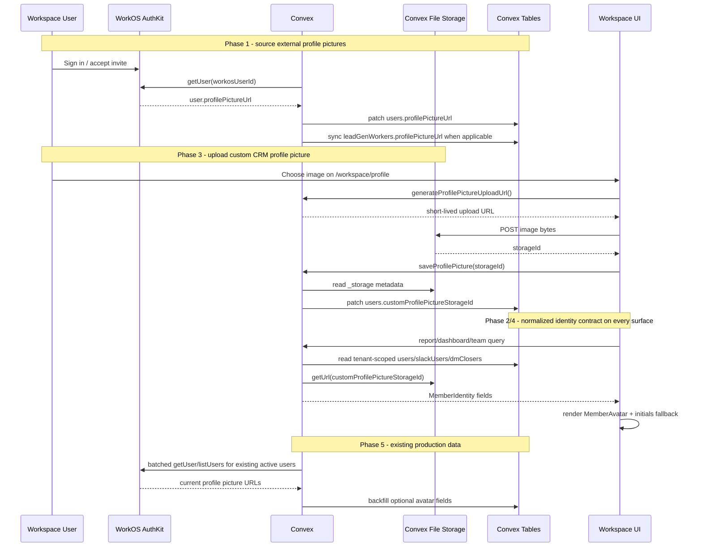

# Team Member Avatars - Design Specification

**Version:** 0.1 (MVP)  
**Status:** Draft  
**Scope:** CRM team members, lead generators, closers, Slack setters, and DM attribution people currently render inconsistently across workspace tables, reports, dashboard cards, dialogs, filters, and profile pages. This feature adds one reusable avatar identity contract, lets every authenticated CRM user role upload a custom profile picture from `/workspace/profile` into Convex storage, and makes every team-member surface show a circular profile image on the left when available with deterministic initials when it is not.  
**Prerequisite:** Existing WorkOS AuthKit integration, CRM `users` table, Slack `slackUsers.avatarUrl` enrichment, lead-gen worker sync, shadcn `components/ui/avatar.tsx`, Convex file storage upload URL support, and the overview dashboard redesign.

---

## Table of Contents

1. [Goals & Non-Goals](#1-goals--non-goals)
2. [Actors & Roles](#2-actors--roles)
3. [End-to-End Flow Overview](#3-end-to-end-flow-overview)
4. [Phase 1: Profile Data Contract](#4-phase-1-profile-data-contract)
5. [Phase 2: Shared Avatar UI](#5-phase-2-shared-avatar-ui)
6. [Phase 3: Profile Page Upload](#6-phase-3-profile-page-upload)
7. [Phase 4: Workspace Surface Rollout](#7-phase-4-workspace-surface-rollout)
8. [Phase 5: Backfill & Verification](#8-phase-5-backfill--verification)
9. [Data Model](#9-data-model)
10. [Convex Function Architecture](#10-convex-function-architecture)
11. [Routing & Authorization](#11-routing--authorization)
12. [Security Considerations](#12-security-considerations)
13. [Error Handling & Edge Cases](#13-error-handling--edge-cases)
14. [Open Questions](#14-open-questions)
15. [Dependencies](#15-dependencies)
16. [Applicable Skills](#16-applicable-skills)

---

## 1. Goals & Non-Goals

### Goals

- Add a circular avatar to every workspace surface that displays a CRM team member, closer, lead generator, Slack setter, or DM attribution person.
- Add a `/workspace/profile` custom profile picture upload flow for every authenticated CRM user role: `tenant_master`, `tenant_admin`, `closer`, and `lead_generator`.
- Store custom CRM profile pictures in Convex file storage and resolve display URLs with `ctx.storage.getUrl()` at query time.
- Prefer custom Convex profile pictures over WorkOS `profilePictureUrl` for CRM users when both are available.
- Prefer WorkOS `profilePictureUrl` for CRM users when present.
- Preserve Slack avatar behavior for Slack-only setters and qualifiers using `slackUsers.avatarUrl`.
- Fall back to deterministic initials for users without a profile picture, pending invited users, deactivated users, removed users, and DM attribution people that are not linked to CRM users.
- Centralize avatar rendering in one reusable component instead of per-table one-off `Avatar` markup.
- Keep all tenant-scoped profile data resolved from authenticated server-side Convex queries/actions, never from client-provided user identity.
- Add optional DM closer to CRM user linking so DM closer reports can use uploaded or WorkOS pictures when the DM closer is also a CRM user.
- Keep public unauthenticated surfaces privacy-safe by default.

### Non-Goals (deferred)

- Cropping, resizing, or server-side image transformation for uploaded avatars.
- Proxying/caching WorkOS or Slack remote avatar images through Convex storage or a Next.js image proxy.
- Making profile pictures required. Initials fallback is a first-class state.
- Replacing Slack profile avatars with WorkOS avatars for Slack-only users.
- Showing uploaded, WorkOS, or Slack profile pictures in public DM link portals without explicit product approval.
- Adding a profile upload page for Slack-only users or unlinked DM closer attribution records, because they do not authenticate into `/workspace/profile`.

---

## 2. Actors & Roles

| Actor | Identity | Auth Method | Key Permissions |
|---|---|---|---|
| Tenant owner | CRM `tenant_master`, member of tenant WorkOS org | WorkOS AuthKit | Can upload own custom profile picture, view all tenant team avatars, run/trigger admin-safe sync, link DM closer records to CRM users |
| Tenant admin | CRM `tenant_admin`, member of tenant WorkOS org | WorkOS AuthKit | Can upload own custom profile picture, view all tenant team avatars, manage team members, link DM closer records where current settings allow |
| Closer | CRM `closer`, member of tenant WorkOS org | WorkOS AuthKit | Can upload own custom profile picture and view own dashboard and assigned-team avatars exposed by existing closer queries |
| Lead generator | CRM `lead_generator`, member of tenant WorkOS org | WorkOS AuthKit | Can upload own custom profile picture and view own lead-gen surfaces and their own avatar |
| Slack setter | Slack workspace user represented in `slackUsers` | Slack OAuth/profile enrichment | May appear in Slack qualification reports with Slack avatar or initials fallback |
| DM attribution person | `dmClosers` row, optionally linked to `users` | Internal CRM attribution record | Appears in DM closer reports; uses linked CRM user avatar when linked, otherwise initials |

### CRM Role <-> WorkOS Role Mapping

| CRM `users.role` | WorkOS Role | Avatar Behavior |
|---|---|---|
| `tenant_master` | `owner` | Custom Convex picture if uploaded; WorkOS profile picture if available; initials otherwise |
| `tenant_admin` | `tenant-admin` | Custom Convex picture if uploaded; WorkOS profile picture if available; initials otherwise |
| `closer` | `closer` | Custom Convex picture if uploaded; WorkOS profile picture if available; initials otherwise |
| `lead_generator` | `lead-generator` | Custom Convex picture if uploaded; WorkOS profile picture if available; initials otherwise; denormalized to `leadGenWorkers` |

---

## 3. End-to-End Flow Overview



---

## 4. Phase 1: Profile Data Contract

### 4.1 Profile Picture Source Priority

CRM users can have two profile picture sources: a custom image uploaded to Convex storage from `/workspace/profile`, and the external WorkOS `profilePictureUrl`. Slack-only setters and qualifiers continue to use `slackUsers.avatarUrl`. DM attribution records use the linked CRM user's resolved avatar when `dmClosers.userId` is set; otherwise they use initials from `dmClosers.displayName`.

| Identity Type | First Choice | Second Choice | Fallback |
|---|---|---|---|
| CRM user: owner, admin, closer, lead generator | `users.customProfilePictureStorageId` resolved with `ctx.storage.getUrl()` | `users.profilePictureUrl` from WorkOS | Initials from `fullName` or `email` |
| Lead-gen worker | `leadGenWorkers.customProfilePictureStorageId` resolved with `ctx.storage.getUrl()` | `leadGenWorkers.profilePictureUrl` from WorkOS sync | Initials from `displayName` or `email` |
| Slack setter/qualifier | `slackUsers.avatarUrl` | None | Initials from Slack display/real name |
| Linked DM closer | Linked CRM user's resolved avatar | None | Initials from DM closer display name |
| Unlinked DM closer | None | None | Initials from DM closer display name |
| System/removed/historical actor | None | Stored snapshot label when available | `?` or initials from stored label |

WorkOS AuthKit's User API returns a user object from `workos.userManagement.getUser(...)` and the current API reference documents `profilePictureUrl` on the user object. The app already calls `getUser` during invitation claiming in `convex/workos/userActions.ts`, so the least risky source of truth for external CRM avatars is the WorkOS User object rather than session claims.

> **Runtime decision:** Use Convex Node actions for WorkOS profile fetches because they need `WORKOS_API_KEY`. Mutations only patch the normalized profile fields. Do not fetch WorkOS from client components or browser routes.
>
> **Storage decision:** Do not persist signed Convex file URLs in documents. Persist only `Id<"_storage">` and call `ctx.storage.getUrl()` from tenant-authorized queries so URLs are generated only for the surfaces already allowed to display the user.

### 4.2 Normalized Member Identity

Every UI surface should receive enough data to render the same identity row:

```typescript
// Path: app/workspace/_components/member-avatar.tsx
export type MemberAvatarIdentity = {
  id: string;
  name: string | null;
  email?: string | null;
  imageUrl?: string | null;
  imageSource?: "custom_storage" | "workos" | "slack" | "none";
  secondaryLabel?: string | null;
  isActive?: boolean | null;
  source: "crm_user" | "slack" | "dm_closer" | "system" | "unknown";
};
```

Convex query rows should expose an identity object when the row is not itself a user document:

```typescript
// Path: convex/dashboard/overviewTypes.ts
export type PhoneCloserOperations = {
  rows: Array<{
    closerId: Id<"users">;
    closer: MemberAvatarIdentity;
    scheduled: number;
    showRate: number | null;
    closeRate: number | null;
    cashCollectedMinor: number;
  }>;
  totals: { /* unchanged */ };
};
```

### 4.3 Sync Points

| Flow | Current State | Planned Change |
|---|---|---|
| Tenant owner onboarding | `convex/onboarding/complete.ts` creates/patches `users` from Convex identity only | After workspace access, call `workos.userActions.syncCurrentProfile` once when missing/stale |
| Invited user claim | `convex/workos/userActions.ts` already calls `workos.userManagement.getUser` | Pass `profilePictureUrl` into `claimInvitedAccountByEmail` |
| Existing active users | No avatar field exists | Add one admin/internal backfill action using WorkOS `getUser` for active non-pending users |
| Current user custom upload | `/workspace/profile` is read-only | Generate a Convex upload URL, POST the image from the browser, validate `_storage` metadata, then patch the authenticated user's custom storage ID |
| Current user custom removal | No custom avatar state exists | Clear `customProfilePictureStorageId`; delete the old storage object after patching |
| Lead generator worker profile | `syncWorkerProfileForUser` denormalizes name/email | Also denormalize `profilePictureUrl` and `customProfilePictureStorageId` |
| Role changes | User role can change into/out of lead generator | Existing sync path updates `leadGenWorkers`; include avatar fields in same patch |
| DM closer attribution | `dmClosers` has no user link | Add optional `userId`; use linked user's profile picture when present |

### 4.4 Example WorkOS Sync Action

```typescript
// Path: convex/workos/profileActions.ts
"use node";

import { WorkOS } from "@workos-inc/node";
import { v } from "convex/values";
import { internal } from "../_generated/api";
import { action } from "../_generated/server";
import { getCanonicalIdentityWorkosUserId, getRawWorkosUserId } from "../lib/workosUserId";

const workos = new WorkOS(process.env.WORKOS_API_KEY!, {
  clientId: process.env.WORKOS_CLIENT_ID!,
});

export const syncCurrentProfile = action({
  args: {},
  handler: async (ctx) => {
    const identity = await ctx.auth.getUserIdentity();
    if (!identity) throw new Error("Not authenticated");

    const workosUserId = getCanonicalIdentityWorkosUserId(identity);
    if (!workosUserId) throw new Error("Missing WorkOS user ID");

    const user = await workos.userManagement.getUser(getRawWorkosUserId(workosUserId));

    return await ctx.runMutation(internal.workos.profileMutations.patchCurrentProfile, {
      workosUserId,
      email: user.email,
      fullName: [user.firstName, user.lastName].filter(Boolean).join(" ") || undefined,
      profilePictureUrl: user.profilePictureUrl ?? undefined,
      syncedAt: Date.now(),
    });
  },
});
```

> **Security decision:** The action derives the WorkOS user ID from `ctx.auth.getUserIdentity()`. It never accepts a `userId`, `tenantId`, or `profilePictureUrl` from the browser.

---

## 5. Phase 2: Shared Avatar UI

### 5.1 Component Contract

Create a workspace-scoped component that wraps `components/ui/avatar.tsx`.

```typescript
// Path: app/workspace/_components/member-avatar.tsx
"use client";

import { Avatar, AvatarFallback, AvatarImage } from "@/components/ui/avatar";
import { cn } from "@/lib/utils";

export function MemberAvatar({
  identity,
  size = "sm",
  className,
}: {
  identity: MemberAvatarIdentity;
  size?: "sm" | "default" | "lg";
  className?: string;
}) {
  const label = identity.name ?? identity.email ?? "Unknown";
  const initials = getInitials(identity.name, identity.email);

  return (
    <Avatar size={size} className={className} aria-label={label}>
      <AvatarImage src={identity.imageUrl ?? undefined} alt="" referrerPolicy="no-referrer" />
      <AvatarFallback className={cn("font-medium uppercase")}>
        {initials}
      </AvatarFallback>
    </Avatar>
  );
}
```

### 5.2 Identity Row Component

Most tables need the same name + secondary label layout:

```typescript
// Path: app/workspace/_components/member-identity.tsx
export function MemberIdentity({
  identity,
  badge,
}: {
  identity: MemberAvatarIdentity;
  badge?: React.ReactNode;
}) {
  const name = identity.name ?? identity.email ?? "Unknown";

  return (
    <div className="flex min-w-0 items-center gap-2.5">
      <MemberAvatar identity={identity} />
      <div className="min-w-0">
        <div className="flex min-w-0 items-center gap-2">
          <span className="truncate font-medium">{name}</span>
          {badge}
        </div>
        {identity.secondaryLabel ? (
          <p className="truncate text-xs text-muted-foreground">
            {identity.secondaryLabel}
          </p>
        ) : null}
      </div>
    </div>
  );
}
```

### 5.3 Fallback Rules

| Input | Initials |
|---|---|
| `fullName = "Hector Zavala"` | `HZ` |
| `fullName = "Maryie"` | `MA` or `M` depending final helper choice; recommendation: first two letters for one token |
| No name, `email = "sharon@example.com"` | `SH` |
| Deleted/removed unknown user | `?` |

> **UI decision:** Avatars are decorative only when the adjacent visible name is present, but they should still have an accessible label in icon-only contexts like compact headers. Do not add visible helper text explaining avatars.

---

## 6. Phase 3: Profile Page Upload

### 6.1 Upload Flow

`/workspace/profile` becomes the authenticated self-service entry point for custom CRM profile pictures. Every logged-in CRM role can upload, replace, or remove their own picture. Admins cannot upload on behalf of another user in the MVP because the avatar is personal identity data and the existing profile route is scoped to the current session.

The flow follows the Convex file-storage upload URL pattern:

1. The client calls a tenant-authenticated mutation to generate a short-lived upload URL.
2. The browser posts the selected image bytes directly to the upload URL with the file's `Content-Type`.
3. Convex storage returns a `storageId`.
4. The client calls a second tenant-authenticated mutation with the `storageId`.
5. The mutation reads `_storage` metadata with `ctx.db.system.get("_storage", storageId)`, validates that it is an allowed image type and size, patches the current `users` row, updates any matching `leadGenWorkers` row, and deletes the previous custom file if one existed.

```typescript
// Path: convex/users/profilePictures.ts
import { v } from "convex/values";
import { mutation } from "../_generated/server";
import { requireTenantUser } from "../requireTenantUser";

const allowedProfilePictureTypes = new Set([
  "image/jpeg",
  "image/png",
  "image/webp",
  "image/gif",
]);
const maxProfilePictureBytes = 2 * 1024 * 1024;

export const generateProfilePictureUploadUrl = mutation({
  args: {},
  handler: async (ctx) => {
    await requireTenantUser(ctx, [
      "tenant_master",
      "tenant_admin",
      "closer",
      "lead_generator",
    ]);
    return await ctx.storage.generateUploadUrl();
  },
});

export const saveProfilePicture = mutation({
  args: { storageId: v.id("_storage") },
  handler: async (ctx, { storageId }) => {
    const { userId, tenantId } = await requireTenantUser(ctx, [
      "tenant_master",
      "tenant_admin",
      "closer",
      "lead_generator",
    ]);
    const metadata = await ctx.db.system.get("_storage", storageId);
    if (!metadata) throw new Error("Uploaded file was not found.");
    if (!metadata.contentType || !allowedProfilePictureTypes.has(metadata.contentType)) {
      throw new Error("Profile picture must be a JPEG, PNG, WebP, or GIF image.");
    }
    if (metadata.size > maxProfilePictureBytes) {
      throw new Error("Profile picture must be 2 MB or smaller.");
    }

    const user = await ctx.db.get(userId);
    if (!user || user.tenantId !== tenantId) throw new Error("User not found.");

    const previousStorageId = user.customProfilePictureStorageId;
    const now = Date.now();
    await ctx.db.patch(userId, {
      customProfilePictureStorageId: storageId,
      customProfilePictureUploadedAt: now,
    });

    const worker = await ctx.db
      .query("leadGenWorkers")
      .withIndex("by_tenantId_and_userId", (q) =>
        q.eq("tenantId", tenantId).eq("userId", userId),
      )
      .unique();
    if (worker) {
      await ctx.db.patch(worker._id, {
        customProfilePictureStorageId: storageId,
        updatedAt: now,
      });
    }

    if (previousStorageId && previousStorageId !== storageId) {
      await ctx.storage.delete(previousStorageId);
    }
  },
});

export const removeProfilePicture = mutation({
  args: {},
  handler: async (ctx) => {
    const { userId, tenantId } = await requireTenantUser(ctx, [
      "tenant_master",
      "tenant_admin",
      "closer",
      "lead_generator",
    ]);
    const user = await ctx.db.get(userId);
    if (!user || user.tenantId !== tenantId) throw new Error("User not found.");

    const previousStorageId = user.customProfilePictureStorageId;
    await ctx.db.patch(userId, {
      customProfilePictureStorageId: undefined,
      customProfilePictureUploadedAt: undefined,
    });

    const worker = await ctx.db
      .query("leadGenWorkers")
      .withIndex("by_tenantId_and_userId", (q) =>
        q.eq("tenantId", tenantId).eq("userId", userId),
      )
      .unique();
    if (worker) {
      await ctx.db.patch(worker._id, {
        customProfilePictureStorageId: undefined,
        updatedAt: Date.now(),
      });
    }

    if (previousStorageId) {
      await ctx.storage.delete(previousStorageId);
    }
  },
});
```

> **Security decision:** The browser is allowed to receive an upload URL only after `requireTenantUser(...)` succeeds, but the returned `storageId` is still validated server-side before it is attached to a user. The save mutation derives `userId` and `tenantId` from auth and never accepts a target user from the client.

### 6.2 Profile Page UI

`app/workspace/profile/_components/profile-page-client.tsx` should render a `MemberAvatar` in the account card header, then provide upload/replace/remove controls in the same card. The file input is wired manually because browser file inputs should not be controlled. Client-side validation mirrors the server limits to fail fast, but server metadata validation remains authoritative.

```typescript
// Path: app/workspace/profile/_components/profile-page-client.tsx
"use client";

import { useRef, useState } from "react";
import { Trash2Icon, UploadIcon } from "lucide-react";
import { useMutation, useQuery } from "convex/react";
import { api } from "@/convex/_generated/api";
import type { Id } from "@/convex/_generated/dataModel";
import { Button } from "@/components/ui/button";
import { MemberAvatar } from "@/app/workspace/_components/member-avatar";

export function ProfilePictureControl() {
  const user = useQuery(api.users.queries.getCurrentUser);
  const generateUploadUrl = useMutation(
    api.users.profilePictures.generateProfilePictureUploadUrl,
  );
  const saveProfilePicture = useMutation(
    api.users.profilePictures.saveProfilePicture,
  );
  const removeProfilePicture = useMutation(
    api.users.profilePictures.removeProfilePicture,
  );
  const inputRef = useRef<HTMLInputElement>(null);
  const [isUploading, setIsUploading] = useState(false);

  if (!user) return null;

  async function uploadProfilePicture(file: File) {
    setIsUploading(true);
    try {
      const uploadUrl = await generateUploadUrl();
      const response = await fetch(uploadUrl, {
        method: "POST",
        headers: { "Content-Type": file.type },
        body: file,
      });
      if (!response.ok) throw new Error("Failed to upload profile picture.");
      const { storageId } = (await response.json()) as { storageId?: string };
      if (!storageId) throw new Error("Upload did not return a storage ID.");
      await saveProfilePicture({ storageId: storageId as Id<"_storage"> });
    } finally {
      setIsUploading(false);
      if (inputRef.current) inputRef.current.value = "";
    }
  }

  return (
    <div className="flex items-center gap-3">
      <MemberAvatar identity={user.avatar} size="lg" />
      <input
        ref={inputRef}
        type="file"
        accept="image/jpeg,image/png,image/webp,image/gif"
        className="sr-only"
        onChange={(event) => {
          const file = event.target.files?.[0];
          if (file) void uploadProfilePicture(file);
        }}
      />
      <Button
        type="button"
        variant="outline"
        size="sm"
        disabled={isUploading}
        onClick={() => inputRef.current?.click()}
      >
        <UploadIcon />
        {user?.avatar?.imageUrl ? "Replace" : "Upload"}
      </Button>
      <Button
        type="button"
        variant="ghost"
        size="icon"
        disabled={isUploading || user.avatar.imageSource !== "custom_storage"}
        onClick={() => void removeProfilePicture()}
      >
        <Trash2Icon />
        <span className="sr-only">Remove profile picture</span>
      </Button>
    </div>
  );
}
```

> **Form decision:** Keep the control compact and action-oriented. The profile page is a settings surface, not a landing page; the uploaded avatar should be visible directly beside the user's name/email and the upload actions should be secondary controls.

### 6.3 Serving Uploaded Avatars

Queries that expose CRM identities should resolve custom storage IDs into signed URLs when the current request is already authorized for that identity. The helper returns the custom signed URL when present, falls back to WorkOS, and never exposes raw storage IDs to client components unless a specific upload management UI needs them.

```typescript
// Path: convex/lib/memberIdentity.ts
import type { Doc } from "../_generated/dataModel";
import type { QueryCtx } from "../_generated/server";

export async function userMemberIdentity(
  ctx: QueryCtx,
  user: Doc<"users"> | null | undefined,
) {
  if (!user) {
    return {
      id: "removed",
      name: "Removed user",
      email: null,
      imageUrl: null,
      imageSource: "none" as const,
      isActive: false,
      source: "crm_user" as const,
    };
  }

  const customUrl = user.customProfilePictureStorageId
    ? await ctx.storage.getUrl(user.customProfilePictureStorageId)
    : null;

  return {
    id: user._id,
    name: user.fullName ?? user.email,
    email: user.email,
    imageUrl: customUrl ?? user.profilePictureUrl ?? null,
    imageSource: customUrl ? "custom_storage" : user.profilePictureUrl ? "workos" : "none",
    isActive: user.isActive,
    source: "crm_user" as const,
  };
}
```

> **Privacy decision:** Public DM portal queries must not call this helper for linked CRM users in a way that returns custom signed URLs or WorkOS URLs. Public payloads stay initials-only unless a later product decision explicitly changes public identity exposure.

---

## 7. Phase 4: Workspace Surface Rollout

### 7.1 Avatar Placement Rule

On every authenticated workspace surface that displays a team member, closer, lead generator, Slack qualifier/setter, DM closer, actor, reviewer, author, converter, or assigned person, render the circular avatar immediately to the left of the visible name. Use `MemberIdentity` for name-plus-secondary-label rows and `MemberAvatar` only when the surrounding layout already renders the name separately.

Select/filter menus are included where row height remains stable. Exports remain text-only. Public DM link portals are initials-only.

### 7.2 Initial Inventory

| Surface | Files | Data Source | Avatar Plan |
|---|---|---|---|
| Workspace sidebar current user | `app/workspace/_components/workspace-auth.tsx`, `workspace-shell-client.tsx`, legacy `workspace-shell.tsx` | `getWorkspaceAccess().crmUser` | Pass resolved avatar identity; render `MemberIdentity` in sidebar header |
| Profile page | `app/workspace/profile/_components/profile-page-client.tsx`, `app/workspace/profile/loading.tsx`, `convex/users/queries.ts`, `convex/users/profilePictures.ts` | `users.queries.getCurrentUser`, Convex storage | Render current user's avatar in account card; add upload/replace/remove controls for all CRM roles |
| Team management | `app/workspace/team/_components/team-members-table.tsx` | `users.queries.listTeamMembers` | Render name cell with `MemberIdentity`; include inactive badge |
| Team action dialogs | `remove-user-dialog.tsx`, `role-edit-dialog.tsx`, `calendly-link-dialog.tsx`, `event-type-assignment-dialog.tsx`, `mark-unavailable-dialog.tsx` | Selected user from team page state | Use compact identity row in user-specific destructive or role-changing dialogs |
| Recent reassignments | `app/workspace/team/_components/recent-reassignments.tsx`, `convex/unavailability/queries.ts` | reassignment from/to/reassignedBy user IDs | Return avatar identity for from, to, and by |
| Team redistribution wizard | `app/workspace/team/redistribute/[unavailabilityId]/_components/redistribute-wizard-page-client.tsx`, `convex/unavailability/queries.ts`, `convex/unavailability/shared.ts` | unavailable closer, available closers, manual resolve closer options | Return identity for unavailable and available closers; render avatar-left candidate rows and stable select options |
| Overview lead generators | `app/workspace/_components/lead-gen-overview-card.tsx`, `convex/dashboard/overviewLeadGen.ts` | `leadGenWorkers` | Add worker identity and render compact avatar row |
| Overview top DM closers | `app/workspace/_components/top-dm-closers-card.tsx`, `convex/dashboard/overviewOperations.ts` | `dmClosers`, optional linked `users` | Use linked user avatar if `dmClosers.userId`; initials otherwise |
| Overview phone closer operations | `app/workspace/_components/phone-closer-operations-table.tsx`, `convex/dashboard/overviewOperations.ts` | `users` | Add closer identity to row |
| Slack overview/report cards | `top-qualifiers-card.tsx`, `slack-user-leaderboard-card.tsx`, `setter-contribution-table.tsx` | `slackUsers.avatarUrl` | Replace repeated raw `Avatar` markup with `MemberIdentity` using `source: "slack"` |
| Team Performance report | `app/workspace/reports/team/_components/*`, `convex/reporting/teamPerformance.ts`, `teamOutcomes.ts`, `teamActions.ts` | `users` | Add avatar fields to closer rows and top closer actor rows |
| Leads & Conversions report | `conversion-by-closer-table.tsx`, `convex/reporting/leadConversion.ts` | `users` | Add avatar fields to `byCloser` rows |
| Revenue report | `closer-revenue-table.tsx`, `top-deals-table.tsx`, `convex/reporting/revenue.ts` | `users` | Add avatar fields to `commissionable.byCloser` and top deal attributed closer rows |
| Reminder report | `per-closer-reminder-conversion-table.tsx`, `convex/reporting/remindersReporting.ts` | `users` | Add avatar fields to `perCloser` rows |
| Activity Feed report | `activity-event-row.tsx`, `activity-feed-filters.tsx`, `activity-summary-cards.tsx`, `convex/reporting/activityFeed.ts` | `domainEvents.actorUserId` to `users`; system actor fallback | Return actor identity for events, filters, and most-active summary; preserve `System` as non-user identity |
| Pipeline Health report | `stale-pipeline-list.tsx`, `loss-attribution-chart.tsx`, `convex/reporting/pipelineHealth.ts` | assigned closer and loss actor user IDs | Add assigned closer identity to stale opportunities and actor identity to loss attribution rows |
| Operations tables | `scheduling-table.tsx`, `phone-sales-table.tsx`, `qualification-table.tsx`, Convex operations modules | `slackUsers`, `users`, `dmClosers` | Render Slack qualifier, phone closer, and DM closer names with avatars where row has identity data |
| Lead Gen Ops | `lead-gen-settings-page-client.tsx`, `worker-performance-table.tsx`, `lead-gen-filter-bar.tsx`, `raw-submissions-table.tsx` | `leadGenWorkers` | Use worker avatar in tables and select items where layout is stable |
| Lead Gen exports/raw reports | `lead-gen-export-menu.tsx`, `lead-gen-excel-report.ts`, `convex/leadGen/exports.ts`, `convex/leadGen/reportBuilders.ts` | `leadGenWorkers` | UI raw rows can use worker identity; spreadsheets and exported files remain text-only |
| Customers | `customers-table.tsx`, `customer-detail-page-client.tsx`, `payment-history-table.tsx`, `convex/customers/queries.ts` | converter, assigned closer, attributed closer, recorded-by users | Return identity objects for converter, assigned closer, attributed closer, and recorded-by where displayed |
| Legacy Leads routes | `leads-table.tsx`, `lead-overview-tab.tsx`, `lead-opportunities-tab.tsx`, `lead-meetings-tab.tsx`, `lead-activity-tab.tsx`, `convex/leads/queries.ts` | assigned closer, Slack qualifier, opportunity/meeting closer, merge actor | Add closer, Slack, and merge actor identities to lead list/detail payloads |
| Leads and Customers unified view | `entity-opportunity-row.tsx`, `entity-attribution-grid.tsx`, `opportunity-sheet-summary.tsx`, `opportunity-sheet-body.tsx`, `convex/leadCustomers/detailPayload.ts`, `convex/lib/attribution/detailPayload.ts` | compact closer payloads, Slack qualifier, DM closer, phone closer | Promote label-only attribution payloads to identity objects; keep public context privacy rules separate |
| Pipeline/opportunity tables and detail | `pipeline/opportunities-table.tsx`, `opportunities-table.tsx`, `opportunity-detail-client.tsx`, `opportunity-activity-timeline.tsx`, `convex/opportunities/queries.ts`, `convex/opportunities/detailQuery.ts` | assigned closer, Slack qualifier, actor user IDs | Add assigned closer and qualifier identity; render activity actor identity where the timeline already exposes an actor |
| Closer/opportunity selector controls | `closer-select.tsx`, `opportunity-filters.tsx`, `pipeline-filters.tsx`, `operations-filter-bar.tsx`, `lead-gen-filter-bar.tsx` | active closers, operation filter options, lead-gen workers | Add identity to options only where stable menu row height is preserved |
| Billing detail surfaces | `billing-payment-summary.tsx`, `billing-event-history.tsx`, `slack-contributor-timeline.tsx`, `convex/billing/enrichment.ts`, `convex/billing/types.ts`, `convex/billing/export.ts` | entered-by, phone closer, reviewer, audit actor, DM closer, Slack contributor | Add identity payloads for UI detail/history/timeline; keep exports text-only |
| Closer detail surfaces | closer dashboard header, meeting info/overview cards, payment recorded-by labels | current user and assigned closer users | Add current-user avatar in header; assigned closer/avatar where admin views another closer |
| Meeting comments | `app/workspace/closer/meetings/_components/comment-entry.tsx`, `convex/closer/meetingComments.ts` | comment author user IDs | Return author identity and replace manual initials circle with shared avatar component |
| Admin reminder detail | `admin-reminder-detail-page-client.tsx`, `admin-reminder-outcome-action-bar.tsx`, `convex/pipeline/reminderDetail.ts` | assigned closer user ID | Return assigned closer identity directly instead of broad roster lookup for display metadata |
| Settings attribution and portal admin | `attribution-tab.tsx`, `dm-closer-dialog.tsx`, `portal-usage-card.tsx`, `report-attribution-filters.tsx`, `convex/attribution/dmClosers.ts`, `convex/linkPortal/copyQueries.ts` | DM closers and optional linked CRM users | Add linked-user identity in authenticated settings/report surfaces; add CRM user select/clear in DM closer dialog |
| Public DM link portal | `app/dm-links/[portalSlug]/_components/dm-link-portal-client.tsx`, `convex/linkPortal/portalQueries.ts` | public DM closer rows | Initials-only circles beside DM closer names; do not expose WorkOS, Slack, or Convex storage image URLs |

### 7.3 Query Enrichment Pattern

Avoid repeated ad hoc shaping by adding a small helper:

```typescript
// Path: convex/lib/memberIdentity.ts
import type { Doc } from "../_generated/dataModel";
import type { QueryCtx } from "../_generated/server";

export async function userMemberIdentity(ctx: QueryCtx, user: Doc<"users"> | null) {
  // CRM users: custom Convex storage image, then WorkOS image, then initials.
}

export function slackMemberIdentity(slackUser: Doc<"slackUsers"> | null, fallbackId?: string) {
  // Slack-only qualifiers/setters: Slack avatarUrl, then initials.
}

export async function dmCloserMemberIdentity(
  ctx: QueryCtx,
  dmCloser: Doc<"dmClosers">,
  linkedUser: Doc<"users"> | null,
) {
  // Linked DM closers reuse CRM identity. Unlinked DM closers use initials.
}

export function unknownMemberIdentity(label: string, source: "system" | "unknown") {
  // Removed users, system actors, and historical rows.
}
```

> **Architecture decision:** Enrich rows in Convex query results instead of making client components call extra user queries. This keeps tenancy checks in one place and prevents read waterfalls in large tables.

### 7.4 DM Closer Linking

`dmClosers` are attribution records today, not guaranteed CRM users. Add optional linking to support WorkOS avatars where possible:

```typescript
// Path: convex/attribution/dmClosers.ts
export const updateDmCloser = mutation({
  args: {
    dmCloserId: v.id("dmClosers"),
    displayName: v.string(),
    utmMedium: v.string(),
    userId: v.optional(v.id("users")),
  },
  handler: async (ctx, args) => {
    const { tenantId } = await requireTenantUser(ctx, ["tenant_master", "tenant_admin"]);
    const linkedUser = args.userId ? await ctx.db.get(args.userId) : null;
    if (linkedUser && linkedUser.tenantId !== tenantId) {
      throw new Error("Linked user not found");
    }
    // patch existing dmCloser...
  },
});
```

If `userId` is unset, report rows still get a circular initials avatar using the DM closer display name.

---

## 8. Phase 5: Backfill & Verification

### 8.1 Migration Strategy

The schema changes are optional fields, so this is a safe widened deploy with no required narrow step:

1. Deploy optional fields and dual-read UI fallbacks.
2. Update all writes/sync paths to write WorkOS `profilePictureUrl` and custom Convex storage IDs.
3. Add `/workspace/profile` upload/replace/remove actions with server-side `_storage` metadata validation.
4. Run a dry-run backfill for existing active users' WorkOS `profilePictureUrl`.
5. Run the backfill in production.
6. Verify avatar coverage, custom upload behavior, old-file cleanup, and all fallback states.
7. Keep fields optional permanently because WorkOS users may legitimately have no profile picture and many historical identities are not authenticated CRM users.

No migration is needed for custom profile pictures because those fields are populated only by future user uploads. If an uploaded file is replaced or removed, delete the previous `Id<"_storage">` with `ctx.storage.delete(...)` after the user row has been patched so old files do not accumulate.

### 8.2 Backfill Shape

Use a batched internal action for active, non-pending WorkOS users. The production tenant is small, but the code should still batch to avoid WorkOS rate-limit surprises.

```typescript
// Path: convex/workos/profileBackfill.ts
"use node";

export const backfillUserProfilePictures = internalAction({
  args: {
    tenantId: v.id("tenants"),
    cursor: v.optional(v.string()),
    dryRun: v.boolean(),
  },
  handler: async (ctx, args) => {
    // Read a bounded page of users, skip pending:* workosUserId rows,
    // call WorkOS getUser for each, patch profilePictureUrl via internal mutation,
    // then schedule next page with ctx.scheduler.runAfter(0, ...).
  },
});
```

### 8.3 Verification

| Check | Command / Method | Expected |
|---|---|---|
| Typecheck | `npm run typecheck` or repo equivalent | No TypeScript errors from widened row types |
| Lint | `npm run lint` if available | No new lint errors |
| Convex codegen | `npx convex codegen` | Generated types include new optional fields |
| Data verification | `npx convex data users` | Active users have `profilePictureUrl` where WorkOS returns one; custom fields remain unset until upload |
| Storage metadata | Upload test image, inspect `_storage` metadata in Convex dashboard or query | `contentType` is allowed and `size` is within the server limit |
| Manual upload UI | `/workspace/profile` as owner, admin, closer, and lead generator | Upload, replace, remove, and fallback states work for each CRM role |
| Manual surface UI | `/workspace`, `/workspace/team`, `/workspace/reports/team`, `/workspace/reports/activity`, `/workspace/reports/pipeline`, `/workspace/reports/slack-qualifications`, `/workspace/lead-gen`, `/workspace/operations`, `/workspace/customers`, `/workspace/leads`, `/workspace/leads-customers`, `/workspace/billing`, `/workspace/settings` | Circular avatars appear to the left of team-member names without layout shifts; initials fallback works |
| Public portal privacy | `/dm-links/[portalSlug]` | DM closer choices show initials-only circles and no WorkOS, Slack, or Convex storage image URLs |
| Dark mode | Toggle theme | Avatar border/fallback remains readable |
| Broken image | Temporarily use invalid URL in dev | Component falls back to initials |

---

## 9. Data Model

### 9.1 Modified: `users`

```typescript
// Path: convex/schema.ts
users: defineTable({
  // ... existing fields ...
  customProfilePictureStorageId: v.optional(v.id("_storage")),
  customProfilePictureUploadedAt: v.optional(v.number()),
  profilePictureUrl: v.optional(v.string()),
  profilePictureSyncedAt: v.optional(v.number()),
})
  .index("by_tenantId", ["tenantId"])
  .index("by_workosUserId", ["workosUserId"])
  .index("by_tenantId_and_email", ["tenantId", "email"])
  .index("by_tenantId_and_isActive", ["tenantId", "isActive"]),
```

No index is needed for `customProfilePictureStorageId` or `profilePictureUrl`; they are display metadata.

### 9.2 Modified: `leadGenWorkers`

```typescript
// Path: convex/schema.ts
leadGenWorkers: defineTable({
  // ... existing fields ...
  customProfilePictureStorageId: v.optional(v.id("_storage")),
  profilePictureUrl: v.optional(v.string()),
})
  .index("by_tenantId", ["tenantId"])
  .index("by_tenantId_and_userId", ["tenantId", "userId"])
  .index("by_tenantId_and_workosUserId", ["tenantId", "workosUserId"])
  .index("by_tenantId_and_isActive", ["tenantId", "isActive"])
  .index("by_tenantId_and_teamId", ["tenantId", "teamId"]),
```

### 9.3 Modified: `dmClosers`

```typescript
// Path: convex/schema.ts
dmClosers: defineTable({
  // ... existing fields ...
  userId: v.optional(v.id("users")),
})
  .index("by_tenantId_and_teamId", ["tenantId", "teamId"])
  .index("by_tenantId_and_slug", ["tenantId", "slug"])
  .index("by_tenantId_and_normalizedUtmMedium", ["tenantId", "normalizedUtmMedium"])
  .index("by_tenantId_and_userId", ["tenantId", "userId"]),
```

> **Migration decision:** Keep all new fields optional. WorkOS profile pictures are not guaranteed, custom uploads are user-driven future data, and not every DM attribution person should require a CRM login.

---

## 10. Convex Function Architecture

```text
convex/
  schema.ts                                      # MODIFIED - optional avatar storage/external/link fields
  lib/
    memberIdentity.ts                            # NEW - normalize users/slack/dm closer identity payloads
  workos/
    userActions.ts                               # MODIFIED - include profilePictureUrl during invite claim
    userMutations.ts                             # MODIFIED - patch users.profilePictureUrl
    profileActions.ts                            # NEW - authenticated profile sync from WorkOS
    profileMutations.ts                          # NEW - internal user profile patches
    profileBackfill.ts                           # NEW - batched internal backfill
  users/
    queries.ts                                   # MODIFIED - getCurrentUser/listTeamMembers/listActiveClosers return avatar identities
    profilePictures.ts                           # NEW - generate upload URL, save/remove current user's custom picture
  leadGen/
    exports.ts                                   # MODIFIED - keep exports text-only while UI rows use identities
    reporting.ts                                 # MODIFIED - worker identity fields for UI reports
    workers.ts                                   # MODIFIED - sync leadGenWorkers profile picture fields
    reportBuilders.ts                            # MODIFIED - include worker avatar fields in report rows
  dashboard/
    overviewTypes.ts                             # MODIFIED - avatar fields in overview rows
    overviewLeadGen.ts                           # MODIFIED - worker avatar fields
    overviewOperations.ts                        # MODIFIED - phone closer and DM closer avatar fields
  reporting/
    lib/helpers.ts                               # MODIFIED - user display helper can expose avatar identity
    activityFeed.ts                              # MODIFIED - actor identity rows and filters
    pipelineHealth.ts                            # MODIFIED - stale closer and loss actor identities
    teamPerformance.ts                           # MODIFIED - closer avatar fields
    teamOutcomes.ts                              # MODIFIED - closer outcome identity payloads
    teamActions.ts                               # MODIFIED - action actor identity payloads
    leadConversion.ts                            # MODIFIED - closer avatar fields
    revenue.ts                                   # MODIFIED - closer avatar fields
    remindersReporting.ts                        # MODIFIED - closer avatar fields
  operations/
    scheduling.ts                                # MODIFIED - qualifier/closer/dm avatar fields
    phoneSales.ts                                # MODIFIED - qualifier/closer/dm avatar fields
    qualifications.ts                            # MODIFIED - qualifier/closer/dm avatar fields
  unavailability/
    queries.ts                                   # MODIFIED - reassignment avatar fields
    shared.ts                                    # MODIFIED - redistribution closer identity rows
  attribution/
    dmClosers.ts                                 # MODIFIED - optional linked CRM user and identity payloads
  customers/
    queries.ts                                   # MODIFIED - converter/closer/payment actor avatar fields
  leads/
    queries.ts                                   # MODIFIED - legacy lead closer/Slack/merge actor avatar fields
  leadCustomers/
    detailPayload.ts                             # MODIFIED - unified view identity payloads
  opportunities/
    queries.ts                                   # MODIFIED - list closer/qualifier avatar fields
    detailQuery.ts                               # MODIFIED - detail closer/qualifier/activity avatar fields
  pipeline/
    reminderDetail.ts                            # MODIFIED - admin reminder assigned closer identity
  billing/
    enrichment.ts                                # MODIFIED - payment/review/audit/Slack contributor identity payloads
    types.ts                                     # MODIFIED - detail payload identity types
  linkPortal/
    copyQueries.ts                               # MODIFIED - authenticated copy activity DM closer identity
    portalQueries.ts                             # MODIFIED - public initials-only identity payload
  closer/
    meetingComments.ts                           # MODIFIED - author identity payloads
```

---

## 11. Routing & Authorization

No new routes are required. The existing `/workspace/profile` route becomes writable for the current user's custom avatar.

```text
app/workspace/
  _components/
    member-avatar.tsx                            # NEW
    member-identity.tsx                          # NEW
    workspace-auth.tsx                           # MODIFIED - passes avatar identity into shell
    workspace-shell-client.tsx                   # MODIFIED - sidebar current user avatar
    lead-gen-overview-card.tsx                   # MODIFIED
    top-dm-closers-card.tsx                      # MODIFIED
    phone-closer-operations-table.tsx            # MODIFIED
  profile/
    _components/profile-page-client.tsx          # MODIFIED - current-user avatar upload controls
    loading.tsx                                  # MODIFIED - matching avatar/upload skeleton dimensions
  team/_components/
    team-members-table.tsx                       # MODIFIED
    recent-reassignments.tsx                     # MODIFIED
    *-dialog.tsx                                 # MODIFIED targeted user identity rows
  team/redistribute/[unavailabilityId]/
    _components/redistribute-wizard-page-client.tsx # MODIFIED closer identity rows
  reports/**/_components/*.tsx                   # MODIFIED targeted tables
  lead-gen/_components/*.tsx                     # MODIFIED worker rows/selects
  operations/_components/*.tsx                   # MODIFIED targeted tables
  customers/**/_components/*.tsx                 # MODIFIED converter/closer/payment identity rows
  leads/**/_components/*.tsx                     # MODIFIED closer/Slack/actor identity rows
  leads-customers/[leadId]/_components/*.tsx     # MODIFIED unified attribution identity rows
  opportunities/**/_components/*.tsx             # MODIFIED closer/qualifier identity rows
  billing/_components/*.tsx                      # MODIFIED payment/review/audit identity rows
  settings/_components/*.tsx                     # MODIFIED DM closer linking and identity rows
app/dm-links/[portalSlug]/
  _components/dm-link-portal-client.tsx          # MODIFIED initials-only DM closer circles
```

Authorization stays in existing server/Convex gates:

- Workspace RSCs keep using `requireWorkspaceUser()` and `requireRole(...)`.
- Convex queries keep using `requireTenantUser(...)`.
- Profile sync actions derive identity from `ctx.auth.getUserIdentity()`.
- Profile picture upload mutations use `requireTenantUser(...)`, derive the current `userId`, and do not accept target user identity from client arguments.
- DM closer `userId` links are validated server-side against the caller's `tenantId`.

---

## 12. Security Considerations

### Credential Security

`WORKOS_API_KEY` remains only in Convex Node actions or existing server callback code. WorkOS and Slack avatar URLs are public image URLs returned by those services; they are display metadata, not credentials. Convex storage IDs are not treated as user-facing URLs; signed display URLs are generated with `ctx.storage.getUrl()` only inside authorized queries.

### Upload Security

Profile upload URL generation requires an authenticated tenant user. The save mutation validates `_storage` metadata with `ctx.db.system.get("_storage", storageId)` and rejects files whose `contentType` is not `image/jpeg`, `image/png`, `image/webp`, or `image/gif`, or whose size exceeds the configured limit. Do not use the deprecated `ctx.storage.getMetadata()` path.

The upload mutation must derive the target user from auth and must never accept `userId`, `tenantId`, `role`, `profilePictureUrl`, or `customProfilePictureStorageId` as trusted identity input from the browser.

### Multi-Tenant Isolation

All user/avatar query enrichment must load only users whose `tenantId` matches the authenticated tenant. `dmClosers.userId` must be rejected if it points outside the tenant. Public link portal payloads must not include linked CRM custom storage URLs, WorkOS URLs, Slack URLs, or emails.

### Role-Based Data Access

| Resource | Tenant Owner/Admin | Closer | Lead Generator | Public DM Portal |
|---|---|---|---|---|
| Own avatar | Full | Full | Full | None |
| Other CRM user avatars | Full tenant view | Only through already-authorized closer surfaces | Only through already-authorized lead-gen surfaces | None by default |
| Slack setter avatars | Full tenant report view | Existing authorized views only | Existing authorized views only | None |
| DM closer initials | Full | Existing authorized views only | Existing authorized views only | Allowed if currently showing DM closer names |
| DM closer linked CRM picture | Full | Existing authorized views only | Existing authorized views only | None by default |

### Webhook Security

No webhook changes are required. Slack `user_change` handling already updates `slackUsers.avatarUrl`; this plan only standardizes rendering and row shapes.

### Rate Limit Awareness

WorkOS backfill must be batched and resumable. Do not call WorkOS `getUser` inside ordinary read queries. Use stored `profilePictureUrl` after sync.

---

## 13. Error Handling & Edge Cases

### Custom Profile Picture Missing

Detection: `customProfilePictureStorageId` is unset or `ctx.storage.getUrl(...)` returns `null`.  
Recovery: fall back to WorkOS `profilePictureUrl`; if that is absent, render initials.  
User-facing behavior: no warning unless the user is actively editing their profile picture.

### Upload URL Expired

Detection: browser POST to generated upload URL returns a non-2xx response.  
Recovery: show a profile-page error toast/message and allow the user to retry, which generates a new upload URL.  
User-facing behavior: the old avatar remains visible.

### Invalid Uploaded File Type Or Size

Detection: client precheck fails or server `_storage` metadata validation rejects the file.  
Recovery: keep the previous avatar and return a field-level/profile-page error.  
User-facing behavior: explain the allowed image types and max size.

### Orphaned Uploaded File

Detection: browser uploads bytes but `saveProfilePicture` fails before the storage ID is attached to a user.  
Recovery: accept rare orphan risk for MVP, then optionally add an admin cleanup migration for aged unattached profile-upload files if storage growth is observed. Any cleanup must verify references from `users`, `leadGenWorkers`, and existing payment proof fields before deleting `_storage` objects.  
User-facing behavior: retry upload; the old avatar remains active.

### Missing WorkOS Profile Picture

Detection: `profilePictureUrl` is `undefined`, `null`, or empty.  
Recovery: render initials.  
User-facing behavior: no warning or blank image.

### Broken Remote Image

Detection: Radix Avatar image load failure.  
Recovery: `AvatarFallback` renders initials.  
User-facing behavior: stable circular initials.

### Pending Invited User

Detection: `users.workosUserId` starts with `pending:` or `invitationStatus === "pending"`.  
Recovery: no WorkOS fetch; render initials from invited name/email.  
User-facing behavior: pending user still has a circle.

### Removed / Historical User

Detection: referenced `userId` no longer resolves or inactive user appears in history.  
Recovery: return `"Removed user"` or stored name when available, initials fallback.  
User-facing behavior: historical reports remain readable.

### DM Closer Without CRM Link

Detection: `dmClosers.userId` is unset.  
Recovery: render initials from `dmClosers.displayName`.  
User-facing behavior: reports still show circles without requiring WorkOS accounts.

### Public Portal Privacy

Detection: route is `app/dm-links/[portalSlug]`.  
Recovery: do not expose WorkOS image URL, Slack image URL, Convex storage signed URL, or CRM email unless product explicitly approves.  
User-facing behavior: public portal may show initials-only DM closer identity.

---

## 14. Open Questions

| # | Question | Current Thinking |
|---|---|---|
| 1 | Should DM closer records be required to link to CRM users? | No. Make `dmClosers.userId` optional so legacy attribution and non-login DM closers keep working. |
| 2 | Should public DM link portals show uploaded, WorkOS, or Slack profile pictures? | No for MVP. Public pages should use initials unless product explicitly wants public identity images. |
| 3 | How frequently should WorkOS profile pictures refresh? | Sync on invite claim, run a one-time backfill, then refresh the current user's profile when missing or older than 7 days. |
| 4 | Should selects/dropdowns show avatars? | Yes where the row height stays stable. Table cells and cards are required first; compact select menus are second pass. |
| 5 | Should Slack setters ever prefer CRM WorkOS avatars? | Only if a reliable Slack-to-CRM mapping exists later. Current source remains Slack profile. |
| 6 | Should uploaded images be cropped or resized before storage? | No for MVP. Enforce content type and size, then display with object-cover in the circular avatar. |

---

## 15. Dependencies

### New Packages

| Package | Why | Runtime | Install Command |
|---|---|---|---|
| None | Existing WorkOS SDK and shadcn Avatar are enough | N/A | N/A |

### Already-Installed Packages

| Package | Used For |
|---|---|
| `@workos-inc/node` | Fetch WorkOS User profile data from Convex Node actions |
| `@workos-inc/authkit-nextjs` | Existing AuthKit session/callback integration |
| Convex file storage | Generate upload URLs, store uploaded profile images, read `_storage` metadata, and serve signed image URLs |
| `radix-ui` avatar primitive via `components/ui/avatar.tsx` | Circular image + fallback rendering |
| `lucide-react` | Upload/remove icons for profile controls and existing UI button icons |

### Environment Variables

| Variable | Where Set | Used By |
|---|---|---|
| `WORKOS_API_KEY` | Convex env / server env | WorkOS profile sync and backfill actions |
| `WORKOS_CLIENT_ID` | Convex env / server env | WorkOS SDK client configuration |
| `NEXT_PUBLIC_WORKOS_REDIRECT_URI` | `.env.local` / deployment | Existing callback handling; unchanged |

### External Service Configuration

| Service | Configuration |
|---|---|
| WorkOS AuthKit | No new dashboard configuration expected. Profile picture availability depends on the user's auth method/provider. |
| Slack | Existing `slackUsers.avatarUrl` enrichment remains unchanged. |
| Convex file storage | No external configuration expected. Upload URLs expire automatically; app code validates metadata before attaching storage IDs to users. |

---

## 16. Applicable Skills

| Skill | When to Invoke | Phase(s) |
|---|---|---|
| `convex-migration-helper` | Schema optional-field rollout, WorkOS backfill, production verification | 1, 5 |
| `workos` | WorkOS User API/profile sync details | 1, 5 |
| `frontend-design` | Avatar row component, profile upload UI, and dense report/table rollout | 2, 3, 4 |
| `shadcn` | `Avatar`, table, select, button, and form composition details | 2, 3, 4 |
| `next-best-practices` | Workspace shell/RSC boundary changes and profile route updates | 3, 4 |
| `web-design-guidelines` | Accessibility and visual QA for avatar states | 3, 5 |
